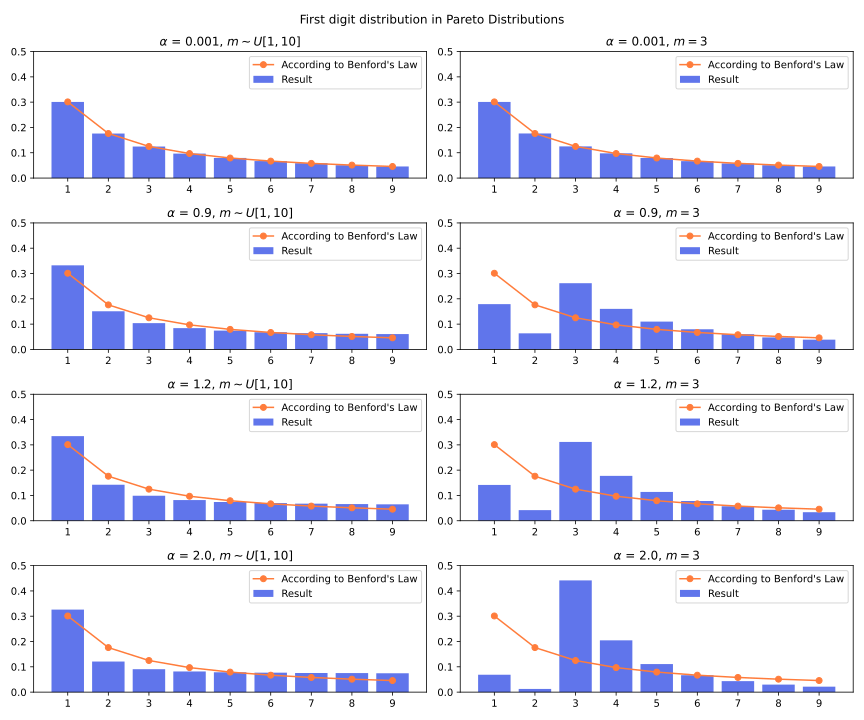

## Normal distribution

The normal distribution, also called Gaussian distribution, is important in statistics. It's the distribution with maximum entropy if we constraint its variance $\sigma^2$ to be a finite value.

It has two parameters: the mean $\mu$ and the standard deviation $\sigma$. $N(\mu, \sigma^2)$ denotes a normal distribution. Changing $\mu$ moves the PDF alone X axis. Changing $\sigma$ scales PDF along X axis.

We can rediscover normal distribution by maximizing entropy under variance constraint. To do that there are two prerequisite concepts: Largrange multiplier and functional derivative.

### Rediscover normal distribution by maximizing entropy with variance constraint

For a distribution's probability density function $f$, we want to maximize its entropy $H(f)=\int f(x) \log\frac{1}{f(x)}dx$ under the constraint:

- It's a valid probability density function: $\int_{-\infty}^{\infty} f(x)dx=1$, and $f(x) \geq 0$
- The mean: $\int_{-\infty}^{\infty} x f(x) dx = \mu$
- The variance constraint: $\int_{-\infty}^{\infty} f(x) (x-\mu)^2 dx = \sigma^2$

We can simplify to make deduction easier:

- Moving the probability density function along X axis doesn't change entropy, so we can fix the mean as 0 (we can replace $x$ as $x-\mu$ after finishing deduction). 
- $\log\frac{1}{f(x)}$ already implicitly tells $f(x)>0$
- It turns out that the mean constraint $\int_{-\infty}^{\infty} x f(x) dx = 0$ is not necessary to deduce the result, so we can not include it in Largrange multipliers. (Including it is also fine but will make it more complex.)

The Largragian function:

$$
\mathcal{L}(f,\lambda_1,\lambda_2,\lambda_3)=
\begin{cases}
\int_{-\infty}^{\infty} f(x) \log\frac{1}{f(x)}dx \\ + \lambda_1 \left(\int_{-\infty}^{\infty} f(x)dx-1\right) \\ + \lambda_2 \left(\int_{-\infty}^{\infty} f(x)x^2dx -\sigma^2\right)
\end{cases}
$$
$$
=\int_{-\infty}^{\infty} (-f(x)\log f(x) + \lambda_1 f(x) + 
\lambda_2 x^2 f(x) ) dx - \lambda_1 - \lambda_2\sigma^2
$$

Then compute the functional derivative $\frac{\partial \mathcal{L}}{\partial f}$

$$
\frac{\partial \mathcal{L}}{\partial f}
= -\log f(x) - 1 + \lambda_1 + \lambda_2 x^2
$$

Then solve $\frac{\partial \mathcal{L}}{\partial f}=0$:

$$
\frac{\partial \mathcal{L}}{\partial f}=0
\quad\quad\quad
\log f(x) = -1+\lambda_1+\lambda_2 x^2
\quad\quad\quad
f(x) = e^{(-1+\lambda_1+\lambda_2 x^2)}
$$

We get the rough form of normal distribution's probabilify density function.

Then solve $\frac{\partial \mathcal{L}}{\partial \lambda_1}=0$:

$$
\frac{\partial \mathcal{L}}{\partial \lambda_1}=0 \quad\quad\quad
\int_{-\infty}^{\infty} f(x)dx=1 \quad\quad\quad
\int_{-\infty}^{\infty} e^{(-1+\lambda_1+\lambda_2 x^2)} dx = 1
$$

That integration must converge, so $\lambda_2<0$.

A subproblem: solve $\int_{-\infty}^{\infty} e^{-k x^2}dx$ ($k>0$). The trick is to firstly compute its square $(\int_{-\infty}^{\infty} e^{-k x^2}dx)^2$, turning the integration into two-dimensional, and then substitude polar coordinates $x=r \cos \theta, \ y = r \sin \theta, \ x^2+y^2=r^2, \ dx\ dy = r \ dr \ d\theta$ :

$$
\left( \int_{-\infty}^{\infty} e^{-kx^2}dx\right)^2
=\int_{-\infty}^{\infty}\int_{-\infty}^{\infty} e^{-k(x^2+y^2)}dx\ dy
= \int_{\theta=0}^{\theta=2\pi}\int_{r=0}^{r=\infty} r e^{-kr^2}dr\ d\theta
= 2\pi \int_{0}^{\infty} r e^{-kr^2}dr
$$

Then substitude $u=-kr^2, \ du = -2kr\ dr, \ dr = -\frac{1}{2kr}du$:

$$
= 2\pi \int_{0}^{-\infty} (-\frac{1}{2k}) e^udu=\frac{\pi}{k}\int_{-\infty}^0e^udu=\frac{\pi}{k}
$$

So $\int_{-\infty}^{\infty} e^{-kx^2}dx=\sqrt{\frac{\pi}{k}}$. 

Put $-\lambda_2=k$

$$
\int_{-\infty}^{\infty} e^{(-1+\lambda_1+\lambda_2 x^2)} dx 
= e^{-1+\lambda_1} \int_{-\infty}^{\infty} e^{\lambda_2 x^2}
= e^{-1+\lambda_1} \sqrt{\frac{\pi}{-\lambda_2}} = 1
$$

$$
e^{-1+\lambda_1} = \sqrt{\frac{-\lambda_2}{\pi}}
$$

Then solve $\frac{\partial \mathcal{L}}{\partial \lambda_2}=0$:

$$
\frac{\partial \mathcal{L}}{\partial \lambda_2}=0 \quad\quad\quad
\int_{-\infty}^{\infty} x^2f(x)dx=\sigma^2 \quad\quad\quad
\int_{-\infty}^{\infty} x^2e^{(-1+\lambda_1+\lambda_2 x^2)} dx = \sigma^2
$$

It requires another trick. For the previous result $\int_{-\infty}^{\infty} e^{-kx^2}dx=\sqrt{\frac{\pi}{k}}$, take derivative to $k$ on two sides:

$$
\int_{-\infty}^{\infty} e^{(-x^2)k}dx=\sqrt{\pi} k^{-\frac{1}{2}}
\xrightarrow{\text{take derivative to }k}
\int_{-\infty}^{\infty} (-x^2)e^{(-x^2)k}dx = -\frac{1}{2}\sqrt{\pi} k^{-\frac{3}{2}}
$$

So $\int_{-\infty}^{\infty} x^2e^{-kx^2}dx = \frac{1}{2}\sqrt{\frac{\pi}{k^3}}$

$$
\int_{-\infty}^{\infty} x^2e^{(-1+\lambda_1+\lambda_2 x^2)} dx
=e^{-1+\lambda_1} \int_{-\infty}^{\infty} e^{\lambda_2x^2}dx
=e^{-1+\lambda_1} \cdot \frac{1}{2} \sqrt{\frac{\pi}{-\lambda_2^3}}=\sigma^2
$$

By using $e^{-1+\lambda_1} = \sqrt{\frac{-\lambda_2}{\pi}}$, we get:

$$
\sqrt{\frac{-\lambda_2}{\pi}} \cdot \frac{1}{2} \sqrt{\frac{\pi}{-\lambda_2^3}}=\sigma^2
\quad\quad\quad
\sqrt{\frac{1}{\lambda_2^2}}=2\sigma^2
$$

Previously we know that $\lambda_2<0$, then $\lambda_2=-\frac{1}{2\sigma^2}$. Then $e^{-1+\lambda_1}=\sqrt{\frac{1}{2\pi\sigma^2}}$

Then we finally deduced the normal distribution's probability density function (when mean is 0):

$$
f(x) = e^{(-1+\lambda_1+\lambda_2 x^2)} = \sqrt{\frac{1}{2\pi\sigma^2}} e^{-\frac{1}{2\sigma^2}x^2}
$$

When mean is not 0, substitute $x$ as $x-\mu$, we get the general normal distribution:

$$
f(x)=\sqrt{\frac{1}{2\pi\sigma^2}} e^{-\frac{1}{2\sigma^2}(x-\mu)^2}
= \frac{1}{\sqrt{2\pi}\sigma} e^{-\frac{1}{2}\left( \frac{x-\mu}{\sigma} \right)^2}
$$

### Entropy of normal distribution

We can then calculate the entropy of normal distribution:

$$H(X) = \int f(x)\log\frac{1}{f(x)}dx=\int f(x) \log( \sqrt{2\pi\sigma^2}e^{\frac{(x-\mu)^2}{2\sigma^2}})dx$$

$$=\int f(x) \left(\frac{1}{2}\log(2\pi\sigma^2)+\frac{(x-\mu)^2}{2\sigma^2}\right)dx=\frac{1}{2}\log(2\pi\sigma^2)\underbrace{\int f(x)dx} _ {=1}+
\frac{1}{2\sigma^2}\underbrace{\int f(x)(x-\mu)^2} _ {=\sigma^2}dx$$

$$=\frac{1}{2}\log(2\pi\sigma^2)+\frac{1}{2}=\frac{1}{2}\log(2\pi e \sigma^2)$$

If X follows normal distribution and Y's distribution that have the same mean and variance, the cross entropy $H(Y,X)$ have the same value: $\frac{1}{2}\log(2\pi e \sigma^2)$, regardless of the exact probability density function of Y. The deduction is similar to the above:

$$
H(Y,X)=\int f_Y(x) \log \frac 1 {f_X(x)} dx = \int f_Y(x) \log( \sqrt{2\pi\sigma^2}e^{\frac{(x-\mu)^2}{2\sigma^2}})dx
$$

$$=\int f_Y(x) \left(\frac{1}{2}\log(2\pi\sigma^2)+\frac{(x-\mu)^2}{2\sigma^2}\right)dx=\frac{1}{2}\log(2\pi\sigma^2)\underbrace{\int f_Y(x)dx} _ {=1}+
\frac{1}{2\sigma^2}\underbrace{\int f_Y(x)(x-\mu)^2} _ {=\sigma^2}dx$$
$$=\frac{1}{2}\log(2\pi\sigma^2)+\frac{1}{2}=\frac{1}{2}\log(2\pi e \sigma^2)$$

### Central limit theorem

We have a random variable $X$, which has meam 0 and (finite) variance $\sigma^2$. 

If we add up $n$ independent samples of $X$: $X_1+X_2+...+X_n$, the variance of sum is $n\sigma^2$. 

To make its variance constant, we can divide it by $\sqrt n$, then we get $S_n = \frac{X_1+X_2+...+X_n}{\sqrt n}$. Here $S_n$ is called the **standardized sum**, because it makes variance not change by sample count.

Central limit theorem says that the standardized sum apporaches **normal distribution** as $n$ increase. No matter what the original distribution of $X$ is (as long as its variance is finite), the standardized sum will approach normal distribution. 

The information of distribution of $X$ will be "washed out" during the process. This "washing out information" is also **increasing of entropy**. As $n$ increase, the entopy of standardized sum always increase (except when X follows normal distribution the entropy stays at maximum). $H(S_{n+1}) > H(S_n)$ if $X$ is not normally distributed.

Normal distribution has the maximum entropy under variance constraint. As the entropy of standardized sum increase, its entropy will approach maximum and it will approach normal distribution. This is similar to second law of theomodynamics.

This is called Entropic Central Limit Theorem. Proving that is hard and requires a lot of prerequisite knowledges. See also: [Solution of Shannon's problem on the monotonicity of entropy](https://www.ams.org/journals/jams/2004-17-04/S0894-0347-04-00459-X/S0894-0347-04-00459-X.pdf), [Generalized Entropy Power Inequalities and Monotonicity Properties of Information](https://www.researchgate.net/publication/3086399_Generalized_Entropy_Power_Inequalities_and_Monotonicity_Properties_of_Information)

In the real world, many things follow normal distribution, like height of people, weight of people, error in manufacturing, error in measurement, etc. 

The height of people is affect by many complex factors (nurtrition, health, genetic factors, exercise, environmental factors, etc.). The combination of these complex factors definitely cannot be similified to a standardized sum of i.i.d zero-mean samples $\frac{X_1+X_2+...+X_n}{\sqrt n}$. Some factors have large effect and some factors have small effect. The factors are not necessarily independent. But the height of people still roughly follows normal distribution. This can be semi-explained by second law of theomodynamics. The complex interactions of many factors increase entropy of the height. At the same time there are also many factors that constraint the variance of height. Why is there a variance constraint? In some cases variance correspond to instability. A human that is 100 meters tall is impossible as it's physically unstable. Similarily a human that's 1 cm tall is impossible in maintaining normal biological function. The unstable things tend to collapse and vanish (survivorship bias), and the stable things remain. That's how the variance constraint occurs in nature. In some places, variance correspond to energy, and the variance is constrainted by conservation of energy.

Although normal distribution is common, not all distributions are normal. There are also many things that follow fat-tail distributions.

### Multivariate normal distribution

In below, bold letter (like $\boldsymbol x$) means column vector:

$$
\boldsymbol x = \begin{bmatrix} x_1 \\ x_2 \\ ... \\ x_n \end{bmatrix}
$$

Linear transform: for a (column) vector $\boldsymbol{x}$, muliply a matrix $A$ on it: $A\boldsymbol x$ is linear transformation. Linear transformation can contain rotation, scaling and shearing. For row vector it's $\boldsymbol xA$. Two linear transformations can be combined one, corresponding to matrix multiplication.

Affine transform: for a  (column) vector $\boldsymbol x$, multiply a matrix on it and then add some offset $A\boldsymbol x + \boldsymbol b$. It can move based on the result of linear transform. Two affine transformations can be combined into one. If $\boldsymbol y=A\boldsymbol x+\boldsymbol b, \boldsymbol z=C\boldsymbol y+\boldsymbol d$, then $\boldsymbol z=(CA)\boldsymbol x +(C\boldsymbol b + \boldsymbol d)$

(in some places affine transformation is called "linear transformation".)

Normal distribution has linear properties:

- if you multiply a constant, the result still follow normal distribution. $X \sim N \rightarrow \ kX \sim N$
- if you add a constant, the result still follow normal distribution. $X \sim N \rightarrow (X+k) \sim N$
- If you add up two independent normal random variables, the result still follows normal distribution. $X \sim N, Y \sim N \rightarrow (X+Y) \sim N$
- A linear combination of many normal distributions also follow normal distribution. $X_1 \sim N, X_2 \sim N, ... X_n \sim N \rightarrow (k_1X_1 + k_2X_2 + ... + k_nX_n) \sim N$

If:

- We have a (row) vector $\boldsymbol x$ of independent random variables $\boldsymbol x=(x_1, x_2, ... x_n)$, each element in vector follows a normal distribution (not necessarily the same normal distribution),
- then, if we apply an affine transformation on that vector, which means multipling a matrix $A$ and then adding an offset $\boldsymbol b$,  $\boldsymbol y=A\boldsymbol x+\boldsymbol b$, 
- then each element of $\boldsymbol y$ is a linear combination of normal distributions, $y_i=x_1 A_{i,1} + x_2 A_{i, 2} + ... x_n A_{i,n} + b_i$, 
- so each element in $\boldsymbol y$ also follow normal distribution. Now $\boldsymbol y$ follows multivariate normal distribution.

Note that the elements of $\boldsymbol y$ are no longer necessarily independent. 

What if I apply two or many affine transformations? Two affine transformations can be combined into one. So the result is still multivariate normal distribution.

To describe a multivariate normal distribution, an important concept is **covariance matrix**. 

Recall covariance: $\text{Cov}[X,Y]=E[(X-E[X])(Y-E[Y])]$. Some rules about covariance:

- It's symmetric: $\text{Cov}[X,Y] = \text{Cov}[Y,X]$
- If X and Y are independent, $Cov[X,Y]=0$
- Adding constant $Cov[X+k,Y] = Cov[X,Y]$. Variance is invariant to translation.
- Multiplying constant $\text{Cov}[k\cdot X,Y] = k \cdot \text{Cov}[X,Y]$
- Addition $Cov[X+Y,Z] = Cov[X,Z]+Cov[Y,Z]$

Covariance matrix:

$$
Cov(\boldsymbol x,\boldsymbol y) = E[(\boldsymbol x - E[\boldsymbol x])(\boldsymbol y-E[\boldsymbol y])^T]
$$

Here $E[\boldsymbol x]$ taking mean of each element in $\boldsymbol x$ and output a vector. It's element-wise. $E[\boldsymbol x]_i = E[\boldsymbol x_i]$. Similar for matrix.

The covariance matrix written out:

$$
Cov(\boldsymbol x,\boldsymbol y)=\begin{bmatrix} 
\text{Cov}[\boldsymbol x_1,\boldsymbol y_1] &\ \text{Cov}[\boldsymbol x_1,\boldsymbol y_2] &\ ... &\ \text{Cov}[\boldsymbol x_1,\boldsymbol y_n] \\
\text{Cov}[\boldsymbol x_2,\boldsymbol y_1] &\ \text{Cov}[\boldsymbol x_2,\boldsymbol y_2] &\ ... &\ \text{Cov}[\boldsymbol x_2,\boldsymbol y_n] \\
\vdots &\ \vdots &\ \ddots &\ \vdots \\
\text{Cov}[\boldsymbol x_n,\boldsymbol y_1] &\ \text{Cov}[\boldsymbol x_n,\boldsymbol y_2] &\ ... &\ \text{Cov}[\boldsymbol x_n,\boldsymbol y_n]
\end{bmatrix}
$$

Recall that multiplying constant and addition can be "moved out of $E[]$": $E[kX] = k E[X], \ E[X+Y]=E[X]+E[Y]$. If $A$ is a matrix that contains random variable and $B$ is a matrix that's not random, then $E[A\cdot B] = E[A]\cdot B, \ E[B\cdot A] = B\cdot E[A]$, because multiplying a matrix come down to multiplying constant and adding up, which all can "move out of $E[]$". Vector can be seen as a special kind of matrix.

So applying it to covariance matrix:

$$
Cov(A \cdot \boldsymbol x,\boldsymbol y) = E[(A\cdot \boldsymbol x - E[A\cdot \boldsymbol x])(\boldsymbol y-E[\boldsymbol y])^T] = E[(A\cdot \boldsymbol x - A \cdot E[\boldsymbol x])(\boldsymbol y-E[\boldsymbol y])^T]
$$
$$
=A\cdot E[(\boldsymbol x - E[\boldsymbol x])(\boldsymbol y-E[\boldsymbol y])^T] = A \cdot Cov(\boldsymbol x, \boldsymbol y)
$$

Similarily, $Cov(\boldsymbol x, B \cdot \boldsymbol y) = Cov(\boldsymbol x, \boldsymbol y)  \cdot B^T$.

If $\boldsymbol x$ follows multivariate normal distribution, it can be described by mean vector $\boldsymbol \mu$ (the mean of each element of $\boldsymbol x$) and covariance matrix $Cov(\boldsymbol x,\boldsymbol x)$.

Initially, if I have some independent normal variables $x_1, x_2, ... x_n$ with mean values $\mu_1, ..., \mu_n$ and variances $\sigma_1^2, ..., \sigma_n^2$. If we treat them as a multivariate normal distribution, the mean vector $\boldsymbol \mu_x = (\mu_1, ..., \mu_n)$. The covariance matrix will be diagonal as they are independent:

$$
Cov(\boldsymbol x,\boldsymbol x) = 
\begin{bmatrix} 
\sigma_1^2 &\ 0 &\ ... &\ 0 \\
0  &\ \sigma_2^2 &\ ... &\ 0 \\
\vdots &\ \vdots &\ \ddots &\ \vdots \\
0 &\ 0 &\ ... &\ \sigma_n^2
\end{bmatrix}
$$

Then if we apply an affine transformation $\boldsymbol y = A \boldsymbol x + \boldsymbol b$, then $\boldsymbol \mu_y = A \mu_x + \boldsymbol b$. $Cov(\boldsymbol y,\boldsymbol y) = Cov(A \boldsymbol x + \boldsymbol b,A \boldsymbol x + \boldsymbol b) = Cov(A \boldsymbol x, A \boldsymbol x) = A Cov(\boldsymbol x,\boldsymbol x) A^T$.

### Gaussian splatting

The industry standard of 3D modelling is to model the 3D object as many triangles, called mesh. It only models the visible surface object. It use many triangles to approximate curved surface.

Gaussian splatting provides an alternative method of 3D modelling. The 3D scene is modelled by a lot of mutlivariate (3D) gaussian distributions, called gaussian. When rendering, that 3D gaussian distribution is projected onto a plane (screen) and become a 2D gaussian distribution, now probability density correspond to color opacity.

A gaussian's color can be fixed or can change based on different view directions.

### Score-based diffusion model

In diffusion model, we add gaussian noise to image (or other things). Then the diffusion model takes noisy input and we train it to output the noise added to it. There will be many steps of adding noise and the model should output the noise added in each step.

Tweedie's formula shows that estimating the noise added is the same as computing the likelihood of image distribution.

To simplify, here we only consider one dimension and one noise step (the same also applies to many dimensions and many noise steps). 

If the original value is $x_0$, we add a noise $\epsilon \sim N(0, \sigma^2)$, the noise-added value is $x_1 = x_0 + \epsilon$, $x_1 \sim N(x_0, \sigma^2)$.

The diffusion model only know $x_1$ and don't know $x_0$. The diffusion model need to estimate $\epsilon$ from $x_1$.

Here:

- $p_0(x_0)$ is the probability density of original clean value (for image generation, it correspond to the probability distribution of images that we want to generate)
- $p_1(x_1)$ is the probability density of noise-added value
- $p_{1|0}(x_1 | x_0)$ is the probability density of noise-added value, given clean training data $x_0$. It's a normal distribution given $x_0$. It can also be seen as a function that take two arguments $x_0, x_1$.
- $p_{0|1}(x_0|x_1)$ is the probability density of the original clean value given noise-added value. It can also be seen as a function that take two arguments $x_0, x_1$.

(I use $p_{1|0}(x_1|x_0)$ instead of shorter $p(x_1|x_0)$ is to reduce confusion between different distributions.)

$p_{1|0}(x_1 | x_0)$ is a normal distribution:

$$
p_{1|0}(x_1|x_0) = \frac{1}{\sqrt{2\pi}\sigma} e^{-\frac{1}{2}\left( \frac{x1-x_0}{\sigma} \right)^2}
$$

Take log:

$$
\log p_{1|0}(x_1|x_0) = -\frac 1 2 \left( \frac{x_1-x_0}{\sigma} \right)^2 + \log \frac 1 {\sqrt{2\pi}\sigma}
$$

The linear score function under condition:

$$
\frac{\partial \log p_{1|0}(x_1 | x_0)}{\partial x_1} = -\left(\frac{x_1-x_0}{\sigma} \right) \cdot \frac 1 \sigma = - \frac{x_1-x_0}{\sigma^2}
$$

Bayes rule:

$$
p_{0|1}(x_0 | x_1) = \frac{p_{1|0}(x_1|x_0) p_0(x_0)}{p_1(x_1)}
$$

Take log

$$
\log p_{0|1}(x_0 | x_1) = \log p_{1|0}(x_1|x_0) + \log p_0(x_0) - \log p_1(x_1)
$$

Take partial derivative to $x_1$:

$$
\frac{\partial\log p_{0|1}(x_0 | x_1)}{\partial x_1} = \frac{\partial \log p_{1|0}(x_1|x_0)}{\partial x_1} + \underbrace{\frac{\partial \log p_0(x_0)}{\partial x_1}}_{=0} - \frac{\partial \log p_1(x_1)}{\partial x_1}
$$

Using previous result $\frac{\partial \log p_{1|0}(x_1 | x_0)}{\partial x_1} = - \frac{x_1-x_0}{\sigma^2}$

$$
\frac{\partial\log p_{0|1}(x_0 | x_1)}{\partial x_1}  = - \frac{x_1-x_0}{\sigma^2} - \frac{\partial \log p_1(x_1)}{\partial x_1}
$$

Rearrange:

$$
\sigma^2 \frac{\partial\log p_{0|1}(x_0 | x_1)}{\partial x_1}  = - x_1+x_0 - \sigma^2\frac{\partial \log p_1(x_1)}{\partial x_1}
$$

$$
x_0=\sigma^2 \frac{\partial\log p_{0|1}(x_0 | x_1)}{\partial x_1}+x_1+\sigma^2\frac{\partial \log p_1(x_1)}{\partial x_1}
$$

Now if we already know the noise-added value $x_1$, but we don't know $x_0$ so $x_0$ is uncertain. We want to compute the expectation of $x_0$ under that condition that $x_1$ is known.

$$
E[x_0|x_1] = E_{x_0}\left[ \sigma^2 \frac{\partial\log p_{0|1}(x_0 | x_1)}{\partial x_1}+x_1+\sigma^2\frac{\partial \log p_1(x_1)}{\partial x_1}  \biggr| x_1 \right]
$$

$$
= x_1 + E_{x_0}\left[\sigma^2 \frac{\partial\log p_{0|1}(x_0 | x_1)}{\partial x_1}\biggr|x_1\right] + E_{x_0}\left[ \sigma^2\frac{\partial \log p_1(x_1)}{\partial x_1} \biggr|x_1\right]
$$

Within it, $E_{x_0}\left[ \frac{\partial\log p_{0|1}(x_0 | x_1)}{\partial x_1} \biggr| x_1 \right]=0$, because

$$
E_{x_0}\left[ \frac{\partial\log p_{0|1}(x_0 | x_1)}{\partial x_1} \biggr| x_1 \right]=
\int p_{0|1}(x_0|x_1) \cdot \frac{\partial \log p_{0|1}(x_0|x_1)}{\partial x_1} dx_0 
$$

$$= \int p_{0|1}(x_0) \cdot \frac 1 {p_{0|1}(x_0|x_1)} \cdot \frac{\partial p_{0|1}(x_0|x_1)}{\partial x_1} dx_0 = \int \frac{\partial p_{0|1}(x_0|x_1)}{\partial x_1} dx_0 = \frac{\partial \int p_{0|1}(x_0|x_1) dx_0}{\partial x_1} = \frac{\partial 1}{\partial x_1}=0
$$

And $E_{x_0}\left[ \sigma^2\frac{\partial \log p_1(x_1)}{\partial x_1} \biggr|x_1\right] = \sigma^2\frac{\partial \log p_1(x_1)}{\partial x_1}$ because it's unrelated to random $x_0$.

So 

$$
E[x_0|x_1] = x_1 + \underbrace{\sigma^2\frac{\partial \log p_1(x_1)}{\partial x_1}}_\text{Train diffusion model to output this}
$$

That's Tweedie's formula (for 1D case). It can be generalized to many dimensions, where the $x_0, x_1$ are vectors, the distributions $p_0, p_1, p_{0|1}, p_{1|0}$ are joint distributions where different dimensions are not necessarily independent. The gaussian noise added to different dimensions are still independent.

The diffusion model is trained to estimate the added noise, which is the same as estimating the linear score.


## Exponential distribution

If we have constraint $X \geq 0$ and fix the mean $E[X]$ to a specific value $\mu$, then maximizing entropy gives exponential distribution. It can also be rediscovered from Lagrange multiplier:

$$
\mathcal{L}(f,\lambda_1,\lambda_2,\lambda_3)=
\begin{cases}
\int_{0}^{\infty} f(x) \log\frac{1}{f(x)}dx \\ + \lambda_1 \left(\int_{0}^{\infty} f(x)dx-1\right) \\ + \lambda_2 \left(\int_{0}^{\infty} f(x)xdx -\mu\right)
\end{cases}
$$
$$
=\int_{0}^{\infty} (-f(x)\log f(x) + \lambda_1 f(x) + 
\lambda_2 x f(x) ) dx - \lambda_1 - \lambda_2\mu
$$

$$
\frac{\partial \mathcal{L}}{\partial f}
= -\log f(x) - 1 + \lambda_1 + \lambda_2 x
\quad\quad\quad
\frac{\partial \mathcal{L}}{\partial \lambda_1}=\int_0^{\infty}f(x)dx-1
\quad\quad\quad
\frac{\partial \mathcal{L}}{\partial \lambda_2}=\int_0^{\infty} xf(x)dx-\mu
$$

Then solve $\frac{\partial \mathcal{L}}{\partial f}=0$:

$$
\frac{\partial \mathcal{L}}{\partial f}=0
\quad\quad\quad
\log f(x) = -1+\lambda_1+\lambda_2 x
\quad\quad\quad
f(x) = e^{(-1+\lambda_1+\lambda_2 x)} = e^{(-1+\lambda_1)} \cdot e^{\lambda_2 x}
$$

Then solve $\frac{\partial \mathcal{L}}{\partial \lambda_1}=0$:

$$
\frac{\partial \mathcal{L}}{\partial \lambda_1}=0
\quad\quad\quad
\int_0^{\infty} e^{(-1+\lambda_1)} \cdot e^{\lambda_2 x} dx = 1
\quad\quad\quad
\int_0^{\infty} e^{\lambda_2 x} dx = e^{1-\lambda_1}
$$

To make that integration finite, $\lambda_2 < 0$.

Let $u = \lambda_2 x, \ du = \lambda_2 dx, dx=\frac 1 {\lambda_2} du$, 

$$
\int_0^{\infty} e^{\lambda_2 x} dx = \frac 1 {\lambda_2} \int_0^{-\infty} e^udu = -\frac 1 {\lambda_2} = e^{1-\lambda_1}
$$

Then solve $\frac{\partial \mathcal{L}}{\partial \lambda_2}=0$:

$$
\frac{\partial \mathcal{L}}{\partial \lambda_2}=0
\quad\quad\quad
\int_0^{\infty} x e^{(-1+\lambda_1+\lambda_2 x)} dx = \mu
\quad\quad\quad
\int_0^{\infty} x e^{\lambda_2 x} dx = \mu e^{1-\lambda_1}
$$

$$
\int_0^{\infty} x e^{\lambda_2 x} dx = (\frac 1 {\lambda_2} x e^{\lambda_2 x} - \frac 1 {\lambda_2^2} e^{\lambda_2x}) _0^{\infty} = \frac 1 {\lambda_2^2}
$$

Now we have

$$
f(x) = e^{(-1+\lambda_1)} \cdot e^{\lambda_2 x}
\quad\quad\quad
-\frac 1 {\lambda_2} = e^{1-\lambda_1}
\quad\quad\quad
\frac 1 {\lambda_2^2}=\mu e^{1-\lambda_1}
$$

Solving it gives $\lambda_2 = - \frac 1 {\mu}, \ e^{1-\lambda_1} = \mu$. Then

$$
f(x) = \frac 1 \mu e^{-\frac 1 \mu x} \quad\quad (x \geq 0)
$$

In the common definition of exponential distribution, $\lambda = \frac 1 \mu$, $f(x) = \lambda e^{-\lambda x}$.

Its tail function:

$$
\text{TailFunction}(x) = P(X>x) = \int_x^{\infty} \lambda e^{-\lambda y}dy= \left(-e^{-\lambda y}\right) \biggr|_{y=x}^{y=\infty} = e^{-\lambda x}
$$

If some event is happening in fixed rate ($\lambda$), exponential distribution measures **how long do we need to wait for the next event**, **if how long we will need to wait is irrelevant how long we have aleady waited (memorylessness)**.

Exponential distribution can measure:

- The lifetime of machine components.
- The time until a radioactive atom decays.
- The time length of phone calls.
- The time interval between two packets for a router.
- ...

How to understand memorlessness? For example, a kind of radioactive atom decays once per 5 minutes on average. If the time unit is minute, then $\lambda = \frac 1 5$. For a specific atom, if we wait for it to decay, the time we need to wait is on average 5 minutes. However, if we have already waited for 3 minutes and it still hasn't decay, the expected time that we need to wait is still 5 minutes. If we have waited for 100 minutes and it still hasn't decay, the expected time that we need to wait is still 5 minutes. Because the atom doesn't **"remember"** how long we have waited.

Memorylessness means the probability that we still need to wait $\text{needToWait}$ amount of time is irrelevant to how long we have already waited:

$$
P(t \geq (\text{alreadyWaited} + \text{needToWait}) \ | \ t \geq \text{alreadyWaited}) = P(t \geq \text{needToWait})
$$

(We can also rediscover exponential distrbution from just memorylessness.)

Memorylessness is related with its maximum entropy property. Maximizing entropy under constraints means maximizing uncertainty and minizing information other than the constraints. The only two constraints are $X\geq 0$, the wait time is positive, and $E[X]=\frac 1 \lambda$, the average rate of the event. Other than the two constraints, there is no extra information. No information tells waiting reduces time need to wait, no information tells waiting increases time need to wait. So it's the most unbiased: waiting has no effect on the time need to wait. If the radioactive atom has some "internal memory" that changes over time and controls how likely it will decay, then the waiting time distribution encodes extra information other than the two constraints, which makes it no longer max-entropy.

## Pareto distribution


### Rediscover Pareto distribution from 80/20 rule

**80/20** rule: for example 80% of weallth are in the richest 20% (the real number may be different). 

It has **fractal property**: even within the richest 20%, 80% of wealth are in the richest 20% within. Based on this fractal-like property, we can naturally get **Pareto distribution**.

If the total people count is $N$, the total wealth amount is $W$. Then $0.2N$ people have $0.8W$ wealth. Applying the same within the $0.2N$ people: $0.2 \cdot 0.2 N$ people have $0.8 \cdot 0.8W$ wealth. Applying again, $0.2 \cdot 0.2 \cdot 0.2 N$ people have $0.8 \cdot 0.8 \cdot 0.8 W$ welath. 

Generalize it, $0.2^k N$ people have $0.8^k W$ wealth ($k$ can be generalized to continuous real number).

If the wealth variable is $X$ (assume $X > 0$), its probability density function is $f(x)$, and porportion of people correspond to probability, the richest $0.2^k$ porportion of people group have $0.8^kW$ wealth, $t$ is the wealth threshold (minimum wealth) of that group:

$$
P(X \geq t) = \int_t^{\infty} f(x)dx = 0.2^k
$$

Note that $f(x)$ represents probability density function (PDF), which correspond to density of proportion of people. $N\cdot f(x)$ is people amount density over wealth. Multiplying it with wealth $x$ and integrate gets total wealth in range:

$$
\int_t^{\infty} x (N \cdot f(x)) dx = 0.8^k W
\quad\quad\quad
\int_t^{\infty} x f(x) dx = 0.8^k \frac W N
$$

We can rediscover Pareto distribution from these. The first thing to do is extract and eliminate $k$:

$$
\int_t^{\infty} f(x)dx = 0.2^k = e^{(\ln 0.2)k} \quad\quad\quad (\ln 0.2) k=\ln\int_t^{\infty} f(x)dx
$$

$$
\int_t^{\infty} x f(x) dx = \frac W N 0.8^k = \frac W N e^{(\ln 0.8)k} \quad\quad\quad
(\ln 0.8)k = \ln \frac{N\int_t^{\infty} x f(x) dx}{W}
$$

$$
k=\frac{\ln\int_t^{\infty} f(x)dx}{\ln 0.2}=\frac{\ln \frac{N\int_t^{\infty} x f(x) dx}{W}}{\ln 0.8}
\quad\quad\quad
\frac{\ln 0.8}{\ln 0.2} \ln\int_t^{\infty} f(x)dx = \ln \frac{N\int_t^{\infty} x f(x) dx}{W}
$$

$$
\ln\left(\left(\int_t^{\infty} f(x)dx\right) ^{\frac{\ln 0.8}{\ln 0.2}} \right) = \ln \frac{N\int_t^{\infty} x f(x) dx}{W}
$$

$$
\left(\int_t^{\infty} f(x)dx\right) ^{\frac{\ln 0.8}{\ln 0.2}}  = \frac N W \int_t^{\infty} x f(x) dx
$$

Then we can take derivative to $t$ on two sides:

$$
\frac{\ln 0.8}{\ln 0.2} \left( \int_t^{\infty} f(x)dx \right)^{\frac{\ln 0.8}{\ln 0.2}-1} (- f(t)) = \frac N W (-t f(t))
$$

$f(t) \neq 0$. Divide two sides by $-f(t)$:

$$
\frac{\ln 0.8}{\ln 0.2} \left( \int_t^{\infty} f(x)dx \right)^{\frac{\ln 0.8}{\ln 0.2}-1} = \frac N W t
$$

$$
\left( \left( \int_t^{\infty} f(x)dx \right)^{\frac{\ln 0.8}{\ln 0.2}-1} \right)^{\frac 1 {\frac{\ln 0.8}{\ln 0.2}-1}} = \left(\frac {N\ln 0.2} {W\ln 0.8} t\right)^{\frac 1 {\frac{\ln 0.8}{\ln 0.2}-1}}
$$

$$
\int_t^{\infty} f(x)dx = \left( \frac{N\ln 0.2}{W\ln 0.8} t \right)^{\frac 1 {\frac{\ln 0.8}{\ln 0.2}-1}}
= \left( \frac{N\ln 0.2}{W\ln 0.8} t \right)^{\frac {\ln 0.2} {\ln 0.8-\ln 0.2}}
$$

Take derivative to $t$ on two sides again:

$$
-f(t) = \frac {\ln 0.2} {\ln 0.8-\ln 0.2} \left( \frac{N\ln 0.2}{W\ln 0.8} t \right)^{\frac {\ln 0.2} {\ln 0.8-\ln 0.2} - 1} \cdot \frac{N\ln 0.2}{W\ln 0.8}
$$

Now $t$ is an argument and can be renamed to $x$. And do some adjustments:

$$
f(x) = -\frac {\ln 0.2} {\ln 0.8-\ln 0.2} \left(\frac{N\ln 0.2}{W\ln 0.8}\right)^{\frac {\ln 0.2} {\ln 0.8-\ln 0.2} } \cdot x ^{\frac {\ln 0.2} {\ln 0.8-\ln 0.2} - 1}
$$

Now we get the PDF. We still need to make the total probability area to be 1 to make it a valid distribution. But there is no extra unknown parameter in PDF to change. The solution is to crop the range of $X$. If we set the minimum wealth in distribution to be $m$ (but doesn't constraint the maximum wealth), creating constraint $X \geq m$, then using the previous result

$$
\int_m^{\infty} f(x)dx = 1 \quad\quad\quad
\left( \frac{N\ln 0.2}{W\ln 0.8} m \right)^{\frac {\ln 0.2} {\ln 0.8-\ln 0.2}} = 1
\quad\quad\quad
m = \frac{W \ln 0.8}{N \ln 0.2} \approx 0.1386 \frac W N
$$

Now we rediscovered (a special case of) Pareto distribution from just fractal 80/20 rule. We can generalize it further for other cases like 90/10 rule, 80/10 rule, etc. and get Pareto (Type I) distribution. It has two parameters, shape parameter $\alpha$ (correspond to $-\frac {\ln 0.2} {\ln 0.8-\ln 0.2} = \frac{\ln 5}{\ln 4} \approx 1.161$) and minimum value $m$:

$$
f(x) = \begin{cases}
\alpha m^\alpha x^{-\alpha-1} &\ x \geq m,  \\
0 &\ x < m
\end{cases}
$$

Note that in real world the wealth of one can be negative (has debts more than assets). The Pareto distribution is just an approximation. $m$ means the threshold where Pareto distribution starts to be good approximation.

If $\alpha \leq 1$ then its theoretical mean is infinite. Of course if we have finite samples then the sample mean will be finite, but if the theoretical mean is infinite, the more sample we have, the larger the sample mean tend to be, and the trend won't stop.

If $\alpha \leq 2$ then its theoretical variance is infinite. Recall that centrol limit theorem require finite variance. The standarized sum of values taken from Pareto distribution whose $\alpha \leq 2$ does not follow central limit theorem because it has infinite variance.

Pareto distribution is often described using tail function (rather than probability density function):

$$
\text{TailFunction}(x) = P(X>x) = \begin{cases}
m^\alpha x^{-\alpha} &\ \text{if } x \geq m, \\
1 &\ \text{if } x < m
\end{cases}
$$

### Rediscover Pareto distribution by maximizing entropy under geometric mean constraint

There are additive values, like length, mass, money. For additive values, we often compute arithmetic average $\frac 1 n (x_1 + x_2 + .. + x_n)$.

There are also multiplicative values, like asset return rate, growth ratio. For multiplicative values, we often compute geometric average $(x_1 \cdot x_2 \cdot ... \cdot x_n)^{\frac 1 n}$. For example, if an asset grows by 20% in first year, drops 10% in second year and grows 1% in third year, then the average growth ratio per year is $(1.2 \cdot 0.9 \cdot 1.01)^{\frac 1 3}$.

Logarithm allows turning multiplication into addition, and turning power into multiplication. If $y = \log x$, then log of geometric average of $x$ is arithmetic average of $y$:

$$
\log \left((x_1 \cdot x_2 \cdot ... \cdot x_n)^{\frac 1 n}\right) = \frac 1 n (\log x_1 + \log x_2 + ... + \log x_n)=\frac 1 n (y_1 + y_2 + ... + y_n)
$$

Pareto distribution maximizes entropy under geometric mean constraint $E[\log X]$. 

If we have constraints $X \geq m > 0$, $E[\log X] = g$, using largrange multiplier to maximize entropy:

$$\mathcal{L}(f, \lambda_1, \lambda_2)= \begin{cases}\int_m^{\infty} f(x) \log \frac 1 {f(x)} dx \\\\ + \lambda_1 (\int_m^{\infty} f(x)dx-1) \\\\ + \lambda_2 (\int_m^{\infty} f(x)\log x dx - g) \end{cases}$$


$$
\mathcal{L}(f, \lambda_1, \lambda_2) = \int_m^{\infty} (\ -f(x)\log f(x) + \lambda_1 f(x) + \lambda_2 f(x) \log x \ ) dx -\lambda_1 - g \lambda_2
$$


$$
\frac{\partial \mathcal{L}}{\partial f} = -\log f(x) - 1 + \lambda_1 + \lambda_2 \log x
$$


$$
\frac{\partial \mathcal{L}}{\partial \lambda_1} = \int_m^{\infty} f(x) dx -1
$$


$$
\frac{\partial \mathcal{L}}{\partial \lambda_2} = \int_m^{\infty} f(x) \log x \ dx-g
$$

Solve $\frac{\partial \mathcal{L}}{\partial f}=0$:

$$- \log f(x) - 1 + \lambda_1 + \lambda_2 \log x=0$$

$$\log f(x) = -1+\lambda_1 + \lambda_2 \log x$$

$$f(x) = e^{-1+\lambda_1+\lambda_2 \log x}$$


$$f(x) = e^{-1+\lambda_1} \cdot (e^{\log x})^{\lambda_2} = e^{-1+\lambda_1} \cdot x^{\lambda_2}$$


Solve $\frac{\partial \mathcal{L}}{\partial \lambda_1}=0$:

$$e^{-1+\lambda_1}\int_m^{\infty} x^{\lambda_2}dx = 1\quad\quad\quad \int_m^{\infty} x^{\lambda_2}dx = e^{1-\lambda_1}
$$

To make $\int_m^{\infty} x^{\lambda_2}dx$ be finite, $\lambda_2 < 0$. 

$$\int_m^{\infty} x^{\lambda_2}dx= \left( \frac{1}{\lambda_2+1}x^{\lambda_2+1} \right) \biggr|^{x=\infty}_{x=m}  =- \frac 1 {\lambda_2+1} m^{\lambda_2 + 1} = e^{1-\lambda_1}$$

$$\frac{m^{\lambda_2+1}}{\lambda_2+1} = -e^{1-\lambda_1} \tag{1}\quad\quad\quad e^{-1+\lambda_1}=-\frac{\lambda_2+1}{m^{\lambda_2+1}}$$

Solve $\frac{\partial \mathcal{L}}{\partial \lambda_2}=0$:

$$\int_m^{\infty} f(x) \log x \ dx=g$$

$$\int_m^{\infty} e^{-1+\lambda_1} \cdot x^{\lambda_2} \log x \ dx=g$$

If we temporarily ignore $e^{-1+\lambda_1}$ and compute $\int_m^{\infty} x^{\lambda_2} \log x \ dx$. Let $u=\log x$, $x=e^u$, $dx = e^udu$:

$$\int_m^{\infty} x^{\lambda_2} \log x \ dx=\int_{\log m}^{\infty} e^{\lambda_2 u} u \ du = \left( \frac 1 {\lambda_2+1} u e^{(\lambda_2+1)u} - \frac 1 {(\lambda_2+1)^2} e^{(\lambda_2+1)u}\right) \biggr|_{u=\log m}^{u=\infty}$$

To make it be finite, $\lambda_2+1 \leq 0$, $\lambda_2 \leq -1$. Then

$$\int_m^{\infty} x^{\lambda_2} \log x \ dx=- \frac 1 {\lambda_2+1} (\log m) e^{(\lambda_2+1)\log m} + \frac 1 {(\lambda_2+1)^2} e^{(\lambda_2+1)\log m}$$

$$=- \frac 1 {\lambda_2+1} (\log m)  m^{(\lambda_2+1)} + \frac 1 {(\lambda_2+1)^2} m^{(\lambda_2+1)}$$

So

$$\int_m^{\infty} e^{-1+\lambda_1} \cdot x^{\lambda_2} \log x \ dx
= e^{-1+\lambda_1} \left(- \frac 1 {\lambda_2+1} (\log m)  m^{(\lambda_2+1)} + \frac 1 {(\lambda_2+1)^2} m^{(\lambda_2+1)} \right)$$

By using (1) $e^{-1+\lambda_1}=-\frac{\lambda_2+1}{m^{\lambda_2+1}}$:

$$=- (-\log m + \frac 1 {\lambda_2+1})=\log m - \frac 1 {\lambda_2+1} = g$$

$$\frac 1 {\lambda_2+1} = \log m - g\quad\quad\quad\lambda_2+1 = \frac 1 {\log m - g}$$

$$e^{-1+\lambda_1}=-\frac{\lambda_2+1}{m^{\lambda_2+1}} = - \frac{\frac 1 {\log m - g}}{m^{\frac 1 {\log m - g}}}$$

$$f(x)= e^{-1+\lambda_1} \cdot x^{\lambda_2} = - \frac{\frac 1 {\log m - g}}{m^{\frac 1 {\log m - g}}} x^{(\frac 1 {\log m - g}-1)}$$

Let $\alpha = -\frac 1 {\log m - g}$, it become:

$$f(x) = \alpha m^{\alpha} x^{-\alpha-1} \quad\quad(x>m)$$

Now we rediscovered Pareto (Type I) distribution by maximizing entropy.

In the process we have $\lambda_2 \leq -1$. From $\lambda_2+1 = \frac 1 {\log m - g}$ we know $\log m - g <0$, which is $m < e^g$.

### Share of top $p$ porportion

For example, if wealth follows Pareto distribution, how to compute the wealth share of the top 1%? Generally how to compute the share of the top $p$ porpotion?

We firstly need to compute the threshold value $t$ of the top $n$:

$$
P(X>t) = n
\quad\quad\quad
m^\alpha t^{-\alpha}=p
\quad\quad\quad
t= (p m^{-\alpha})^{- \frac{1}{\alpha}} = m p^{- \frac{1}{\alpha}}
$$

Then compute the share

$$\text{Share} = \frac{\int_t^{\infty} x N f(x)dx}{\int_m^{\infty} x N f(x)dx}=\frac{\int_t^{\infty} x f(x)dx}{\int_m^{\infty} x f(x)dx}$$

$$\int_b^{\infty} x f(x)dx = \int_b^{\infty} \alpha m^{-\alpha} x^{-\alpha}dx = \alpha m^{-\alpha} \cdot \left( \frac 1 {-\alpha+1} x^{-\alpha+1} \right) \biggr|_{x=b}^{x=\infty} = \left(- \alpha m^{-\alpha} \frac 1 {-\alpha+1}\right) b^{-\alpha+1}$$

To make that integration finite, we need $-\alpha+1< 0$, $\alpha > 1$.

$$\text{Share}=\frac{\int_t^{\infty} x f(x)dx}{\int_m^{\infty} x f(x)dx}= \frac{\left(- \alpha m^{-\alpha} \frac 1 {-\alpha+1}\right) t^{-\alpha+1}}{\left(- \alpha m^{-\alpha} \frac 1 {-\alpha+1}\right) m^{-\alpha+1}}= \frac{t^{-\alpha+1}}{m^{-\alpha+1}} = \frac{m^{-\alpha+1} p^{ - \frac{1}{\alpha} (-\alpha+1)}}{m^{-\alpha+1}}=p^{1- \frac{1}{\alpha}}
$$

The share porpotion is irrelevant to $m$.

Some concrete numbers:

| $\alpha$ | Share of top 20% | Share of top 1% |
| -------- | ---------------- | --------------- |
| 1.001    | 99.84%           | 99.54%          |
| 1.1      | 86.39%           | 65.79%          |
| 1.160964 | 80.00%           | 52.81%          |
| 1.2      | 76.47%           | 46.42%          |
| 1.3      | 68.98%           | 34.55%          |
| 1.5      | 58.48%           | 21.54%          |
| 2        | 44.72%           | 10.00%          |
| 2.5      | 38.07%           | 6.31%           |
| 3        | 34.20%           | 4.64%           |

```python
print("| $\\alpha$ | Share of top 20% | Share of top 1% |\n| - | - | - |\n"+ "\n".join([
    "|"+ "|".join([f"{a}"] + [
        f"{pow(p,1-(1/a)):.2%}" for p in [0.2,0.01]
    ]) + "|" for a in [1.001,1.1,1.160964,1.2,1.3,1.5,2,2.5,3]
]))
```

### Power law distributions

A distribution is power law distribution if its tail function $P(X>x)$ is roughly porpotional to $x^{-\alpha}$, where $\alpha$ is called exponent.

$$
P(X>x) \propto x^{-\alpha} \quad\quad \text{(roughly)}
$$


The "roughly" here means that it can have small deviations that is infinitely small when $x$ is large enough. Rigorously speaking it's $P(X>x) \propto L(x) x^{-\alpha}$ where $L$ is a slow varying function that requires $\lim_{x \to \infty} \frac{L(rx)}{L(x)}=1$ for positive $r$.

Note that in some places the power law is written as $P(X>x) \propto L(x) x^{-(\alpha-1)}$. In these places the $\alpha$ is 1 larger than the $\alpha$ in Pareto distribution. The same $\alpha$ can have different meaning in different places. Here I will use the $\alpha$ that's consistent with the $\alpha$ in Pareto distribution.

The lower the exponent $\alpha$, the more right-skewed it is, and the more extreme values it have.

The power law parameter estimation according to [Power laws, Pareto distributions and Zipf’s law](https://arxiv.org/pdf/cond-mat/0412004):

| Distribution                   | Estimated min value that power law starts to hold | Estimated exponent $\alpha$ |
| ------------------------------ | ------------------------------------------------- | --------------------------- |
| Frequency of use of words      | 1                                                 | 1.20                        |
| Number of citations of papers  | 100                                               | 2.04                        |
| Number of hits on web sites    | 1                                                 | 1.40                        |
| Copies of books sold in the US | 2 millions                                        | 2.51                        |
| Telephone calls received       | 10                                                | 1.22                        |
| Magnitude of earthquakes       | 3.8                                               | 2.04                        |
| Diameter of moon craters       | 0.01                                              | 2.14                        |
| Intensity of solar flares      | 200                                               | **0.83**                    |
| Intensity of wars              | 3                                                 | **0.80**                    |
| Net worth of Americans         | \$600 millions                                    | 1.09                        |
| Frequency of family names      | 10000                                             | **0.94**                    |
| Population of US cities        | 40000                                             | 1.30                        |

Book _The Black Swan_ also provides some estimation of power law parameter in real world:

| Distribution                      | Estimated exponent $\alpha$            |
| --------------------------------- | -------------------------------------- |
| Number of books sold in the U.S.  | 1.5                                    |
| Magnitude of earthquakes          | 2.8                                    |
| Market moves                      | 3 (or lower)                           |
| Company size                      | 1.5                                    |
| People killed in terroist attacks | 2 (but possibly a much lower exponent) |

Note that the estimation **is not accurate** because they are sensitive to rare extreme samples.

Note that there are things whose estimated $\alpha < 1$: intensity of solar flares, intensity of wars, frequency of family names. Recall that in Pareto (Type I) distribuion if $\alpha \leq 1$ then the theoretical mean is infinite. The sample mean tend to be higher and higher when we collect samples and the trend won't stop. If the intensity of war do follow power law and the real $\alpha < 1$, then much larger wars exists in the future.

Note that most of these things has estimated $\alpha < 2$. In Pareto (Type I) distribution if $\alpha \leq 2$ then its theoretical variance is infinite. Not having a finite variance makes them not follow central limit theorem and should not be modelled using gaussian distribution.

There are other distributions that can have extreme values:

- **Log-normal distribution**: If $\log X$ is normally distributed, then $X$ follows log-normal distribution. Put in another way, if $Y$ is normally distributed, then $e^Y$ follows log-normal distribution.
- **Stretched exponential distribution**: $P(X>x)$ is roughly porpotional to $e^{-kx^\beta}$ ($\beta < 1$)
- **Power law with exponential cutoff**: $P(X>x)$ is roughly porpotional to $x^{-\alpha} e^{-\lambda x}$

They all have less extreme values than power law distributions, but more extreme values than normal distribution and exponential distribution.

### Relation with exponential distribution

If $T$ follows exponential distribution, then $a^T$ follows Pareto (Type I) distribution if $a>1$.

If $T$ follows exponential distribution, its probability density $f_T(t) = \lambda e^{-\lambda t}$ ($T\geq 0$), its cumulative distribution function $F_T(t) = P(T<t) = 1-e^{-\lambda t}$

If $Y=a^T$, $a>1$, then

$$P(Y<y) = P(a^T < y) = P\left(T < \frac{\log y}{\log a}\right) = 1- e^{-\lambda \frac{\log y}{\log a}}=1- (e^{\log y})^{-\frac{\lambda}{\log a}}=1-y^{-\frac{\lambda}{\log a}}$$

$$\text{TailFunction}(y)=P(Y>y) = 1-P(Y<y) = y^{-\frac{\lambda}{\log a}}$$

Because $T\geq 0$, $Y \geq a^0=1$. Now $Y$'s tail function is in the same form as Pareto (Type I) distribution, where $\alpha=\frac{\lambda}{\log a}, \ m =1$.

### Lindy effect

If the lifetime of something follows power law distribution, then it has Lindy effect: the longer that it has existed, the longer that it will likely to continue existing.

If the lifetime $T$ follows Pareto distribution, if something keeps living at time $t$, then compute the expected lifetime under that condition.

(The mean is weighted average. The conditional mean is also weighted average but under condition. But as the total integrated weight is not 1, it need to divide the total integrated weight.)

$$E[T | T > t] = \frac{\int_t^{\infty} xf(x)dx}{\int_t^{\infty} f(x)dx} =
\frac{\int_t^{\infty} x \alpha m^{-\alpha} x^{-\alpha-1} dx }{\int_t^{\infty} \alpha m^{-\alpha} x^{-\alpha-1} dx}$$

$$= \frac{\int_t^{\infty}  x^{-\alpha} dx }{\int_t^{\infty} x^{-\alpha-1} dx} = \frac{ \frac 1 {-\alpha+1} x^{-\alpha+1} |_{x=t}^{x=\infty}}{\frac 1 {-\alpha} x^{-\alpha}|_{x=t}^{x=\infty}} = \frac{-\frac 1 {-\alpha+1} t^{-\alpha+1}}{-\frac 1 {-\alpha} t^{-\alpha}} = \frac{\alpha}{\alpha-1} t$$

(For that integration to be finite, $-\alpha+1<0$, $\alpha>1$)

The expected lifetime is $\frac{\alpha}{\alpha-1} t$ under the condition that it has already lived to time $t$. The expected remaining lifetime is $\frac{\alpha}{\alpha-1} t-t= \frac{1}{\alpha-1}t$. It increases by $t$.

Lindy effect often doesn't apply to physical things. Lindy effect often applies to information, like technology, culture, art, social norm, etc.

| Distribution of lifetime | Expected remaining lifetime of living ones      |
| ------------------------ | ----------------------------------------------- |
| Normal distribution      | Get shorter as time passes                      |
| Exponential distribution | Does not change as time passes (memorylessness) |
| Pareto distribution      | Get longer as time passes (Lindy effect)        |

### Benford's law

If some numbers spans multiple orders of magnitudes, Benford's law says that about 30% of numbers have leading digit 1, about 18% of numbers have leading digit of 2, ... The digit $d$'s porportion is $\log_{10} \left(1 + \frac 1 d \right)$.

Pareto distribution is a distribution that spans many orders of magnitudes. Let's compute the distribution of first digit if the number follows Pareto distribution.

If $x$ starts with digit $d$ then $d 10^k \leq x < (d+1) 10^k$, $k=0, 1, 2, ...$ Pareto distribution has a lower bound $m$. If we make $m$ randomly distributed then analytically computing the probability of each starting digit become hard due to edge cases. 

In this case, doing a Monte Carlo simulation is easier.

How to randomly sample numbers from a Pareto distribution? Firstly we know the cumulative distribution function $F(x) = P(X<x) = 1-P(X>x) = 1- m^\alpha x^{-\alpha}$. We can then get quantile function, which is the inverse of $F$: $F(x)=p, \ \ Q(p) = x$

$$p=1-m^\alpha x^{-\alpha} \quad\quad\quad m^\alpha x^{-\alpha}=1-p \quad\quad\quad x^{-\alpha} = (1-p) m^{-\alpha}$$

$$(x^{-\alpha})^{- \frac{1}{\alpha}} = \left((1-p) m^{-\alpha}\right)^{- \frac{1}{\alpha}}
\quad\quad\quad x = m (1-p)^{- \frac{1}{\alpha}}
\quad\quad\quad Q(p) = m (1-p)^{- \frac{1}{\alpha}}
$$

Now we can randomly sample $p$ between 0 and 1 then $Q(p)$ will follow Pareto distribution.

Given $x$ how to calculate its first digit? If $10\leq x<100$ ($1 \leq \log_{10} x < 2$) then first digit is $\lfloor {\frac x {10}} \rfloor$. If $100 \leq x < 1000$ ($2 \leq \log_{10}x < 3$) then the first digit is $\lfloor {\frac x {100}} \rfloor$. Generalize it, the first digit $d$ is:

$$d = \left\lfloor \frac {x} {10^{\lfloor \log_{10} x \rfloor}} \right\rfloor$$

Because Pareto distribution has a lot of extreme values, directly calculating the sample will likely to exceed floating-point range and give some `inf`. So we need to use log scale. Only calculate using $\log x$ and avoid using $x$ directly.

Sampling in log scale:

$$\log x = \log \left(m (1-p)^{- \frac{1}{\alpha}}\right) = \log m - \frac{1}{\alpha} \log (1-p)$$

Calculating first digit in log scale:

$$\log_{10}x = \frac{\log_e x}{\log_e 10}$$

$$\log \frac {x} {10^{\lfloor \log_{10} x \rfloor}} = \log x - \lfloor \log_{10} x \rfloor  \log 10 = \log x - \left\lfloor \frac{\log x}{\log 10} \right\rfloor \log 10$$

$$d = \left\lfloor e^{\log x - \left\lfloor \frac{\log x}{\log 10} \right\rfloor \log 10} \right\rfloor$$

When $\alpha$ approaches $0$ it accurately follows Benford's law. The larger $\alpha$ the larger deviation with Benford's law.

If we fix the min value $m$ as a specific number, like $3$, when $\alpha$ is not very close to $0$ it significantly deviates with Benford's law. However if we make $m$ a random value between 1 and 10 then it will be close to Benford's law.




```python
import numpy as np
import matplotlib.pyplot as plt

def first_digit_of_log_x(log_x):
    log_10_x = log_x / np.log(10)
    exponent = log_x - np.floor(log_10_x) * np.log(10)
    return np.floor(np.exp(exponent)).astype(int)

benford_probs = [np.log10(1 + 1/d) for d in range(1, 10)]

n_samples = 1000000
alphas = [0.001, 0.9, 1.2, 2.0]

fig, axs = plt.subplots(4, 2, figsize=(12, 10))
fig.suptitle("First digit distribution in Pareto Distributions")

def sub_plot(row, col, alpha, m, m_str):
    p = np.random.uniform(0, 1, n_samples)
    log_xs = np.log(m) - (np.log(1 - p)) / alpha
    digits = first_digit_of_log_x(log_xs)
    digit_counts = np.bincount(digits, minlength=10)[1:10]
    observed_probs = digit_counts / digit_counts.sum()
    
    axs[row, col].bar(range(1, 10), observed_probs, label='Result', color='#6075eb')
    axs[row, col].plot(range(1, 10), benford_probs, 'o-', label='According to Benford\'s Law', color='#ff7c3b')
    axs[row, col].set_title(f"$\\alpha$ = {alpha}, {m_str}")
    axs[row, col].legend()
    axs[row, col].set_xticks(range(1, 10))
    axs[row, col].set_ylim(0, 0.5)

sub_plot(0,0,0.001,np.random.uniform(1, 10, n_samples),'$m \\sim U[1,10]$')
sub_plot(1,0,0.9,np.random.uniform(1, 10, n_samples),'$m \\sim U[1,10]$')
sub_plot(2,0,1.2,np.random.uniform(1, 10, n_samples),'$m \\sim U[1,10]$')
sub_plot(3,0,2.0,np.random.uniform(1, 10, n_samples),'$m \\sim U[1,10]$')

sub_plot(0,1,0.001,3.0,'$m = 3$')
sub_plot(1,1,0.9,3.0,'$m = 3$')
sub_plot(2,1,1.2,3.0,'$m = 3$')
sub_plot(3,1,2.0,3.0,'$m = 3$')

plt.tight_layout()
plt.savefig("pareto_benfords_law.svg")
```


## Hypothesis testing

We have a null hypothesis $H_0$, like "the coin is fair", and an alternative hypothesis $H_1$, like "the coin is unfair". We now need to test how likely $H_1$ is true using data. 

If you have some data and it's extreme if we assume null hypothesis $H_0$, then **P-value** is the probability of getting the result that's as extreme or more extreme than the data if we assume null hypothesis $H_0$ is true. If p-value is small then the alternative hypothesis is likely true.

If I do ten coin flips then get 9 heads and 1 tail, the probability that the coin flip is fair but still get 9 heads and 1 tail. P-value is the probability that we get as extreme or more extreme as the result, and the "extreme" is two sided, so p-value is $P(\text{9 heads 1 tail}) + P(\text{10 heads 0 tail}) + P(\text{1 heads 9 tail}) + P(\text{0 heads 10 tail})$ assume coin flip is fair.

Can we swap the null hypothesis and alternative hypothesis? For two conflicting hypothesis, which one should be the null hypothesis? The key is **burden of proof**. The null hypothesis is the default that most people tend to agree and does not need proving. The alternative hypothesis is special and require you to prove using the data.

The lower the p value, the higher your confidence that alternative hypothesis is true. But due to randomness you cannot be 100% sure.

### Caveat: Collect data until significance

If you are doing an AB test, you keep collecting data, and when there is statistical significance (like p-value lower than 0.05) you make a conclusion, this is not statistically sound. A random fluctation in the process could lead to false positive results.

A more rigorous approach is to determine required sample size before AB test. And the fewer data you have the stricter hypothesis test should be (lower p-value threshold). According to O'Brien-Fleming Boundary, the p-value threshold should be 0.001 when you have 25% data, 0.005 when you have 50% data, 0.015 when you have 75% data and 0.045 when you have 100% data.


## Bootstrap

If I have some samples and I calculate values like mean, variance, median, etc. The calculated value is called statistic. The statistics themselves are also random. If you are sure "In 95% probability the real median is between 8.1 and 8.2" then $[8.1,8.2]$ is a confidence interval with 95% confidence level. Confidence interval can measure how uncertain a statistics is.

One way of computing confidence interval is called **bootstrap**. It doesn't require you to assume that the statistic is normally distributed. But it do require the samples to be i.i.d.

It works by resample from the data and create many replacements of the data, then calculate the statistics of the replacement data, then get the confidence interval.

For example if the original samples are $[1.0, 2.0, 3.0, 4.0, 5.0]$, resample means randomly select one from original data and repeat 5 times, giving things like $[4.0, 2.0, 4.0, 5.0, 2.0]$ or $[3.0, 2.0, 4.0, 4.0, 5.0]$ (they are likely to contain duplicates).

Then compute the statistics for each resample. If the confidence level is 95%, then the confidence interval's lower bound is the 2.5% percentile number in these statistics, and the upper bound is the 97.5% percentile number in these statistics.

## Overfitting

When we train a model (including deep learning and linear regression) we want it to also work on new data that's not in training set. But the training itself is to change the model parameter to fit training data. 

Overfitting means the training make the model "memorize" the training data and does not discover the underlying rule in real world that generates training data.

Reducing overfitting is a hard topic. The ways to reduce overfitting:

- Regularization. Force the model to be "simpler". Force the model to compress data. Weight sharing is also regularization (CNN is weight sharing comparing to MLP). Add inductive bias to limit the possibility of model. 
  
  (The old way of regularization is to simply reduce parameter count, but in deep learning, there is [deep double descent](https://openai.com/index/deep-double-descent/) effect where more parameter is better.)

- Make the model more expressive. If the model is not exprssive enough to capture real underlying rule in real world that generates training data, it's simply unable to generalize. An example is that RNN is less expressive than Transformer due to fixed-size state.
- Make the training data more comprehensive. Reinforcement learning, if done properly, can provide more comprehensive training data than supervised learning, because of the randomness in interacting with environment.

How to test how overfit a model is?

- Separate the data into training set and test set. Only train using training set and check model performance on test set.
- Test sensitivity to random fluctation. We can add randomness to parameter, input, hyperparameter, etc., then see model performance. An overfit model is more prone to random perturbation because memorization is more "fragile" than real underlying rule.

## Issues in real-world statistics

- Survivorship bias and selection bias.
- Simpson's paradox and base rate fallacy.
- Confusing correlation with causalty.
- Try too many different hypothesis. [Spurious correlations](https://tylervigen.com/spurious-correlations)
- Collect data until significance.
- Wrongly remove outliers.
- ...

