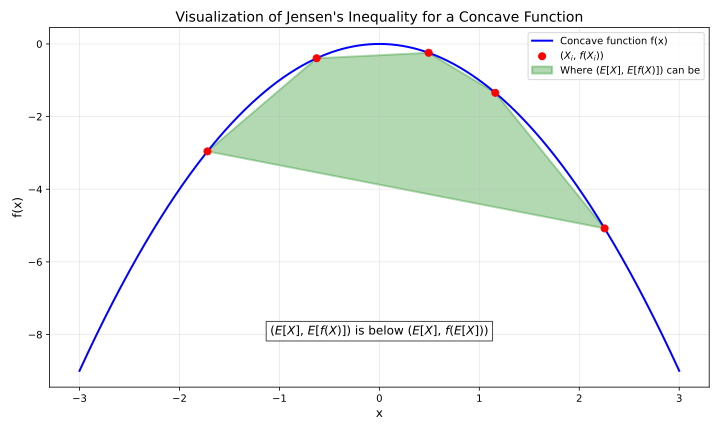

# Some Statistics Knowledge

## Basic concepts

Probability is relative to the information you have. 

Probability is related to sampling assumptions. Example: [Bertrand Paradox](https://en.wikipedia.org/wiki/Bertrand_paradox_(probability)): there are many ways to randoly select a chord on a circle, with different "proability densities".

A distribution tells how likely a random variable will be what value:

- A discrete distribution can be a table, telling the probability of each possible outcome.
- A discrete distribuiton can be a function, where the input is a possible outcome and the output is probability.
- A discrete distribution can be a vector (an array), where i-th number is the probability of i-th outcome.
- A discrete distribution can be a histogram, where each pillar is a possible outcome, and the height of pillar is probability.
- A continuous distribution can be described by a **probability density function (PDF)** $f$. A continuous distribution has infinitely many outcomes, and the probability of each specific outcome is zero (usually). We care about the probability of a range: $P(a<X<b)=\int_a^b f(x)dx$. The integral of the whole range should be 1: $\int_{-\infty}^{\infty}f(x)dx=1$. The value of PDF can be larger than 1.
- A distribution can be described by cumulative distribution function. $F(x) = P(X \leq x)$. It can be integration of PDF: $F(x) = \int_{-\infty}^x f(x)dx$. It start from 0 and monotonically increase then reach 1.
- Quantile function $Q$ is the inverse of cumulative distribution function. $Q(p) = x$ means $F(x)=p$ and $P(X \leq x) = p$. The top 25% value is $Q(0.75)$. The bottom 25% value is $Q(0.25)$. 

Independent means that two random variables don't affect each other. Knowing one doesn't affect the distribution of other. But there are dependent random variables that, when you know one, the distribution of another changes.

$P(X=x)$ means the probability of random variable $X$ take value $x$. It can also be written as $P_X(x)$ or $P(X)$. Sometimes the probability density function $f$ is used to represent a distribution.

A joint distribution tells how likely a combination of multiple variables will be what value. For a joint distribution of X and Y, each outcome is a pair of X and Y, denoted $(X, Y)$. If X and Y are independent, then $P(X=x,Y=y)=P((X,Y)=(x,y))=P(X=x) \cdot P(Y=y)$.

For a joint distribution of $(X, Y)$, if we only care about X, then the distribution of X is called **marginal** distribution.

You can only add probability when two events are mutually exclusive. 

You can only multiply probability when two events are independent or working with conditional probability.

What's the essence of probability? There are two views:

- Frequentist: Probability is an objective thing. We can know probability from the result of repeating a random event many times in the same condition.
- Bayesian: Probability is a subjective thing. Probability means how you think it's likely to happen based on your initial assumptions and the evidences you see.

## Conditional probability

$P(E|C)$ means the probability of $E$ happening **if** $C$ happens.

$$
P(E|C) = \frac{P(\overbrace{E \cap C}^\mathclap{E \ and \ C \ both \ happen})}{P(C)}
\quad\quad\quad\quad\quad
P(E\cap C) = P(E|C) \cdot P(C)
$$

If E and C are independent, then $P(E \cap C) = P(E)P(C)$, then $P(E|C)=P(E)$.

For example, there is a medical testing method of a disease. The test result can be positive (indicate having diesase) or negative. But that test is not always accurate.

There are two random variables: whether test result is positive, whther the person actually has disease. This is a joint distribution. The 4 cases:

|                               | Test is positive                      | Test is negative                       |
| ----------------------------- | ------------------------------------- | -------------------------------------- |
| Actually has disease          | True positive $a$                     | **False negative (Type II Error)** $b$ |
| Actually doesn't have disease | **False positive (Type I Error)** $c$ | True negative $d$                      |

$a, b, c, d$ are four possibilities. $a + b + c + d = 1$.

For that distribution, there are two marginal distributions. If we only care about whether the person actually has disease and ignore the test result, then the marginal distribution is:

|                               | Probability                           |
| ----------------------------- | ------------------------------------- |
| Actually has disease          | $a+b$ (the infect rate of population) |
| Actually doesn't have disease | $c+d$                                 |

Similarily there is also a marginal distribution of whether the test result is positive.

False negative rate is $P(\text{Test is negative} \ | \ \text{Actually has disease})$, it means the rate of negative test when actually having disease. And false positive rate is $P(\text{Test is positive} \ | \ \text{Actually doesn't have disease})$.

$$
\text{False negative rate} = P(\text{Test is negative} \ | \ \text{Actually has disease}) =
\frac{b}{a + b}
$$
$$
\text{False positive rate} = P(\text{Test is positive} \ | \ \text{Actually doesn't have disease}) = \frac{c}{c + d}
$$

Some people may intuitively think false negative rate means $P(\text{Test result is false} \ | \ \text{Test is negative})$, which equals $P(\text{Actually has disease} \ | \ \text{Test is negative})$, which equals $\frac{b}{b+d}$. But that's not the official definition of false negative.

Bayes theorem allow "reversing" $P(A|B)$ as $P(B|A)$:

$$
P(A|B) = \frac{P(A \cap B)}{P(B)} = \frac{P(B|A)\cdot P(A)}{P(B)}
$$

- **Prior** means what I assume the distribution is before knowing some new information.
- If I see some new information and improved my understanding of the distribution, then the new distribution that I assume is **posterior**.

## Mean

The theoretical mean is the "weighted average" of all possible cases using theoretical probabilities.

$E[X]$ denotes the theoretical mean of random variable $X$, also called the expected value of $X$. It's also often denoted as $\mu$.

For discrete case, $E[X]$ is calculated by summing all theoretically possible values multiply by their  theoretical probability.

The mean for discrete case:

$$
\mu = E[X] = \sum_{\underbrace{x} _ \mathclap{consider \ all \ cases \ of \ x}} x \cdot \overbrace{P(X=x)} ^ \mathclap{probability \ of \ that \ case}
$$

The mean for continuous case:

$$
\mu = E[X] = \int_{-\infty}^{\infty} x \cdot p(x) dx
$$

Some rules related to mean:

- The mean of two random variables can add up
$$E[X + Y] = E[X] + E[Y]\quad \quad \quad E[\sum_iX_i] = \sum_iE[X_i]$$
- Multiplying a random variable by a constant $k$ multiplies its mean
$$E[kX] = k \cdot E[X]$$
- A constant's mean is that constant
$$E[k] = k$$

(The constant $k$ doesn't necessarily need to be globally constant. It just need to be a certain value that's not affected by the random outcome. It just need to be "constant in context".)

Another important rule is that, if $X$ and $Y$ are independent, then

$$E[X \cdot Y] = E[X] \cdot E[Y]$$

Because when $X$ and $Y$ are independent, $P(X=x_i, Y=y_j) = P(X=x_i) \cdot P(Y=y_j)$, then:

$$E[X \cdot Y] = \sum_{i,j}{x_i \cdot y_j \cdot P(X=x_i, Y=y_j)} = \sum_{i,j}{x_i \cdot y_j \cdot P(X=x_i) \cdot P(Y=y_j)}$$

Note that $E[X+Y]=E[X]+E[Y]$ always work regardless of independence, but $E[XY]=E[X]E[Y]$ requires independence.

For a sum, the common factor that's not related to sum index can be extraced out. So:

$$
\sum_{i,j}f(i)g(j)
= \sum_{i} \left( \sum _ {j} (\underbrace{f(i)} _ \text{irrelevant to j} \cdot g(j)) \right)  
=\sum _ {i} \left(  f(i)  \underbrace{\sum _ {j} g(j)} _ \text{irrelevant to i} \right)
=\left(\sum _ {i} f(i)\right) \left(\sum  _ {j} g(j)\right) 
$$

Then:

$$
\sum_{i,j}{x_i \cdot y_j \cdot P(X=x_i) \cdot P(Y=y_j)} = \left(\sum_ix_iP(X=x_i)\right) \cdot \left(\sum_jy_jP(Y=y_j)\right) = E[X] \cdot E[Y]
$$

(That's for the discrete case. Continuous case is similar.)

If we have $n$ samples of $X$, denoted $X_1, X_2, ... X_n$, each sample is a random variable, and **each sample is independent to each other**, and **each sample are taken from the same distribution** (independently and identically distributed, **i.i.d**), then we can estimate the theoretical mean by calculating the average. The estimated mean is denoted as $\hat{\mu}$ (Mu hat):

$$
\hat{E}_i[X] = \hat{\mu} = \frac{1}{n} \sum_i{X_i}
$$

Hat  $\hat{}$  means it's an **empirical** value calculated from samples, not the theoretical value. 

Some important clarifications:

- The theoretical mean is weighted average using theoretical probabilities
- The estimated mean (empirical mean, sample mean) is non-weighted average over samples
- The theoretical mean is an accurate value, determined by the theoretical distribution
- The estimated mean is an inaccurate random variable, because it's calculated from random samples

The mean of estimated mean equals the theoretical mean. 

$$E[\hat{\mu}] = E[\frac{1}{n}\sum_iX_i] = \frac{1}{n} \sum_i E[X_i] = \frac{1}{n} \sum_i E[X] = \frac{1}{n} n \cdot E[X] = \mu$$

Note that if the samples are not independent to each other, or they are taken from different distributions, then the estimation will be possibly biased.

## Variance

The theoretical variance, $\text{Var}[X]$, also denoted as $\sigma ^2$, measures how "spread out" the samples are.

$$\sigma ^2 = \text{Var}[X] = E[(X - \mu)^2]$$

If $k$ is a constant:

$$
\text{Var}[kX] = k^2 \text{Var}[X]
$$
$$\text{Var}[X + k] = \text{Var}[X]$$
$$
\text{Var}[X] = E[X^2] - E[X]^2
$$

Standard deviation (**stdev**) $\sigma$ is the square root of variance. Multiplying a random variable by a constant also multiplies the standard deviation.

The covariance $\text{cov}[X, Y]$ meansures the "joint variability" of two random variables $X$ and $Y$.

$$
\text{cov}[X, Y] = E[(X-E[X])(Y-E[Y])]
\quad\quad\quad
\text{Var}[X]=\text{cov}[X,X]
$$

Some rules related to variance:

$$
\text{Var}[X + Y]=
E[((X-E[X])+(Y-E[Y]))^2] 
$$
$$
= E[(X-E[X])^2 + (Y-E[Y])^2 + 2(X-E[X])(Y-E[Y])] 
= \text{Var}[X] + \text{Var}[Y] + 2 \cdot \text{cov}[X, Y]
$$

If $X$ and $Y$ are indepdenent, as previouly mentioned $E[XY]=E[X]\cdot E[Y]$, then

$$\text{cov}[X, Y] = E[(X-E[X])(Y-E[Y])] = E[X-E[X]] \cdot E[Y-E[Y]] = 0 \cdot 0 = 0$$

so $\text{Var}[X + Y]= \text{Var}[X] + \text{Var}[Y]$


The mean is sometimes also called location. The variance is sometimes called dispersion.

If we have some i.i.d samples but don't know the theoretical variance, how to estimate the variance? If we know the theoretical mean, then it's simple:

$$
\hat{\sigma}^2 = \frac{1}{n} \sum_{i}((X_i - \mu)^2)
$$
$$E[\hat{\sigma}^2] = \sigma^2$$

However, the theoretical mean is different to the estimated mean. If we don't know the theoretical mean and use the estimated mean, it will be biased, and we need to divide $n-1$ instead of $n$ to avoid bias:

$$
\hat{\sigma}^2 = \frac{1}{n-1} \sum_{i}((X_i - \hat{\mu})^2)
$$

This is called Bessel's correction. note that the more i.i.d samples you have, the smaller the bias, so if you have many i.i.d samples, then the bias doesn't matter in practice.

Originally, n samples have n degrees of freedom. If we keep the estimated mean fixed, then it will only have n-1 degrees of freedom. That's an intuitive explanation of the correction. The exact dedution of that correction is tricky:

### Deduction of Bessel's correction

Firstly, the estimated mean itself also has variance

$$
\text{Var}[\hat{\mu}] = \text{Var}\left[\frac{1}{n}\sum_iX_i\right] = \frac{1}{n^2} \text{Var}\left[\sum_iX_i\right]
$$

As each sample is independent to other samples. As previously mentioned, if $X$ and $Y$ are independent, adding the variable also adds the variance: $\text{Var}[X + Y]= \text{Var}[X] + \text{Var}[Y]$. So:

$$\text{Var}\left[\sum_i{X_i}\right] = \sum_i{\text{Var}[X_i]} = n\sigma^2$$
$$\text{Var}[\hat{\mu}] = \frac{1}{n^2} \text{Var}\left[\sum_iX_i\right] = \frac{1}{n^2} \cdot n\sigma^2 = \frac{\sigma^2}{n}$$

As previously mentioned $E[\hat{\mu}] = \mu$, then $\text{Var}[\hat{\mu}] = E[(\hat{\mu} - E[\hat{\mu}])^2] = E[(\hat{\mu} - \mu)^2] = \frac{\sigma^2}{n}$. This will be used later.

A trick is to rewrite $X_i - \hat{\mu}$ to $(X_i - \mu) - (\hat{\mu} - \mu)$ and then expand:

$$
\sum_{i}((X_i - \hat{\mu})^2) = \sum _ {i}\left(((X_i - \mu) - (\hat{\mu} - \mu))^2\right)
= \sum _ i{\left(
(X_i - \mu)^2-2(X_i - \mu)(\hat{\mu} - \mu)+(\hat{\mu} - \mu)^2\right)
}
$$
$$
= \sum_i{(X_i - \mu)^2}
-2 (\hat{\mu} - \mu) \sum_i{(X_i - \mu)}
+n(\hat{\mu} - \mu)^2
\quad
$$

Then take mean of two sides:

$$
E\left[ \sum _ {i}((X_i - \hat{\mu})^2) \right]=
E\left[\sum _ i{(X_i - \mu)^2}
 -2 (\hat{\mu} - \mu) \sum _ i{(X_i - \mu)}
 +n(\hat{\mu} - \mu)^2\right]
$$
$$
=E\left[\sum_i{(X_i - \mu)^2}\right] 
-2 E\left[(\hat{\mu} - \mu) \sum_i{(X_i - \mu)}\right]
+n E[ (\hat{\mu} - \mu)^2 ]
$$

There are now three terms. The first one equals $n\sigma^2$:

$$
E\left[\sum_i{(X_i - \mu)^2}\right] = n\sigma^2
$$

note that

$$
\sum_i{(X_i-\mu)} = (\sum_iX_i) - n\mu = n\hat{\mu} - n\mu = n(\hat{\mu}-\mu)
$$

So the second one becomes

$$
-2 E\left[(\hat{\mu} - \mu) \sum_i{(X_i - \mu)}\right] =
-2E[(\hat{\mu}-\mu)n(\hat{\mu}-\mu)] = -2nE[(\hat{\mu}-\mu)^2]
$$

Now the above three things become

$$
E\left[ \sum_{i}((X_i - \hat{\mu})^2) \right]=n\sigma^2 -nE[(\hat{\mu}-\mu)^2]
$$

$E[(\hat{\mu}-\mu)^2]$ is also $\text{Var}[\hat{\mu}]$. As previously mentioned, it equals $\frac{\sigma^2}{n}$, so

$$
E\left[ \sum_{i}((X_i - \hat{\mu})^2) \right]=
n\sigma^2 -n \frac{\sigma^2}{n} = (n-1)\sigma^2
$$

So

$$
E\left[ \frac{\sum _ {i}((X_i - \hat{\mu})^2)}{n-1} \right] = \sigma^2
$$

## Z-score

For a random variable $X$, if we know its mean $\mu$ and standard deviation $\sigma$ then we can "standardize" it so that its mean become 0 and standard deviation become 1:

$$
Z = \frac{X-\mu}{\sigma}
$$

That's called Z-score or standard score.

Often the theoretical mean and theoretical standard deviation is unknown, so z score is computed using sample mean and sample stdev:

$$
Z = \frac{X-\hat\mu}{\hat\sigma}
$$

In deep learning, **normalization** uses Z score:

- **Layer normalization**: it works on a vector. It treats each element in a vector as different samples from the same distribution, and then replace each element with their Z-score (using sample mean and sample stdev).
- **Batch normalization**: it works on a batch of vectors. It treats the elements in the same index in different vectors in batch as different samples from the same distribtion, and then compute Z-score (using sample mean and sample stdev).

Note that in layer normalization and batch normalization, the variance usually divides by $n$ instead of $n-1$.

Computing Z-score for a vector can also be seen as a projection:

- The input $\boldsymbol{x} = (x_1,x_2,...,x_n)$
- The vector of ones: $\boldsymbol{1} = (1, 1, ..., 1)$
- Computing sample mean can be seen as scaling $\frac 1 n$ then dot product with the vector of ones:  ${\boldsymbol \mu}= \frac 1 n \boldsymbol{x} \cdot \boldsymbol{1}$
- Subtracting the sample mean can be seen as subtracting $\hat {\boldsymbol \mu} \cdot \boldsymbol{1}$, let's call it $\boldsymbol y$: $\boldsymbol y = \boldsymbol x - {\boldsymbol \mu} \cdot \boldsymbol{1} = \boldsymbol x- \frac 1 n (\boldsymbol{x} \cdot \boldsymbol{1}) \cdot \boldsymbol{1}$
- Recall projection: projecting vector $\boldsymbol a$ onto $\boldsymbol b$ is $(\frac{\boldsymbol a \cdot \boldsymbol b}{\boldsymbol b \cdot \boldsymbol b}) \cdot \boldsymbol b$.
- $(\boldsymbol 1)^2 = n$. So $\frac 1 n (\boldsymbol{x} \cdot \boldsymbol{1}) \cdot \boldsymbol{1}$ is the projection of $\boldsymbol x$ onto $\boldsymbol 1$. 
- Subtracting it means removing the component in the direction of $\boldsymbol 1$ from $\boldsymbol x$. So $\boldsymbol y$ is orthogonal to $\boldsymbol 1$. $\boldsymbol y$ is in a hyper-plane orthogonal to $\boldsymbol 1$.
- Standard deviation can be seen as the length of $\boldsymbol y$ divide by $\sqrt{n}$ (or $\sqrt{n-1}$): $\boldsymbol\sigma^2 = \frac 1 n (\boldsymbol y)^2$, $\boldsymbol\sigma = \frac 1 {\sqrt{n}} |\boldsymbol y|$.
- Dividing by standard deviation can be seen as projecting it onto unit sphere then multiply by $\sqrt n$ (or $\sqrt{n-1}$).
- So computing Z-score can be seen as firstly projecting onto a hyper-plane that's orthogonal to $\boldsymbol 1$ and then projecting onto unit sphere then multiply by $\sqrt n$ (or $\sqrt{n-1}$).

## Skewness

Skewness measures which side has more extreme values. 

$$\text{Skew}[X] = E\left[\frac{(X - \mu)^3}{\sigma ^3}\right]$$

A large positive skew means there is a fat tail on positive side (may have positive Black Swans). A large negative skew means fat tail on negative side (may have negative Black Swans). 

If two sides are symmetric, its skew is 0, regardless of how fat the tails are. Gaussian distributions are symmetric so they has zero skew. note that an asymmetric distribution can also has 0 skewness.

There is a concept called **moments** that unify mean, variance, skewness and kurtosis:

- The n-th moment: $E[X^n]$. Mean is the first moment.
- The n-th central moment: $E[(X-\mu)^n]$. Variance is the second central moment.
- The n-th central standardized moment: $E[(\frac{X-\mu}{\sigma})^n]$. Skewness is the third central standardized moment. Kurtosis is the fourth central standardized moment.

There is an unbiased way to estimate the thrid central moment $\mu_3$.

$$
\mu_3[X] = E[(X-\mu)^3]
\quad\quad\quad\quad
\hat{\mu_3} = \frac{n}{(n-1)(n-2)} \sum_i (X_i - \hat{\mu})^3
$$

The deduction of unbiased third central moment estimator is similar to Bessel's correction, but more tricky.

A common way of estimating skewness from i.i.d samples, is to use the unbiased third central moment estimator, to divide by cubic of unbiased estimator of standard deviation:

$$
G_1 = \frac{\hat{\mu_3}}{\hat{\sigma}^3}
= \frac{n}{(n-1)(n-2)}\sum_i{\frac{(X_i - \hat{\mu})^3}{\hat{\sigma}^3}}
$$

But it's still biased, as $E[\frac{X}{Y}]$ doesn't necessarily equal $\frac{E[X]}{E[Y]}$. Unfortunately, there is no completely unbiased way to estimate skewness from i.i.d samples (unless you have other assumptions about the underlying distribution). The bias gets smaller with more i.i.d samples.

## Kurtosis

Larger kurtosis means it has a fatter tail. The more extreme values (Black Swans) it has, the higher its kurtosis.

$$\text{Kurt}[X] = E\left[\frac{(X - \mu)^4}{\sigma ^4}\right] = \frac{E[(X-\mu)^4]}{\sigma^4}$$

Gaussian distributions have kurtosis of 3. Excess kurtosis is the kurtosis minus 3.

A common way of estimating excess kurtosis from i.i.d samples, is to use the unbiased estimator of fourth cumulant ($E[(X-E[X])^4]-3Var[X]^2$), to divide the square of unbiased estimator of variance:

$$
G_2 = \frac{(n+1)n}{(n-1)(n-2)(n-3)} \cdot \frac{\sum_i((X_i-\hat{\mu})^4)}{\hat{\sigma}^4}
-3\frac{(n-1)^2}{(n-2)(n-3)}
$$

It's still biased.


## Control variate

If we have some independent samples of $X$, can estimate mean $E[X]$ by calculating average $\hat{E}[X]=\frac{1}{n}\sum_i X_i$. The variance of calculated average is $\frac{1}{n} \text{Var}[X]$, which will reduce by having more samples. 

However, if the variance of $X$ is large and the amount of samples is few, the average will have a large variance, the estimated mean will be inaccurate. We can make the estimation more accurate by using control variate.

If:

- we have a random variable Y that's correlated with X
- we know the true mean of Y: $E[Y]$,

Then we can estimate $E[X]$ using $\hat{E}[X+\lambda(Y-E[Y])]$, where $\lambda$ is a constant. By choosing the right $\lambda$, the estimator can have lower variance than just calculating average of X. The Y here is called a control variate.

Some previous knowledge: $E[\hat{E}[A]] = E[A]$,  $\text{Var}[\hat{E}[A]]=\frac{1}{n}\text{Var}[A]$.

The mean of that estimator is $E[X]$, meaning that the estimator is unbiased:

$$
E[\hat{E}[X+\lambda(Y-E[Y])]] = E[X+\lambda(Y-E[Y])] 
= E[X] + \lambda(\underbrace{E[Y-E[Y]]}_{=0})=E[X]
$$

Then calculate the variance of the estimator:

$$
\text{Var}[\hat{E}[X+\lambda(Y-E[Y])]]=\frac{1}{n}\text{Var}[X+\lambda(Y-E[Y])]
=\frac{1}{n}\text{Var}[X+\lambda Y\underbrace{-\lambda E[Y]}_\text{constant}]
$$
$$
=\frac{1}{n}\text{Var}[X+\lambda Y] = \frac{1}{n}(\text{Var}[X]+\text{Var}[\lambda Y] +2\text{cov}[X,\lambda Y])
= \frac{1}{n}(\text{Var}[X]+\lambda^2 \text{Var}[Y]+2\lambda \text{cov}[X,Y])
$$

We want to minimize the variance of estimatory by choosing a $\lambda$. We want to find a $\lambda$ that minimizes $\text{Var}[Y] \lambda^2 + 2\text{cov}[X,Y] \lambda$. Quadratic funciton knowledge tells $ax^2+bx+c \ \ (a>0)$ minimizes when $x=\frac{-b}{2a}$, then the optimal lambda is:

$$
\lambda = - \frac{\text{cov}[X,Y]}{\text{Var}[Y]}
$$

And by using that optimal $\lambda$, the variance of estimator is:

$$
\text{Var}[\hat{E}[X+\lambda(Y-E[Y])]]=\frac{1}{n} \left( \text{Var}[X] -\frac{\text{cov}[X,Y]^2}{\text{Var}[Y]} \right)
$$

If X and Y are correlated, then $\frac{\text{cov}[X,Y]^2}{\text{Var}[Y]} > 0$, then the new estimator has smaller variance and is more accurate than the simple one. The larger the correlation, the better it can be.

## Information entropy

Information entropy measures:

- How **uncertain** a distribution is.
- **How much information** a sample in that distribution carries.

If we want to measure the amount of information of a specific event, an event $E$ 's amount of information as $I(E)$, we can define these axioms:

- If that event always happens, then it carries zero information. $I(E) = 0$ if $P(E) = 1$.
- The more rare an event is, the larger information (more surprise) it carries. $I(E)$ increases as $P(E)$ decreases.
- The information of two independent events happen together is the sum of the information of each event. Here I use $(X, Y)$ to denote the combination of $X$ and $Y$. That means $I((X, Y)) = I(X) + I(Y)$ if $P((X, Y)) = P(X) \cdot P(Y)$. This implies the usage of logarithm.

Then according to the three axioms, the definition of $I$ is:

$$
I(E) = \log_b \frac{1}{P(E)} = - \log_b P(E)
$$

The base $b$ is relative to the unit. We often use the amount of bits as the unit of amount of information. An event with 50% probability has 1 bit of information, then the base will be 2:

$$
I(E) = \log_2 \frac{1}{P(E)} \quad \text{(in bits)}
$$

Then, for a distribution, the expected value of information of one sample is the expected value of $I(E)$. That defines information entropy $H$:

$$
H(X) = E[I(X)] = E\left[\log_2\frac{1}{P(X)}\right]
$$

In discrete case:

$$
H(X) = \sum_x \left(P(x) \cdot \log_2\left(\frac{1}{P(x)}\right) \right)
$$

If there exists $x$ where $P(x) = 0$, then it can be ignored in entropy calculation, as $\lim_{x \to 0} x \log x = 0$.

Information entropy in discrete case is always positive.

In continuous case, where $f$ is the probability density function, this is called differential entropy:

$$
H(X) = \int_{\mathbb{X}} {f(x) \cdot \log \frac{1}{f(x)}} dx
$$

($\mathbb{X}$ means the set of $x$ where $f(x) \neq 0$, also called support of $f$.)

In continuous case the base is often $e$ rather than 2. Here $\log$ by default means $\log_e$.

In discrete case, $0<=P(x)<=1$, $\log \frac{1}{P(x)} > 0$, so entropy can never be negative. But in continuous case, probability density function can take value larger than 1, so entropy may be negative.

- A fair coin toss with two cases has 1 bit of information entropy: $0.5 \cdot log_2(\frac{1}{0.5}) + 0.5 \cdot log_2(\frac{1}{0.5}) = 1$ bit.
- If the coin is biased, for example the head has 90% probability and tail 10%, then its entropy is: $0.9 \cdot log_2(\frac{1}{0.9}) + 0.1 \cdot log_2(\frac{1}{0.1}) \approx 0.47$ bits.
- If it's even more biased, having 99.99% probability of head and 0.01% probability of tail, then its entropy is: $0.9999 \cdot log_2(\frac{1}{0.9999}) + 0.0001 \cdot log_2(\frac{1}{0.0001}) \approx 0.0015$ bits.
- If a coin toss is fair but has 0.01% percent of standing up on the table, having 3 cases each with probability 0.0001, 0.49995, 0.49995, then its entropy is $0.0001 \cdot log_2(\frac{1}{0.0001}) + 0.49995 \cdot log_2(\frac{1}{0.49995}) + 0.49995 \cdot log_2(\frac{1}{0.49995}) \approx 1.0014$ bits. (The standing up event itself has about 13.3 bits of information, but its probability is low so it contributed small in information entropy)

If X and Y are independent, then $H((X,Y))=E[I((X,Y))]=E[I(X)+I(Y)]=E[I(X)]+E[I(Y)]=H(X)+H(Y)$. If one fair coin toss has 1 bit entropy, then n independent tosses has n bit entropy.

If I split one case into two cases, entropy increases. If I merge two cases into one case, entropy reduces. Because $p_1\log \frac{1}{p_1} + p_2\log \frac{1}{p_2} > (p_1+p_2) \log \frac{1}{p_1+p_2}$ (if $p_1 \neq 0, p_2 \neq 0$), which is because that $f(x)=\log \frac{1}{x}$ is convex, so $\frac{p_1}{p_1+p_2}\log\frac{1}{p_1}+\frac{p_2}{p_1+p_2}\log\frac{1}{p_2}>\log\frac{1}{p_1+p_2}$ , then multiply two sides by $p_1+p_2$ gets the above result.

The information entropy is the theorecical minimum of information required to encode a sample. For example, to encode the result of a fair coin toss, we use 1 bit, 0 for head and 1 for tail (reversing is also fine). If the coin is biased to head, to compress the information, we can use 0 for two consecutive heads, 10 for one head, 11 for one tail, which require fewer bits on average for each sample. That may not be optimal, but the most optimal loseless compresion cannot be better than information entropy.

In continuous case, if $k$ is a positive constant, $H(kX) = H(X) + \log k$:

$$
Y=kX \quad (k>0) \quad \quad
f_Y(y) = \frac{1}{k}f_X(\frac{y}{k})
$$
$$
H(Y) = \int {f_Y(y) \cdot \log\frac{1}{f_Y(y)}} dy=\int{\frac{1}{k}f_X(x)\log\frac{1}{\frac{1}{k}f_X(x)}} d(kx)
=\int f_X(x) \left(\log\frac{1}{f_X(x)} + \log k \right) dx
$$
$$
=\int f_X(x) \log \frac{1}{f_X(x)}dx + (\log k) \int f_X(x) dx = H(X) + \log k
$$

Entropy is invariant to offset of random variable. $H(X+k)=H(X)$

## Joint information entropy

A joint distribution of X and Y is a distribution where each outcome is a pair of X and Y. Its entropy is called joint information entropy. Here I will use $H((X,Y))$ to denote joint entropy (to avoid confusing with cross entropy).

$$
H((X,Y)) = E_{(X,Y)}\left[\log\frac{1}{P((X,Y))}\right] = \sum_{x,y}P((X,Y)=(x,y)) \log \frac{1}{P((X,Y)=(x,y))}
$$

If I fix the value of Y as $y$, then see the distribution of X:

$$
H(X|Y=y) = E_X\left[\log \frac{1}{P(X|Y=y)} \right]=\sum_xP(X=x|Y=y) \log\frac{1}{P(X=x|Y=y)}
$$

Take that mean over different Y, we get conditional entropy:

$$
H(X|Y) =  E_y[H(X|Y=y)] = \sum_{x,y} P(Y=y) P(X=x|Y=y) \log\frac{1}{P(X=x|Y=y)}
$$

Applying conditional probability rule: $P((X,Y)) = P(X|Y) P(Y)$

$$
= \sum_{x,y} P((X,Y)) \log \frac{1}{P(X=x|Y=y)}
$$

So the conditional entropy is defined like this:

$$
H(X|Y) = E_{X,Y}\left[\log\frac{1}{P(X|Y)}\right] = \sum_{x,y} P((X,Y)=(x,y)) \log \frac{1}{P(X=x|Y=y)}
$$

$P((X, Y)) = P(X|Y) P(Y)$. Similarily, $H((X,Y))=H(X|Y)+H(Y)$. The exact deduction is as follows:

$$
H(X|Y) + H(Y) = E_{X,Y}\left[ \log\frac{1}{P(X|Y)} \right] +E_Y\left[\log\frac{1}{P(Y)}\right]=E_{X,Y}\left[ \log\frac{1}{P(X|Y)} \right] +E_{X,Y}\left[\log\frac{1}{P(Y)}\right]
$$
$$
=E_{X,Y}\left[ \log\frac{1}{P(X|Y)}+\log\frac{1}{P(Y)} \right]=E_{X,Y}\left[ \log\frac{1}{P(X|Y)P(Y)}\right]=E_{X,Y}\left[ \log \frac{1}{P((X,Y))} \right] = H((X,Y))
$$

If $X$ and $Y$ are not independent, then the joint entropy is smaller than if they are independent: $H((X, Y)) < H(X) + H(Y)$. If X and Y are not independent then knowing X will also give some information about Y. This can be deduced by mutual information which will be explained below.

## KL divergence

Here $I_A(x)$ denotes the amount of information of value (event) $x$ in distribution $A$. The difference of information of the same value in two distributions $A$ and $B$:

$$
I_B(x) - I_A(x) = \log \frac{1}{P_B(x)} - \log \frac{1}{P_A(x)} = \log \frac{P_A(x)}{P_B(x)}
$$

The KL divergence from $A$ to $B$ is the expected value of that regarding the probabilities of $A$. Here $E_A$ means the expected value calculated using $A$'s probabilities:

$$
D_{KL}(A \parallel B) = E_A[I_B(x) - I_A(x)] = \sum_x P_A(x) \log \frac{P_A(x)}{P_B(x)}
$$

You can think KL divergence as:

- The "distance" between two distributions.
- If I "expect" the distribution is B, but the distribution is actually A, how much "surprise" do I get on average.
- If I design a loseless compression algorithm optimized for B, but use it to compress data from A, then the compression will be not optimal and contain redundant information. KL divergence measures how much redundant information it has on average.

KL divergence is also called relative entropy.

KL divergence is asymmetric, $D_{KL}(A\parallel B)$ is different to $D_{KL}(B\parallel A)$. It's often that the first distribution is the real underlying distribution, and the second distribution is an approximation or the model output.

If A and B are the same, the KL divergence betweem them are zero. Otherwise, KL divergence is positive. KL divergence can never be negative, will explain later.

$P_B(x)$ appears on denominator. If there exists $x$ that $P_B(x) = 0$ and $P_A(x) \neq 0$, then it can be seen that KL divergence is infinite. It can be seen as "The model expect something to never happen but it actually can happen". If there is no such case, we say that A absolutely continuous with respect to B, written as $A \ll B$. This requires all outcomes from B to include all outcomes from A.

Another concept is **cross entropy**. The cross entropy from A to B, denoted $H(A, B)$, is the entropy of A plus KL divergence from A to B:

$$
H(A, B) = H(A) + D_{KL}(A \parallel B) = E_A[I_B(x)]
$$
$$
H(A, B) = \sum_x P_A(x) \cdot \log \frac{1}{P_B(x)}
$$

Information entropy $H(X)$ can also be expressed as cross entropy of itself $H(X, X)$, similar to the relation between variance and covariance.

(In some places $H(A,B)$ denotes joint entropy. I use $H((A,B))$ for joint entropy to avoid ambiguity.)

Cross entropy is also asymmetric.

In deep learning cross entropy is often used as loss function. If each piece of training data's distribution's entropy $H(A)$ is fixed, minimizing cross entropy is the same as minimizing KL divergence.

### Jensen's inequality

Jensen's inequality states that for a concave function $f$:

$$
E[f(X)] \leq f(E[X])
$$

The reverse applies for convex.

Here is a visual example showing Jensen's inequality. For example I have a discrete distribution with 5 cases $X_1,X_2,X_3,X_4,X_5$ (these are possible outcomes of distribution, not samples), corresponding to X coordinates of the red dots. The probabilities of the 5 cases are $p_1, p_2, p_3, p_4, p_5$ that sum to 1.

$E[X] = p_1 X_1 + p_2 X_2 + p_3 X_3 + p_4 X_4 + p_5 X_5$.

$E[f(x)] = p_1 f(X_1) + p_2 f(X_2) + p_3 f(X_3) + p_4 f(X_4) + p_5 f(X_5)$.

Then $(E[X], E[f(x)])$ can be seen as an **interpolation** between five points $(X_1, f(X_1)), (X_2, f(X_2)), (X_3, f(X_3)), (X_4, f(X_4)), (X_5, f(X_5))$, using weights $p_1, p_2, p_3, p_4, p_5$. The possible area of the interpolated point correspond to the green convex polygon:



```python
import numpy as np
import matplotlib.pyplot as plt
from matplotlib.patches import Polygon

np.random.seed(42)

def concave_function(x):
    return -x**2

x_range = np.linspace(-3, 3, 1000)
y_range = concave_function(x_range)

x_points = np.random.uniform(-2.5, 2.5, 5)
x_points = np.sort(x_points)
y_points = concave_function(x_points)

average_x = np.mean(x_points)
f_of_average_x = concave_function(average_x)

average_of_f = np.mean(y_points)

plt.figure(figsize=(10, 6))

plt.plot(x_range, y_range, 'b-', linewidth=2, label='Concave function f(x)')

plt.scatter(x_points, y_points, color='red', s=50, zorder=3, label='($X_i$, $f(X_i)$)')

polygon_vertices = list(zip(x_points, y_points))
polygon = Polygon(polygon_vertices, closed=True, alpha=0.3, facecolor='green', edgecolor='green', 
                 linewidth=2, label='Where ($E[X]$, $E[f(X)]$) can be')
plt.gca().add_patch(polygon)

inequality_text = "($E[X]$, $E[f(X)]$) is below ($E[X]$, $f(E[X])$)"
plt.text(0, min(y_range) + 1, inequality_text, 
         horizontalalignment='center', fontsize=12, bbox=dict(facecolor='white', alpha=0.7))

plt.grid(True, alpha=0.3)
plt.legend(loc='upper right')
plt.title("Visualization of Jensen's Inequality for a Concave Function", fontsize=14)
plt.xlabel('x', fontsize=12)
plt.ylabel('f(x)', fontsize=12)

plt.tight_layout()
#plt.show()

plt.savefig("jensen_inequality.svg")

```

For each point in green polygon $(E[X], E[f(X)])$, the point on function curve with the same X coordinate $(E[X], f(E[X]))$ is above it. So $E[f(X)] \leq f(E[X])$.

The same applies when you add more cases to the discrete distribution, the convex polygon will have more points but still below the function curve. The same applies to continuous distribution when there are infinitely many cases.

Jensen's inequality tells that KL divergence is non-negative:

There is a trick that extracting -1 makes $P_A$ be in denominator that will be cancelled later.

$$
D_{KL}(A\parallel B) = E_A\left[\log \frac{P_A(x)}{P_B(x)}\right] = - E_A\left[\log \frac{P_B(x)}{P_A(x)}\right]
$$

The logarithm function is concave. Jensen's inequality gives:

$$
E_A\left[\log \frac{P_B(x)}{P_A(x)}\right] \leq \log \left( E_A \left[\frac{P_B(x)}{P_A(x)}\right] \right)
$$

Multiplying -1 and flip:

$$
D_{KL}(A \parallel B) = - E_A\left[\log \frac{P_B(x)}{P_A(x)}\right] \geq  
-\log \left( E_A \left[\frac{P_B(x)}{P_A(x)}\right] \right)
$$

The right side equals 0 because:

$$
E_A \left[\frac{P_B(x)}{P_A(x)}\right] = \sum_x P_A(x) \cdot \frac{P_B(x)}{P_A(x)} = \sum_x P_B(x) = 1
\quad\quad\quad
-\log \left( E_A\left[\frac{P_B(x)}{P_A(x)}\right] \right) = -\log 1 = 0
$$

### Estimate KL divergence

If:

- We have two distributions: $A$ is the target distribution, $B$ is the output of our model
- We have $n$ samples from $A$: $x_1, x_2, ... x_n$
- We know the probablity of each sample in each distribution. We know $P_A(x_i)$ and $P_B(x_i)$

Then how to estimate the KL divergence $D_{KL}(A, B)$?

Reference: [Approximating KL Divergence](http://joschu.net/blog/kl-approx.html)

As KL divergence is $E_A\left[\log \frac{P_A(x)}{P_B(x)}\right]$, the simply way is to calculate the average of $\log \frac{P_A(x)}{P_B(x)}$:

$$
\hat{D}_{KL}(A \parallel B) = \hat E_{x \sim A}\left[\log\frac{P_A(x)}{P_B(x)}\right]=\frac{1}{n}\sum_{x \sim A} \log \frac{P_A(x)}{P_B(x)}
$$

However it may to be negative in some cases. The true KL divergence can never be negative. This may cause issues.

A better way to estimate KL divergence is:

$$
\hat{D}_{KL}(A \parallel B) = \hat E_{x \sim A} \left[\log \frac{P_A(x)}{P_B(x)} + \frac{P_B(x)}{P_A(x)} - 1\right]
$$

($P_A(x) = 0$ is impossible because it's sampled from A)

It's always positive and has no bias. The $\frac{P_B(x)}{P_A(x)}-1$ is a **control variate** and is negatively correlated with $\log \frac{P_A(x)}{P_B(x)}$.

Recall control variate: if we want to estimate $E[X]$ from samples more accurately, we can find another variable $Y$ that's correlated with $X$, and we must know its theoretical mean $E[Y]$, then we use $\hat E[X+\lambda Y] - \lambda E[Y]$ to estimate $E[X]$. The parameter $\lambda$ is choosed by minimizing variance.

The mean of that control variate is zero, because $E_{x \sim A}\left[\frac{P_B(x)}{P_A(x)}-1\right]=\sum_x P_A(x) (\frac{P_B(x)}{P_A(x)}-1)=\sum_x (P_B(x) - P_A(x)) =\sum_x P_B(x) - \sum_x P_A(x)=0$

The $\lambda=1$ is not chosen by mimimizing variance, but chosen by making the estimator non-negative. If I define $k=\frac{P_B(x)}{P_A(x)}$, then $\log \frac{P_A(x)}{P_B(x)} + \lambda(\frac{P_B(x)}{P_A(x)} - 1) = -\log k + \lambda(k-1)$. We want it to be non-negative: $-\log k + \lambda(k-1) \geq 0$ for all $k>0$, it can be seen that a line $y=\lambda (k-1)$ must be above $y=\log k$, the only solution is $\lambda=1$, where the line is a tangent line on $\log k$.

### KL divergence in reinforcement learning

In reinforcement learning, the KL divergence is usually used in loss function for regularization and make training more stable.

In policy model, the model accepts a state input and output a distribution (a vector of probabilities), telling the probability of doing each possible action in that state, called policy value:

$$
\pi_{\text{parameter}} (\text{action} \ | \ \text{state}) = \text{probability of taking that action given state}
$$

The training keeps updating the model parameter. KL divergence can be added into loss function to make the new model's policy be not too far from old policy, avoiding model from changing too fast, making training more stable:

$$
\text{Loss} = \ ... + \hat E_{\text{state}}[\hat D_{KL}(\pi_\text{new parameter}(\cdot | \text{state}) \parallel \pi_\text{old parameter}(\cdot | \text{state}))]
$$

That KL divergence is estimated from samples, using multiple states and multiple actions:

$$
\hat D_{KL}(\pi_\text{new}(\cdot|\text{state}) \parallel \pi_\text{old}(\cdot | \text{state}))= \hat E_{\text{action} \sim \pi_\text{new}}\left[
\log \frac{\pi_\text{new}(\text{action}|\text{state})}
{\pi_\text{old}(\text{action}|\text{state})}
+\frac{\pi_\text{old}(\text{action}|\text{state})}
{\pi_\text{new}(\text{action}|\text{state})}-1
\right]
$$

## Mutual information

If X and Y are independent, then $H((X,Y))=H(X)+H(Y)$. But if X and Y are not independent, knowing X reduces uncertainty of Y, then $H((X,Y))<H(X)+H(Y)$. 

Mutual information $I(X;Y)$ measures how "related" X and Y are:

$$
I(X;Y) = H(X) + H(Y) - H((X, Y)) 
$$

For a joint distribution, if we only care about X, then the distribution of X is a marginal distribution, same as Y. 

If we treat X and Y as independent, consider a "fake" joint distribution as if X and Y are independent. Denote that "fake" joint distribution as $Z$, then $P(Z=(x,y))=P(X=x)P(Y=y)$. It's called "outer product of marginal distribution", because its probability matrix is the outer product of two marginal distributions, so it's denoted $X \otimes Y$.

Then mutual information can be expressed as KL divergence between joint distribution $(X, Y)$ and that "fake" joint distribution $X \otimes Y$:

$$
I(X;Y)=H(X)+H(Y)-H((X,Y))=E_X[I(X)]+E_Y[I(Y)]-E_{X,Y}[I((X,Y))]
$$

$$
=E_{X,Y}[I(X)+I(Y)-I((X,Y))] = E_{X,Y}\left[\log\frac{1}{P(X)} + \log \frac{1}{P(Y)} - \log \frac{1}{P((X,Y))} \right]
$$

$$
=E_{X,Y}\left[\log\frac{P((X,Y))}{P(X)P(Y)} \right]
= D_{KL}((X,Y) \parallel (X \otimes Y))
$$

KL divergence is zero when two distributions are the same, and KL divergence is positive when two distributions are not the same. So:

- Mutual information $I(X;Y)$ is zero if the joint distribution $(X,Y)$ is the same as $X\otimes Y$, which means X and Y are independent. 
- Mutual information $I(X;Y)$ is positive if X and Y are not independent.
- Mutual information is never negative, because KL divergence is never negative. 

$H((X,Y))=H(X)+H(Y)-I(X;Y)$, so if X and Y are not independent then $H((X,Y))<H(X)+H(Y)$.

Mutual information is symmetric, $I(X;Y)=I(Y;X)$.

As $H((X,Y)) = H(X|Y) + H(Y)$, so $I(X;Y) = H(X) + H(Y) - H((X,Y)) = H(X) - H(X|Y)$.

If knowing Y completely determines X, knowing Y make the distribution of X collapse to one case with 100% probability, then $H(X|Y) = 0$, then $I(X;Y)=H(X)$.

### Information Bottleneck theory in deep learning

Information Bottleneck theory tells that the training of neural network will learn an intermediary representation that:

- Minimize $I(\text{Input} \ ; \ \text{IntermediaryRepresentation})$. Try to compress the intermediary representation and reduce unnecessary information related to input.
- Maximize $I(\text{IntermediaryRepresentation} \ ; \ \text{Output})$. Try to keep the information in intermediary representation that's releveant to the output as much as possible.

## Convolution

If we have two independent random variablex X and Y, and consider the distribution of the sum $Z=X+Y$, then

$$
P(Z=z)=\sum_{x,y, \ \text{if} \  z=x+y} P(X=x)P(Y=y)
$$

For each z, it sums over different x and y within the constraint $z=x+y$.

The constraint $z=x+y$ allows determining $y$ from $x$ and $z$: $y=z-x$, so it can be rewritten as:

$$
P(Z=z)=\sum_{x}P(X=x) P(Y=z-x)
$$

In continuous case

$$
f_Z(z) = \int_{-\infty}^{\infty} f_X(x) f_Y(z-x) dx
$$

The probability density function of the sum $f_Z$ is denoted as convolution of $f_X$ and $f_Y$:

$$
f_Z = f_X * f_Y \quad\quad\quad P_Z=P_X * P_Y
$$

The convolution operator $*$ can:

- In continuous case, convolution takes two probability density functions, and give a new probability density function.
- In discrete case, convolution can take two functions and give a new function. Each function inputs an outcome and outputs the probability of that outcome.
- In discrete case, convolution can take two vectors and give a new vector. Each vector's i-th element is the probability of i-th outcome.

### Convolutional neural network

TODO

## Likelihood

Normally when talking about probability we mean the probability of an outcome under a modelled distribution: $P(\text{outcome} \ | \ \text{modelled distribution})$. But sometimes we have some concrete samples from a distribution but want to know which model suits the best, so we talk about the probability that a model is true given some samples: $P(\text{modelled distribution} | \text{outcome})$. 

If I have some samples, then some parameters make the samples more **likely** to come from the modelled distribution, and some parameters make the samples less likely to come from the modelled distribution. 

For example, if I model a coin flip using a parameter $\theta$, that  and I observe 10 coin flips have 9 heads and 1 tail, then $\theta=0.9$ is more likely than $\theta=0.5$. That's straightforward for a simple model. But for more complex models, we need to measure likelihood.

Likelihood $L(\theta|x_1,x_2,...,x_n)$ measures:

- How likely that we get samples $x_1, x_2, ... , x_n$ from the modelled distribution using parameter $\theta$.
- how likely a parameter $\theta$ is the real underlying parameter, given some independent samples $x_1,x_2,...,x_n$.

$$
L(\theta | x_1,x_2,...x_n) = f(x_1|\theta) \cdot f(x_2|\theta) \cdot ... \cdot f(x_n|\theta) = \prod_i f(x_i|\theta)
$$

For example, if I model a coin flip distribution using a parameter $\theta$, the probability of head is $\theta$ and tail is $1-\theta$. If I observe 10 coin flip has 9 heads and 1 tail, then the likelihood of $\theta$:

$$
L(\theta | \text{ 9 heads and 1 tail }) = \theta^9 \cdot (1-\theta)
$$

- If I assume that the coin flip is fair, $\theta=0.5$, then likelihood is about 0.000977. 
- If I assume $\theta=0.9$, then likelihood is about 0.387, which is larger. 
- If I assume $\theta=0.999$ then likelihood is about 0.00099, which is smaller than when assuming $\theta=0.9$.

The more likely a parameter is, the higher its likelihood. If $\theta$ equals the true underlying parameter then likelihood takes maximum.

By taking logarithm, multiply becomes addition, making it easier to analyze. The log-likelihood function:

$$
\log L(\theta | x_1,x_2,...x_n) = \sum_i \log f(x_i|\theta)
$$

### Score and Fisher information

The **score function** is the derivative of log-likelihood with respect to parameter, for one sample:

$$
s(\theta;x) = \frac{\partial \log L(\theta | x)}{\partial \theta}
= \frac{\partial\log f(x | \theta)}{\partial \theta} = \frac{1}{f(x|\theta)} \cdot  \frac{\partial f(x|\theta)}{\partial \theta}
$$

If $\theta$ equals true underlying parameter, then mean of likelihood $E_x[L(\theta | x)]$ takes maximum, mean of log-likelihood $E_x[\log L(\theta|x)]$ also takes maximum.

A continuous function's maximum point has zero derivative, so when $\theta$ is true, then the mean of score function $E_x[s(\theta;x)]= \frac{\partial E_x[f(x|\theta)]}{\partial \theta}$ is zero.

The **Fisher information** $\mathcal{I}(\theta)$ is the mean of the square of score:

$$
\mathcal{I}(\theta) = E_x[s(\theta;x)^2]
$$

(The mean is calculated over different outcomes, not different parameters.)

We can also think that Fisher information is always computed under the assumption that $\theta$ is the true underlying parameter, then $E_x[s(\theta;x)]=0$, then Fisher information is the variance of score $\mathcal{I}(\theta)=\text{Var}_x[s(\theta;x)]$.

Fisher informaiton $\mathcal{I}(\theta)$ also measures the curvature of score function, in parameter space, around $\theta$.

Fisher information measures how much information a sample can tell us about the underlying parameter.

### Linear score

When the parameter is an offset and the offset is infinitely small, then the score function is called linear score. If the infinitely small offset is $\theta$. The offseted probability density is $f_2(x|\theta) = f(x+\theta)$, then 

$$
s_\text{linear}(x)=s(\theta;x) = \frac{\partial f_2(x|\theta)}{\partial \theta} = \frac{\partial \log f(x+\overbrace{\theta}^{\approx 0})}{\partial \theta} = \frac{d\log f(x)}{dx}
$$

In the places that use score function (and Fisher information) but doesn not specify which parameter, they usually refer to the linear score function.

## Max-entropy distributions

Recall that if we make probability distribution more "spread out" the entropy will increase. If there is no constraint, maximizing entropy of real-number distribution will get a distribution that's "infinitely spread out over all real numbers". But if there are constraints, maximizing entropy will give some common and important distributions:

| Constraint                          | Max-entropy distribution     |
| ----------------------------------- | ---------------------------- |
| $a \leq X \leq b$                   | Uniform distribution         |
| $E[X]=\mu,\ \text{Var}[X]=\sigma^2$ | Normal distribution          |
| $X \geq 0, \ E[X]=\mu$              | Exponential distribution     |
| $X \geq m > 0, \ E[\log X] = g$     | Pareto (Type I) distribution |

There are other max-entropy distributions. See [Wikipedia](https://en.wikipedia.org/wiki/Maximum_entropy_probability_distribution).

We can rediscover these max-entropy distributions, by using Largrange multiplier and functional derivative.

### Largrange multiplier

To find the distribution with maximum entropy under variance constraint, we can use Largrange multiplier. If we want to find maximum or minimum of $f(x)$ under the constraint that $g(x)=0$, we can define Largragian function $\mathcal{L}$:

$$
\mathcal{L}(x,\lambda) = f(x) + \lambda \cdot g(x)
$$

Its two partial derivatives have special properties:

$$
\frac{\partial \mathcal{L}(x,\lambda)}{\partial x} = \frac{\partial f(x)}{\partial x} + \lambda \frac{\partial g(x)}{\partial x}
\quad\quad\quad
\frac{\partial \mathcal{L}(x,\lambda)}{\partial \lambda} = g(x)
$$

Then solving equation $\frac{\partial \mathcal{L}(x,\lambda)}{\partial x}=0$ and $\frac{\partial \mathcal{L}(x,\lambda)}{\partial \lambda}=0$ will find the maximum or minimum under constraint. Similarily, if there are many constraints, there are multiple $\lambda$s. Similar things also apply to functions with multiple arguments. The argument $x$ can be a number or even a function, which involves functional derivative:

### Functional derivative

A functional is a function that inputs a function and outputs a value. (One of) its input is a function rather than a value (it's a higher-order function). Functional derivative (also called variational derivative) means the derivative of a functional respect to its argument function.

To compute functional derivative, we add a small "perturbation" to the function. $f(x)$ becomes $f(x)+ \epsilon \cdot \eta(x)$, where epsilon $\epsilon$ is an infinitely small value that approaches zero, and eta $\eta(x)$ is a test function. The test function can be any function that satisfy some properties.

The definition of functional derivative:

$$
\frac{\partial G(f+\epsilon \eta)}{\partial \epsilon} = \int \boxed{\frac{\partial G}{\partial f}} \cdot \eta(x) dx
$$

Note that it's inside integration.

For example, this is a functional: $G(f) = \int x f(x) dx$. To compute functional derivative $\frac{\partial G(f)}{\partial f}$, we firstly compute $\frac{\partial G(f+\epsilon \eta)}{\partial \epsilon}$ then try to make it into the form of $\int \boxed{\frac{\partial G}{\partial f}} \cdot \eta(x) dx$

$$
\frac{\partial G(f+\epsilon \eta)}{\partial \epsilon}=
\frac{\partial \int x (f(x)+\epsilon \eta(x))dx }{\partial \epsilon}=
\int x \cdot \eta(x) dx
$$

Then by pattern matching with the definition, we get $\frac{\partial G}{\partial f}=x$.

Calculate functional derivative for $G(f)=\int x^2f(x)dx$:

$$
\frac{G(f+\epsilon\eta)-G(f)}{\partial \epsilon}=
\frac{\partial\int x^2(f(x)+\epsilon\eta(x))- x^2f(x)dx}{\partial \epsilon}
= \int x^2 \eta(x) dx
$$

Then $\frac{\partial G}{\partial f}=x^2$.

Calculate functional derivative for $G(f) = \int (-f(x) \log f(x)) dx$:

$$
\frac{\partial G(f+\epsilon \eta)}{\partial \epsilon} = \frac{\partial \int (-1) (f(x)+\epsilon \eta(x)) \log(f(x)+\epsilon\eta(x)) dx}{\partial \epsilon}
$$

$$
= \int (-1) \left( \eta(x) \log (f(x)+\epsilon \eta(x)) + \frac{\eta(x)}{f(x)+\epsilon \eta(x)} (f(x)+\epsilon \eta(x)) \right) dx
= \int \left( -\log(f(x)+\epsilon \eta(x)) - 1 \right) \eta(x) dx
$$

As $\log$ is continuous, and $\epsilon \eta(x)$ is infinitely small, so $\log(f(x)+\epsilon \eta(x))=\log (f(x))$:

$$
\frac{\partial G(f+\epsilon \eta)}{\partial \epsilon} = \int (-\log f(x) - 1) \eta(x) dx
\quad\quad\quad
\frac{\partial G}{\partial f} = -\log f(x) - 1
$$

### Get uniform distribution by maximizing entropy

If we constraint the variance range,  $a \leq X \leq b$, then maximize its entropy using fuctional derivative

We have constraint $\int_a^b f(x)dx=1$, which is $\int_a^b f(x)dx-1=0$.

$$
\mathcal{L}(f) = \int_a^b f(x) \log \frac 1 {f(x)} dx + \lambda_1 \left(\int_a^b f(x)dx-1  \right)
$$

$$
= \int_a^b (-f(x) \log f(x) + \lambda_1 f(x)) dx - \lambda_1
$$

Compute derivatives

$$
\frac{\partial \mathcal{L}}{\partial f} = -\log f(x) -1 + \lambda_1
\quad\quad\quad
\frac{\partial \mathcal{L}}{\partial \lambda_1} = \int_a^b f(x)dx-1
$$

Solve $\frac{\partial \mathcal{L}}{\partial f}=0$:

$$
-\log f(x) -1 + \lambda_1=0
\quad\quad\quad
\log f(x) = \lambda_1 - 1
\quad\quad\quad
f(x) = e^{\lambda_1-1}
$$

Solve $\frac{\partial \mathcal{L}}{\partial \lambda_1}=0$:

$$
\int_a^b f(x)dx=1
\quad\quad\quad
\int_a^b e^{\lambda_1-1} dx = 1
\quad\quad\quad
(b-a) e^{\lambda_1-1} = 1
\quad\quad\quad
e^{\lambda_1-1}=\frac 1 {b-a}
$$

The result is $f(x) = \frac 1 {b-a} \ \ \ (a \leq x \leq b)$. 
