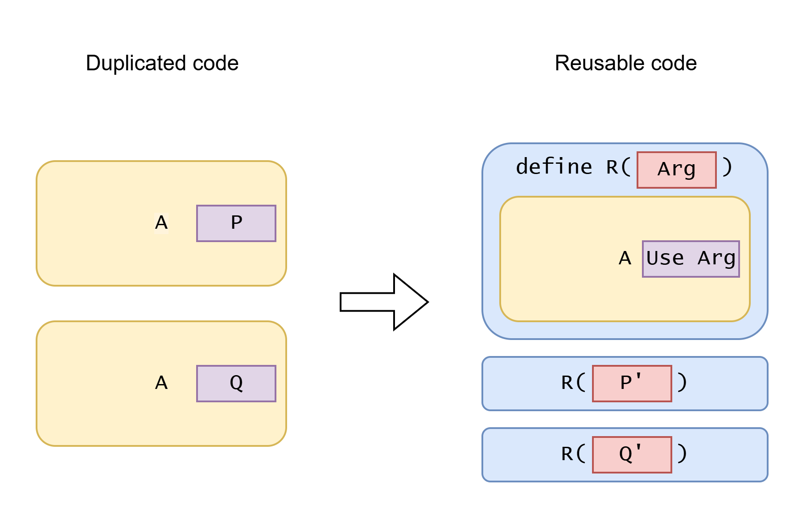

# About Code Reuse, Polymorphism and Abstraction

<!-- truncate -->

## Code reuse mechanisms

| Code reuse mechanism                                                  | A                    | P and Q                                                       | R                                        | P' and Q'                                                             | Use Arg                                                                  |
| --------------------------------------------------------------------- | -------------------- | ------------------------------------------------------------- | ---------------------------------------- | --------------------------------------------------------------------- | ------------------------------------------------------------------------ |
| Extract function                                                      | Execution code block | Values                                                        | Function                                 | Values (converted to argument type)                                   | Pass argument                                                            |
| Extract higher-order function (closure, lambda expression)            | Execution code block | Execution code blocks (can take outer arguments)              | Function, taking function as argument    | Closure function (can capture values)                                 | Call function argument                                                   |
| OOP inheritance, Interface, dynamic trait (subtype polymorphism)      | Execution code block | Execution code blocks (can take outer arguments)              | Code that use supertype object reference | Objects of different subtypes overriding polymorphic method           | Call polymorphic method                                                  |
| Function overloading, static trait, typeclasses (ad-hoc polymorphism) | Execution code block | Execution code blocks (possibly dealing with different types) | Generic function                         | Type or typeclass                                                     | Call overloaded function / call trait function / call typeclass function |
| Generic type (parametric polymorphism)                                | Type definition      | Types                                                         | Generic type                             | Type parameters                                                       | Use type parameter                                                       |
| Generic function (parametric polymorphism)                            | Execution code block | Types                                                         | Generic function                         | Type parameters (usually inferred)                                    | Use type parameter                                                       |
| Type erasure                                                          | Code block           | Values in different types, or works with different types      | Function (can be constructor)            | Value of top type (`any`, `Object`), with type information at runtime | Pass value, check type, cast type, reflection, etc.                      |
| Duck typing (row polymorphism), structural typing                     | Execution code block | Object field accesses, method calls                           | Field access or method call by name      | Different values with common fields or methods                        | Use common fields/methods by name                                        |
| Macro                                                                 | Code fragment        | Code fragments                                                | Macro                                    | Code fragments                                                        | Use macro argument                                                       |

## Regularize and de-regularize

Extracting function is regularization, while inlining function is de-regularization. Extracting function turns duplicated code into a shared function, and inlining turns shared function into duplicated code.

| Regularization                                                                               | De-regularization                                                             |
| -------------------------------------------------------------------------------------------- | ----------------------------------------------------------------------------- |
| Extract function                                                                             | Inline function                                                               |
| Extract generic parameter                                                                    | Inline generics / type erasure                                                |
| Encapsulate                                                                                  | Remove encapsulation                                                          |
| Extract higher-order function                                                                | Inline dynamic dispatch                                                       |
| Extract polymorphic method call                                                              | Inline dynamic dispatch                                                       |
| Use cross-platform frameworks                                                                | Develop separately for different platforms                                    |
| Adding flexibility                                                                           | Removing flexibility                                                          |
| Generalize                                                                                   | Specialize                                                                    |
| Abstracted "clever" code                                                                     | Duplicated "dumb" code                                                        |
| Easier to implement requirements that follow regularity.                                     | Harder to implement requirements that follow regularity. (duplicated changes) |
| Harder to implement requirements that breaks regularity. (add complex special-case handling) | Easier to implement requirements that breaks regularity.                      |

Why we sometimes specialize instead of generalizing:

- Generalization introduces new concepts and **adds cognitive load**. Sometimes, not adding these is better, depending on how useful the abstraction is.
- A new requirement can break the assumption or regularity that the generalization is based on. **New exceptions break generalization**.

About leaky abstraction: Abstraction aim to hide details and make things simpler. But some abstractions are **leaky**: to use it correctly you need to understand the details that it tries to hide. The more leaky an abstraction is, the less useful it is.

If a new requirement follows the regularity that the abstraction uses, then the abstraction is good and makes things simpler.

But when the new requirement change breaks the regularity, then abstraction hinders the developer. The developer will be left with two choices:

- De-regularize the abstraction and do the change accordingly. (And create new abstractions that follow the new regularity. This is refactoring.)
- Add special case handlings within the current abstraction. The exceptions can **make the previously unrelated things related again** (break orthogonality), **increasing (accidental) complexity**. It will often involve new boolean flags that control internal behavior, weird data relaying, new state sharing, new concurrency handling, etc.

**Every abstraction makes some things easier AND make other things harder. It's a tradeoff.**

> every game engine has things they make easier and things they make harder. working exclusively with one tool for a long time makes your brain stop even considering designs that fall outside the scope of that tool. it can make it feel like the tool doesnt have limits
> 
> \- Tyler Glaiel, [Link](https://x.com/TylerGlaiel/status/1880340558767702377)

## Simple interface = hardcoded defaults = less customizability

Real world is complex. Building software require making decision on a lot of details.

If some tool has a simple interface, it must have hardcoded a lot of detail decisions inside. If the interface exposes these detail decisions, the interface won't be simple.

This also applies to AI coding. When you write a vague prompt and LLM generates a whole application/feature for you, the generated code contains many opinionated detail decisions that's made by LLM, not you (of course you can then prompt the LLM to change a detail).

### When an existing tool "almost" match my requirement

Sometimes an existing tool can satisfy your 90% requirements. It lacks only 10% functioanlities. However, sometimes that missing 10% is the most important ones. And implementing that 10% is not a simple addition of feature but require architectural change.

Now there are two solutions:

- Avoid large architectural change. Just add workarounds here and there to make it support the new requirement.
- Rebuild a new one with the wanted architecture. Partialy "reinvent the wheel".

## Make things as unrelated as possible

Reducing complexity requires making things as unrelated as possible. One thing is less complex when less thing relates with it. Reduce responsibility of any individual module. Separation of concern.

In the context of programming, **orthogonality** means **unrelatedness**:

- Two different pieces of data can be combined in valid way.
- Two different pieces of logic can work together without interferring with each other. No need to do special-case-handling of combinations.
- No combinatory explosion.

Sometimes splitting a complex operation into multiple stages makes it more orthogonal. Merging multiple steps into one step increases complexity.

The reality is usually less perfect than theories. Often two things are mostly orthogonal but has some non-orthogonal edge cases. If the edge cases are few and are not complex, and add the special case handling is ok. However, if there are many special cases, or some special cases are complex, then the two modules are very non-orthogonal and should be re-designed.

### Reducing fake orthogonality

Sometimes the interface allow passing two orthogonal options, but it actually does not support some combinations of options. This is fake orthogonality (seems orthogonal in interface but actually doesn't).

Sum types are useful for avoiding the invalid combinations of data, reducing fake orthogonality. They can help correctness by stopping the invalid combinations of data from being created.

Another case is that the software provides orthogonality in interface, and actually supports all combinations of options (including many useless option combinations), but the implementation is non-orthogonal, then the implementaiton will face **combinatory explosion**. Limiting the supported combinations in interface is better.

> If you consider it as a library, you can use Windows linker functionality X in combination with Unix linker functionality Y, but there was no precedent for what the linker should behave in such a case. Even worse, in many situations, it was not obvious what would be the “right” behavior. We spent a lot of time discussing to define the semantics that would make sense for all possible feature combinations, and we carefully wrote complex code to support all targets simultaneously. However, in hindsight, this was probably not a good way to spend time because no one really wanted to use such hypothetical feature combinations. lld v1 probably didn't have any real users.
>
> \- [My story on “worse is better”](https://www.sigbus.info/worse-is-better)

## Examples of breaking abstraction

### Major change of data modelling

- The user name is used as id of user. But a new requirement comes: the user must be able to change the user name. 
  
  (Using name as id is usually a bad design, unless the tool is for programmers.)

- In a game, if an entity dies, that entity is deleted. But a new requirement comes: a dead entity can be resurrected by a new magic.
  
  To implement that, you need to change real delete to soft delete. For example, add a boolean flag of whether it's living, and check that flag in every logic of entity behavior.

- An app supports one language. And the event log is recorded using simple strings. But a new requirement comes: make the app support multiple languages. The user can switch language at any time and see the event log in their language.
  
  To implement that, you cannot store the text as string. The log should be stored as data structure of relevant information of log, and turned to text when showing in UI. (A "dumber" way is to store the strings for every supported language.)

- A todo list app need to support undo and redo.

### Major change of dataflow and source-of-truth

- In a singleplayer game, all game logic runs locally. All game data are in memoery and are loaded/saved from file. But a new requirement comes: make it multiplayer.
  
  In singleplayer game, the in-memory data can be source-of-truth, but in multiplayer the server is source-of-truth. Every non-client operation now requires packet sending and receiving.
  
  What's more, to reduce visible latency, the client side game must guess future game state and correct the guess from server packets (add rollback mechanism). It can become complex.

- In a todo list app, all data are loaded from server. All edits also go through server. But a new requirement comes: make the app work offline and sync when it connects with internet.

- In a GUI, previously there is a long running task that changes GUI state, and user cannot operate the GUI while task is running. Now, to improve user experience, you need to allow operating the GUI while task is running. Both the background task and user can now change the mutable state. [User interfaces are hard - why?](https://happyfellow.bearblog.dev/user-interfaces-are-hard-why/)

- Two previously separated UI components now need to share mutable state. [The complexity that lives in the GUI | RoyalSloth](https://blog.royalsloth.eu/posts/the-complexity-that-lives-in-the-gui/)

- The previous data processing removes some information. New requirement needs to keep that information. (Example TODO)

### Corner case explosion

- There are some fixed workflows (hardcoded in code). A new requirement comes: allow the user to configure and customize the workflow. The new flexible system allow much more ways of configuring and introduce many corner cases.
  
  (Developing specially for each enterprise customer may be actually easier than creating a configurable flexible "rules engine". The custom "rules engine" will be more complex and harder to debug than just code. You can still share common code when developing separately. [The Configuration Complexity Clock](https://mikehadlow.blogspot.com/2012/05/configuration-complexity-clock.html))

- Special case in permission system. Allow non-logged-in users to access some functionalities. Add bot as a new kind of user with special permissions. Make permission of modifying specific field fing-grained.
- Two systems A and B need to work together, but A and B's API both change across versions. However every version of A must work with every version of B.
- Keep adding AB test feature flags. There will be many combinations of feature flags. It's possible that some combinations will trigger bugs.

The design of CSS is an example of corner case explosion. CSS has many functionalities, each with corner cases. Most of them can be combined, creating many combinations of corner cases.

Deserialization faces much more corner cases than serialization. Deserialization is a common source of security vulnerabilities.

### Working on full data to working on partially known data

- There is a data visualization UI. Originally, it firstly loads all data from server then render. But when the data size become huge, loading becomes slow and you need break the data into parts, dynamically load parts and visualize loaded parts.
- A game has loading screen when switching scene. A new requirement comes: make the loading seamless and remove the loading screen.
- It loads all data from database and then compute things using programming language. One day the data become so big that cannot be held in memory. You need to either 
  - load partial data into memory, compute separately and then merge the result, or
  - rewrite logic into SQL and let database compute it 

