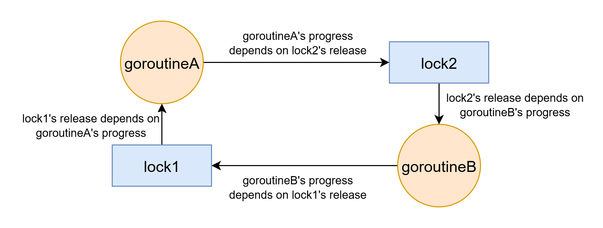
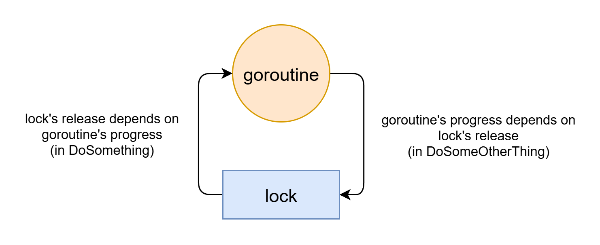
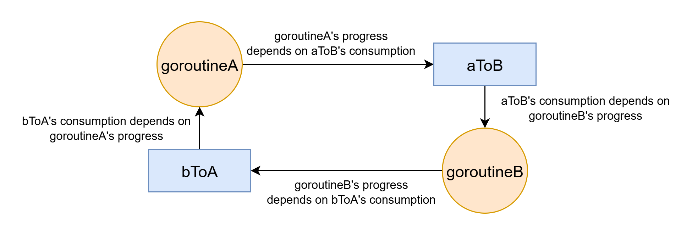
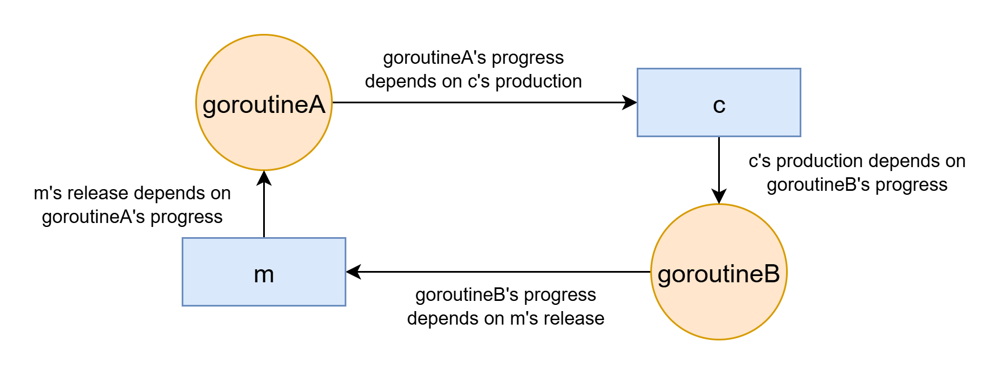

# Deadlock, Circular Reference and Halting

<!-- truncate -->

The 3 concepts: deadlock, circular reference and halting, are deeply connected.

## Deadlock

Deadlock can be understood via **resource allocation graph**.

It has two kinds of nodes:

- The unit of execution: Threads, processes, goroutines, async tasks, etc.
- Synchronization primitives: Locks, channels, etc.

Its edges represent **dependency**. A point to B means A depends on B. Specifically it has two kinds of edges:

- Assignment edge. A lock points to a thread. It denotes that the thread already holds the lock. The lock's release depends on the thread's progress.
- Request edge. A thread points to a lock. It denotes that the thread try to hold the lock. The thread's progress depends on acquiring the lock.

Deadlock occurs when that graph forms a **cycle**.

A simple two-lock deadlock in Golang:

```go
func goroutineA(lock1 *sync.Mutex, lock2 *sync.Mutex) {
	lock1.Lock()
	defer lock1.Unlock()
	// ...
	lock2.Lock() // deadlock here
	defer lock2.Unlock()
}

func goroutineB(lock2 *sync.Mutex, lock1 *sync.Mutex) {
	lock2.Lock()
	defer lock2.Unlock()
	// ...
	lock1.Lock() // deadlock here
	defer lock1.Unlock()
}
```

Resource allocation graph in deadlock state:



Golang's locks are not reentrant. Deadlock can happen with only one lock and one thread:

```go
type SomeObject struct {
	lock *sync.Mutex
	// ...
}

func (o *SomeObject) DoSomething() {
	o.lock.Lock()
	defer o.lock.Unlock()
	// ...
	o.DoSomeOtherThing()
}

func (o *SomeObject) DoSomeOtherThing() {
	o.lock.Lock() // deadlock here
	defer o.lock.Unlock()
	// ...
}
```



(Rust's locks are also non-reentrant. But Java `synchronized` and C# `lock` are reentrant. One thread can acquire same lock multiple times.)

**These examples are simplified. The real-world deadlocks are less obvious and often only trigger in specific conditions.** Some deadlocks rarely trigger and are hard to reproduce.

Sometimes retrying can solve deadlock. Retrying may evade the specific condition that deadlock relies on. But retrying may cause livelock, explained below.

## Lock-free deadlock

Deadlock can also happen when there is no explicit lock. I call it **lock-free deadlock**. (The naming is similar to "[serverless servers](https://vercel.com/blog/serverless-servers-node-js-with-in-function-concurrency)", "constant variables" and "[unnamed namespaces](https://en.cppreference.com/w/cpp/language/namespace.html#Unnamed_namespaces)".)

A simple Golang program showing lock-free deadlock:

```go
func goroutineA(aToB chan string, bToA chan string) {
	aToB <- "Hello from A" // deadlock here
	msg := <-bToA
}

func goroutineB(aToB chan string, bToA chan string) {
	bToA <- "Hello from B" // deadlock here
	msg := <-aToB
}
```

In Golang, channels are not buffered by default, then producer waits for consumer. If the two channels are not buffers, it will deadlock:



If you put a thing into a channel that no one will consume, it will wait forever. But changing the channel to buffered channel `make(chan string, 1)` will make the producer to not wait for consumer as long as buffer is not full. That deadlock can be solved by making channels buffered.

Note that Golang channel buffer must have a constant size limit. There are packages for unbounded channel ([chanx](https://github.com/smallnest/chanx)). Note that if big bursts happen it may out-of-memory.

Different choices of channel buffer:

- Use fixed-size buffer. When channel is full, producer blocks, this gives **back pressure**. It can avoid out-of-memory or disk full. It's often better for stability (only block some requests rather than letting whole system crash).
- Use unbounded buffer:
  - If buffer is in-memory, it can **out-of-memory if big burst occurs**.
  - Use disk-backed event queue, such as Kafka. Disk can hold more data than memory, but it's still finite. Kafka discards messages according to retention policy. If disk space is used up, there may be other issues (e.g. database may fail to write).

A simple one-goroutine lock-free deadlock:

```go
ctx, cancel := context.WithCancel(context.Background())
defer cancel()
// ...
<-ctx.Done() 
```

### Buffered channels can still deadlock

The previous deadlock can be solved by making channel buffered. However, buffering doesn't solve all lock-free deadlocks. 

Simple example:

```go
func goroutineA(aToB chan string, bToA chan string) {
	msg := <-bToA // deadlock here
	aToB <- "Hello from A"
}

func goroutineB(aToB chan string, bToA chan string) {
	msg := <-aToB // deadlock here
	bToA <- "Hello from B"
}
```

Also, if buffer is fixed-sized, when buffer is full, it may still deadlock. Example

```go
results := make(chan int, 100)
var wg sync.WaitGroup
wg.Add(1)
go func() {
    defer wg.Done()
    for i := 0; i < 200; i++ {
        results <- i
    }
}()
wg.Wait()
```

### Pipe buffer full deadlock

If a parent process launches a child process and pipes child's stdin and stdout, then:

- If the stdin pipe buffer is full, parent will block when writing to child stdin, until child reads from it.
- If the stdout pipe buffer is full, child will block when writing to its stdout, until parent reads from it.

It may deadlock. Example:

(`cat` when invoked without any argument will read data from stdin and output same data to stdout. The example launches a subprocess `cat` then write large data to its stdin before reading from its stdout.)

```go
cmd := exec.Command("cat")

stdin, err := cmd.StdinPipe()
if err != nil { panic(err) }
defer stdin.Close()

stdout, err := cmd.StdoutPipe()
if err != nil { panic(err) }

err = cmd.Start()
if err != nil { panic(err) }

largeData := []byte(strings.Repeat("X", 233333)) // larger than pipe buffer

_, err = stdin.Write(largeData) // deadlock here
if err != nil { panic(err) }

// read from stdout after writing large data
buf := make([]byte, len(largeData))
stdout.Read(buf)
```

The reading and writing to subprocess should use different goroutine.

## Channel+Lock deadlock

Example:

```go
func goroutineA(m *sync.Mutex, c chan string) {
    m.Lock()
    defer m.Unlock()
    value := <-c // deadlock here (assume goroutineA runs first)
}

func goroutineB(m *sync.Mutex, c chan string) {
    m.Lock() // deadlock here (assume goroutineA runs first)
    defer m.Unlock()
    c <- "some result"
}
```



## Select leak

For example, do some work with timeout, using channel and select:

```go
func doWorkWithTimeout(timeout time.Duration) (string, error) {
	ch := make(chan string) // unbuffered channel
	go func() {
		result := doWork()
		ch <- result // this blocks
	}()
	select {
	case result := <- ch:
		return result, nil
	case <- time.After(timeout):
		return "", errors.New("timeout") // if this path is taken, ch will never be consumed
	}
}
```

`select` will finish if either case gives a result. If it timeouts, `select` will finish by second case and never consume from `ch`. So the `ch <- result` will hang forever, causing **goroutine leak**. This can be fixed by making `ch` buffered.

Many memory leaks in Golang are caused by goroutine leak. Goroutine leak will also cause its task to never finish which can cause other bugs. If something waits for a leaked goroutine it will deadlock.

Select also has traps in async Rust, but in a different mechanism (cancellation).

## Livelock

Sometimes, replace locking with try-locking and add retrying mechanism can solve some deadlocks. Deadlock are often dependent on exact timing, so it may not deadlock in next retry. 

But sometimes retrying cannot avoid deadlock. Then it will become livelock: keep retrying without successfully acquiring lock.

```go
func WithRetry[T any](attempts int, operation func() (T, error)) (T, error) {
	i := 0
	for {
		result, err := operation()
		if err == nil {
			return result, nil
		}
		i++
		if i >= attempts {
			return result, err
		}
	}
}

func goroutineA(lock1 *sync.Mutex, lock2 *sync.Mutex) (string, error) {
	return WithRetry(10, func() (string, error) {
		lock1.Lock()
		defer lock1.Unlock()
		// do some work

		if lock2.TryLock() { // this may keep failing
			defer lock2.Unlock()
			// do some other work
			return "success", nil
		} else {
			return "", fmt.Errorf("failed to acquire lock2")
		}
	})
}

func goroutineB(lock1 *sync.Mutex, lock2 *sync.Mutex) (string, error) {
	return WithRetry(10, func() (string, error) {
		lock2.Lock()
		defer lock2.Unlock()
		// do some work
		
		if lock1.TryLock() { // this may keep failing
			defer lock1.Unlock()
			// do some other work
			return "success", nil
		} else {
			return "", fmt.Errorf("failed to acquire lock1")
		}
	})
}
```

## Priority inversion

In some real-time (or near-real-time) systems, important threads have higher priority than other thread. The thread scheduler tries to run higher-priority threads first. 

Priority inversion problem can make high-priority threads keep stuck, effectively similar to deadlock (although it's not deadlock).

The common priority inversion problem involves 3 threads, with low/medium/high priorities respectively:

- The low-priority thread holds a lock.
- A high-priority thread tries to acquire lock. It cannot and wait for low-priority thread to release lock.
- Another medium-priority thread keeps running. When medium-priority thread runs, it occupies CPU cores so that low-priority thread cannot run. The high-priority thread's running now indirectly depend on medium-priority thread. If medium-priority thread keeps running, high-priority thread will never run.


## SQL deadlock

There are explicit locks (updates, deletes, `select ... for update`, etc.). There are also implicit lockings. Here I will focus on non-obvious deadlocks related to implicit locking.

### Foreign key deadlock

In MySQL (InnoDB), it implicitly locks foreign-key-referenced row to ensure foreign key validity. But this may cause deadlock. Example:

```sql
create table parent (
    id int primary key,
    update_time timestamp
) engine=innodb;

create table child (
    id int primary key,
    parent_id int,
    constraint fk_parent foreign key (parent_id) references parent(id)
) engine=innodb;

insert into parent(id, update_time) values (2333, now());
```

Then there are two concurrent transctions. Each transaction inserts a child then updates parent `update_time`:

| Transaction A                                                                  | Tranaction B                                                                             |
| ------------------------------------------------------------------------------ | ---------------------------------------------------------------------------------------- |
| `insert into child(id, parent_id) values (1, 2333);`                           |                                                                                          |
| Implicitly read-lock parent row                                                |                                                                                          |
|                                                                                | `insert into child(id, parent_id) values (2, 2333);`                                     |
|                                                                                | Implicitly read-lock parent row                                                          |
| `update parent set update_time = now() where id = 2333;`                       |                                                                                          |
| Write-locks parent row. Because it's read-locked by transaction B, wait for B. |                                                                                          |
|                                                                                | `update parent set update_time = now() where id = 2333;`                                 |
|                                                                                | Write-locks parent row. Because it's read-locked by transaction A, wait for A. Deadlock. |

That deadlock is caused by **locking more than what it needs to lock**. To ensure the foreign key validity, it only need to ensure parent row don't get deleted (or change primary key). It doesn't need to lock whole parent row.

That deadlock can be prevented by changing timestamp before inserting child. It avoids upgrading read lock to write lock.

In PostgreSQL, when touching child row, it does fine-grained `for key share` locking to parent row. `for key share` doesn't prevent changing parent field other than referenced key. That deadlock case won't happen in PostgreSQL.

But in PostgreSQL foreign key can still deadlock with `for update`. `for update` is exclusive to `for key share`. Two transactions can firstly `for key share` lock the same parent row then `for update` the parent row then deadlock.

### MySQL gap lock deadlock

Normally, a row that does not yet exist cannot be locked. But MySQL can "lock a row that does not yet exist", by locking on a gap in index. It's called gap lock. It's used in repeatable read level. [^predicate_lock]

[^predicate_lock]: Apart from gap lock, there is another way of locking a row that doesn't yet exist: predicate lock. It prevents all new values that follow a predicate. It's used by PostgreSQL in serializable level.

Gap lock can cause deadlock.

For example, I have a table of users. The users with `status=1` cannot duplicate name. But users with other statuses can duplicate name. This "conditional unique" cannot be enforced by a simple unique index. So the application enforces it in backend code.

```sql
create table users (
    id int auto_increment primary key,
    name varchar(50),
    status int,
    index name_index (name)
) engine=innodb character set utf8mb4 collate utf8mb4_bin;
```

| Transaction A                                                                   | Transaction B                                                                              |
| ------------------------------------------------------------------------------- | ------------------------------------------------------------------------------------------ |
| `select id from users where name = 'xxx' and status = 1 for update;`            |                                                                                            |
| Implicitly do read-gap-lock on `name_index`                                     |                                                                                            |
|                                                                                 | `select id from users where name = 'xxx' and status = 1 for update;`                       |
|                                                                                 | Also implicitly do read-gap-lock on `name_index`.                                          |
| `insert into users(name,status) values ('xxx', 1);`                             |                                                                                            |
| Try to do write-gap-lock. The same gap is already read-locked by B. Wait for B. |                                                                                            |
|                                                                                 | `insert into users(name,status) values ('xxx', 1);`                                        |
|                                                                                 | Try to do write-gap-lock. The same gap is already write-locked by A. Wait for A. Deadlock. |

PostgreSQL doesn't have gap lock and won't deadlock in that case. However, PostgreSQL cannot prevent name duplication in that setup (repeatable read level, `select ... for update`). MySQL gap lock can ensure no duplicaiton in that setup. In PostgreSQL, if you want to ensure conditional uniqueness, it's recommended to use [partial unique index](https://www.postgresql.org/docs/current/indexes-partial.html).

### Common cause: upgrading read lock to write lock

In the previous two deadlocks, the common thing is that it directly upgrades read lock to write lock.

When two transactions (threads) both acquire same read lock, then when they both want to upgrade read lock to write lock, it deadlocks. 

Upgrading read lock to write lock is prone to deadlock. So most in-memory read-write-lock implementations (Golang `RWMutex`, Java `ReentrantReadWriteLock`, Rust `RwLock`, etc.) don't support directly upgrading read lock to write lock. Trying to write lock when holding read lock will directly deadlock.

The in-database deadlocks can be mostly solved by enabling deadlock detection and doing transaction retry.

But the in-memory deadlocks cannot be simply solved by that. Programming languages doesn't do rollback for you. Deadlock detection has limitations (Golang deadlock detection only trigger if all goroutines block). In-memory deadlocks need to be carefully prevented.

## Circular reference counting leak

Reference counting leaks memory if there exists a cycle of strong references.

- **Reference counting works locally**. It only tracks how many references point to one object. It only triggers when references to one object adds/removes.
- **Tracing GC works globally**. It knows all GC roots and scans the whole object graph.
- **Cycle is a global property**. If the cycle can be arbitrarily large, no local-only mechanism can detect a cycle. However if you limit the cycle size (e.g. at most 3-node cycle) then it's a local property and can be detected by local mechanisms.

The common solution is to use weak reference counting to cut cycle, as developers know the reference structure and know where cycles can form.

### Memory leak even when using GC

Tracing GC can handle the unreachable cycle. However it's still possible to leak memory in GC, by keeping the unused data reachable from GC roots. Examples:

- Keep adding things into a container and never remove.
- Registers a global callback. Forget to unregister callback when it's no longer useful. All data captured by callback will not be collected.
- There is a large tree structure. Every child in tree references parent (circular reference). When you only need one node of tree, the whole tree is kept reachable.
- Golang allows interior pointer. Having an interior pointer keeps the whole object alive. Keeping a small slice within a large slice can leak memory.

These memory leaks are often related to containers and non-obvious references. Some memory leaks are related to lambda capture, as it creates non-obvious reference.

With GC it's still possible to leak non-heap resources, like file handles, TCP connections, memory manged by native code, etc.

Rice's theorem tells that it's impossible to reliably tell whether program will use a piece of data (unless in trivial case). If an object is unreachable from GC roots, then it obviously won't be used. But if some data won't be used, it may be still referenced. This is the case that tracing GC cannot handle.

## Observer circular dependency

Observer pattern is common in GUI applications. It's a common pattern to use observer to make some data's update to propagate to other data. However, it may form a circular dependency, then stuck in dead recursion:

```go
type ObservedValue[T any] struct {
	Value T
	Observers []func(T)
}

func (o *ObservedValue[T]) AddObserver(observer func(T)) {
	o.Observers = append(o.Observers, observer)
}

func (o *ObservedValue[T]) SetValue(value T) {
	o.Value = value
	for _, observer := range o.Observers {
		observer(value)
	}
}

func main() {
	a := ObservedValue[int]{Value: 0}
	b := ObservedValue[int]{Value: 0}
	a.AddObserver(func(value int) {
		b.SetValue(value + 1)
	})
	b.AddObserver(func(value int) {
		a.SetValue(value + 1)
	})
	a.SetValue(1) // stuck in dead recursion
}
```

Similar thing can happen in React:

```js
function SomeComponent() {
    const [countA, setCountA] = useState(0);
    const [countB, setCountB] = useState(0);

    useEffect(() => {
        setCountB(countA + 1);
    }, [countA]);

    useEffect(() => {
        setCountA(countB + 1);
    }, [countB]);
    
    ...
}
```

React effect triggers in next iteration of event loop so it won't directly dead recursion, but it will keep doing re-render which costs performance.

## Ordering breaks cycle

If there is a partial ordering, and edge can only be formed follow the order, then cycle cannot exist.

Although cycle is a global property, **ordering is a local property that can trasitively propagate to global** ($a < b \land b < c \Rightarrow a < c$).

If there is a globally uniform ordering of holding locks, then deadlock won't occur. For example, if there are two locks `lock1` and `lock2`, if I ensure that `lock1` must be already held when locking `lock2`, then there won't be the case that a thread acquired `lock2` is acquiring `lock1`. Then in resource allocation graph, the path from `lock2` to `lock1` cannot be formed. So deadlock can be prevented.

Note that (outside of SQL) "lock order" isn't simply the order of `lock()` operations. If you only hold at most one lock at the same time, then locking in whatever order won't deadlock. Locking A before B means must already hold A when trying to lock B. (In SQL there is no way to release lock within transaction. Locks are automatically released after transaction ends. So in SQL "lock order" correspond to order of locking.)

Rust favors tree-shaped ownership. There is a hierarchy between owner and owned values. This creates an order that prevents cycle. If you use sharing (reference counting) but don't use mutability, then creating new value can only use already-created value, so circular reference is still not possible. Only by combination of sharing and mutability can circular reference be created.

Without mutability and lazy evaluation, reference cycle cannot be created. Because new values can only contain the existing values when creating it (order of evaluation prevents cycle). But with lazy evaluation, the not-yet-created values can be used so circular reference is possible.

## Lazy evaluation circular reference

### Infinite container

Haskell is a pure functional language where there is no mutable state. Haskell also has lazy evaluation.

Haskell has lazy evaluation so it allows circular reference. Example:

```haskell
ones :: [Integer]
ones = 1 : ones
```

It will be an infinte list of `1`s.

It can also be seen as a tree structure expand infinitely, with no circular reference.

Similarily, this

```haskell
from :: Integer -> [Integer]
from n = n : from (n + 1)
```

creates an infinite list of increasing integers from `n`.

Although the conceptual list is infinitely large, due to lazy evaluation, only the needed places need to be computed and stored into memory. They can be used as long as computation don't use the whole list.

### Reverse state monad

In normal state monad, the new state is computed on old state. But in reverse state monad, the state flows backwards. Old state can be computed on new state. You can change the old state that's used in previous computation. This "magic" relies on lazy evaluation.

Definition of reverse state monad.

```haskell
newtype RState s a = RState { runRState :: s -> (a, s) }

instance Monad (RState s) where
  ...
  RState sf >>= f = RState $ \state2 ->
    let (oldResult, state0) = sf state1
        (newResult, state1) = runRState (f oldResult) state2
    in (newResult, state0)
```

It has circular dependency: `(oldResult, state0) = sf state1` uses `state1` obtained in next line. The next line uses `oldResult` obtained in previous line.

Example usage:

```haskell
{-# LANGUAGE GeneralizedNewtypeDeriving #-}

import Control.Monad (ap)

newtype RState s a = RState { runRState :: s -> (a, s) }

instance Functor (RState s) where
  fmap f st = RState $ \s ->
    let (a, s') = runRState st s
    in (f a, s')

instance Applicative (RState s) where
  pure x = RState $ \s -> (x, s)
  (<*>) = ap

instance Monad (RState s) where
  return = pure
  RState sf >>= f = RState $ \state2 ->
    let (oldResult, state0) = sf state1
        (newResult, state1) = runRState (f oldResult) state2
    in (newResult, state0)

get :: RState s s
get = RState $ \s -> (s, s)

put :: s -> RState s ()
put s = RState $ \_ -> ((), s)

-- it modifies old state based on new state
modify :: (s -> s) -> RState s ()
modify f = RState $ \s -> ((), f s)

example :: RState Int String
example = do
  x <- get
  modify (* 2)
  y <- get
  return $ "Before: " ++ show x ++ ", After: " ++ show y

main :: IO ()
main = do
  let result = runRState example 2333
  putStrLn $ show result
```

It will output

```
("Before: 4666, After: 2333",4666)
```

Note that reverse state monad is still in a normal Haskell program. It cannot magically "make time flow backwards". It also cannot magically solve equations to compute old state based on new state. If new state relies on old state it will just deadloop.

### Limitations of Haskell lazy evaluation

Haskell lazy evaluation is tied to evaluation order. For `a || b`, it always try to evaluate `a` even if `b` is known to be true. Haskell lazy evaluation cannot be used for solving equations. (Prolog can be used for solving equations)

Lazy evaluation may also cause memory leak. For example, if you have a large list of integers and you compute sum of it. If the sum value is never used, the list will be still kept in memory for possible evaluation.

## Halting problem

[Halting problem](https://en.wikipedia.org/wiki/Halting_problem) is proved impossible to solve, by using circular reference.

Assume there exists a function `halts(program, input)`, which takes in a `program` and `input` data, and outputs a boolean telling whether `program(input)` will eventually halt.

Then construct a paradox program `paradox`: 

```pseudocode
fn paradox(program: Program) {
    if halts(program, program) {
        while true {} // dead loop
    } else {
        return; // halts
    }
}
```

Then `halts(paradox, paradox)` will cause a paradox. If it returns true, then `paradox(paradox)` halts, but in `paradox`'s definition it should deadloop.
  
[Rice's theorem](https://en.wikipedia.org/wiki/Rice%27s_theorem) is an extension to Halting problem: All non-trivial semantic properties of programs are undecidable (includes whether it eventually halts).

(Note that halting problem cares about whether program halts in finite time, but don't care about how long it takes. A program that need to run 1000 years to complete still halts.)

For a Turing machine, if the states are nodes, then each iteration of running is an edge, jumping from old state to new state. It forms a graph. Not halting is having a cycle in that graph, and that cycle is reachable from beginning state.

### Nothing can be analyzed?

Halting problem and Rice's theorem says that we cannot reliably analyze arbitrary Turing-complete programs. 

But it doesn't mean nothing can be analyzed. It just means we cannot analyze arbitrary program. There are many analyzable programs. If the program is simple enough, it obviously can be analyzed. If a program use proper encapsulation, analyze can be simplified by only focusing on one part of program. 

If we apply some constraints, to make it not Turing complete but still expressive, then halting can be ensured, while being still useful enough, like in Lean.

Rust has a lot of constraints to limit sets of programs to an analyzable subset, so it can analyze about memory safety and thread safety. [^rust_rice]

[^rust_rice]: Rust can ensure memory safety (when not using unsafe) and is still Turing-complete. This doesn't contradict with Rice's theorem. Because under Rust's constraint memory safety is a "trivial property".

## Non-Turing-Complete programming languages

SQL is not Turing-complete when not using recursive common table extension (`with recursive ...`) and other procedural extensions (e.g. `while`).

The proof languages describe both program and proof, according to [Curry–Howard correspondence](https://en.wikipedia.org/wiki/Curry%E2%80%93Howard_correspondence):

- The propositions, like `1 = 1`, `1 + 1 = 2`, correspond to types. If you can obtain a value of that type, you can prove it (what's inside the value is not important for proof, only the type is important).
- The function types, like `(x: Integer) -> (x + 0) = x` represent a proposition `x + 0 = x`. Pass argument `1` to that function, you get `(1 + 0) = 1`
- If you can write a program of that type, without using any side effect , and the program halts, then that theorem corresponding to type is proved.
- A proof can rely on another proof. For example `((x + 1) + 1) + y = 1 + ((x + 1) + y)` relies on `(x + 1) + y = 1 + (x + y)`, recursively "call function" until the basic case `(0 + 1) + y = 1 + (0 + 1)`
- To prove theorem corresponding to type `X`, "run" a program that return `X`. When the program normally finishes and output a value of type `X`, it's proved. 
- If the program don't halt, then value of type `X` can never be obtained.
- That program should not use any side effect (mutation, fail, external IO, randomness, etc.).
- In reality, you just need to ensure the program halts and don't need to really execute the program.

The proof languages, like Lean and Idris, are not Turning-complete. Because a valid proof require the corresponding program to halt. They have special mechanisms (halt checker) to ensure that program eventually halts.

Strictly speaking, Turing complete requires infinitely large memory, so all practical computers and languages don't satisfy strict Turing complete. Apart from memory constraint, blockchain applications often consume fee (gas) in each step of execution, but Turing complete requires unlimited execution steps, so they also not strictly Turing complete.

## Ethernet loop

In the raw form of Ethernet, switches don't communicate topology information to each other.

How raw form of Ethernet do routing:

- When it receive a packet from one interface, it knows that the source MAC address correspond to that interface. It's stored into MAC address table. This is self-learning.
- When it doesn't know which interface a MAC address correspond to, it broadcasts packet to all other interfaces, except for the interface that the packet comes from. 

It works fine when there is no cycle in network topology. But when there is a cycle, the broadcast will come back to the same switch but from another interface. It not only messes up the self-learning of MAC address table, but can also cause the switch to broadcast the same packet again, and again, causing boradcast storm. 

This is solved in spanning tree protocol, where switches share topology information with each other, then break the loop.

## Service overload feedback loop

One service A calls another service B. If B is nearly overloaded and process requests slowly, then A's requests timeout and retries, then B will be even more overloaded. This creates a feedback loop that turns nearly-overloaded to fully down.

(Most backend services don't implement early cancellation correctly, so closing TCP connection doesn't immeidately free resources of the request [^early_cancellation].)

[^early_cancellation]: It's hard to implement early cancellation. If the client closes TCP connection during request processing, the backend often don't immediately stop request processing code and free its memory immediately. Directly killing a thread is unsafe as it may cause cleanup (free resource, release mutex) to not run or violate an invariant of data structure.

Another factor: when service A's requests to service B hang for long time, A also accumulates waiting threads/coroutines. A will use more resources (memory, threads, coroutines, etc.) and may also overload or down.

Circuit breaker aims to solve that issue. It directly prevents request from being sent when target service is overloaded.

About out-of-memory: For GC applications, when the free memory is not enough, it often stuck in long GC pause instead of directly crashing. This cause the TCP connections of it to not close and the callers of that service to continue waiting until timeout. This issue doesn't exist for non-GC applications, as they tend to directly crash when memory is not enough.

About database and caching: in some systems, the database cannot handle all requests. The database can only handle requests if there is a cache (e.g. Redis) that handles 90% requests in front of database. After cache service restarts, the database overloads because too many requests hit database. Database can only run if cache fills, but cache cannot be filled because database overloads. Solution is to only allow a small set of requests in gateway and gradually increase the limitation. [Cache stampede](https://en.wikipedia.org/wiki/Cache_stampede).

## Break-my-tool outage

An outage can break your tool for solving the outage:

> In order to make that fix, we needed to access the Kubernetes control plane – which we could not do due to the increased load to the Kubernetes API servers.
> 
> [API, ChatGPT & Sora Facing Issues - OpenAI Status](https://status.openai.com/incidents/ctrsv3lwd797)

> All of this happened very fast. And as our engineers worked to figure out what was happening and why, they faced two large obstacles: first, it was not possible to access our data centers through our normal means because their networks were down, and second, the total loss of DNS broke many of the internal tools we’d normally use to investigate and resolve outages like this. 
> 
> [More details about the October 4 outage - Engineering at Meta](https://engineering.fb.com/2021/10/05/networking-traffic/outage-details/)

> Many of our internal users and tools experienced similar errors, which added delays to our outage external communication.
> 
> [Google Cloud services are experiencing issues and we have an other update at 5:30 PDT](https://status.cloud.google.com/incidents/cFXPsFUnUELR8U2bQeGz)


## Circular reference in math

### Circular proof

[Circular proof](https://en.wikipedia.org/wiki/Circular_reasoning): if A then B, if B then A. Circular proof is wrong. It can prove neither A nor B.

A simple example: I want to prove $S = 1 + 2 + 4 + 8 + 16 + ...$ is a finite value. Then:

 1. $S = 1 + 2 (1 + 2 + 4 + ...)$
 2. $S = 1 + 2S$
 3. $S-2S=1$
 4. $S=-1$, $S$ is a finite value

The jump from 1 to 2 assumes $S$ is a finite value. It's using the result of deduction so it's circular proof.

### Russel's paradox

The set that indirectly includes itself cause [Russel's paradox](https://en.wikipedia.org/wiki/Russell%27s_paradox).

Let R be the set of all sets that are not members of themselves. R contains R deduces R should not contain R, and vice versa. Set theory carefully avoids cirular reference.

### Y combinator

Raw lambda calculus doesn't allow directly self-reference. It doesn't allow directly writing "recursive function". But it can be workarounded by Y combinator:


$$
Y = \lambda f . (\lambda x . f (x \ x)) (\lambda x . f (x \ x))
$$

Written in TypeScript:

```typescript
type Func<Input, Output> = (input: Input) => Output;

type SelfAcceptingFunc<Input, Output> = (s: SelfAcceptingFunc<Input, Output>) => Func<Input, Output>;

function Y<Input, Output>(
    f: (s: Func<Input, Output>) => Func<Input, Output>
): Func<Input, Output> {
    // temp = λ x . f (x x)
    let temp: SelfAcceptingFunc<Input, Output> = 
        (x: SelfAcceptingFunc<Input, Output>) => f (input => x(x)(input));
        // Note: cannot write f(x(x)), it will deadloop
    return temp(temp);
}

const factorial = Y((f: (a: number) => number) => (n) => n > 1 ? n * f(n - 1) : 1);

console.log(factorial(4));
```

Note that the type of Y combinator requires self-reference, although Y combinator's expression itself don't require self-reference.

Y combinator gives the fixed point of a lambda term. $Y f = f \ (Y f)$.

### Gödel's incompleteness theorem

Firstly encode symbols, statements and proofs into data. The statements that contain free variables (e.g. x is a free variable in "x is an even number") can also be encoded (it can represent "functions" and even "higher-order functions").

Specifically, Gödel encodes symbols, statements and proofs into integer, called Gödel number. There exists many ways of encoding symbols/statements/proofs as data, and which exact way is not important. For simplicity, I will treat them all as data, and ignore the conversion between data and symbol/statements/proofs.

`is_proof(theory, proof)` allows determining whether a proof successfully proves a theory. 
  
Then `provable(theory)` is defined as whether there exists a `proof` that satisfies `is_proof(theory, proof)`.

Unprovable is inverse of provable: `unprovable(theory) = !provable(theory)`

Let `H(x) = unprovable(x(x))`. Then let `G = H(H) = unprovable(H(H)) = unprovable(G)` (it uses the same form as Y combinator), which creates a self-referencial statement: `G`  means `G` is not provable. If `G` is true, then `G` is not provable, then `G` is false, which is a paradox.

The `x(x)` is symbol substitution. replacing the free variable `x` with `x`, while avoid making two different variables same name by renaming when necessary. 

### In statistics: Error of error of error...

> An error rate can be measured. The measurement, in turn, will have an error rate. The measurement of the error rate will have an error rate ...
> 
> We can use the same argument by replacing "measurement" by "estimation" (say estimating the future value of an economic variable, the rainfall in Brazil, or the risk of a nuclear accident). 
> 
> What is called a regress argument by philosophers can be used to put some scrutiny on quantitative methods or risk and probability. The mere existence of such regress argument will lead to two different regimes, both leading to the necessity to raise the values of small probabilities, and one of them to the necessity to use power law distributions.
> 
> \- N. N. Taleb, [Link](https://www.fooledbyrandomness.com/notebook.htm)


## Related

[Understanding Real-World Concurrency Bugs in Go](https://songlh.github.io/paper/go-study.pdf)

[Weakening Cycles So That Turing Can Halt](https://pling.jondgoodwin.com/post/weakening-cycles/)

[A Universal Approach to Self-Referential Paradoxes, Incompleteness and Fixed Points](https://arxiv.org/pdf/math/0305282)

[Quick takes on the recent OpenAI public incident write-up](https://surfingcomplexity.blog/2024/12/14/quick-takes-on-the-recent-openai-public-incident-write-up/)

