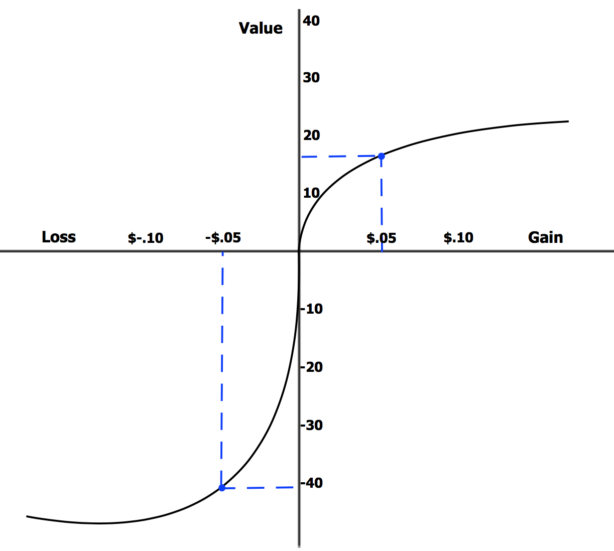
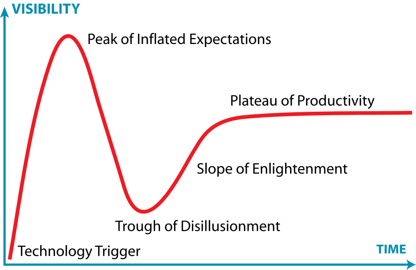
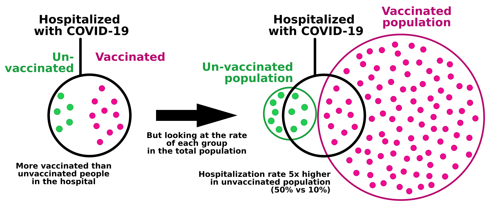

# Notes about Cognitive Biases

A summarization of the main cognitive biases, relating to financial trading, combined with my own understanding.

<!-- truncate -->

## Nonlinear perception

### Perception of gain and loss

**Diminishing marginal utility**: For example, one is hungry and then eats 3 pieces of bread, the first piece eaten while hungry is has more utility than the second piece eaten after the first, and so on. The more of something you have, the less utility another such thing has.

Corresponding to diminishing marginal utility, the happiness of gaining \$200 is less than two times of happiness of gaining \$100. The perception of gain is convex.

[Reference](https://en.wikipedia.org/wiki/Prospect_theory)

The same applies to pain. The pain of losing \$100 two times is higher than losing \$200 in one time.

Weber-Fechner law: Human's sensor perception is roughly logarithmic to the actual value.

### Expectation and framing

The "gain/loss" is **relative to the expectation** (frame of reference). Different people have different expectations in different scenarios.

Expectation management is important. If the outcome is good but doesn't meet the high expectation, it still causes disappointment. Vice versa.

**The expectation can gradually change.** People gradually get used to the new norm. This make people be able to endure bad environments, and not get satisfied after achievement.

**Shifting baseline syndrome (boiling frog syndrome)**: If the reality keeps changing slowly, the expectation also tend to keep nudging, eventually move a lot without being noticed. This is also common in long-term psychological manipulation.

**Relative deprivation**: When people expect to have something that they don't have, they think they lose that thing, although they don't actually losing it.

**Door-in-the-face effect**: Firstly make a large request that will likely be rejected, then make a modest request. The firstly made large request changes expectation to make the subsequent modest request easier to accept.

>  ... 譬如你说，这屋子太暗，须在这里开一个窗，大家一定不允许的。但如果你主张拆掉屋顶他们就来调和，愿意开窗了。
>  
>  ... If you say, "This room is too dark; we need to open a window here," everyone would definitely refuse. However, if you propose removing the roof, they would come to a compromise and agree to open a window.
>
> \- 鲁迅 LuXun

**Protective pessimism**: Being pessimistic can reduce risk of disappointment.

|                | Be optimistic             | Be pessimistic                        |
| -------------- | ------------------------- | ------------------------------------- |
| Result is good | Expected. Mild happiness. | Exceeds expectation. Large happiness. |
| Result is bad  | Large disappointment.     | Expected. Mild disappointment.        |

Procrastination is also related to protective pessimism. If you believe that the outcome will be bad, then reducing cost (time and efforts put into it) is "beneficial".

### Loss aversion and risk aversion

In real life, some risks are hard to reverse or are irreversible, so avoiding risk is more important than gaining. In investment, losing 10% requires gaining 11.1% to recover, and losing 50% requires gaining 100% to recover. Keep staying in the game is important as it makes one exposed to future opportunities.

So, losses have a larger mental impact than gains of the same size. The pain of losing \$100 is bigger than the happiness of gaining \$100.

Unfortunately, loss aversion make being unhappy easier and make being happy harder.

**Relative deprivation** is also a kind of loss that people tend to avoid. For example, when the people near one get rich by investing a bubble asset, one may also choose to invest the bubble asset to avoid the "relative loss" between one and others.

It's much easier to increase expectation than to reduce expectation. The knowledge of "better things exist" can be "info hazard", as it makes one harder to accept the things that one gets used to.

### Perception of risk

**We prefer deterministic gain instead of risky gain**. A bird in the hand is worth two in the bush. 

Given 100% chance to gain \$450 or 50% chance to gain \$1000, people tend to choose the former. 

The professions that face uncertain gain, like academic research, where it's common that researching a problem for years without getting any meaningful result, are not suitable for most people.

**We prefer having hope rather than accepting failure**.

Given 100% chance to lose \$500 or 50% chance to lose \$1100, most people will choose the latter. The second one has "hope" and the first one means accepting failure.

In this case, "no losing" is usually taken as expectation. What if the expectation is "already losing \$500"? Then the two choices become: 1. no change  2. 50% gain \$500 and 50% lose \$600. In this case, people tend to choose the first choice which has lower risk. The expectation point is very important.

### Time perception

Telescoping effect: 

- In perception, recent time is "stretched". Recent events are recalled to be eariler than the actual time of the event. (backward telescoping)
- In perception, distant past time is "compressed". The events in distant past are recalled as more recent than the actual time. (forward telescoping)

Vierordt's law: Shorter time intervals tend to be overestimated. Longer time intervals tend to be underestimated.

Oddball effect: The time that have novel and unexpected experience feels longer. 

It can be seen that **we feel time length via the amount of memory**. Novel and unexpected experiences correspond to more memory. Forgetting "compresses" time. When people become older, novel experiences become more rare, thus time feels faster.

**The memory of feeling risk has higher "weight" (risk aversion)**, so time feels slower when feeling risk. In contrast, happy time feels going faster.

Reference: [Time perception - Wikipedia](https://en.wikipedia.org/wiki/Time_perception)

## Hedonic treadmill

**Hedonic treadmill**: after some time of happiness, the expectation goes up and happiness reduces. The things that people gained will gradually be taken for granted, and they always pursue for more.

> Do not spoil what you have by desiring what you have not; remember that what you now have was once among the things you only hoped for.
> 
> ― Epicurus

If happiness can be predicted, some happiness moves earlier. For example, one is originally happy when eating delicious chocolate. Then one become happy just after buying chocolate before eating it, and the happiness of actually eating chocolate reduces. In future the happiness can move earlier into deciding to buy chocolate. This effect is also called **second-order conditioning**.

Material consumption can give short-term satisfaction, but cannot give long-term well-being (paradox of materialism). Long-term well being can better be achieved by sustainable consumption with temperance.

**Means-end inversion**: one originally want money (means) to improve life quality (end). However, the process of making money can sacrifice life quality. Examples: investing all money and leave little for consumption, or choosing a high-paying job with no work-life balance (golden handcuffs).

> We al­ready walked too far, down to we had for­got­ten why em­barked.

> A man on a thousand mile walk has to forget his goal and say to himself every morning, "Today I'm going to cover twenty-five miles and then rest up and sleep."
> 
> \- Leo Tolstoy, War and Peace

## Self-serving and self-justification

People tend to maintain their ego by **self-serving bias**:

### Overconfidence

People tend to be **overconfident** about themselves:

- People overestimate the correctness and rationality of their belief.
- **Dunning-Kruger effect**: overestimate capability when low in capability, and understimate when high in capability. (Low-capability ones tend to criticize other people's work even though they cannot do the work themselves.)
- **Restraint bias**: Overestimate the ability of controlling emotion, controlling impulse behaviors and resisting addiction.
- **False uniqueness**: We tend to think that we have special talents and special virtues.
- **Hindsight bias**: Overconfident in understanding history and the ability to predict.
- **Bias blind spot**: People are hard to recognize their own biases.
- An expert in one domain tend to think they are generally intelligent in all domains. (Some intellectual experts don't know they are susceptible to psychological manipulation.)

The overconfidence is sometimes useful:

- Being confident helps persuading others, increasing social impact.
- **Self-fulfilling prophecy**: sometimes having confidence make people perform better, make others collaborate more, and then get good result (Note that the power of mere confidence is limited by physical conditions).

### Hindsight bias

When looking at past, people find past events (including Black Swan events) reasonable and predictable, although they didn't predicted these events in prior.

In a complex world, **one event can have two contradicting interpretations**. For example:

- Federal reserve increases interst rate. 
  - Bearish: it tightens money supply.
  - Bullish: it's a sign of strong economy.
- A company reports great profit.
  - Bearish: that great profit was anticipted and priced in. The potential is being exhausted.
  - Bullish: that company is growing fast.
- A large company buys a startup at high price.
  - Bearish: the large company is trapped in bureaucracy. It cannot compete with the startup despite having more resources.
  - Bullish: the startup's business will synergize with the large company's. It's a strategic move.

People make execuses about their prediction failure, such as:

- See their prediction as "almost" correct. Distort the memory and change the past prediction.
- Blame prediction failure to outside factors, e.g. the statistical data is being manipulated, conspiracy theories.
- Blame that they are just unlucky as the Black Swan event is low-probability. (Black Swan events are rare, but you are still likely to encounter multiple Black Swan events in life.)

### Fundamental attribution error

- Attribute self success by own characteristics (capability, virtue, etc.).
- Attribute self failure by external factors (luck, situation, etc.).
- Attribute other people's success by external factors.
- Attribute other people's failure by their characteristics.

### Self justification

People tend to **justify previous behavior**, even if these behaviors was made randomly, or made under external factors that does not exist now.

Self justitication shows self-control and consistency, facilitating social collaboration.

This is related to Stockholm Syndrome. After experiencing pain in the past, people tend to justify their previous pain.

**Ben Franklin effect**: People like someone more after doing a favor for them.

**Endowment effect**: We value more on the things that we own (including ideas). Investors tend to be biased to positive information of the stock they own. Disaggreing an idea tend to be treated as insult.

**Foot-in-the-door effect**: One agreed on a small request tend to subsequently agree on a larger request.

Saying becomes believing.

### Self-handicapping

People want to show an image of high capability (to both others and self). But a failure can debunk the high-capability-image. Self-handicapping is one way of protecting the image. It's an extension of **protective pessimism**.

|                 | Try hard                           | Self-handicap                           |
| --------------- | ---------------------------------- | --------------------------------------- |
| Get good result | Shows a sign of common capability. | Shows a sign of great capability.       |
| Get bad result  | Shows a sign of low capability.    | Can blame failure to self-handicapping. |

Examples of self-handicapping:

- Playing videogames instead of learning before exam.
- Procrastination. Reduce the time finishing the task.
- Refusing help. Refusing medical treatment.
- Drinking alcohol and using drugs.
- Choosing difficult conditions and methods.

When one succeedes despite self-handicapping, it shows great capability. But if one fails, self-handicapping can only protect image to self, not from others. People usually just judge from result and see failed self-handicapping as low capability.

Setting unrealistic high goals is sometimes a form of self-handicapping. But not always.

Self-handicapping is also a way of **reducing responsibility**. This is common in large corporations and governments: intentionally create reasons of failure to reduce responsibility.

### Reverse psychology

People tend to fight the things that oppose their desire. Examples:

- Being disallowed to play videogames makes videogames more fun to play with.
- Being forced to learn makes one dislike learning.
- People tend to gain more interest in the information being banned by government.
- When the love is objected by parents, the love strengthens.
- Restricting buying something make people buy it more eagerly. Same for restricting selling.

Providing external reward may reduce internal motivation (overjustification effect).

Being helped doesn't always elicit gratitude. The one being helped may feel being inferior in social status, thus helping may cause hatred, especially when reciprocal helping cannot be done.

### Avoid thinking about death

People tend to avoid thinking about inevitable death because it's unpleasant. People may subcounciously feel like they live forever, then:

- People feel like having plenty time to procrastinate
- People tend to not value the present because "life is permanent"
- People focus too much on small problems

Stoicism proposes thinking about death all the time (_memento mori_). Thinking about death can make one not procrastinate important things, make one value the present and reduce worrying about small problems. But Stocism does NOT propose indulgence and overdrafting the future.

## Belief stability

- People tend to **keep their belief stable** (being stubborn).
- People tend to **avoid conflicting beliefs (cognitive dissonance)**.
- People tend to justify their previous behavior. Behavior can shape attitudes.
- People have a tendency to pursuade others by their belief (meme spread).

**Confirmation bias**: People tend to seek and accept the evidences that confirm their beliefs, and reluctant to accept contradictory evidences. Confirmation bias can even make one subcounciously ignore some information.

**Motivated reasoning**: when they does not want to accept contradictory evidences, they may make up and believe in **non-falsifiable explanations** to explain the evidence in a way that follows the original belief.

Examples of non-falsifiable explanations:

- "There is \[a secret evil group\] that controls everything. You don't see evidence of its existence because it's so powerful that it hides all evidences."
- "The AI doesn't work on your task just because you prompted it wrongly." (without telling how to "prompt correctly".)
- "You propose \[an idea\] because you get a sense of moral superiority from that."
- "Absolute free-market capitalism is the only correct path. All problems of market is caused by the market being not free enough." (without telling how free is "free enough")

**With confirimation bias, more information increases confidence, but doesn't lead to better understanding**.

> If you don't have an opinion, resist the pressure to have one. 
>
> \- N. N. Taleb, [Link](https://x.com/nntaleb/status/1789709702097481773)

**Information cocoon (echo chamber)**: People tend to actively choose to digest the information source that they like, and make friends with the one having similar beliefs.

> Another thing I think should be avoided is extremely intense ideology, because it cabbages up one’s mind. ...
>
> I have what I call an iron prescription that helps me keep sane when I naturally drift toward preferring one ideology over another. And that is I say “**I’m not entitled to have an opinion on this subject unless I can state the arguments against my position better than the people do who are supporting it**. I think that only when I reach that stage am I qualified to speak.” 
>
> \- Charlie Munger

**Belief bias**: if the conclusion confirms people's existing belief, then people tend to believe it, regardless of the reasoning correctness, vice versa.

**Bullshit asymmetry principle**: Refuting misinformation is much harder than producing misinformation. To produce a misinformation and make it spread, you just need to make it follow people's existing beliefs. But to refute a misinformation, you need to find sound evidences. This is also **reversal of the burden of proof**.

The good side of stubborness is to maintain diversity of ideas in a society, helping innovation and overcoming of unknown risks.

### Group justification and system justification

People tend to justify the groups they belong (group justification), and justify the society that they are in (system justification).

Examples:

- An environmental activist may justify other environmental activists' illegal behaviors, because they are deemed in the same group.
- A middle-class tend to believe "the poor are lazy" and "the wealthy work harder".

### Urge to persuade others

People love to correct others and persuade others. Some ideas are **memes** that drive people to spread the idea. Correcting others also provide superiority satisfaction. 

However, due to belief stability, it's hard to persuade/teach others. People dislike being persuaded/teached. This effect is common on internet social media.

> The trouble with having an open mind, of course, is that people will insist on coming along and trying to put things in it.
>
> \- Terry Pratchett

Cunningham's Law: The best way to get the right answer on the internet is not to ask a question; it's to post the wrong answer.

### Sunk cost fallacy

Commitment can be a good thing. A lot of goals require continual time, efforts and resources to achieve.

However, there are investments that turn out to be bad and should be given up to avoid futher loss. All the previous investments become sunk cost. People are reluctant to give up because they have already invested a lot in them. Doing stop-loss signals failure. **We want to have hope rather than accepting failure.**

Examples:

- Keep watching a bad movie because you paid it and already spent time watching it.
- Keeping an unfulfilling relationship because of the past commitments.

**Opportunity cost**: if you allocate resource (time, money) to one thing, that resource cannot be used in other things that may be better. Opportunity cost is not obvious.

The difference between "good persistence" and "bad obstinacy":

- Persistent people keep their original root goal. They are happy to make corrections on exact methods for achieving the root goal. They can accept failure of sub-goals.
- Obstinate people keep both the root goal and the exact method to achieve the goal. Suggesting them to change the exact method is seen as offending their self-esteem.

> The persistent are like boats whose engines can't be throttled back. The obstinate are like boats whose rudders can't be turned. ...
>
> The persistent are much more attached to points high in the decision tree than to minor ones lower down, while the obstinate spray "don't give up" indiscriminately over the whole tree.
>
> \- Paul Graham, [The Right Kind of Stubborn](https://paulgraham.com/persistence.html)

An environment that doesn't tolerant failure makes people not correct mistakes and be obstinate on the wrong path (especially in authoritarian environments, where loyalty and execution attitude override honesty).

> When you’re in the midst of building a product, you will often randomly stumble across an insight that completely invalidates your original thesis. In many cases, there will be no solution. And now you’re forced to pivot or start over completely.
>
> If you’ve only worked at a big company, you will be instinctually compelled to keep going because of how pivoting would reflect on stakeholders. This behavior is essentially ingrained in your subconscious \- from years of constantly worrying about how things could jeopardize your performance review, and effectively your compensation.
>
> This is why so many dud products at BigCos will survive with anemic adoption.
>
> Instead, it’s important to build an almost academic culture of intellectual honesty \- so that being wrong is met with a quick (and stoic) acceptance by everyone.
>
> There is nothing worse than a team that continues to chase a mirage.
>
> \- Nikita Bier, [Link](https://x.com/nikitabier/status/1753915234794774978)

Drip pricing: Only show extra price (e.g. service fee) when the customer has already decided to buy. The customer that already spent efforts in deciding tend to keep the decision.

### Ostrich effect

Ignoring negative information or warning signs to avoid psychological discomfort.

Examples:

- Not wanting to diagnose health problem.
- Reluctant to check the account after an investment failed.

### Self-deception

Robert Trivers proposes that we deceive ourselves to better deceive others:

- If one tries to deceive others without internally believing in the lie, the brain need to process two pieces of conflicting information, which takes more efforts and is slower.
- When one knows one is telling lie, one may unable to control the nervousness, which can show in ways like heart beat rate, face blush, body movement, etc. Deceiving self before deceiving others can avoid these nervousness signals.

Saying becomes believing. Telling a lie too many times may make one truly believe in it.

## Quick simplified understanding

We can learn from the world in an **information-efficient** way: learning from very few information quickly. [^deep_learning_data_efficiency]

[^deep_learning_data_efficiency]: On the contrary, current deep learning technology is information-inefficient, as it requires tons of training data to get good results. Current (2025 Oct) LLMs have limited in-context learning ability, but still suffer from context rot and cannot do continuous learning.

The flip side of information-efficient learning is **hasty generalization**. We tend to generalize from very few examples quickly, rather than using logical reasoning and statistical evidence, thus easily get fooled by randomness.

The reality is complex, so **we need to simplify things to make them easier to understand and easier to remember. However, the simplification can get wrong.** There are too many informations in the world. We have some heuristics for filtering information.

To simplify, we tend to **make up reasons of why things happen**. A reasonable thing is simpler and easier to memorize than raw complex facts. This process is also compression. [^lossy_compression_ai]

[^lossy_compression_ai]: It has implications in AI: Attempting (lossy) compression will naturally lead to learning, which is the core mehanism of why unsupervised learning works. [See also](https://www.youtube.com/live/AKMuA_TVz3A?si=IswmwkZj8kBRx9Fv)

### Hasty generalization

Examples:

- See a few rude peoples in one city, then conclude that "people from that city are rude".
- People who only live in one country think that some societal issue is specific to the country that they are in. In fact, most societal issues apply to most countries.
- **Illusion of control**: A gambler may have the illusion that their behavior can control the random outcomes after seeing occasional coincidents.

People tend to see false pattern from random things. This effect is [apophenia](https://en.wikipedia.org/wiki/Apophenia).

Related: most people cannot actually behave randomly even if they try to be random. An example: [Aaronson Oracle](https://people.ischool.berkeley.edu/~nick/aaronson-oracle/).

#### Frequency matching

If there are two lights, the first flashes in 70% probability and the second flashes in 30% probability. When asked to predict which light flashes next, people tend to try to find patterns even if the light flash is purely random, having correct rate about 58%. 

People tend to do **frequency matching**, the predictions also contain 70% first light and 30% second light.

But in that lab experiment enviornment, the light flash is purely random and the probability stays the same, so the optimal strategy is to not try to predict and always choose the first which has larger probability, having correct rate 70%.

Reference: [The Left Hemisphere’s Role in Hypothesis Formation](https://www.jneurosci.org/content/jneuro/20/6/RC64.full.pdf)

Although the strategy of always choosing the highest-probability choice is optimal in that lab experiment environment, it's not a good strategy in the complex changing real world:

- Making different choices can increase exploration and help discovering new things. Only making one decision reduces exploration.
- In real world, the distribution may change and the highest-probability choice may change. Always choosing the same choice can be risky, especially when the opponent can learn your behavior.
- In real world, many things have patterns, so pattern-seeking may be useful.
- In real world, the "good" is often multi-dimensional. Overly optimizing for one aspect often hurt other aspects. Not choosing the seemingly optimal choice may have hidden benefits.

### Confusing correlation as causation

When statistical analysis shows that A correlates with B, the possible causes are:

- A caused B.
- B caused A.
- Another factor, C, caused A and B. (confounding variable)
- Self-reinforcement feedback loop. A reinforces B. B reinforces A. Initial random divergence gets amplified.
- A selection mechanism that favors the combination of A and B (survivorship bias).
- More complex interactions.
- The sampling or analyze is biased.

Examples of correlation of A and B are actually driven by another factor C:

- The children wearing larger shoe has better reading skills: both driven by age. Just wearing a large shoe won't make the kid smarter.
- Countries with more TVs had longer life expectancy: both driven by economy condition. Just buying a TV won't make you live longer.
- Ice cream sales increases at the same time drowning incidents increase: both driven by summer.

> Among my favorite examples of misunderstood fitness markers is a friend of a friend who had heard that grip strength was correlated with health. He bought one of this grip squeeze things, and went crazy with it, eventually developing tendonitis.
> 
> \- Paul Kedrosky, [Link](https://x.com/pkedrosky/status/1876018990663041285)

### Narrative fallacy

Narrative fallacy is introduced in _The Black Swan_:

> We like stories, we like to summarize, and we like to simplify, i.e., to reduce the dimension of matters. 
> 
> ...... 
> 
> The fallacy is associated with our vulnerability to overinterpretation and our predilection for compact stories over raw truths. It severely distorts our mental representation of the world; it is particularly acute when it comes to the rare events.
> 
> \- _The Black Swan_

Narrative fallacy includes:

- People tend to make the known facts reasonable, by finding reasons or making up reasons. This can be seen as an information compression mechanism (reasonable facts are easier to remember).
- People prefer simpler understanding of the world. This is also information compression. This includes **causal simplification**, **binary thinking**. 
- People tend to believe in concrete things and stories other than abstract statistics. This is related **anecdotal fallacy**.

### First impression effect (primacy effect)

People tend to judge things **by first impression**. This makes people generate belief by only one observation, which is information-efficient, but can also be biased.

### Nominal fallacy

Nominal fallacy: Understand one thing just by its names. Examples:

- Knowing that LLM has "temperature" so think LLM is heat-based algorithm.
- Knowing that LLM has "token" so think LLM is a Web3 crypto thing.
- "How can you be against Patriot Act/Safety Bill/Responsible Disclosure? Do you hate your country/want to kill people/be not responsible?" [Link](https://x.com/onehappyfellow/status/1952258485024084118)

### Outcome bias

People like to judge a decision by its immediate result. However, the real world is full of randomness. A good plan may yield bad result and a bad plan may yield good result. And the short-term result can differ to long-term result.

There is no perfect strategy that will guarantee success. Overemphasizing short-term outcomes leads to abandoning good strategies prematurely.

### Delayed feedback issue and learning

The quicker the feedback gives, the quicker people can learn (this also applies to reinforcement learning AI). But if the feedback delays 6 months, it's hard to learn from it, and people may do **wrong hasty generalization using random coincidents**, before the real feedback comes, thus get fooled by randomness.

When feedback comes early, its correlation with previous behavior is high, having high **signal-to-noise ratio**. If feedback comes late, many previous behaviors may correlate with it, so feedback has low signal-to-noise ratio.

Reducing cost by removing safety measures usually does not cause any visible accidents in the short run, but the benefit of reduced costs are immediately visible. When the accident actually happened because of the removed safety measures, it may be years later.

**People crave quick feedback**. Successful video games and gambling mechanisms utilize this by providing immediate responses to actions. 

What's more, for most people, **concrete visual and audio feedback is more appealing than abstract feedback** (feedback of working with words and math symbols).

The previously mentioned reverse psychology is also related to learning. Being forced to learn make one dislike learning it. Self-directed learning make one focus on what they are interested in, thus is more effective.

To summarize, most people naturally prefer the learning that:

- Has quick feedback.
- Has concrete visual and audio feedback, instead of abstract feedback.
- Is self-directed rather than forced.

It's also hard to learn if the effect of decision is applied to other people, especially for decision-makers:

> It is so easy to be wrong \- and to persist in being wrong \- when the costs of being wrong are paid by others.
> 
> \- Thomas Sowell

### Causal simplification

People tend to simplify causal relationship and ignore complex nuance. If X is a factor that causes Y, then people tend to treat X as the only reason that caused Y, over-simplifying causal relationship.

Usually, the superficial effect is seen as the reason, instead of the underlying root cause.

Examples of causal oversimplification:

- Oversimplification: "Poor people are poor because they are lazy."
  
  Other related factors: Education access, systemic discrimination, health disparities, job market conditions, the Matthew effect, etc.
- Oversimplification: "Immigrants are the cause of unemployment."
  
  Other related factors: Manufacturing relocation, automation technologies, economic cycles, skill mismatches, overall labor market conditions, etc.
- Oversimplification: "The Great Depression happened because of the stock market crash of 1929."
  
  Other related factors: Excessive financial risk-taking, lack of regulatory oversight, production overcapacity, wealth inequality, and international economic imbalances, etc.
- Oversimplification: "That company succeeded because of the CEO."
  
  Other related factors: Market conditions, employee contributions, incentive structures, company culture, government-business relationships, competitive landscape, and the cumulative impact of past leadership decisions, etc.

> For every complex problem there is an answer that is clear, simple, and wrong.
> 
> \- H. L. Mencken

People often dream of a "silver bullet" that simply magically works:

- People hope that a "secret advanced weapon" can reverse the systematic disadvantage in war. This almost never happens in real world. 
- Hoping that a secret recipe or a secret techonology alone can succeed.
  - Coca Cola succeedes not just by the "secret recipe". The brading, global production system and logistic network are also important.
  - Modern technologies are complex and have many dependencies. You cannot just simply copy "one key techonology" and get the same result. Even just imitating existing technology often requires a whole infrastructure, many talents and years of work. [^about_ai_race]

[^about_ai_race]: It's a common view that AI capability can improve exponetially. And when AI is smart enough to keep improving itself, its intelligence will skyrocket into superintelligence, far above human. But it's highly possible that future AI will still be bottlenecked by 1. energy production 2. compute power 3. getting verification from real world. These 3 factors limits how fast AI can take effect and self-improve. Especially the third limitation (Go game and Lean math proving can be verified purely in computer, but other kinds of science, like chemistry and biology, are too complex to be fully simulated in computer, thus getting verification from real world is a very important bottleneck. Also, some AI researchers say they are bottlecked by training speed rather than ideas. Deep learning has chaotic characteristics, so how fast AI experiments can be done is an important bottleneck in AI self-improve.). There will probably be no dramatic "suddenly winning AI race forever".

### Binary thinking (false dichotomy)

We tend to simplify things. One way of simplification is to ignore the grey-zone and complex nuance, reducing things into two simple extremes.

Examples of binary thinking:

- "That person is a good person." / "That person is a bad person."
- "You're either with us or against us.", "Anything less than absolute loyalty is absolute disloyalty."
- "Bitcoin is the future." / "Bitcoin is a scam".
- "This asset is completely safe." / "This bubble is going to collapse tomorrow."
- FOMO (fear of missing out) / risk averse.
- "No one understands it better than me." / "I don't understand even a tiny bit of it."
- "It's very easy to do" / "It's impossible."
- The idol maintains a perfect image. / Image collapse, true nature exposes.
- "We will win quickly." / "We will lose quickly."
- "I can do it perfectly." / "I cannot do it perfectly so I will fail."
- "\[X\] is the best thing and everyone should use it." / "\[X\] has this drawback so it's not only useless but also harmful."
- "Market is always fully effective." / "Market is never effective."
- Doesn't admit **tradeoffs** exist.

People's evaluations are anchored on the expectation, and **not meeting an expectation could make people's belief turn to another extreme**.

[Technology Hype Cycle](https://en.wikipedia.org/wiki/Gartner_hype_cycle):

Internet has indeed changed the world. But the dot com bubble burst. It's just that the power of Internet required time to unleash, and people placed too much expectation in it too early.

**Neglect of probability**: either neglect a risk entirely or overreact to the risk. 

**Strawman argument** is a technique in debating: refute a changed version of opponent's idea. It often utilizes binary thinking: **refute a more extreme version of opponent's idea**. Examples:

- A: "We should increase investment for renewable energy." B: "You want to ban oil, gas, and coal, removing millions of jobs and crash the economy?"
- A: "The history curriculum should include more perspectives to present a more objective and nuanced view of our nation." B: "So you want to rewrite history to make our children hate their own country?"
- A: "We should implement stricter gun control." B: "It's useless, because no matter how strict it is, criminals will always find a way to get guns illegally." (perfect solution fallacy)

### Halo effect and horn effect

**Halo effect**: Liking one aspect of a thing cause liking all aspects of that thing and its related things. (爱屋及乌) 

Examples:

- A person falling in love thinks the partner is flawless.
- Thinking that a beautiful/handsome person is more intelligent and kind.
- A person that likes one Apple product thinks that all designs of all Apple products are correct and superior.
- When one likes one opinion of a political candidate, one tend to ignore the candidate's shortcomings.

**Horn effect** is the inverse of halo effect: if people dislike one aspect of a thing, they tend to dislike all aspects of that thing and its related things. People tend to judge words by the political stance of the person who said it. 

**Disaggrement on ideas tend to become insults to people.**

Halo effect and horn effect are related to **binary thinking**.

### Need for closure

People prefer definite answer, over ambiguity or uncertainty (such as "I don't know", "it depends on exact case", "need more investigation"), even if the answer is inaccurate or made up.

This is related to **narrative fallacy**: people like to make up reasons explaining why things happen.

> One day in December 2003, when Saddam Hussein was captured, Bloomberg News flashed the following headine at 13:01: U.S. TREASUERIES RISE; HUSSEIN CAPTURE MAY NOT CURB TERROISM. ...... 
>
> As these U.S. Treasury bonds fell in price (they fluctuate all day long, so there was nothing special about that) ...... they issued the next bulletin: U.S. TREASURIES FALL; HUSSEIN CAPTURE BOOSTS ALLURE OF RISKY ASSETS.
>
> \- _The Black Swan_

People dislike uncertain future and keep predicting the future, while ignoring their terrible past prediction record (hindsight bias).

People like to wrongly apply a theory to real world, because applying the theory can give results. Example: assuming that an unknown distribution is gaussian even when it's not.

**Zeigarnik effect**: People focus on uncompleted things more than completed things. When some desire is not fulfilled (gambling not winning, PvP game not winning, browsing social media not seeing wanted content, etc.), the desire becomes more significant. This effect can cause one not wanting to sleep.

Need for closure is also related to **curiosity**.

### Idealization of the unfamiliar

People may idealize the things that they are not familiar with:

- People may idealize their partner, until living with the parter for some time.
- "The grass is greener on the other side" (**Greener grass syndrome**).
- Assuming that another career/lifestyle/country (that you are not familar with) is better than the current one.

People tend to idealize the distant past and forget the past misery. This helps people get out of trauma, and at the same time idealize the past things:

- After a long time since bearing a child, women tend to forget the pain of bearing a child and may want another child.
- After decades passed since the collapse of Soviet Union, some people remember more of the good aspects of the Soviet Union.

### Illusion of understanding

People may think that they deeply understand something, until writing it down. When writing it down, the "gaps" of the idea will be revealed.

Pure thinking is usually vague and incomplete, but people overestimate the rationality of their pure thinking.

> The reason I've spent so long establishing this rather obvious point \[that writing helps you refine your thinking\] is that it leads to another that many people will find shocking. If writing down your ideas always makes them more precise and more complete, then no one who hasn't written about a topic has fully formed ideas about it. And someone who never writes has no fully formed ideas about anything nontrivial.
>
> It feels to them as if they do, especially if they're not in the habit of critically examining their own thinking. Ideas can feel complete. It's only when you try to put them into words that you discover they're not. So if you never subject your ideas to that test, you'll not only never have fully formed ideas, but also never realize it.
>
> \- Paul Graham, [Link](https://www.paulgraham.com/words.html)

Even so, writing the idea down may be still not enough, because **natural language is vague**, and **vagueness can hide practical details**. The issues hidden by the vagueness in language will be revealed in real practice (e.g. turning software requirement into code).

Having ideas is easy and cheap. If you search the internet carefully you are likely to find ideas similar to yours. The important is to validate and execute the idea.

Analogies are useful for explaining things to others, but not good at accurately thinking. The analog is similar to the real thing but is different in nuanced ways.

### Predictive processing

According to [predictive processing theory](https://en.wikipedia.org/wiki/Predictive_coding), the brain predicts (hallucinates) the most parts of perception (what you see, hear, touch, etc.). The sensory signals just correct that prediction (hallucination).

[Body transfer illusion (fake hand experiment)](https://x.com/visualfeastwang/status/1788507432961839469)

Prior belief (confirmation bias) can often greatly affect perception. This not only affects recognition of objects, but also affects reading of text. **Under confirmation bias, when reading text, one may skip important words subcounciously**.

**Free energy principle**: The brain tries to minimize free energy.

Free energy = Surprise + Change of Belief

- Surprise is the difference between perception and prediction.
- Change of Belief is how much belief changes to improve prediction.

The ways of reducing free energy:

- Passive: Change the belief (understanding of the world).
- Active: Use action (change environment, move to another environment, etc.) to make the perception better match prediction. [^third_way_of_reducing_free_energy]

[^third_way_of_reducing_free_energy]: I think there is a third way of reducing free energy: hallucination. Confirmation bias can be seen as a mild version of hallucination. Hallucination make the brain "filter" some sensory signal and "fill the gap" with prediction.

### Survivorship bias

Survivorship bias means that only consider "survived", observed samples and does not consider "silent", "dead", unobserved samples, neglecting the selection mechanism of samples.

A popular image of survivorship bias:

The planes that get hit in critical places never come back, thus don't get included in the stat of bullet holes, forming the regions missing bullet hole in that image.

Other examples of survivorship bias:

- Most gamblers are initially lucky, because the unlucky ones tend to quit gambling early.
- Assume that many fund managers randomly pick stocks. After one year, some of the lucky ones have good performance, while others are overlooked. In the short term, you cannot know whether success come from just luck.
- "Taleb's rat health club": Feeding poison to rats increases average health, because the unhealthy ones are more likely to die from poison.
- Social media has more negative news than positive news. Bad news travels fast.
- The succeded research results are published and the failed attempts are hidden (P-hacking).
- Only special and interesting events appear on news. The more representative common but not newsworthy events are overlooked.

A more generalized version of survivor bias is **selection bias**: When the sampling is not uniform enough and contains selection mechanism (not necessary 100% accurate selection), there will be bias in the result.

The opinions on social media does not necessarily represent most peoples' view. There are several selection mechanisms in it: 1. not all people use the same social media platform 2. the people using social media may not post opinions 3. not all posted opinions will be seen by you due to algorithmic recommendation.

Some physicists propose **Anthropic Principle**: the physical laws allow life because the existence of life "selects" the physical law. The speciality of the physical laws come from survivorship bias.

What people don't do is as important as what people do.

### Availability bias

**Availability bias**: When thinking, the immediate examples that come into mind plays a big role.

Example: If you recently saw a car crash, you tend to think that traveling by car is riskier than traveling by plane. However, if you recently watched a movie about a plane crash, you might feel that planes are more dangerous.

> Nothing in life is as important as you think it is when you are thinking about it.
> 
> \- Daniel Kahnman

**Vividness bias**: People tend to believe more from vivid things and stories, over abstract statistical evidences. This is related to **anecdotal fallacy** and **narrative fallacy**.

> **The Italian Toddler**: In the late 1970s, a toddler fell into a well in Italy. The rescue team could not pull him out of the hole and the child stayed at the bottom of the well, helplessly crying. ...... the whole of Italy was concerned with his fate ...... The child's cries produced acute pains of guilt in the powerless rescuers and reporters. His pictures was prominently displayed on magazines and newspapers .....
> 
> Meanwhile, the civil war was raging in Lebanon ...... Five miles away, people were dying from the war, citizens where threatened with car bombs, but the fate of the Italian child ranked high among the interests of the population in the Christian quarter of Beirut.
> 
> \- _The Black Swan_

Enforcing safety measures is usually unappreciated. Because people only see the visible cost and friction caused by safety measures (concrete), and do not see the consequences of not applying safety measures in a parallel universe (abstract), until an incident really happens (concrete).

People are more likely to pay terrorism insurance than for plain insurance that covers terrorism and other things.

If people are given some choices, people tend to choose one of the provided choices and ignore the fact that other choices exist. This is also framing effect.

People tend to attribute one product to one public figure, or attribute a company to its CEO, because that's the name that they know, and because of causal simplification tendency.

People often think the quality of new movies/games/novels declines, worse than the ones produced in "golden age" before. However it's mainly due to people only remember good ones and neglect the bad ones filtered by time.

Interestingly, LLMs also seem to have availability bias: the information mentioned before in context can guide or mislead subsequent output. The knowledge that's "implicit" in LLM may be suppressed by context.

When reviewing a document, most reviews tend to nitpick on the most easy-to-understand places, like diagram, or summarization, while not reading subsequent text that explain the nuances.

When judging on other people's decisions, people often just see visible downsides and don't see it's a tradeoff that avoids larger downsides.

**Agenda-setting theory**: what media pay attention to can influence people's attention, then influence people's opinions.

**Saliency bias**: We pay attention to the salient things that grab attention. The things that we don't pay attention to are ignored. **Attention** is a core mechanism of how brain works [^about_attention].

[^about_attention]: Related: modern deep learning also relies on attention mechanism (transformer).

### Anecdotal fallacy

People tend to believe more from stories, anecdotes or individual examples, even if these examples are made up or are just statistical outlier. On the contrary, people are less likely to believe in abstract statistical evidences.

Examples: 

- "Someone smoked their entire life and lived until 97, so smoking is actually not that bad."
- "Someone never went to college and turned out to be successful, so college is a waste of time and money."
- "Someone made a fortune trading cryptocurrency, and so can I."
- "It was the coldest winter on record in my town this year. Global warming can't be real." [^weather]

[^weather]: The weather is a non-linear chaotic system. Global warming can indeed make some region's winter colder.

### Familiarity bias

People prefer familiar things. One reason is the availability bias. Another reason is that people self-justifys their previous attention and dedication. This is highly related to availability bias.

When making decisions, people tend to focus on what they already know, and ignore the aspects that they do not know or are not familiar with. We have already considered what we already know, so we should focus on what we don't know in decision making.

This is related to risk compensation: People tend to take more risk in familiar situations.

**Imprinting**: At young age, people are more likely to embrace new things. At older age, people are more likely to prefer familiar things and avoid taking risk in unfamiliar things. (Baby duck syndrome).

> 1. Anything that is in the world when you’re born is normal and ordinary and is just a natural part of the way the world works.
> 2. Anything that's invented between when you’re 15 and 35 is new and exciting and revolutionary and you can probably get a career in it.
> 3. Anything invented after you're 35 is against the natural order of things.
>
> \- Douglas Adams

#### About LLM

Most people tend to treat LLM chatbot as similar to human, because most familiar form of intelligence is human. 

However, LLM is different to human in many fundamental ways:

- Deep learning is very different to how human brain works.
- **Jagged intelligence**. [See also](https://x.com/karpathy/status/1816531576228053133)
  - LLM is good at many things that are hard for human. LLM's knowledge is larger than any individual human.
  - LLM is bad at many things that are easy for human.
- Most chatbots are trained to sycophants. Asking LLM a loaded question, LLM tend to follow the assumption in question to please the user. Directly asking a question tend to get different answer than asking a question under context (other chat history).
  - LLM sometimes "defend" the things they said in previous context, similar to belief stability of human. However, the "LLM's opinion" is highly dependent to context, not "intrinsic opinion".

One similarity: Both human and LLM can "hallucinate" in consistent way. When human forgets something, human tend to make up consistent information to fill the hole in memory. LLM's hallucinations are seemingly plausible (maximize likelihood), not just random.

### Frequency illusion

Noticing something more frequently after learning about it, leading to overestimating its prevalence or importance.

Sometimes, one talked about something then sees its ad in social media, thus suspecting that their phone and social media app is recording voice for ad recommendation. Of course that possibility exists, but perception of that possibility is exaggerated by frequency illusion.

### Representativeness bias

People tend to judge things by comparing it with examples (stereotypes) that come into mind, and tend to think that one sample is representative to the whole group.

Representative bias can sometimes be misleading:

> Say you had the choice between two surgeons of similar rank in the same department in some hospital. The first is highly refined in appearance; he wears silver-rimmed glasses, has a thin build, delicate hands, measured speech, and elegant gestures. ...
> 
> The second one looks like a butcher; he is overweight, with large hands, uncouth speech, and an unkempt appearance. His shirt is dangling from the back. ...
> 
> Now if I had to pick, I would overcome my sucker-proneness and take the butcher any minute. Even more: I would seek the butcher as a third option if my choice was between two doctors who looked like doctors. Why? Simply the one who doesn’t look the part, conditional on having made a (sort of) successful career in his profession, had to have much to overcome in terms of perception. And if we are lucky enough to have people who do not look the part, it is thanks to the presence of some skin in the game, the contact with reality that filters out incompetence, as reality is blind to looks.
> 
> \- _Skin in the game_

Note that the above quote should NOT be simplified to tell that "the unprofessional-looking ones are always better". It depends on exact case.

### Gambler's fallacy

When an event has occured frequently, people tend to believe that it will occur less frequently in the future. 

Examples:

- When tossing coin, if head appear frequently, people tend to think tail will appear frequently. (If the coin is fair and tosses are statistically independent, this is false. If the coin is biased, it's also false.)
- When a stock goes down for a long time, people tend to think it will be more likely to rise.

One related topic is the **law of large numbers**: if there are enough samples of a random event, the average of the results will converge. The law of large numbers focus on the total average, and does not consider exact order. 

The **law of large number works by diluting unevenness rather than correcting unevenness**. For example, a fair coin toss will converge to 1/2 heads and 1/2 tails. Even if the past events contain 90% heads and 10% tails, this does not mean that the future events will contain more tails to "correct" past unevenness. The large amount of future samples will dilute the finite amount of uneven past samples, eventually reaching to 50% heads. 

Actually, **gambler's fallacy can be correct in a system with negative feedback loop, where the short-term distribution changes by past samples**. These long-term feedback loops are common in nature, such as the predator-prey amount relation. It also appears in markets with cycles. (Note that in financial markets, some cycles are much longer than expected, forming trends.) In a PvP game with Elo-score-based matching mechanism, losing makes make you more likely to win in the short term.

One related concept is **regression to the mean**, meaning that, if one sample is significantly higher than average, the next sample is likely to be lower than the **last sample**, and vice versa. Example: if a student's score follows normal distribution with average 80, when that student gets 90 scores, they will likely to get a score worse than 90 in the next exam. 

The difference between gambler's fallacy and regression to the mean:
- Gambler's fallacy: if the past samples deviate to mean, assume the distribution of future samples change to "compensate" the deviations. This is wrong when the distribution doesn't change.
- Regression to the mean: if the last sample is far from the mean, the next sample will likely to be closer to the mean than the last sample. It compares the next sample with the last sample, not the future mean with the past mean.

**Regression fallacy**: after doing something and regression to the mean happens, people tend to think what they do caused the effect (hasty generalization). Example: the kid gets a bad score; parent criticizes; the kid then get a better score. It's seen that criticizing makes the score get better, although this is just regression to the mean that can happen naturally.

### Conjunction fallacy

People tend to think that more specific and reasonable cases are more likely than abstract and general cases.

Consider two scenarios:

- **A:** "The company will achieve higher-than-expected earnings next quarter."
- **B:** "The company will launch a successful new product, and will achieve higher-than-expected earnings next quarter."

Although B is more specific to A, thus have a lower probability than A, people tend to think B is more likely than A. B implies a causal relationship, thus look more reasonable.

People tend to think that a story with more details is more plausible, and treat probability as plausibility. A story with more details is not necessarily more plausible, as the details can be made up.

Making a story more reasonable allows better information compression, thus making it easier to remember and recall.

### Curse of knowledge

People often assume that others know what they know. So people often **omit important details** when explaining things, causing problems in communication and teaching.

When learning a new domain of knowledge, it's beneficial to ask "stupid questions". These "stupid questions" are actually fundamental questions, but seen as stupid by experts, who already forgot the thinking when not knowing the fundamentals, under curse of knowledge. One benefit of AI is that you can ask "stupid questions" without being humiliated (but be wary of hallucinations).

**Simplicity is often confused by familiarity**. If one is very familiar with a complex thing, they tend to think that thing is simple.

### Normalcy bias

Normalcy bias: Thinking that past trend will always continue. This is partially due to confirmation bias.

Although the market has trends, and a trend may be much longer than expected, no trend continues forever. Anything that is physically constrained cannot grow forever.

Most people are late-trend-following in investment: **not believing in a trend in the beginning, then firmly believing in the trend in its late stage**. This is dangerous, because the market has cycles, and some macro-scale cycles can span years or even decades. **The experiences gained in the surge part of the cycle are harmful in the decline part of the cycle and vice versa**.

### Recency bias

Overemphasizing recent events, while ignoring long-term trends.

People tend to

- **overestimate the short-term effect of a recent event**, and
- **underestimate the long-term effect of an old event**.

This is related to **Amara's law**: we tend to overestimate the effect of a technology in the short run and underestimate the effect in the long run.

This is also related to availability bias, where the just-seen events are more obvious and easier to recall than old events and non-obvious underlying trends.

**Normalcy bias means underreact** to new events, but **recency bias means overreact** to new events, which is the opposite of normalcy bias. These two are actually not conflicting. Which one takes effect initially is related to actual situation and existing beliefs (**confirmation bias**). When one person does not believe in a trend but the trend continued for a long time, **binary thinking** may make that person turn their belief 180 degrees and deeply believe in the trend.

Relation between recency effect and primacy effect (first impression effect):

- One firstly sees A, then after a long time, then sees B, recency effect tells that B has higher influence than A.
- One firstly sees A, then sees B, then after a long time, primarcy effect tells A has higher influence than B.

### Framing effect

People tend to make decisions based on how information is presented (framed) rather than objective facts.

There are many ways to frame one fact. For example, one from positive aspect, one from negative aspect:

- "90% of people survive this surgery" / "10% of people die from this surgery". 
- "This ground beef is 80% lean" / "This ground beef is 20% fat".
- "Save \$20 by buying now!" / "You'll lose the \$20 discount if you wait".
- "99.9% effective against germs" / "Fails to kill 0.1% of germs".

The content creator could emphasize one aspect and downplay another aspect, and use different wording or art style to convey different opinions. The people reading the information could be easily influenced by the framing subconsciously.

The name of a thing affects how people perceive it. Examples:

- "Collateral damage" / "Death"
- "Gun control" / "Gun safety"
- "Government subsidy" / "Using taxpayer money"
- "Risk measurement" / "Risk forecast"

A **loaded question** is a question that contains an assumption (framing). Following that assumption can lead to a biased answer. Example: "Do you support the attempt by the US to bring freedom and democracy to other places in the world?"

The current LLMs are mostly trained to satisfy the user. If you ask LLM a loaded question that has a bias, the LLM often follow your bias to please you.

**Asking the right question requires the right assumption.**

**Mehrabian's rule**: When communicating attitudes and feelings, the impact is 7% verbal (words), 38% vocal (tone of voice), 55% non-verbal (facial expressions, gestures, posture). Note that this doesn't apply to all kinds of communications.

Just looking confident can often make other people believe. This even applies when the talker is AI:

> A friend sent me MRI brain scan results and I put it through Claude. No other AI would provide a diagnosis, Claude did. Claude found an aggressive tumour. The radiologist report came back clean. I annoyed the radiologists until they re-checked. They did so with 3 radiologists and their own AI. Came back clean, so looks like Claude was wrong. **But looks how convincing Claude sounds!** We're still early...
>
> \- [Link](https://x.com/misha_saul/status/1771019329737462232)

**Anchoring bias**: People's judgement may be influenced by reference "anchors", even if the reference anchor is irrelevant to decision making. Anchoring is a kind of framing. A salesman may firstly show customers an expensive product, then show cheap products, making customers feel the product being cheaper, utilizing anchoring bias.

[The Anchoring Bias and its Effect on Judges](https://www.thelawproject.com.au/insights/anchoring-bias-in-the-courtroom).

**Decoy effect**: Adding a new worse option to make another option look relatively better.

**Lie by omission**: A person can tell a lot of truth while omitting the important facts, stressing unimportant facts (wrong framing), intentially causing misunderstanding, but at the same time be not lying in literal sense.

The price chart is often drawn by making lowest price at the bottom and highest price at the top. The offset and scale of the chart is also framing. If one stock already have fallen by 30%, the latest price is in the bottom of the chart, so the stock seems cheap when looking at the chart, but it may actually be not cheap at all, and vice versa.

**Reversal of burden of proof**: One common debating technique is to reverse the burden of proof to opponent: "My claim is true because you cannot prove it is false." "You are guilty because you cannot prove you are innocent."

PowerPoint (keynote, slide) medium is good for persuading, but bad for communicating information. PowerPoint medium encourages author to omit imformation instead of writing details. [Amazon bans PowerPoint for internal usage](https://www.inc.com/justin-bariso/amazon-jeff-bezos-powerpoint-meetings-how-to-think.html). See also: [Columbia Space Shuttle Disaster](https://nicholastoole.wordpress.ncsu.edu/disaster-archive-case-study/columbia-space-shuttle-disaster-and-powerpoint/), [Military spaghetti powerpoint](http://warincontext.org/2010/04/29/the-perils-of-powerpoint/).

#### Two talking styles

Two different talking styles: the charismatic leader one and the intellectual expert type:

| Charismatic leader talking style                                                                       | Intellectual expert talking style                                             |
| ------------------------------------------------------------------------------------------------------ | ----------------------------------------------------------------------------- |
| Confident and assertive. (doesn't fear of being wrong)                                                 | Conservative and rigorous. (fear of being wrong)                              |
| Persuades using narratives and emotions (more effective to most people)                                | Persuades using expert knowledge and evidence (less effective to most people) |
| Create hope and mission                                                                                | Warn about tradeoffs and possible risks                                       |
| Often take risk and bear responsibility. Often make decisions quickly using intuition and simple logic | Often conservative and hesitate in taking risk and bearing responsibility     |

Note that the above are two simplified stereotypes. The real cases may be different.

### Blame the superficial

"Shooting the messenger" means blaming the one who bring the bad news, even though the messenger has no responsibility of causing the bad news.

The same effect happens in other forms:

- Blaming the journalist exposing the bad things in society.
- Refuse medical treatment, because medical treatment reminds illness and show weakness.
- In corporation, the responsibility of solving a problem usually belongs to the one raising the problem, not the one creating the problem.

> Imagine someone who keeps adding sand to a sand pile without any visible consequence, until suddenly the entire pile crumbles. It would be foolish to blame the collapse on the last grain of sand rather than the structure of the pile, but that is what people do consistently, and that is the policy error. ...
> 
> As with a crumbling sand pile, it would be foolish to attribute the collapse of a fragile bridge to the last truck that crossed it, and even more foolish to try to predict in advance which truck might bring it down. ...
> 
> Obama’s mistake illustrates the illusion of local causal chains\-that is, confusing catalysts for causes and assuming that one can know which catalyst will produce which effect.
> 
> \-  The Black Swan of Cairo; How Suppressing Volatility Makes the World Less Predictable and More Dangerous

### Scarcity heuristic

People tend to value scarce things even they are not actually valuable and undervalue good things that are abundant. 

Examples:

- When an online learning material is always there, people have no pressure to learn and often just bookmark it.
- A thing that's sold in a time-limited or amount-limited way is deemed to be valuable.
- Restrict buying something make people buy it more eagerly even when they don't need that thing. Same as restricting some information may increase people's perceived value of that information.

People tend to value something only after losing it.

> Health is forgotten until it’s the only thing that matters.
> 
> \- Bryan Johnson, [Link](https://x.com/bryan_johnson/status/1972674688087445603)

### Simpson's paradox and base rate fallacy

The correlation of overall samples may be contradictory to the correlation inside each sub-groups. 

[Reference](https://en.wikipedia.org/wiki/Simpson%27s_paradox)

Examples:

- In the COVID-19 pandemic, a developed country have higher overall fatality rate than a developing country. But in each age group, the developed country's fatality rate is lower. The developed country has a larger portion of old population.
- After improving a product, the overall customer satisfaction score may decrease, because the product gets popular and attracted the customers that don't fit the product, even though the original customers' satisfaction score increases.
- You post on internet something that 90% people like and 1% people hate. The people liking the post usually don't direct-message you. But the people hating it often have strong motivation to direct-message you. So your direct message may contain more haters than likers, even though most people like your post.

**Base rate fallacy**: there are more vaccinated COVID-19 patients than un-vaccinated COVID-19 patients in hospital, but that doesn't mean vaccine is bad:

[Reference](https://en.wikipedia.org/wiki/Base_rate_fallacy)

In these cases, **confounding variable** correspond to which subgroup the sample is in. **Statified analysis** means analyzing separately in each subgroup, controlling the confounding variable.

### False consensus (echo chamber, information cocoon)

When one person is in a small group with similar opinions, they tend to think that the general population have the similar opinions. When they encounter a person that disagrees with them, they tend to think the disagreer is minority or is defective in some way.

This effect is exacerbated by algorithmic recommendation of social medias.

We also tend to think other people are similar to us in some ways. We learn from very few examples, and that few examples include ourselves.

> We don't see things as they are. We see things as we are.

### Priming

We use relations to efficiently query information in memory. The brain is good at looking up relations, in an automatically, unintentionally and subconscious way.

Being exposed to information makes human recognize similar concepts quicker. Examples:

- Reminding "yellow" makes recognizing "banana" faster.
- Reminding "dog" makes recognizing "cat" faster.

Being exposed to information also changes behavior and attitudes. Examples:

- Being more likely interpret things as danger signals after watching a horror movie.
- Red in food packaging increases people's intention to buy it.
- Being familiar with a brand after exposed to its ads, even after trying to ignore ads.
- Sleeper effect: After exposed to persuation, people that don't initially agree may gradually agree after time passes.

> The main moral of priming research is that our thoughts and our behavior are influenced, much more than we know or want, by the environment of the moment.
> 
> \- _Think, fast and slow_

Note that the famous "age priming" effect (walk more slowly after reminding aging concepts) failed to be replicated.

The placebo effect is also possibly related with priming.

**Spontaneous trait transfer**: listeners tend to associate what the talker say to the talker, even when talker is talking about another person:

- If you praise another person, the listeners tend to subcounciously think that you are also good.
- If you say something bad about another person, the listeners tend to subcounciously think you are also bad.

Flattering subcounciously increase favorability, even when knowing it's flattering (this even applies to sycophant AI). Saying harsh criticism subcounciously reduce favorability, even when knowing the criticism is beneficial. Placebo still works even when knowing it's placebo.

## Efficient decision making

When making decisions, human tend to **follow intuitions, which is quick and energy-efficient**, but also less accurate.

- Often quickly making decision before having complete information is better than waiting for complete investigation.
- Sometime multiple decisions both can fulfill the goal. The important is to quickly do action, rather than which decision is optimal.

_Thinking, Fast and Slow_ proposes that human mind has two systems: 

- **System 1** thinks by intuition and heuristics, which is fast and efficient, but inaccurate and biased.
- **System 2** thinks by rational logical reasoning, which is slower and requires more efforts, but is more accurate.

Most thinking mainly uses System 1 while being unnoticed.

### Emotion overrides rationality

With intense emotion, the rationality (System 2) is being overridden, making one more likely to make mistakes.

Some examples:

- When being criticized, the more eager you are trying to prove you correct, the more mistake you may make.
- The trader experiencing loss tend to do more irrational trading and lose more money.

**Being calm can "increase intelligence".**

When one is in intense emotion, logical argument often has little effect in persuading, and emotional connection is often more effective.

### Default effect

People tend to choose the default and easiest choice. Partially due to laziness, partially due to fear of unknown risk.

In software product design, the default options in software plays a big role in how user will use and feel about the software. Increasing the cost of some behavior greatly reduces the people doing that behavior:

- If a software functionality require manually enabling it, much fewer users will know and use that functionality.
- Just 1 second longer page load time may reduce user conversion by 30%. [Source](https://www.cloudflare.com/learning/performance/more/website-performance-conversion-rates/)
- Each setup procedure will frustrate a portion of users, making them give up installing the software. [Why I’m Done Making Desktop Applications](https://www.kalzumeus.com/2009/09/05/desktop-aps-versus-web-apps/). A good product requires minimal configuration to start working.

[Ask for no, don’t ask for yes](https://www.mooreds.com/wordpress/archives/3518).

**Status quo bias**: tend to maintain status quo. This is related to risk aversion, as change may cause risk.

A related concept is **omission bias**: People treats the harm of doing something (commision) higher than the harm of not doing anything (omission). Doing things actively bears more responsibility. In the trolley problem, not doing anything reduces perceived responsibility.

If there is an option to postpone some work, the work may eventually never be done.

### Action bias

Action bias: In the places where doing action is normal, people prefer to do something instead of doing nothing, even when doing action has no effect or negative effects.

When being judged by other people, people tend to do action to show their value, productivity and impression of control:

- A personal doctor may do useless medications to show they are working. (_Antifragile_ argues that useless medications are potentially harmful. It's naïve interventionism.)
- A politician tend to do political action to show that they are working on an affair. These policies usually superficially helps the problem but doesn't address the root cause, and may exacerbate the problem. One example is to subsidize house buyers, which makes housing price higher, instead of building more houses.
- Financial analysts tend to give a definitive result when knowing there isn't enough sound evidence.

For high-liquidity assets (e.g. stocks), people tend to do impulsive trading when market exhibit volatility. But for low-liquidity harder-to-trade assets (e.g. real estate) people tend to hold when the market exhibit volatility.

Action bias does not contradict with default effect. When one is asked to work and show value, doing action is the default behavior, and not doing action is more risky, as people tend to question the one that does not look like working.

> It's not the things you buy and sell that make you money; it's the things you hold.
> 
> \- Howard Marks

Also, when under pressure, people tend do make actions in hurry before thinking, which increase the chance of making mistakes.

### Prioritizing the easy and superficial

**Law of least effort**: people tend to choose the easiest way to do things, choosing path of least resistance. [^principle_of_least_action]

[^principle_of_least_action]: Related: In physics, there is principle of least action, but the "action" here means a physical quantity, not the common meaning of "action".

Some seemingly easy solutions do not address the root cause, having negligible effect or negative effect in the long run. Applying the easy solution gives the fake impression that the problem is being addressed, achieving mental comfort.

Examples:

- Focusing on buying exercise equipments instead of exercising. Paying to gym without going to gym.
- Buying supplements instead of adopting healthier lifestyle.
- Focusing on buying courses, books, study equipments instead of actually studying. Keep bookmarking online learning materials instead of reading them.
- Musicians focusing on buying instruments (gear acquisition syndrome).
- When writing, focusing on the formatting instead of the content.
- A manager pushing employees to seemingly work hard instead of improving efficiency.
- A parent train child by punishing hard, instead of using scientific training methods.
- Bikeshedding effect: during meetings, people spend most time talking about trivial matters.
- Staying in comfort zone. Only learn/practice the familiar things and avoid touching unfamiliar things. Avoiding the unpleasant information when learning.
- Only care about the visible numbers (KPI, OKR), and ignore the important things behind the numbers, like perverse incentives caused by the KPI, statistical bias, and the validity of interpretations from the numbers.
- Streetlight effect: Only search in the places that's easy to search, not the places that the target is in.
- Hiding the signal of error instead of diagnosing and solving the error.

This is related to **means-end inversion**. To achieve the root goal (end) we work on a sub-goal (means) that helps root goal. But focusing on an easy but unimportant sub-goal may hurt the root goal, by taking resources from hard but important sub-goals.

A similar phenomenon occurs commonly in medicine: treatments usually mainly suppress superficial symptoms (e.g. painkiller) instead of curing the root cause of illness. This is usually due many other factors.

Pepole tend to spend much time making decision on small things but spend very few time making decisions on big things (e.g. buy house with mortgage, big investment):

- As the big decision is important, people tend to be nervous when thinking about it.
- Thinking about big decisions is tiresome, as the future is uncertain, and there are many factors to analyze.
- So people tend to procrastinate to avoid the unpleasant feeling of thinking about big decisions, or simply follow others (herd metality).
- The small decisions (e.g. choosing item in shop, choosing restaurant) require less mental efforts and cause less nervous feeling. Thinking on these decisions can give feeling of control. These decisions usually have quick feedback (human crave quick feedback).

### Path dependence

Path dependence means sticking to what worked in the past and avoid changing, even when the paradigm has shifted and the past successful decisions are no longer appropriate.

> I think people's thinking process is too bound by convention or analogy to prior experiences. It's rare that people try to think of something on a first principles basis. 
> 
> They'll say, "We'll do that because it's always been done that way." Or they'll not do it because "Well, nobody's ever done that, so it must not be good." 
> 
> But that's just a ridiculous way to think. 
> 
> You have to build up the reasoning from the ground up \- "From the first principles" is the phrase that's used in physics. You look at the fundamentals and construct your reasoning from that, and then you see if you have a conclusion that works or doesn't work, and it may or may not be different from what people have done in the past.
> 
> \- Elon Musk

**Law of the instrument**: "If the only tool you have is a hammer, it is tempting to treat everything as if it were a nail."

### Herd mentality

One easy way to make decisions is to simply follow the people around us. This is beneficial in ancient world: for example, if a tiger comes and some people start fleeing, following them is better than spending time recognizing the tiger.

**Social proof heuristic**: Assuming that surrounding people know the situation better, so following them is correct.

Following the crowd is also a great way of **reducing responsibility**: when everyone is guilty, the law cannot punish everyone. The one that acts independently bears more responsibility (omission bias). People often fear of acting independently.

> Worldly wisdom teaches that it is better for reputation to fail conventionally than to succeed unconventionally.
> 
> \- John Maynard Keynes

When many people follow each other, they will confirm each other, creating self-reinforcing feedback loop. This is also a reason of the momentum in markets. People tend to be overconfident when people around them are confident, and vice versa.

Two kinds of knowing:

- I know something. But I am not sure other people also know it. Other people may also be not sure I know it. There is no consensus even if everyone thinks the same. This is [**pluralistic ignorance**](https://en.wikipedia.org/wiki/Pluralistic_ignorance). It happens when there is something that prevents communicating information.
- I know something. I also know other people also know it. I also know other people know me know it. It's [**common knowledge**](https://en.wikipedia.org/wiki/Common_knowledge). This is the kind of knowledge that drives herd mentality.

In "The emperor's new cloth" story, "king is clothless" is originally not common knowledge, even though everyone knows. But once the child states the truth publicly, that knowlege becomes common knowledge.

The forming of new common knowledge is often self-reinforcing feedback loop. Once the momentum forms, it can unleash big power.

Price grow often depends on "delta" of believers, instead of the existing believers. 

[Veblen good](https://en.wikipedia.org/wiki/Veblen_good): higher price induce more demand, unlike normal commodity.

Measuring people's belief by observing the people around you is inaccurate, because the people near you don't necessarily represent all people (representative bias).

Herd mentality is in some sense a kind of trend following strategy. If the trend is some new good technology then following is good regardless of early or late. However, for speculative financial assets, the price grow depends on new people and money entering, so most people will start following too late and cannot profit from it.

One similar effect, **in-group bias**: Favoring investments or opinions from people within one's own group or those who share similar characteristics.

[Bystander effect](https://en.wikipedia.org/wiki/Bystander_effect): People are less likely to help a victim in the presence of other people.

### "Because" justification

In [an experiment](https://www.researchgate.net/publication/232505985_The_mindlessness_of_ostensibly_thoughtful_action_The_role_of_placebic_information_in_interpersonal_interaction), requesting jumping the queue of using a copy machine:

| Request                                                                   | Accept rate |
| ------------------------------------------------------------------------- | ----------- |
| "... May I use the Xerox machine?"                                        | 60%         |
| "... May I use the Xerox machine **because I have to make some copies**?" | 93%         |
| "... May I use the Xerox machine because I’m in a rush?"                  | 94%         |

Providing a non-reasonable reason "because I have to make some copies" also increases accept rate similar to a normal reason.

### Mental accounting

Mental accounting: Treating different parts of money differently, based on their source or intended use.

For example, one can separate the budgets for entertainment, housing and food. It's a simple huristic that can avoid excessive spending: if each part doesn't overspend, then they won't overspend overall.

Mental accounting is related to sunk cost and loss aversion. If one sub-account is low, people tend to be more saving in that sub-account, making **loss aversion** more significant, and the previous waste in that sub-account become **sunk cost**.

In investment, mental accounting can happen on different forms:

- Seperate by different time intervals. Setting profit target in each time interval (by month, season or year) can be detrimental in a market with momentum. If the profit in the time interval is meet, stop investing misses large profit from trend. If the profit in the time interval is not meet near the end, then the trader tend to be more nervous and more aggressive, which is dangerous.

  However, setting stop-loss in each time interval may be good. When the current trading strategy does not fit the market, temporarily stopping could get through the current part of cycle that temporarily doesn't suit the strategy. The stopping period also helps calm down and become rational.

- Separate by different specific assets (e.g. stocks). If the mental accounts are separated based on different stocks, after losing from one stock, one may insist to gain the loss back from the same stock, even if investing in other stocks is better overall.

- Separate by different categories of assets. People tend to prefer investing medium risk asset using all money over investing high-risk asset using partial money (barbell strategy), even when the total volatility and expected return are the same, because the invested money is in a different mental account than not-invested money, and risk aversion.

**Lipstick effect** is related to mental accounting. When the income declines, the mental account of luxury spending still exists, just shrunk, so cheaper lipsticks get more sales.

Mental accounting is one kind of **narrow framing bias**: 

### Narrow framing bias and zero-risk bias

Narrow framing bias: focusing too much on one aspect while neglecting other aspects.

Zero-risk bias: preferring to eliminate one type of risk entirely rather than reducing overall risk (usually at the expense of increasing exposure to other risks).

It's related to risk aversion and availability bias: risk aversion usually focuses the risk that comes to mind, and ignores other kinds of risks. It's also related to binary thinking: thinking that a risk is either completely eliminated or not being taken any action on. The rational decision is to do a tradeoff to reduce overall risk.

Examples:

- Choose to pay off a small debt completely, rather than paying off high-interest-rate debt first, as eliminating one debt feels more satisfying and reduces memory pressure.
- Enforcing extreme lockdown to eliminate the risk of a pandemic, causing more risk in other diseases (because hospitals are locked down) and more risk in basic living (food supply is constrainted due to extreme lockdown).
- Wanting to hedge inflation by heavily investing in risky assets, whose risk can be higher than inflation. In a liquidity crisis, cash is more valuable than assets.

It should NOT be simplified to "avoiding risk is bad". The point is to not do extreme tradeoffs to eliminte one kind of risk but increase exposure to other kinds of risks.

### Regret aversion

People tend to avoid regret. Regret aversion has two aspects:

- For future: people tend to avoid making decisions that may cause regret in the future. This is related to risk aversion: not making optimal decision is also a kind of risk.
- For past: people tend to avoid regretting their past actions, trying to prove the correctness of their past actions, thus fall into **sunk cost fallacy**.

The world is full of randomness. There is no decision that guarantees to be optimal. **We should accept that we cannot always make perfect decisions**. Validating the strategy in the long run is more important than result in of individual decisions.

We tend to regret doing something in short term, but regret not doing something in the long term. [Reference](https://www.anderson.ucla.edu/faculty/keith.chen/negot.%20papers/GilovichMedvec_Regret95.pdf).

> 'I have led a toothless life', he thought. 'A toothless life. I have never bitten into anything. I was waiting. I was reserving myself for later on \- and I have just noticed that my teeth have gone. ...'
> 
> \- Jean-Paul Sartre

> Some decisions are consequential and irreversible or nearly irreversible – one-way doors – and these decisions must be made methodically, carefully, slowly, with great deliberation and consultation. If you walk through and don’t like what you see on the other side, you can’t get back to where you were before. We can call these Type 1 decisions. 
> 
> But most decisions aren’t like that – they are changeable, reversible – they’re two-way doors. If you’ve made a suboptimal Type 2 decision, you don’t have to live with the consequences for that long. You can reopen the door and go back through. Type 2 decisions can and should be made quickly by high judgment individuals or small groups.
> 
> As organizations get larger, there seems to be a tendency to use the heavy-weight Type 1 decision-making process on most decisions, including many Type 2 decisions. The end result of this is slowness, unthoughtful risk aversion, failure to experiment sufficiently, and consequently diminished invention.
> 
> \- Jeff Bezos

**The more non-trivial things you do, the more mistakes you will make**. No one can make no mistakes when doing many non-trivial things. However, **company KPIs often has large weight on punishing mistakes** (loss aversion in KPI design). This cause veteran employees learn to do non-trivial things as few as possible and as conservative as possible. 

### Risk compensation

Having safety measures make people feel safer and take more risks.

For example, drivers may drive faster when safety belt is on, and cyclists may ride faster when wearing helmet.

People tend to be overconfident in familiar situations, but that's where accidents likely to occur:

> Most accidents (69%) occurred on slopes that were very familiar to the victims. Fewer accidents occurred on slopes that were somewhat familiar (13%) and unfamiliar (18%) to the victim.
>
> \- [Evidence of heuristic traps in recreational avalanche accidents](https://web.archive.org/web/20161207115118/https://avalanche-academy.com/uploads/resources/Traps%20Reprint.pdf)

### Stress and fight-or-flight

"Fight or flight" are the two options for dealing with physical threat (e.g. a tiger) in the ancient world.

But in the modern world, there are non-physical threats and modern risks (e.g. exam failure, losing job). These modern threats can be dealt with neither concrete fight or flight. So they may cause depression, anxiety and immobilization.

Related: **Cortisol** is a kind of hormone that's correlated with stress. Cortisol has many effects, like making you more vigilent and less relax. If the cortisol level keeps being high for long time, there will be health issues like weight gain, weakened immune system, sleep deprivation, digest issues, etc. 

From evolutionary perspective, cortisol makes one more likely to survive under physical threats (e.g. a tiger) at the expense of other aspects. These physical threats are usually quick and short (e.g. either die or flee from tiger). But the modern risks are usually long and chronic (e.g. worry about exam several months before exam, worry about job loss during economic recession every day), so that cortisol system is not adaptive.

## Willpower and mental energy

The rational activities (System 2 activities) require mental energy (willpower):

- Resisting impulse behavior consumes willpower (e.g. resist eating sweet food when on a diet).
- Paying attention and thinking hard problems consume willpower.
- For introverts, social interaction consumes willpower. But for extroverts, staying alone consumes willpower.

If there is no enough mental energy, one is less likely to resist impulse behaviors or think about hard problems, and possibly have difficulty in social interactions. [^long_term_planning_computation]

[^long_term_planning_computation]: Long-term planning require larger computation capacity. In reinforcement learning AI, if the model is small, it cannot learn to do long-term planning. Only when the model is big and has enough computation capacity, does it start to sacrifice short-term reward for larger long-term reward. So, in some sense, not being able to control oneself is related to "lacking compute resource". Note that self-control is also affected by many other factors.

These factors affect mental energy:

- Sleeping and mental resting can replenish mental energy.
- Body conditions (like blood sugar level [^blood_sugar_level]) affects mental energy.
- Exercising self-control can strengthen mental energy, similar to muscular strength.
- Lingering emotion (e.g. keep ruminating past mistakes) costs mental energy.

[^blood_sugar_level]: Related: Using GLP-1 may cause one harder to focus and pay attention due to reduced blood sugar level and other factors. However, GLP-1 can improve brain fog related to inflammation. The overall effect is complex and not yet well understood.

Mental resting is different to body resting. Intense thinking when lying on the bed even consumes mental energy. Mental resting involves focusing on simple things with low cognitive demand.

> Before you try to increase your willpower, try to decrease the friction in your environment.
> 
> \- James Clear, [Link](https://x.com/JamesClear/status/1883877771618738682)

## Memory distortion

In the process of self-justification, people's memory may be distorted. **Human memory is actually very unreliable**. People usually cannot notice that their memory has been distorted, and insist that their memory is correct.

People tend to **simplify their memory and fill the gaps using their own beliefs**. This is also an **information compression** process, at the same time producing wrong memory and biases. 

Memorizing is lossy compression. Recall is lossy decompression, where details can be made up in a congruent way. **Each recall can reshape the memory** according to the existing beliefs. (This is similar to quantum effects: if you observe something, you change it.) 

> I have a pet theory that when people introspect about themselves, their brain sometimes just scrambles to generate relevant content. So they feel like they're gaining insight into deeper parts of themselves when they're actually just inventing it on the fly.
> 
> \- Amanda Askell, [Link](https://x.com/AmandaAskell/status/1931786539002105905)

**Information is costly to store, and even more costly to index and query**. Sometimes forgetting is just not being able to query the specific memory that is stored in brain (and may be recalled if some cue were found that enables querying it). The "querying capacity" of brain is limited and can be occupied by distracting things. [^about_database]

[^about_database]: The similar principle also applies to computer databases. Just writing information into a log is easy and fast. But indexing the information to make them queryable is harder.

Taking notes is one way to mitigate the unreliable memory issue.

**Every time a messsage is relayed through a person, some of its information gets lost, and some noise gets added**. The person relaying the message will add their own understanding (which can be misleading), and omit the information that they think is not important (but can be actually important). This issue is very common in big corporation and governments. **Good communication requires reducing middlemen**. [^about_pdf]

[^about_pdf]: PDF is harder to edit than other document formats. This can be a good trait when you don't want information relayers to modify your document. (Note that it's not a perfect solution. Others can still ask AI to transcribe screenshots, take text snippets and form new documents. It only increases difficulty of modifying.)

People usually remember the "special" things well. This is an information compression mechanism that filters out the unimportant details.

**Peak-end rule**: People judge an experience largely based on how they felt at its peak (its most intense point) and at its end. The most efficient way to improve user experience is to improve the experience in the peak and in the end.

**Serial position effect**: people tend to recall the first and last items best, and the middle items worst. Interestingly, the same effect also applies to LLMs, called "lost in the middle".

**Cryptomnesia**: Treating other peoples' idea as own original idea, after forgetting the source of the idea.

**Sleeper effect**: After exposed to persuation, some people initially don't agree because of some reasons. But after time passes, people may forget the reasons why they initially disagree, and may gradually agree to it. Persuations that don't work immediately may still have long-term effects.

## Information addiction and curiosity

People seeks information that they are interested in. The seeking of interesting information drives **both curiosity and information addiction**.

> As with food, we spent most of our history deprived of information and craving it; now we have way too much of it to function and manage its entropy and toxicity. 
>
> \- N. N. Taleb, [Link](https://twitter.com/nntaleb/status/1705524053618905583)

> Most information in the world is junk.
> 
> The best way to think about it is it's like with food. There was a time, like centuries ago in many countries, where food was scarce, so people ate whatever they could get, especially if it was full of fat and sugar. And they thought that more food is always good. ...
> 
> Then we reach a time of abundance in food. We have all these industrialized processed food, which is artificially full of fat and sugar and salt and whatever. It was always been for us that more food is always good. No, definitely not all these junk food.
> 
> And the same thing has happend with information. Information was once scarce. So if you could get your hands on a book you would read it, because there was nothing else.
> 
> And now information is abundant. We are flooded with information, and much of it is junk information, which is artificially full of greed, anger and fear, because of this battle for attention.
> 
> It's not good for us. We basically need to go on an information diet. Again the first step is to realize that it's not the case that more information is always good for us. We need a limited amount. And we actually need more time to digest the information. And then we have to be of course also careful about the quality of what we take in, because of the abundance of junk information.
> 
> The basic misconception I think is this link between information and truth. The people think "ok if I get a lot of information, this is the raw material of truth, and more information will mean more knowledge". That's not the case. Even in nature more information is not about the truth.
> 
> The basic function of information in history, and also in biology, is to connect. Information is connection. And when you look at history you see that, very often, **the easiest way to connect the people is not with the truth. Because truth is a costly and rare kind of information. It's usually easier to connect people with fantasy, with fiction. Why? Because the truth tends to be not just costly, truth tends to be complicated, and it tends to be uncomfortable and sometimes painful.**
> 
> In politics, a politician who would tell people the whole truth about their nation is unlikely to win the elections. Every nation has these skeleton in the cupboard, all these dark sides and dark episodes that people don't want to be confronted with.
> 
> If you want to connect nations, religions, political parties, you often do it with fiction and fantasies.
> 
> \- Yuval Noah Harari, [Link](https://youtu.be/78YN1e8UXdM?si=u0Bo6I2oBleahXFl&t=1527)

Information bias: Seeking out more information even when more information is no longer useful. 

With confirmation bias, more information lead to higher confidence, but not better accuracy. This is contrary to statistics, where more samples lead to more accurate result (but still suffer from systematic sampling bias).

**Having no information is better than having wrong information**. Wrong information reinforced by confirmation bias can make you stuck in a wrong path.

**Popularity of false information increase the value of true information**. The "carrot problem": during WWII, the British claimed their pilots' night-vision success came from eating carrots, hiding their new radar technology. The best way of hiding something is to override it with another thing.

**Browsing social media makes people learn biased distribution of world**. Such as:

- **Overestimating the amount of perfect parters**, who are beautiful/handsome, have high income and does exaggeraged love.
- Believing in **false consensus**, the consensus that only exists on an internet community.
- Overestimating the proportion of bad news, as **bad news travels fast** in social media, thus facilitating cynicism.

> ... the primary function of conversation is not to communicate facts but to reinforce social ties.
> 
> \- Gurwinder, [Link](https://x.com/G_S_Bhogal/status/1898749727417512281)

The 80/20 rule also applies to social media: 80% of the voice come from 20% of users. The dominant narrative on internet may not represent most people's views.

What's more, social media may make people:

- Get used to interesting easy-to-digest information and become less tolerant to not-so-interesting hard-to-digest information.
- Get used to moving attention (distraction) and not get used to keeping attention. In social media, different posts are usually irrelevant and understanding them requires moving attention (forget previous context).
- Have less intention of trying things via real world practice. Watching videos about a new experience is much easier than experiencing in real life.

### Natural selection of memes

**Social medias are doing "natural selection" to memes**. The recommendation algorithm makes the posts that induce more interactions (likes and arguing) more popular. **It selects the memes that are good at letting human to spread them**.

What memes have higher ability to spread?

- Induce anger. (Seeing a post that you dislike that's popular on social media.)
- Induce superiority satisfaction.
- Express existing thoughts. Utilizes confirmation bias.
- Simple and easy-to-understand.
- Looks convincing and reasonable. Utilizes narrative fallacy.
- Exaggerated. Polarized. Utilizes binary thinking.
- Providing interesting new information. Utilizes information addiction.

In the ancient world, when there was no algorithmic recommendataion, there was still the "natural selection" of memes (stories, cultures) but slower.

Memes facilitate being spreaded. On the contrary, **antimemes** resist being spreaded. 

- Antimemes are usually long, complex and nuanced, reflecting real-world complexity, being hard-to-grasp.
- Antimemes usually don't spur much emotions.
- Antimemes are usually boring and "obvious" (hindsight bias).
- The information that conflicts with existing beliefs are also antimemes. (confirmation bias)

Antimemes are easier to be forgotten than other information. Some antimemes are worth reviewing periodically.

### Longing for attention

People wants attention from others. Some people try to gain attention by posting things on the internet.

> **Attention is a psychological commodity which people value inherently**.
>
> ......
>
> Producers who go viral produce 183% more posts per day for the subsequent month.
>
> \- [Paying attention](https://karthikecon.github.io/karthiksrinivasan.org/paying_attention.pdf) by Karthik Srinivasan

Having attention from others is indeed useful: it increases exposure to possible allies, mates and opportunities.

### Randomized reward

Giving randomized feedback (variable-ratio reinforcement) make people more addicted to the behavior. Random outcome is usually more exciting than known outcome.

Examples:

- Gambling
- PvP gaming (every round has randomly different opponents and outcome)
- Browsing social media (random posts)
- Gacha game (pulling is random)

This is related to information addiction. **Randomized things give more information than deterministic things.**

## Knowing the biases may be not enough

Unfortunately, just knowing the cognitive biases is not enough to avoid and overcome them. A lot of cognitive biases originate from the biological basis of human's cognitive function, which cannot change from just knowledge.

Reference: [G.I. Joe Phenomena: Understanding  the Limits of Metacognitive  Awareness on Debiasing](https://www.hbs.edu/ris/Publication%20Files/21-084_436ebba8-c832-4922-bb6e-49d000a77df3.pdf)

Note that the **cognitive biases are not necessarily negative things**. They are tradeoffs: sometimes worse, sometimes better.

## Two trading strategies

Consider two financial trading strategies:

- Strategy 1 has small gains frequently but has huge loss rarely (suffering from negative Black Swan events).
- Strategy 2 has small losses frequently but has rare huge gains (utilizing positive Black Swan events). 

In the long term, strategy 2 greatly outperforms strategy 1, but people prefer strategy 1, because of many reasons:

- The first strategy has better Sharpe ratio as long as the rare Black Swan don't come. The second strategy has lower Sharpe ratio because of the high volatility (although volatility has positive skewness).
- **Moral hazard**: in some places the money manager can take a share of profit but are only slighly punished when the huge asset loss happens (no skin in the game). This incentive structure allow them to use Strategy 1 while transferring tail risk to asset owner.
- The previously mentioned cognitive biases:
    - Convex perception. Frequent small gains feels better than a rare huge gain, and frequent small losses feels worse than a rare huge loss.
    - Loss aversion. The loss aversion focused more on recent visible loss rather than potential rare large loss.
    - Availability bias and outcome bias. The frequent small losses are more visible than rare potential big loss.
    - Delayed feedback issue. The rare loss in strategy 1 usually come late.
    - Oddball effect. The time experiencing loss feels longer.
    - ...

It's a common misconception that a you need a win rate more than 50% to be profitable. With a favorable risk-reward ratio, profit is possible despite a low win rate. Similarily, a 99% win rate doesn't necessarily imply profit in the long term. The skewness is important.

Disposition effect:

- Investors tend to sell the asset that increased in value (make uncertain profit certain).
- Investors tend to not sell the asset that dropped in value, hoping them to rebound (prefer having hope instead of making loss certain).
  What's more, increasing position can amortize the loss rate, which creates an illusion that loss reduces.

Disposition effect works well in oscillating markets. However, markets can also exhibit momentum, where disposition effect is detrimental.

## Related books

- _The Black Swan_
- _Social Psychology_ (by David G.Myers)
- _Thinking, fast and slow_
- _Elephant in the brain_

