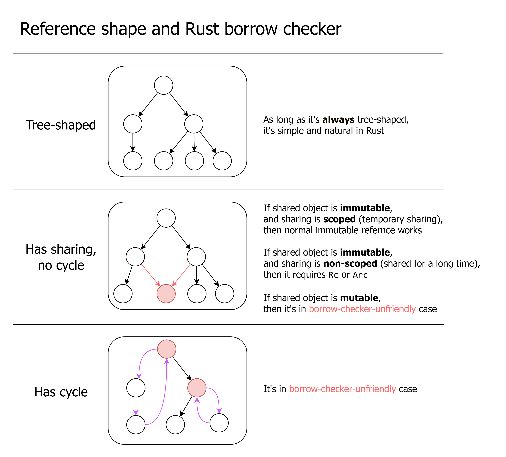

# How to Avoid Fighting Rust Borrow Checker

<!-- truncate -->

The 3 important facts in Rust:

- **Tree-shaped ownership**. In Rust's ownership system, one object can own many children or no chlld, but must be owned by **exactly one parent**. Ownership relations form a tree. [^about_sharing]
- **Mutable borrow exclusiveness**. If there exists one mutable borrow for an object, then no other borrow to that object can exist. Mutable borrow is exclusive.
- **Borrow is contagious**. If you borrow a child, you indirectly borrow the parent (and parent's parent, and so on). Mutably borrowing one wheel of a car makes you borrow the whole car, preventing another wheel from being borrowed. It can be avoided by **split borrow** which only works within one scope.

[^about_sharing]: The native Rust ownership relation form a tree. Reference counting (`Rc`, `Arc`) allows shared ownership.


## Considering reference shape

Firstly consider the reference [^about_reference] shape of your in-memory data.

[^about_reference]: Note that here "reference" here means reference in general OOP context (where there is no distinction between ownership and non-owning reference, think about reference in Java/C#/JS/Python). This is different to the Rust reference. I will use "borrow" for Rust reference in this article.



- If the reference is tree-shaped, then it's simple and natural in Rust. 
- If the reference shape has **sharing**, things become a little complicated.
    - Sharing means there are two or more references to the same object.
    - If shared object is immutable:
        - If the sharing is scoped (only temporarily shared), then you can use immutable borrow. You may need lifetime annotation.
        - If the sharing is not scoped (may share for a long time, not bounded within a scope), you need to use reference counting (`Rc` in singlethreaded case, `Arc` in possibly-multithreaded case)
    - If shared object is mutable, then it's in **borrow-check-unfriendly case**. Solutions elaborated below.
    - Contagious borrow can cause unwanted sharing (elaborated below).
- If the reference shape has **cycle**, then it's also in **borrow-check-unfriendly case**. Solutions elaborated below.

The most fighting with borrow checker happens in the **borrow-check-unfriendly cases**.

## Summarize solutions

The solutions in borrow-checker-unfriendly cases (will elaborate below):

- **Data-oriented design**. (less OOP)
  - Avoid unnecessary getter and setter.
  - **Use ID/handle to replace borrow**. Use arena to hold data.
  - No need to put one object's all data into one struct. Can seperate to different places.
- Do split borrow in outer scope, and pass related fields separately.
- **Defer mutation**. Turn mutation as commands and execute later.
- **Avoid in-place mutation**. Mutate-by-recreate. Use `Arc` to share immutable data. Use **persistent data structure**.
- For circular reference:
  - For graph data structure, use ID/handle and arena.
  - For callbacks, replace capturing with arguments, or use event handling to replace callback.
- Borrow as temporary as possible. For example, replace container for-loop `for x in &vec {}` with raw index loop.
- Refactor data structure to avoid contagious borrow.
- Reference counting and interior mutability. `Arc<QCell<T>>`, `Arc<RwLock<T>>`, etc. (only use when really necessary)
- `unsafe` and raw pointer (only use when really necessary) 

## Contagious borrow issue

Contagious borrow issue is a very common and important source of frustrations in Rust, especially for beginners.

The previously mentioned two important facts:

- **Mutable borrow exclusiveness**. If you mutably borrow one object, others cannot borrow it.
- **Borrow is contagious**. If you borrow a child, you indirectly borrow the parent (and parent's parent, and so on), which contagiously borrow other childs of the same parent. Mutably borrowing one wheel of a car makes you borrow the whole car, including all 4 wheels, then the wheel that you don't use cannot be borrowed. This don't happen under split borrow.

A simple example:

```rust
pub struct Parent {  
    total_score: u32,  
    children: Vec<Child>  
}
pub struct Child {  
    score: u32  
}

impl Parent {  
    fn get_children(&self) -> &Vec<Child> {  
        &self.children  
    }  
  
    fn add_score(&mut self, score: u32) {  
        self.total_score += score;  
    }  
}

fn main() {  
    let mut parent = Parent{total_score: 0, children: vec![Child{score: 2}]};  
  
    for child in parent.get_children() {  
        parent.add_score(child.score);  
    }
}
```

Compile error:

```
25 |     for child in parent.get_children() {
   |                  ---------------------
   |                  |
   |                  immutable borrow occurs here
   |                  immutable borrow later used here
26 |         parent.add_score(child.score);
   |         ^^^^^^^^^^^^^^^^^^^^^^^^^^^^^ mutable borrow occurs here
```

(That simplified example is just for illustrating contagious borrow issue. The **`total_score` is analogous to a complex state that exists in real applications**. Same for subsequent examples. Just summing integers can be done by `.sum()` or local variable. Simple integer mutable state can be workarounded using `Cell`.)

That code is totally memory-safe: the `.add_score()` only touch the `total_score` field, and `.get_children()` only touch the `children` field. They work on separate data, but borrow checker thinks they overlap, because of **contagious borrow**:

- In `fn get_children(&self) -> &Vec<Child> { &self.children }`, although the method body just borrows `children` field, the return value **indirectly borrows the whole `self`**, not just one field.
- In `fn add_score(&mut self, score: u32) { self.total_score += score; }`, the function body only mutably borrowed `total_score` field, but the **argument `&mut self` borrows the whole `Parent`**, not just one field.
- Inside the loop, one immutable borrow to the whole `Parent` and one mutable borrow to the whole `Parent` overlaps in lifetime.

You just want to borrow one field, but forced to borrow the whole object.

What if I just inline `get_children` and `add_score`? Then it compiles fine:

```rust
pub struct Parent {  
    total_score: u32,  
    children: Vec<Child>  
}
pub struct Child {  
    score: u32  
}
fn main() {  
    let mut parent = Parent{total_score: 0, children: vec![Child{score: 2}]};  
  
    for child in &parent.children {  
        let score = child.score;  
        parent.total_score += score;  
    }  
}
```

Why that compiles? Because it does a **split borrow**: the compiler sees borrowing of individual fields in one function (`main()`), and don't do contagious borrow.

The deeper cause is that:

- **Borrow checker works locally**: when seeing a function call, it **only checks function signature**, instead of checking code inside the function.
  
  The borrow checker works locally because:
  
  - If it checks method body, it need to do whole-program analysis. It's complex and slow.
  - It improves decoupling. You don't need to worry a library's changing of function body makes your code stop compling. That decoupling is also required by dynamic linking.

- **Information is lost in function signature**: the borrowing information becomes coarse-grained and is simplified in function signature. The type system does not allow expressing borrowing only one field, and can only express borrowing the whole object.
  
  There are propsed solutions: [view type](https://smallcultfollowing.com/babysteps/blog/2025/02/25/view-types-redux/). It encodes field-level borrow information into type [^solving_container_contagious_borrow].

[^solving_container_contagious_borrow]: The view type solves struct field contagious borrow but doesn't solve container contagious borrow. To encode the information of borrowing `i`-th element of a `Vec` into type, it requires dependent type, depending on runtime value of `i`. Adding dependent type into language is much more complex.

Summarize solutions (workarounds) of contagious borrow issue (elaborated below):

- **Remove unnecessary getters and setters**.
  - Just simply make fields public (or in-crate public). This enables split borrow in outer code. If you want encapsulation, use ID/handle to replace borrow of mutable data (elaborated below).
  - The getter that returns cloned/copied value is fine.
  - If data is immutable, getter is also fine.
- Reorganize code and data structure. [^refactor]
- **Defer mutation**
- **Avoid in-place mutation**
- Do a split borrow on the outer scope. Or just get rid of struct, pass fields as separate arguments. (This is inconvenient. Unfortunately, borrowing is unfriendly to composition.)
- Manually manage index (or key) in container for-loop. Borrow as temporary as possible. 
- Just clone the data (can be shallow-clone).
- Use **interior mutability** (cells and locks).

[^refactor]: Often the borrow checker issues (including contagious borrow issue) can be workarounded by **refactoring**: reorganize data structure, reorganize code and abstractions. However, **new requirements can easily break existing architecture**, so using refactoring to tackle borrow checker issues will **require frequent large refactoring**. "The most fundamental issue is that the borrow checker _forces_ a refactor at the most inconvenient times." [See also](https://loglog.games/blog/leaving-rust-gamedev/#once-you-get-good-at-rust-all-of-these-problems-will-go-away) . If you don't want frequent refactoring, one solution is to use the combination of: arenas + persistent containers + deferred mutation (deferred event handling).

## Defer mutation. Mutation-as-data

Another solution is to **treat mutation as data**. To mutate something, **append a mutation command into command queue**. Then execute the mutation commands at once. (Note that command should not indirectly borrow base data.)

- In the process of creating new commands, it only do immutable borrow to base data, and only one mutable borrow to the command queue at a time. 
- When executing the commands, it only do one mutable borrow to base data, and one borrow to command queue at a time.

What if I need the latest state before executing the commands in queue? Then inspect both the command queue and base data to get latest state ([LSM tree](https://en.wikipedia.org/wiki/Log-structured_merge-tree) does similar things). You can often avoid needing to getting latest state during processing, by separating it into multiple stages.

The previous code rewritten using deferred mutation:

```rust
pub struct Parent {  
    total_score: u32,  
    children: Vec<Child>  
}  
pub struct Child {  
    score: u32  
}  
pub enum Command {  
    AddTotalScore(u32),  
    // can add more kinds of commands  
}  
  
impl Parent {  
    fn get_children(&self) -> &Vec<Child> {  
        &self.children  
    }  
  
    fn add_score(&mut self, score: u32) {  
        self.total_score += score;  
    }  
}  
  
fn main() {  
    let mut parent = Parent{total_score: 0, children: vec![Child{score: 2}]};  
    let mut commands: Vec<Command> = Vec::new();  
  
    for child in parent.get_children() {  
        commands.push(Command::AddTotalScore(child.score));  
    }  
  
    for command in commands {  
        match command {  
            Command::AddTotalScore(num) => {  
                parent.add_score(num);  
            }  
        };  
    }  
}
```

Deferred mutation is not "just a workaround for borrow checker". Treating mutation as data also has other benefits:

- The mutation can be serialized, and sent via network or saved to disk.
- The mutation can be inspected for debugging and logging.
- You can post-process the command list, such as sorting, filtering.
- Easier **parallelism**. The process of generating mutation command does not mutate the base data, so it can be parallelized. If data is sharded, the execution of mutation commands can be dispatched to shards executing in parallel.

Other applications of the idea of mutation-as-data:

- Transactional databases often use write-ahead log (WAL) to help atomicity of transactions. Database writs all mutations into WAL. Then after some time the mutations in WAL will be merged to base data in disk.
- Event sourcing. Derive the latest state from events and previous checkpoint. Distributes systems often use consensus protocol (like Raft) to replicate log (events, mutations). The mutable data is derived from logs and previous checkpoint.
- The idea of turning operations into data is also adopted by [io_uring](https://en.wikipedia.org/wiki/Io_uring) and modern graphics APIs (Vulkan, Metal, WebGPU).
- The idea of turning mutation into insertion is also adopted by ClickHouse. In ClickHouse, direct mutaiton is not performant. Mutate-by-insert is faster, but querying require aggregate both the old data and new mutations.

## Avoid in-place mutation

The previous problem can be avoided if you don't do in-place mutation.

One ways is **mutate-by-recreate**: The data is immutable. When you want to mutate something, you create a new version of it. It's widely used in **functional programming**.

**Sometimes transforming is better than mutating**. Instead of mutating in-place, consume old state and compute new state. 

The old state can use different type than new state, which can improve type safety ([Typestate pattern](https://cliffle.com/blog/rust-typestate/)). For example, if it has an `Option<T>` field that need to be filled in a function, separate input and output as two types, the input type don't have that field, the output has that field of type `T` (not `Option<T>`). This can avoid `.unwrap()`. (Its downside is that you may duplicate some fields and have more types.)

Not doing in-place mutation can reduce chance of bugs. In OOP languages it's easy to wrongly share mutable object. Mutating a wrongly-shared object may cause bugs. Rust helps reducing these bugs.

**Mutate-by-recreate is contagious up to parent**: if you recreated a new version of a child, you need to also recreate a new version of parent that holds the new child, and parent's parent, and so on, **until a "mutable root"**. There are abstractions like [lens](https://hackage.haskell.org/package/lens) to make this kind of cascade-recreate more convenient.

Mutate-by-recreate can be useful for cases like:

- Safely sharing data in multithreading (read-copy-update (RCU), copy-on-write (COW)). Only make one "root reference" be mutable atomically. Mutating is recreating whole object. (It usually requires deferred desctuction, [arc_swap](https://docs.rs/arc-swap/latest/arc_swap/))
- Take snapshot and rollback efficiently

**Persistent data structure**: they share unchanged sub-structure (structural sharing) to make mutate-by-recreate faster. Some crates of persistent data structures: [rpds](https://docs.rs/rpds/latest/rpds/index.html), [im](https://docs.rs/im/latest/im/), [pvec](https://docs.rs/pvec/latest/pvec/index.html).

Example of mutating hash map while looping on a clone of it, using [rpds](https://docs.rs/rpds/latest/rpds/index.html):

```rust
let mut map: HashTrieMap<i32, i32> = HashTrieMap::new();  
map = map.insert(2, 3);  
for (k, v) in &map.clone() {  
    if *v > 2 {  
        map = map.insert(*k * 2, *v / 2);  
    }  
}
```

## Split borrow

**Split borrow of fields in struct**: As previously mentioned, if you separately borrow two fields of a struct within one scope (e.g. a function), Rust will do a split borrow. This can solve contagious borrow issue. Getter and setter functions break split borrow, because borrowing information become coarse-grained in function signature.

Contagious borrow can also happen in containers. If you borrow one element of a container, then another element cannot be mutably borrowed. How to split borrow a container:

- For `Vec` and slice, use [`split_at_mut`](https://doc.rust-lang.org/std/vec/struct.Vec.html#method.split_at_mut)
- For `HashMap`, use [`get_disjoint_mut`](https://doc.rust-lang.org/std/collections/struct.HashMap.html#method.get_disjoint_mut)
- For `BTreeMap`, the standard library doesn't provide a way. [^btreemap_split_borrow]

[^btreemap_split_borrow]: Standard library has [`split_off`](https://doc.rust-lang.org/std/collections/struct.BTreeMap.html#method.split_off) that mutates the container. [multi_mut](https://crates.io/crates/multi_mut) provides a solution of split borrow of `BTreeMap`.

## Avoid iterator. Manually manage index (key) in loop

For looping on container is very common. Rust provides concise container for-loop syntax `for x in &container {...}`. However, it has **an implicit iterator that keeps borrowing the whole container**.

One solution is to manually manage index (key) in loop, without using iterator. For `Vec` or slice, you can make index a mutable local variable, then use while loop to traverse the array.

The previous example rewritten using manual loop:

```rust
pub struct Parent {  
    total_score: u32,  
    children: Vec<Child>  
}  
pub struct Child { score: u32 }  
impl Parent {  
    fn get_children(&self) -> &Vec<Child> { &self.children }  
    fn add_score(&mut self, score: u32) { self.total_score += score; }  
}  
  
fn main() {  
    let mut parent = Parent{total_score: 0, children: vec![Child{score: 2}]};  
  
    let mut i: usize = 0;  
    while i < parent.get_children().len() {  
        let score = parent.get_children()[i].score;  
        parent.add_score(score);  
        i += 1;  
    }  
}
```

It calls `.get_children()` many times. Each time, the result borrow is kept for only a short time. After copying the `score` field of element, it stops borrowing the element, which then indirectly stops borrowing the parent.

Note that **it requires stop borrowing the element before doing mutation**. That example copies `score` integer so it can stop borrowing the child. For other large data structures, you also need copying/cloning to stop borrowing element (reference counting and persistent data structure can reduce cost of cloning).

(Rust doesn't have C-style for loop `for (int i = 0; i < len; i++)`.)

The similar thing can be done in `BTreeMap`. We can get the minimum key, then iteratively get next key. This allows looping on `BTreeMap` without keep borrowing it.

Example of mutating a `BTreeMap` when looping on it.

```rust
let mut map: BTreeMap<i32, i32> = BTreeMap::new();
map.insert(2, 3);

let mut curr_key_opt: Option<i32> = map.first_key_value().map(|(k, _v)| *k);  
while let Some(current_key) = curr_key_opt {  
    let v: &i32 = map.get(&current_key).unwrap();  
    if *v > 2 {  
        map.insert(current_key * 2, *v / 2);  
    }  
    curr_key_opt = map.range((Bound::Excluded(&current_key), Bound::Unbounded))  
        .next().map(|(k, _v)| *k);
}
```

Note that it requires copying/cloning the key, and stop borrowing element before mutating.

That way doesn't work for `HashMap`. `HashMap` doesn't preserver order and doesn't allow getting the next key. But that way can work on [indexmap](https://docs.rs/indexmap/latest/indexmap/index.html)'s `IndexMap`, which allows getting key by integer index (it internally uses array, so removing or adding in the middle is not fast).

## Just (shallow) clone the data

Cloning data can avoid keeping borrowing the data. For immutable data, wrapping in `Rc` (`Arc`) then clone can work:

The previous example rewritten by wrapping container in `Rc` then for-loop:

```rust
pub struct Parent {  
    total_score: u32,  
    children: Rc<Vec<Child>>  
}  
pub struct Child {  
    score: u32  
}  
impl Parent {  
    fn get_children(&self) -> Rc<Vec<Child>> {  
        self.children.clone()  
    }  
    fn add_score(&mut self, score: u32) {  
        self.total_score += score;  
    }  
}  
  
fn main() {  
    let mut parent = Parent{total_score: 0, children: Rc::new(vec![Child{score: 2}])};  
  
    for child in parent.get_children().iter() {  
        parent.add_score(child.score);  
    }  
}
```

For mutable data, to make cloning and mutation more efficient, the previously mentioned persistent data structure can be used. 

If the data is small, deep cloning is usually fine. If it's not in hot code, deep cloning is also usually fine.

For container contagious borrow, a solution is to firstly copy the keys to a new container then use keys to access the container.

There is a misconception: "I already choosed Rust. So I must optimize performance to justify 'Rust cost'. I must not do unnecessary copy." The performance follows 80/20 rule. 80% of time is spent executing 20% code [^8020]. If some code is not bottleneck, optimizing it has neglegible effect. Only optimize after knowing bottleneck. Also performance is not the sole reason of using Rust (e.g. avoid data race Heisenbug).

[^8020]: Exact numbers may be different. The idea is that the "performance cost contribution" of code is highly biased (fat-tail distribution).

## Contagious borrowing between branches

It's a common pattern that we cache some things using a map. If the element is not in cache, we compute it and put into map.

We want the borrow the value in cache to avoid cloning the value:

```rust
fn get_cached_result(cache: &mut HashMap<i32, String>, key: i32) -> &String {  
    match cache.get(&key) {  
        None => {  
            let computed_value = "assume this is result of computation".to_string();  
            cache.insert(key, computed_value);  
            cache.get(&key).unwrap() // value is moved into map so get again  
        }  
        Some(v) => {v}  
    }  
}
```

It triggers contagious borrow between branches:

```
error[E0502]: cannot borrow `*cache` as mutable because it is also borrowed as immutable
  --> src\main.rs:9:13
   |
5  | fn get_cached_result(cache: &mut HashMap<i32, String>, key: i32) -> &String {
   |                             - let's call the lifetime of this reference `'1`
6  |     match cache.get(&key) {
   |           ----- immutable borrow occurs here
...
9  |             cache.insert(key, computed_value);
   |             ^^^^^^^^^^^^^^^^^^^^^^^^^^^^^^^^^ mutable borrow occurs here
...
12 |         Some(v) => {v}
   |                     - returning this value requires that `*cache` is borrowed for `'1`
```

In Rust, expressions can output a value. In that case the `match` expression outputs a value. That `match` has two branches. Each branch also output a value.

Because the match target `cache.get(&key)` indirectly borrows `cache` mutably. And the second branch `Some(v) => {v}`'s output indirectly borrow match target. This indirect borrow of `cache` is **contagious to the whole `match` expression**. In `cache.insert` it also mutably borrows `cache` so it conflicts.

One workaround: firstly use `containes_key` to check whether should insert. After that, read from the map again:

```rust
fn get_cached_result(cache: &mut HashMap<i32, String>, key: i32) -> &String {  
    if !cache.contains_key(&key) {  
        let computed_value = "assume this is result of computation".to_string();  
        cache.insert(key, computed_value);  
    }  
  
    cache.get(&key).unwrap()  
}
```

The `contains_key` gives a `bool` that doesn't borrow anything. The branch also has no output value now.

That solution is not elegant because both `contains_key` and `get` lookups the map. If cache hits it lookups twice but it actually only need once. (The extra cost may can be optimized out by compiler).

A more elegant solution is to use [`entry` API](https://doc.rust-lang.org/std/collections/hash_map/struct.HashMap.html#method.entry):

```rust
fn get_cached_result(cache: &mut HashMap<i32, String>, key: i32) -> &String {  
    cache.entry(key).or_insert_with(|| {  
        "assume this is result of computation".to_string()  
    })  
}
```

(The `entry` API was specifically designed to workaround this borrow checker limitation.)

This will be fixed by [Polonius](https://rust-lang.github.io/polonius/current_status.html) borrow checker. Currently (2025 Aug) it's available in nightly Rust and can be enabled by an option. [See also](https://blog.rust-lang.org/inside-rust/2023/10/06/polonius-update/)

That issue can also be workarounded by cloning value in map.

### Clarifications about branch contagious borrow

The actual mechanism of that issue not simple. Some clarifications: 

This issue only occurs when one branch's output indirectly borrows matched value. If the matched value (condition of `if`) don't indirectly borrow, then two branches don't interfere. Two branches can both borrow `cache` without interference:

If the output don't indirectly borrow from matched value it can compile:

```rust
fn get_cached_result(cache: &mut HashMap<i32, String>, key: i32) -> &String {  
    match cache.get(&key) {  
        None => {  
            let computed_value = "assume this is result of computation".to_string();  
            cache.insert(key, computed_value);  
            cache.get(&key).unwrap()  
        }  
        Some(v) => {  
            // v is not used, can workaround the issue  
            cache.get(&key).unwrap()  
        }  
    }  
}
```

Rust has "indirect borrow". If `a` contains a borrow into `b` then `a` indirectly borrows `b`. To avoid use-after-free, Rust will ensure `b` lives when `a` lives. 

In that case the `cache.get(&key)` indirectly borrows `cache`. The `Some(v)` indirectly borrows `cache.get(&key)`. `v` also indirectly borrow `cache.get(&key)` which indirectly borrows `cache`.

If `v` may be output of `match` expression, then whole `match` expression indirectly borrow `cache`. But if `v` cannot be output of `match` expression, then that issue doesn't apply. Triggering that issue requires a "chain" of indirect borrows.

The issue applies not only to `match`. The issue also applies to `if let`, which is also pattern match. 

The issue doesn't apply to normal `if`, because normal `if` can only test on `bool` which cannot indirectly borrow anything.

## Callbacks

Callbacks are commonly used in GUIs, games and other dynamic reactive systems. If parent want to be notified when some event happens on child, the parent register callback to child, and child calls callback when event happens.

However, the callback function object often have to reference the parent (because it need to use parent's data). Then it creates **circular reference**: parent references child, child references callback, callback references parent. This creates trouble as **Rust is unfriendly to circular reference**.

Summarize solutions to circular reference callbacks:

- Pass mutable data in argument. Don't make the callback capture mutable data. This can break the circular reference.
- Turn events into data. Use ID/handle to refer to objects. Don't use callback. Just create events and process events.
- (Not recommended) Use reference counting and interior mutability, like `Rc<RefCell<>>`.

For example, in a GUI application, I have a counter and a button, clicking button increments counter:

```rust
struct ParentComponent {  
    button: ChildButton,  
    counter: u32,  
}  
struct ChildButton {  
    on_click: Option<Box<dyn FnMut() -> ()>>,  
}  
  
fn main() {  
    let mut parent = ParentComponent {  
        button: ChildButton { on_click: None },  
        counter: 0  
    };  
  
    parent.button.on_click = Some(Box::new(|| {  
        parent.counter += 1;  
    }));  
}
```

Compile error

```
error[E0597]: `parent.counter` does not live long enough
  --> src\main.rs:19:9
   |
13 |       let mut parent = ParentComponent {
   |           ---------- binding `parent` declared here
...
18 |       parent.button.on_click = Some(Box::new(|| {
   |                                     -        -- value captured here
   |  ___________________________________|
   | |
19 | |         parent.counter += 1;
   | |         ^^^^^^^^^^^^^^ borrowed value does not live long enough
20 | |     }));
   | |______- coercion requires that `parent.counter` is borrowed for `'static`
21 |   }
   |   - `parent.counter` dropped here while still borrowed
   |
   = note: due to object lifetime defaults, `Box<dyn FnMut()>` actually means `Box<(dyn FnMut() + 'static)>`
```

### Replace capturing with argument

The callback need to access the mutable state. The callback can access data in 3 ways: 

- Arguments.
- Capturing. It stores data inside function object.
- Global variable. It's not recommended (only use when really necessary).

Use capturing to make callback access mutable data creates circular reference. Letting callback to access mutable data via argument suits borrow checker better.

We can pass the mutable state as argument to callback, instead of letting callback capture it:

```rust
struct ParentState {  
    counter: u32,  
}  
struct ParentComponent {  
    button: ChildButton,  
    state: ParentState,  
}  
struct ChildButton {  
    on_click: Option<Box<dyn Fn(&mut ParentState) -> ()>>,  
}  
  
fn main() {  
    let mut parent = ParentComponent {  
        button: ChildButton { on_click: None },  
        state: ParentState { counter: 0 },  
    };  
  
    parent.button.on_click = Some(Box::new(|state| {  
        state.counter += 1;  
    }));  
  
    // it does a split borrow of two fields in parent
    parent.button.on_click.unwrap()(&mut parent.state);  
    
    assert!(parent.state.counter == 1);  
}
```

That method is useful when callback needs to share mutable data, not just for circular reference.

### Avoid callback. Defer event handling. Event-as-data.

Apply the previous deferred mutation and mutation-as-data idea. Don't immediately call callback when event happens. Store events as data and put to a queue. 

The event should use ID/handle to refer to data, without indirectly borrowing the mutable data. The event then can be notified to the components that subscribe to specific event channels. Event can be handled in a top-down manner, following ownership tree.

Incomplete code example:

```rust
enum Event {  
    ButtonClicked { button_id: Uuid },  
    // ...  
}  
  
struct ParentComponent {
    id: Uuid,
    button: ChildButton,  
    counter: u32,  
}  
struct ChildButton {  
    id: Uuid,  
}  
  
impl ParentComponent {  
    fn handle_event(&mut self, event: Event) -> bool {  
        match event {  
            Event::ButtonClicked { button_id } if button_id == self.button.id => {
                self.counter += 1;  
                true  
            }  
            _ => false,  
        }  
    }  
}

... // many code omitted
```

In backend applications, it's common to use external message broker (e.g. Kafka) to pass message. Using them also requires turning event into data.

## Avoid child-to-parent circular reference

In OOP languages, it's common that parent references child, and child references parent. It's convenient because you can access parent data in child's method, without passing parent as argument. That creates circular reference.

However, Rust is unfriendly to circular reference, so the just-for-convenience circular reference should be avoided. It's recommended to **pass extra arguments instead of having circular reference**.

Note that due to previously mentioned contagious borrow issue, you cannot mutably borrow child and parent at the same time. One workaround is to do a split borrow on parent and pass the individual components of parent (pass more arguments, it's less convenient).

In a tree structure, letting child node to reference parent node can be convenient. If you get a reference to a node, it's easy to do things that use parent data. One workaround is to keep tracking the path from root node to current node (but that solution is unfriendly to mutation). A better solution is to use ID/handle to replace borrow.

In C++ there is the **unregister-from-parent-on-destruct pattern**: the parent keep a container of child object pointers; in child object's destructor, it removes itself from parent's container. This pattern also involves circular reference. This should be avoided in Rust. The child should be owned by parent, and destructing child should be done via parent.

Although circular reference is convenient in GC languages, it still has memory leak risk: when every child references parent, keeping a reference to one node of whole structure will prevent the whole structure from being GCed. In GC languages, the capturing of closure (lambda expression) are one common source of memory leaks, as the capturing is not obvious [^visualize_capturing].

[^visualize_capturing]: JetBrains IDEs semantic coloring can be configured so that captured values are in another color. This can make capturing more obvious.

## The circular reference that's inherent in data structure

If the data structure inherently requires circular reference, solutions:

- Use arena. Use ID/handle to replace borrow (elaborated later).
- Use reference counting and interior mutability (not recommended).
- Use `unsafe` (only use if really necessary).

## Self-reference

Self-reference means a struct contains an interior pointer to another part of data that it owns.

Zero-cost self reference requires `Pin` and `unsafe`. Normal Rust mutable borrow allow moving the value out (by `mem::replace`, or `mem::swap`, etc.). `Pin` disallows that, as self-reference pointer can be invalidated by moving. They are complex and hard to use. 

Using things like reference counting can avoid self-reference in many cases.

The problems of `Pin` aim to be solved in [`Move` trait](https://github.com/rust-lang/lang-team/issues/354) and [in-place initialization](https://github.com/rust-lang/rust-project-goals/blob/main/src/2025h2/in-place-initialization.md).

## Use handle/ID to replace borrow

Data-oriented design:

- Try to pack data into contagious array, (instead of objects laid out sparsely managed by allocator).
- Use handle (e.g. array index) or ID to replace reference.
- **Decouple object ID with memory address**. An ID can be saved to disk and sent via network, but a pointer cannot (the same address cannot be used in another process or after process restart, because there may be other data in the same address).
- The different fields of the same object doesn't necessarily need to be together in memory. The one field of many objects can be put together (parallel array).
- Manage memory based on **arenas**.

Some may think that using handle/ID is "just a nasty workaround caused by borow checker". However, in GC languages, using ID to refer to object is also common, as reference cannot be saved to database or sent via network. [^id_ref_translation]

[^id_ref_translation]: Having both ID and object reference introduces friction: translating between ID and object reference. Some ORM will malfunction if there exists two objects with the same primary key.

### Arena

One kind of arena is [slotmap](https://docs.rs/slotmap/latest/slotmap/). It's **generational arena**.

`SlotMap` is similar to an array of elements, but each slot has a generation integer. If a slot's element is dropped and new element is placed in same slot, the generation counter increases. 

Each handle (key) has an index and a generation integer. It's `Copy`-able data that's not restricted by borrow checker. Accessing slotmap only succeedes if slot generation matches.

Although memory safe, it still has the equivalent of "use-after-free": using a handle of an already-removed object cannot get element from the slotmap [^slotmap_uniqueness]. Each get element operation may fail.

Note that `SlotMap` is not efficient when there are many unused empty space between elements. slotmap crate offers two `HopSlotMap` and `DenseSlotMap` for better performance in sparce case.

[^slotmap_uniqueness]: Each slotmap ensures key uniqueness, but if you mix keys of different slotmaps, the different keys of different slotmap may duplicate. Using the wrong key may successfully get an element but logically wrong. [id-arena](https://docs.rs/id-arena/2.2.1/id_arena/) avoids that by attaching arena id into key, but that makes key larger.

Other kinds of arenas:

- Other map structure, like `HashMap` or `TreeMap` can also be arenas. 
- If no element can be removed from arena, then a `Vec` can also be an areana. [id-arena](https://docs.rs/id-arena/2.2.1/id_arena/) attaches extra arena id to key, so that keys of different arenas can never be confused.
- [generational_box](https://docs.rs/generational-box/0.7.0/generational_box/)
- [bevy_ecs](https://docs.rs/bevy_ecs/latest/bevy_ecs/)

The important things about arena:

- The borrow checker **no longer ensure the ID/handle points to a living object**. Each data access to arena may fail. There is equivalent of "use after free".
- **Arenas still suffer from contagious borrow issue**. Borrowing one element in arena indirectly borrows whole arena. The previously mentioned solutions (deferred mutation, shallow clone, manual container loop, persistent data structure, etc.) may be needed.

Some may think "using arena cannot protect you from equivalent of 'use after free' so it doesn't solve problem". But arena can greatly improve determinism of bugs, making debugging much easier. A randomly-occuring memory safety [Heisenbug](https://en.wikipedia.org/wiki/Heisenbug) may no longer trigger when you enable sanitizer, as sanitizer can change memory layout.

### Entity component system

Entity component system (ECS) is a way of organizing data that's different to OOP. In OOP, an object's fields are laid together in memory. But in ECS, each object is separated into components. The same kind of components for different entities are managed together (often laid together in memory). It can improve cache-friendliness. (Note that performance is affected by many factors and depends on exact case.)

ECS also favors composition over inheritance. Inheritance tend to bind code with specific types that cannot easily compose.

(For example, in an OOP game, `Player` extends `Entity`, `Enemy` extends `Entity`. There is a special enemy `Ghost` that ignores collision and also extends `Enemy`. But one day if you want to add a new player skill that temporarily ignores collision like `Ghost`, you cannot make `Player` extend `Ghost` and have to duplicate code. In ECS that can be solved by just combining special collision component.)


## Mutable borrow exclusiveness

As previously mentioned, Rust has **mutable borrow exclusiveness**:

- A mutable borrow to one object cannot co-exist with any other borrow to the same object. Two mutable borrows cannot co-exist. One mutable and one immutable also cannot co-exist.
- Multiple immutable borrows for one object can co-exist.

That is also called "mutation xor sharing", as mutation and sharing cannot co-exist.

In multi-threading case, this is natural: multiple threads read the same immutable data is fine. As long as one thread mutates the data, other thread cannot safely read or write it without other synchronization (atomics, locks, etc.).

But in single-threaded case, this restriction is not natural at all. No mainstream language (other than Rust) has this restriction.

> _Mutation xor sharing_ is, in some sense, neither necessary nor sufficient. It’s not _necessary_ because there are many programs (like every program written in Java) that share data like crazy and yet still work fine. It’s also not _sufficient_ in that there are many problems that demand some amount of sharing – which is why Rust has “backdoors” like `Arc<Mutex<T>>`, `AtomicU32`, and—the ultimate backdoor of them all—`unsafe`.
> 
> \- [The borrow checker within](https://smallcultfollowing.com/babysteps/blog/2024/06/02/the-borrow-checker-within/)

Mutable borrow exclusiveness is still important for safety of interior pointer, even in single thread:

### Interior pointer

Rust has **interior pointer**. Interior pointer are the pointers that point into some data inside another object. A **mutation can invalidate the memory layout that interior pointer points to**. 

For example, you can take pointer of an element in `Vec`. If the `Vec` grows, it may allocate new memory and copy existing data to new memory, thus the interior pointer to it can become invalid (break the memory layout that interior pointer points to). Mutable borrow exclusiveness can prevent this issue from happening:

```rust
fn main() {  
    let mut vec: Vec<u32> = vec!(1, 2, 3);  
    let interior_pointer: &u32 = &vec[0];  
    vec.push(4);  
    print!("{}", *interior_pointer);  
}
```

Compile error:

```
3 |     let interior_pointer: &u32 = &vec[0];
  |                                   --- immutable borrow occurs here
4 |     vec.push(4);
  |     ^^^^^^^^^^^ mutable borrow occurs here
5 |     print!("{}", *interior_pointer);
  |                  ----------------- immutable borrow later used here
```

Another example is about `enum`: interior pointer pointing inside `enum` can also be invalidated, because different enum variants has different memory layout. In one layout the first 8 bytes is integer, in another layout the first 8 bytes may be a pointer. Treating an arbitrary integer as a pointer is definitely not memory-safe.

```rust
enum DifferentMemoryLayout {  
    A(u64, u64),  
    B(String)  
}  
  
fn main() {  
    let mut v: DifferentMemoryLayout = DifferentMemoryLayout::A(1, 2);  
    let interior_pointer: &u64 = match v {  
        DifferentMemoryLayout::A(ref a, ref b) => {a}  
        DifferentMemoryLayout::B(_) => { panic!() }  
    };  
    v = DifferentMemoryLayout::B("hello".to_string());  
    println!("{}", *interior_pointer);  
}
```

Compile error:

```
9  |         DifferentMemoryLayout::A(ref a, ref b) => {a}
   |                                  ----- `v` is borrowed here
...
12 |     v = DifferentMemoryLayout::B("hello".to_string());
   |     ^ `v` is assigned to here but it was already borrowed
13 |     println!("{}", *interior_pointer);
   |                    ----------------- borrow later used here
```

Note that sometimes mutating can keep validity of interior pointer. For example, changing an element in `Vec<u32>` doesn't invalidate interior pointer to elements, because there is no memory layout change. But Rust by default prevents all mutation when interior pointer exists (unless using interior mutability).

### Interior pointer in other languages

Golang also supports interior pointer, but doesn't have such restriction. For example, interior pointer into slice:

```go
package main

import "fmt"

func main() {
	slice := []int{1, 2, 3}
	interiorPointer := &slice[0]
	slice = append(slice, 4)
	fmt.Printf("%v\n", *interiorPointer)
	fmt.Printf("old interior pointer: %p  new interior pointer: %p\n", interiorPointer, &slice[0])
}
```

Output

```
1
old interior pointer: 0xc0000ac000  new interior pointer: 0xc0000ae000
```

Because after re-allocating the slice, the old slice still exists in memory (not immediately freed). If there is an interior pointer into the old slice, the old slice won't be freed by GC. The interior pointer will always be memory-safe (but may point to stale data).

Golang also doesn't have sum type, so there is no equivalent to enum memory layout change in the previous Rust example.

Also, Golang's doesn't allow taking interior pointer to map entry value, but Rust allows. Rust's interior pointer is more powerful than Golang's.

In Java, there is no interior pointer. So no memory safety issue caused by interior pointer.

But in Java there is one thing logically similar to interior pointer: `Iterator`. Mutating a container can cause iterator invalidation:

```java
public class Main {  
    public static void main(String[] args) {  
        List<Integer> list = new ArrayList<>();  
        list.add(1);  
  
        Iterator<Integer> iterator = list.iterator();  
        while (iterator.hasNext()) {  
            Integer value = iterator.next();  
            if (value < 3) {  
                list.remove(0);  
            }  
        }  
    }  
}
```

That will get `java.util.ConcurrentModificationException`. Java's `ArrayList` has an internal version counter that's incremented every time it changes. The iterator code checks concurrent modification using version counter. 

Even without the version check, it will still be memory-safe because array access is range-checked.

Note that the container for loop in java internally use iterator (except for raw array). Inserting or removing to the container while for looping can also cause iterator invalidation.

Note that **iteration invalidation is logic error**, no matter whether it's memory-safe or not.

In Java, you can remove element via the iterator, then the iterator will update together with container, and no longer invalidate. Or use `removeIf` that avoids managing iterator.

Mutable borrow exclusiveness is still important in single-threaded case, because of interior pointer. **But if we don't use any interior pointer, then mutable borrow exclusiveness is not necessary for memory safety in single-thread case**.

That's why mainstream languages has no mutable borrow exclusiveness, and still works fine in single-threaded case. Java, JS and Python has no interior pointer. Golang and C# have interior pointer, they have GC and restrict interior pointer, so memory safe is still kept without mutable borrow exclusiveness.

### Benefits of mutable borrow exclusiveness

Rust's mutable borrow exclusiveness creates a lot of troubles in single-threaded cases. But it also has **benefits** (even in signle-threaded cases):

- Make the borrow more universal. In Rust, map key and value can be borrowed. But in Golang you cannot take interior pointer to map key or value. This makes abstractions that work with borrows more general.
- Mutable borrow is exclusive, so Rust can emit `noalias` attribute to LLVM. `noalias` means the pointed data cannot be accessed by other code, which means:
  - It allows aggressively merging reads. Before next write to it, it can be temporarily treated as constant.
  - It allows aggressively merging writes. If there are two memory writes to it, compiler can remove the first write, only keep the last write.
  - It allows removing reads after write, using the previous write as read result.
  - It allows aggressively reordering reads/writes to it between other computation and other memory accesses.
  - The above give compiler a lot of freedom of transforming code, which enables many other optimizations.
  - Without `noalias`, the optimizer must consider all possible reads/writes to the same value to do above transformation. In many cases, compiler don't have enough information, so much fewer optimizations can be done.

### Interior mutability summary

Mutable borrow exclusiveness is overly restrictive. It is not necessary for memory safety in single-threaded code when not using interior pointer. There is **interior mutability** that allows getting rid of that constraint.

Interior mutability allows you to mutate something from an immutable reference to it. (Because of that, immutable borrow doesn't necessarily mean the pointed data is actually immutable. This can cause some confusion.)

Ways of interior mutability:

- `Cell<T>`. It's suitable for simple copy-able types like integer.
- `RefCell<T>`, suitable for data structure that does incremental mutation, in single-threaded cases. It has internal counters tracking how many immutable borrow and mutable borrow currently exist. If it detects violation of mutable borrow exclusiveness, `.borrow()` or `.borrow_mut()` will panic.It can cause crash if there is nested borrow that involves mutation.
- `Mutex<T>` `RwLock<T>`, for locking in multi-threaded case. Its functionality is similar to `RefCell`. Note that unnecessary locking can cost performance, and has risk of deadlock. It's not recommended to overuse `Arc<Mutex<T>>` just because it can satisfy the borrow checker.
- [`QCell<T>`](https://docs.rs/qcell/latest/qcell/). Elaborated below.
- Atomic types such as `AtomicU32`
- `UnsafeCell<T>`
- Lazily-initialized `OnceCell<T>`
- ......

They are usually used inside reference counting (`Arc<...>`, `Rc<...>`).

### `RefCell` is not panacea

In the previous contagious borrow case, wrapping parent in `RefCell<>` can make the code compile. However it doesn't fix the issue. **It just turns compile error into runtime panic**:

```rust
use std::cell::RefCell;  
pub struct Parent { total_score: u32,  children: Vec<Child> }  
pub struct Child { score: u32 }  
impl Parent {  
    fn get_children(&self) -> &Vec<Child> {  
        &self.children  
    }  
    fn add_score(&mut self, score: u32) {  
        self.total_score += score;  
    }  
}  
fn main() {  
    let parent: RefCell<Parent> = RefCell::new(Parent{total_score: 0, children: vec![Child{score: 2}]});  
    for child in parent.borrow().get_children() {  
        parent.borrow_mut().add_score(child.score);  
    }  
}
```

It will panic with `RefCell already borrowed` error.

`RefCell` still follows mutable borrow exclusiveness rule, just checked at runtime, not compile time. Borrowing one field inside `RefCell` still borrows the whole `RefCell`.

**Wrapping parent in `RefCell` cannot fix contagious borrow, but putting individual children into `RefCell` can work, as it makes borrow more fine-grained**.

See also: [Dynamic borrow checking causes unexpected crashes after refactorings](https://loglog.games/blog/leaving-rust-gamedev/#dynamic-borrow-checking-causes-unexpected-crashes-after-refactorings)

Rust assumes that, if you have a mutable borrow `&mut T`, you can use it at any time. **But holding the reference is different to using reference**. There are use cases that I have two mutable references to the same object, but I only use one at a time. This is the use case that `RefCell` solves.

Another problem: The borrow taken from `RefCell` cannot be directly returned.

```rust
pub struct Parent {  
    entries: RefCell<HashMap<String, Entry>>,  
    ...
}  
pub struct Entry {  score: u32  }  
impl Parent {  
    fn get_entries(&self) -> &HashMap<String, Entry> {  
        self.entries.borrow()  
    }  
    ...
}
```

Compile error:

```
error[E0308]: mismatched types
  --> src\main.rs:10:9
   |
9  |     fn get_entries(&self) -> &HashMap<String, Entry> {
   |                              ----------------------- expected `&HashMap<String, Entry>` because of return type
10 |         self.entries.borrow()
   |         ^^^^^^^^^^^^^^^^^^^^^ expected `&HashMap<String, Entry>`, found `Ref<'_, HashMap<String, Entry>>`
   |
   = note: expected reference `&HashMap<_, _>`
                 found struct `Ref<'_, HashMap<_, _>>`
help: consider borrowing here
   |
10 |         &self.entries.borrow()
   |         +
```

Because the borrow got from `RefCell` is not normal borrow, it's actually `Ref`. `Ref` implements `Deref` so it can be used similar to a normal borrow.

The "help: consider borrowing here" suggestion won't solve the compiler error. Don't blindly follow compiler's suggestions.

One solution is to return `&RefCell<HashMap<String, Entry>>`, instead of returning `&HashMap<String, Entry>`.

Returning `Ref<HashMap<String, Entry>>` or returning `impl Deref<Target=HashMap<String, Entry>>`) can also work, but they are not recommended.

### `Rc<RefCell<...>>` and `Arc<Mutex<...>>` are not panacea

`Rc<RefCell<...>>` and `Arc<Mutex<...>>` allows freely copying reference and freely mutating things, just like in other languages. Finally "get rid of shackle of borrow checker". However, there are **traps**:

- **Contagious borrowing**. As previously mentioned, `RefCell` wrapping parent doesn't solve contagious borrowing. `Mutex` also won't. Violating mutable borrow exclusiveness in the same thread is panic (or error) in `RefCell` and **deadlock** in `Mutex`. Rust lock is not re-entrant, [explained below](#rust-lock-is-not-re-entrant).
- Need to cut cycle using `Weak`, unless it will memory leak.
- **Performance**. `Rc` and `RefCell` has relatively small performance cost. But for `Arc<Mutex<...>>`, unnecessary locking can hurt performance. `Arc` also can have performance issue, [explained below](#arc-is-not-always-fast). It's still ok to use them when not in performance bottleneck.
- Their syntax ergonomic is not good. The code will have a lot of "noise" like `.borrow().borrow_mut()`.

This doesn't mean `Arc<Mutex<>>` shouldn't be used. It should be used when you want both sharing and locking. It should not be used for just evading borrow checker restriction.

### `QCell`

[`QCell<T>`](https://docs.rs/qcell/latest/qcell/) has an internal ID. `QCellOwner` is also an ID. You can only use `QCell` via an `QCellOwner` that has matched ID. 

The borrowing to `QCellOwner` "centralizes" the borrowing of many `QCell`s associated with it, ensuring mutable borrow exclusiveness. Using it require passing borrow of `QCellOwner` in argument everywhere it's used.

`QCell` will fail to borrow if the owner ID doesn't match. Different to `RefCell`, if owner ID matches, it won't panic just because of nested borrow.

Its runtime cost is low. When borrowing, it just checks whether cell's id matches owner's id. It has memory cost of owner ID per cell.

One advantage of `QCell` is that the duplicated borrow will be compile-time error instead of runtime panic, which helps catch error earlier. If I change the previous `RefCell` panic example into `QCell`:

```rust
pub struct Parent { total_score: u32, children: Vec<Child> }
pub struct Child { score: u32 }
impl Parent {
    fn get_children(&self) -> &Vec<Child> { &self.children }
    fn add_score(&mut self, score: u32) { self.total_score += score; }
}
fn main() {
    let owner: QCellOwner = QCellOwner::new();
    let parent: QCell<Parent> = QCell::new(&owner, Parent{total_score: 0, children: vec![Child{score: 2}]});
    for child in parent.ro(&owner).get_children() {
        parent.rw(&mut owner).add_score(child.score);
    }
}
```

Compile error:

```
17 |     for child in parent.ro(&owner).get_children() {
   |                  --------------------------------
   |                  |         |
   |                  |         immutable borrow occurs here
   |                  immutable borrow later used here
18 |         parent.rw(&mut owner).add_score(child.score);
   |                   ^^^^^^^^^^ mutable borrow occurs here

```

It turns runtime panic into compile error, which make discovering problems eariler.

[GPUI](https://zed.dev/blog/gpui-ownership)'s `Model<T>` is similar to `Rc<QCell<T>>`, where GPUI's `AppContext` correspond to `QCellOwner`.

Directly using `Arc<QCell<>>` is not convenient. GPUI has many wrappers that make it more convenient.

It can also work in multithreading, by having `RwLock<QCellOwner>`. This can allow one lock to protect many pieces of data in different places [^lock_granularity].

[^lock_granularity]: Sometimes, having fine-grained lock is slower because of more lock/unlock operations. But sometimes having fine-grained lock is faster because it allows higher parallelism. Sometimes fine-grained lock can cause deadlock but coarse-grained lock won't deadlock. It depends on exact case.

[Ghost cell](https://docs.rs/ghost-cell/latest/ghost_cell/) and [LCell](https://docs.rs/qcell/latest/qcell/struct.LCell.html) are similar to QCell, but use closure lifetime as owner id. They are zero-cost, but more restrictive (owner is tied to closure scope, cannot dynamically create, owner cannot outlive closure).

Note that `QCell` still suffers from contagious borrow: after mutably borrowing one `QCell` under a `QCellOwner`, you cannot borrow another `QCell` under the same `QCellOwner`, except when using special multi-borrow like [`rw2`](https://docs.rs/qcell/latest/qcell/struct.QCellOwner.html#method.rw2).

### Rust lock is not re-entrant

Re-entrant lock means one thread can lock one lock, then lock it again, then unlock twice, without deadlocking. Rust lock is not re-entrant. (Rust lock is also responsible for keeping mutable borrow exclusiveness. Allowing re-entrant can produce two `&mut` for same object.)

For example, in Java, the two-layer locking doesn't deadlock:

```java
public class Main {  
    public static void main(String[] args) {  
        Object lock = new Object();  
        synchronized (lock) {  
            synchronized (lock) {  
                System.out.println("within two layers of locking");  
            }  
        }  
        System.out.println("finish");  
    }  
}
```

But in Rust the equivalent will deadlock:

```rust
fn main() {  
    let mutex: Mutex<u64> = Mutex::new(0);  
    {  
        let mut g1: MutexGuard<u64> = mutex.lock().unwrap();  
        {  
            println!("going to do second-layer lock");  
            let mut g2 = mutex.lock().unwrap();  
            println!("within two layers of locking");  
        }  
    }  
    println!("finish");  
}
```

It prints `going to do second-layer lock` then deadlocks.

In Rust, it's important to **be clear about which scope holds lock**. Golang lock is also not re-entrant.

Another important thing is that Rust only unlocks at the end of scope by default. `mutex.lock().unwrap()` gives a `MutexGuard<T>`. `MutexGuard` implements `Drop`, so it will drop at the end of scope. It's different to the local variables whose type doesn't implement `Drop`, they are dropped after their last use (unless borrowed). This is called NLL (non-lexical lifetime).

## `Arc` is not always fast

`Arc` uses atomic operations to change its reference count. (Cloning and dropping `Arc` changes reference count, but borrowing `Arc` doesn't.)

However, when many threads frequently change the same atomic counter, performance can degrade. The more threads touching it, the slower it is.

Modern CPUs use cache coherency protocol (e.g. [MOESI](https://en.wikipedia.org/wiki/MOESI_protocol)). **Atomic operations often require the CPU core to hold "exclusive ownership" to cache line** (this may vary between different hardware). Many threads frequently doing so cause cache contention, similar to locking, but on hardware.

[Example 1](https://web.archive.org/web/20250708051211/https://www.conviva.com/platform/the-concurrency-trap-how-an-atomic-counter-stalled-a-pipeline/), [Example 2](https://pkolaczk.github.io/server-slower-than-a-laptop/)

Atomic reference counting is still fast if not contended (mostly only one thread change reference count). Atomic reference counting is faster on Apple silicon than Intel CPUs. [^apple_silicon_reference_counting]

[^apple_silicon_reference_counting]: [See also](https://blog.metaobject.com/2020/11/m1-memory-and-performance.html). That was in 2020. Unsure whether it changed now. One possible reason is that ARM allows weaker memory order than X86. Also, Swift and Objective-C use reference counting almost everywhere, so possibly Apple payed more efforts in optimizing atomic reference counting.

Solutions:

- Avoid sharing the same reference count. Copying data is sometimes better.
- [trc](https://docs.rs/trc/1.2.4/trc/) and [hybrid_rc](https://docs.rs/hybrid-rc/latest/hybrid_rc/). They use per-thread non-atomic counter, and another shared atomic counter for how many threads use it. This can make atomic operations be less frequent, getting higher performance.
- For scenario of frequent short-term reads:
  - [arc_swap](https://docs.rs/arc-swap/latest/arc_swap/). It uses [hazard pointer](https://en.wikipedia.org/wiki/Hazard_pointer) and other mechanics to improve performance.
  - [aarc](https://docs.rs/aarc/latest/aarc/) and [crossbeam_epoch](https://docs.rs/crossbeam-epoch/latest/crossbeam_epoch/). Use [epoch-based memory reclamation](https://aturon.github.io/blog/2015/08/27/epoch/#epoch-based-reclamation).

 These deferred memory reclamation techniques (hazard pointer, epoch-based) are also used in lock-free data structures. If one thread can read an element while another thread removes and frees the same element in parallel, it will not be memory-safe (this issue doesn't exist in GC languages).

Note that using `Arc` doesn't mean every access uses atomic operation. Only cloning and dropping it requires atomic operation. `.borrow()` it doesn't involve atomic operation. Passing `&Arc<T>` instead of `Arc<T>` can improve performance.

This does NOT mean we should avoid using `Arc`. Only optimize after knowing the bottleneck.

## Reference counting vs tracing GC

There are some ambiguity of the word "GC". Some say reference counting is GC, some say it isn't.

No matter what the definition of "GC" is, reference counting is different from tracing GC (in Java/JS/C#/Golang/etc.):

| Reference counting                                                                                     | Tracing GC                                                                                                                                 |
| ------------------------------------------------------------------------------------------------------ | ------------------------------------------------------------------------------------------------------------------------------------------ |
| Frees memory immediately                                                                               | Frees in deferred and batched way [^gc_benefit]                                                                                            |
| Freeing a whole large structure may cause large lag [^ref_counting_lag]                                | [Require more memory to achieve high performance](https://people.cs.umass.edu/~emery/pubs/gcvsmalloc.pdf), otherwise GC lag will be large. |
| [Finds greatest fixed point](https://www.cs.cornell.edu/courses/cs6120/2019fa/blog/unified-theory-gc/) | [Finds least fixed point](https://www.cs.cornell.edu/courses/cs6120/2019fa/blog/unified-theory-gc/)                                        |
| Propagates "death". (freeing one object may cause its children to be freed)                            | Propagates "live". (a living object cause its children to live, except for weak reference)                                                 |
| Cloning and dropping a reference involves atomic operation (except single-threaded `Rc`)               | Reading/writing an on-heap reference may involve read/write barrier (often a branch, no atomic memory access)                              |
| Cannot automatically handle cycles. Need to use weak reference to cut cycle                            | Can handle cycles automatically                                                                                                            |
| Cost is roughly O(reference count changing frequency) [^reference_counting_cost]                       | Cost is roughly O(count of living objects \* GC frequency) [^gc_cost]                                                                      |

[^reference_counting_cost]: Contended atomic operations (many threads touch one atomic value at the same time) are much slower than when not contended. Its cost also include memory block allocation and freeing.

[^ref_counting_lag]: It lags because it need to do many counter decrement and deallocation for each individual object. Can be workarounded by sending the `Arc` to another thread and drop in that thread. Also, for deep structures, dropping may stack overflow.

[^gc_cost]: GC frequency is roughly porpotional to allocation speed divide by free memory. In generational GC, a minor GC only scans young generation, whose cost is roughly count of living young generation objects. But it still need to occasionally do full GC.

[^gc_benefit]: Tracing GC is faster for short-lived programs (such as some CLI programs and serverless functions), because there's no need to free memory for individual objects on exit. Example: [My JavaScript is Faster than Your Rust](https://medium.com/@jbyj/my-javascript-is-faster-than-your-rust-5f98fe5db1bf). The same optimization is also achievable in Rust, but require extra work (e.g. `mem::forget`, bump allocator).

## Bump allocator

[bumpalo](https://docs.rs/bumpalo/latest/bumpalo/) provides bump allocator. In bump allocator, allocation is fast because it usually just increase an integer. It supports quickly freeing the whole arena, but doesn't support freeing individual objects.

It's usually faster than normal memory allocators. Normal memory allocator will do a lot of bookkeeping work for each allocation and free. Each individual memory region can free separately, these regions can be reused for later allocation, these information need to be recorded and updated.

Bump allocator frees memory in batched and deferred way. As it cannot free individual objects, it may temporarily consume more memory. 

Bump allocator is suitable for temporary objects, where you are sure that none of these temporary objects will be needed after the work complets.

The function signature of allocation (changed for clarity):

```rust
impl Bump {
    ...
    pub fn alloc<T, 'bump>(&'bump self, val: T) -> &'bump mut T { ... }
}
```

It takes immutable borrow of `Bump` (it has interior mutability). It moves `val` into the bump-allocated memory region. It outputs a mutable borrow, having the same lifetime as bump allocator. That lifetime ensures memory safety (cannot make the borrow of allocated value outlive bump allocator).

If you want to keep the borrow of allocated result for long time, then **lifetime annotation is often required**. In Rust, **lifetime annotation is also contagious**:

- Every struct that holds bump-allocated borrow need to also have lifetime annotation of the bump allocator. 
- Every function that use it also needs lifetime annotation. Rust has [lifetime elision](https://doc.rust-lang.org/nomicon/lifetime-elision.html), which allows you to omit lifetime in function signature in some cases. However you still need to write a lot of things like `<'_>`. And it doesn't work in all cases.

Adding or removing lifetime for one thing may involve refactoring many code that use it, which can be huge work. (AI can help in these kinds of refactoring.)

`Bump` doesn't implement `Sync`, so `&Bump` is not `Send`. It cannot be shared across threads (even if it can share, there will be lifetime constraint that force you to use structured concurrency). It's recommended to have separated bump allocator in each thread, locally.

Putting a `Bump` with its allocated references together creates self-reference, which is hard and requires unsafe. It's recommended to just put `Bump` on stack and use it temporarily.

Note that bumpalo by default don't run `drop` to improve performance. Use `bumpalo::boxed::Box<T>` for things that require invoking `drop`.

## Using unsafe

By using unsafe you can freely manipulate pointers and are not restricted by borrow checker. But writing unsafe Rust is harder than just writing C, because you need to **carefully avoid breaking the constraints that safe Rust code relies on**. A bug in unsafe code can cause issue in safe code.

Writing unsafe Rust correctly is hard. Here are some traps in unsafe:

- Don't violate mutable borrow exclusiveness. 
  - A `&mut` should not overlap with any other borrows and raw pointers.
  - The overlap here also includes interior pointer. A `&mut` to an object cannot co-exist with any other borrow into any part of that object.
  - Violating that rule cause undefined behavior and can cause wrong optimization. Rust adds `noalias` attribute for mutable borrows into LLVM IR. LLVM will heavily optimize based on `noalias`. [See also](https://doc.rust-lang.org/nomicon/aliasing.html)
  - The above rule doesn't apply to raw pointer `*mut T`.
  - Converting a `&T` to `*mut T` then mutate pointed data is undefined behavior. For that use case, wrap `T` in `UnsafeCell<T>`.
  - It's very easy to accidentally violate that rule when using borrows in unsafe. It's recommended to always use raw pointer and avoid using borrow (including slice borrow) in unsafe code. [Related1](https://chadaustin.me/2024/10/intrusive-linked-list-in-rust/), [Related2](https://web.archive.org/web/20230307172822/https://zackoverflow.dev/writing/unsafe-rust-vs-zig/)
- [Pointer provenance](https://doc.rust-lang.org/std/ptr/index.html#provenance).
  - For to-heap pointers, different allocations are different provenances. For to-stack pointers, different local variables are different provenances.
  - Two pointers created from two provenances is considered to never alias. If their address equals, it's undefined behavior.
  - Converting an integer to pointer gets a pointer with no provenance, using that pointer is undefined behavior, unless in these two cases:
    - The integer was converted from a pointer using `.expose_provenance()` and then integer converts to pointer using `with_exposed_provenance()`
    - The integer `i` is converted to pointer using `p.with_addr(i)` (`p` is another pointer that has provenance). The result has same provenance of `p`.
  - Adding a pointer with an integer doesn't change provenance.
  - The provenance is tracked by compiler in compile time. In actual execution, pointer is still integer address that doesn't attach provenance information [^miri_pointer_provenance].
- Using uninitialized memory is undefined behavior. [`MaybeUninit`](https://doc.rust-lang.org/beta/std/mem/union.MaybeUninit.html)
- `a = b` will drop the original object in place of `a`. If `a` is uninitialized, then it will drop an unitialized object, which is undefined behavior. Use `addr_of_mut!(...).write(...)` [Related](https://lucumr.pocoo.org/2022/1/30/unsafe-rust/)
- Handle panic unwinding. If unsafe code turn data into temporarily-invalid state, you need to make it valid again during unwinding. [See also](https://doc.rust-lang.org/nomicon/unwinding.html).
- Reading/writing to mutable data that's shared between threads need to use atomic, or volatile access ([`read_volatile`](https://doc.rust-lang.org/std/ptr/fn.read_volatile.html), [`write_volatile`](https://doc.rust-lang.org/beta/std/ptr/fn.write_volatile.html)), or use other synchronization (like locking). If not, optimizer may wrongly merge and reorder reads/writes. Note that volatile access themself doesn't establish memory order (unlike Java/C# `volatile`).
- If you want to `mem::transmute`, it's recommended to use [zerocopy](https://docs.rs/zerocopy/latest/zerocopy/) which has compile-time checks to ensure memory layout are the same. For simple wrapper types [^wrapper_type], use `#[repr(transparent)]`.
- ......

[^miri_pointer_provenance]: When running in tools like [Miri](https://github.com/rust-lang/miri), the pointer provenance will be tracked at runtime.

[^wrapper_type]: The main usage of wrapper type is to workaround Rust's trait impl restriction (orphan rule). A single wrapper type value can zero-cost convert to wrapped value. But if wrapper value is in container like `Vec` it requires transmute to avoid copy cost.

Modern compilers tries to optimize as much as possible. **To optimize as much as possible, the compiler makes assumptions as much as possible. Breaking any of these assumption can lead to wrong optimization.** That's why it's so complex. [See also](https://queue.acm.org/detail.cfm?id=3212479)

Unfortunately Rust's syntax ergonomics on raw pointer is currently not good:

- If `p` is a raw pointer, you cannot write `p->field` (like in C/C++), and can only write `(*p).field`
- Raw pointer cannot be method receiver (self).
- There is no "raw pointer to slice". You need to manually `.add()` pointer and dereference. Bound checking is also manual.

## `Send` and `Sync`

Rust favors tree-shaped ownership. Each object is owned by exactly one place. If you send tree-shaped data to another thread, only one thread can access it, so it's thread-safe. No data race.

Sending an immutable borrow to another thread is also fine as long as the shared data is actually immutable.

But there are exceptions. One exception is interior mutability. Because of interior mutability, the data pointed by immutable borrow `&T` may no longer actually be immutable. So Rust prevents sharing `&Cell<T>` and `&RefCell<T>` by making `Cell<T>` and `RefCell<T>` not `Sync`. If `X` is `Sync` then `&X` is `Send`. If `X` is not `Sync` then `&X` is not `Send`. This prevents `Cell` and `RefCell` from being shared across threads.

`Rc` also has internal shared mutable reference counter. It's not atomic, so `Rc` cannot be passed between threads. It's neither `Send` or `Sync`.

But `&Mutex<T>` can be shared because lock protects them. Also immutable reference to atomic cells like `&AtomicU32` can be shared because of atomicity. `Mutex<T>` and `AtomicU32` are `Sync` so `&Mutex<T>` and `&AtomicU32` are `Send`.

There are things that are `Sync` but not `Send`, like `MutexGuard`. If something is already locked, sharing its reference to other threads temporarily is fine. But moving a `MutexGuard` to another thread is not fine because locking is tied to thread.

## `Send + 'static`

Tokio is a popular async runtime. In Tokio, submitting a task require the future to be `Send` and `'static`.

```rust
pub fn spawn<F>(future: F) -> JoinHandle<F::Output>  
where  
    F: Future + Send + 'static,  
    F::Output: Send + 'static,
```

- `'static` means it's standalone (self-owned). It doesn't borrow temporary things. It can borrow global values (global values will always live when program is running).
  
  The spawned future may be kept for a long time. It's not determined whether future will only temporarily live within a scope. So the future need to be `'static`. [tokio_scoped](https://docs.rs/tokio-scoped/latest/tokio_scoped/struct.Scope.html#method.spawn) allows submitting a future that's not `'static`, but it must be finished within a scope.
  
  If the future need to share data with outside, pass `Arc<T>` into (not `&Arc<T>`). 

- `Send` means that the future can be sent across threads. Tokio use work-stealing, which means that one thread's task can be stolen by other threads that currently have no work.
  
  `Send` is not needed if the async runtime doesn't move future between threads.

Rust converts an async functions into a state machine, which is the future object. In async function, the local variables that are used across `await` points will become fields in future. If the future is required to be `Send` then these local variables also need to be `Send`.

Note that the "static" in C/C++/Java/C# often mean global variable. In Rust its meaning is similar but different. `static x` still declares global value. Borrows to global values have lifetime `'static`. But the standalone values (self-owned, don't borrow temporary things) also have `'static` lifetime, although they are not global values and don't live forever.

In Rust `'static` just mean its lifetime is not limited to a specific scope. It doesn't necessarily mean it will live forever. `'static` is the bottom type [^about_bottom_type] of lifetimes, similar to `never` in TypeScript. It's called `'static` just because global values' lifetime is coincidentally also bottom type, so the same naming is reused.

[^about_bottom_type]: Some may intuitively think `'static` is top type (like `any` in TypeScript and `Object` in Java) because it's the most "general". However, in Rust, lifetime is constraint, so the most general one is no constraint, and the most specific one is the hardest constraint. The relation is inverted. In Rust narrowing lifetime is safe but expanding lifetime is not safe, similar to java converting any type to `Object` is safe but converting `Object` to another type doesn't necessarily work.

## Side effect of extracting and inlining variable

In C and GC languages:

- If a variable is used only once, you can inline that variable. This will only change execution order (except in short-circuit [^short_circuit]).
- Extracting a variable will only change execution order (except when variable is used twice or in short-circuit).

[^short_circuit]: `a() || b()` will not execute `b()` if `a()` returns true. `a() && b()` will not execute `b()` if `a()` returns false.

But in Rust it's different. 

### Lifetime of temporary value

Simply put:

- Putting a temporary value to local variable usually make it live longer.
- Inlining a local variable usually make it live shorter.

Specifically:

- A temporary value drops immediately after evaluating, except when there is a borrow to it, its lifetime extends by the borrow. It's called temporary lifetime extension. 
  - There are implicit ways of creating borrow. `DeRef` can implicitly borrow, `a.b()` can implicitly borrow `a`
  - `match`, `if let` or `while let` can also borrow which extend the lifetime
  - Sometimes temporary lifetime extension doesn't work, such as `let guard = Mutex::new(0).lock().unwrap();`
- A value that's put into a local variable:
  - If its type implements `Drop`, then it will drop at the end of scope (one example is `MutexGuard`).
  - If its type doesn't implement `Drop`, then it will drop after its last use. This is called NLL (non-lexical lifetime). Borrow types `&T` don't implement `Drop` so their lifetime ends after last use (unless extended).

### Reborrow

Normally mutable borrow `&mut T` can only be moved and cannot be copied. 

But **reborrow** is a feature that sometimes allow you to use a mutable borrow multiple times. Reborrow is very common in real-world Rust code. [Reborrow is not explicitly documented](https://github.com/rust-lang/reference/issues/788). [See also](https://haibane-tenshi.github.io/rust-reborrowing/)

Example:

```rust
fn mutate(i: &mut u32) -> &mut u32 {  
    *i += 1;  
    i  
}  
fn mutate_twice(i: &mut u32) -> &mut u32 {  
    mutate(i);  
    mutate(i)  
}
```

That works. Rust will implicitly treat the first `mutate(i)` as `mutate(&mut *i)` so that `i` is not moved into and become usable again.

But extracting the second `i` into a local variable early make it not compile:

```rust
fn mutate_twice(i: &mut u32) -> &mut u32 {  
    let j: &mut u32 = i;  
    mutate(i);  
    mutate(j)  
}
```

```
7  | fn mutate_twice(i: &mut u32) -> &mut u32 {
   |                    - let's call the lifetime of this reference `'1`
8  |     let j: &mut u32 = i;
   |                       - first mutable borrow occurs here
9  |     mutate(i);
   |            ^ second mutable borrow occurs here
10 |     mutate(j)
   |     --------- returning this value requires that `*i` is borrowed for `'1`
```

### Move cloned data into closure

`tokio::spawn` require future to be standalone and doesn't borrow other things (`'static`). 

Passing passing an `Arc` (that's used later) into moved closure makes closure borrow the `Arc`. The data that contains borrow is not standalone (not `'static`).

```rust
#[tokio::main]  
async fn main() {  
    let data: Arc<u64> = Arc::new(1);  
  
    let task1_handle = tokio::spawn(async move {  
        println!("From task: Data: {}", *data);  
    });  
  
    println!("From main thread: Data: {}", *data);  
}
```

Compile error

```
6    |     let data: Arc<u64> = Arc::new(1);
     |         ---- move occurs because `data` has type `Arc<u64>`, which does not implement the `Copy` trait
7    |
8    |     let task1_handle = tokio::spawn(async move {
     |                                     ---------- value moved here
9    |         println!("From task: Data: {}", *data);
     |                                          ---- variable moved due to use in coroutine
...
12   |     println!("From main thread: Data: {}", *data);
     |                                             ^^^^ value borrowed here after move
```

Manually clone the `Arc<T>` and put it into local variable works. It will make the cloned version to move into future:

```rust
#[tokio::main]  
async fn main() {  
    let data: Arc<u64> = Arc::new(1);  
  
    let data2 = data.clone(); // this is necessary
    let task1_handle = tokio::spawn(async move {  
        println!("From task: Data: {}", *data2);  
    });  
  
    println!("From main thread: Data: {}", *data);  
}
```

Note that inlining `data2` local variable make it not compile:

```rust
#[tokio::main]  
async fn main() {  
    let data: Arc<u64> = Arc::new(1);  
    let task1_handle = tokio::spawn(async move {  
        println!("From task: Data: {}", *data.clone());  
    });  
    println!("From main thread: Data: {}", *data);  
}
```

```
5    |     let data: Arc<u64> = Arc::new(1);
     |         ---- move occurs because `data` has type `Arc<u64>`, which does not implement the `Copy` trait
6    |     let task1_handle = tokio::spawn(async move {
     |                                     ---------- value moved here
7    |         println!("From task: Data: {}", *data.clone());
     |                                          ---- variable moved due to use in coroutine
8    |     });
9    |     println!("From main thread: Data: {}", *data);
     |                                             ^^^^ value borrowed here after move
```

[There is a proposal on improving syntax ergonomic of it.](https://rust-lang.github.io/rust-project-goals/2024h2/ergonomic-rc.html)

## Nuance of "immutable"

There are 3 kinds of "immutable":

- Fully-immutable. The referenced object is immutable, and the reference is also immutable.
- Mutable-ref-to-immutable-obj. The referenced object is immutable, but the reference itself is mutable.
- Immutable-ref-to-mutable-obj. The referenced object is mutable, but the reference itself is immutable.

Note that **read-only is different to immutable**.

Examples:

- Java `final` reference ensures reference itself is immutable. If pointed object is mutable then its's immutable-ref-to-mutable-obj.
- Java `Collections.unmodifiableList()` gives read-only view.
- Copy-on-write (COW) and read-copy-write (RCU) are mutable-ref-to-immutable-obj.
- Rust `let x: T` makes `x` fully immutable. Immutability applies to whole ownership tree. If a `Vec` is immutable, its elements are also immutable.
- Rust `let mut x: &T` makes `x` a mutable-ref-to-immutable-obj.
- Rust `let x: &mut T` makes `x` an immutable-ref-to-mutable-obj.
- The above Rust immutable no longer holds when using interior mutability.
- Git release tag is mutable-ref-to-immutable-obj. The Git commit with specific hash is immutable. But Git allows removing a release tag and create a new same-named release tag to another commit. This can be disabled.

## Summarize the contagious things

- Borrowing that cross function boundary is contagious. Just borrowing a wheel of car indirectly borrows the whole car.
- Contagious borrow between branches. If the output of a branch indirect borrows matched value, then that borrow contaminates another branch.
- Mutate-by-recreate is contagious. Recreating child require also recreating parent that holds the new child, and parent's parent, and so on.
- Lifetime annotation is contagious. If a type has a lifetime parameter, then every type that holds it must also have lifetime parameter. Every function that use them also need lifetime parameter (except when lifetime elision works). Adding/removing lifetime parameter to a type may require changing many code.
- `async` is contagious. `async` function can call normal function. Normal function cannot easily call `async` function (but it's possible to call by blocking). Many non-blocking functions tend to become async because they may call async function.
- Being not `Sync`/`Send` is contagious. A struct that indirectly owns a non-`Sync` data is not `Sync`. A struct that indirectly owns a non-`Send` data is not `Send`.
- Error passing is contagious. If panic is not acceptable, then all functions that indirectly call a fallible function must return `Result`. Related: NaN is contagious in floating point computation.

## Some arguments

- "Rust doesn't ensure safety of `unsafe` code. There are real vulnerabilities in Rust code: [first Linux vulnerability in Rust code](https://social.kernel.org/notice/B1JLrtkxEBazCPQHDM). So using Rust provides no value.". No. This is [perfect solution fallacy](https://en.wikipedia.org/wiki/Nirvana_fallacy). One solution being imperfect doesn't mean it's useless. If you keep the amount of `unsafe` small, you only need to inspect these small amount of `unsafe` code. In C/C++ you need to inspect all related code.
- "There are sanitizers in C/C++ that help me catch memory safety bugs and thread safety bugs, so Rust has no value." No. Some memory safety and thread safety bugs only trigger in production environments and in client's computers, but don't reproduce in test environment. There are [Heisenbugs](https://en.wikipedia.org/wiki/Heisenbug) that can evade sanitizers. Elaborated below.
- "Using arena still face the equivalent of 'use after free', so arena doesn't solve the problem". No. Arenas can make these bugs much more deterministic than raw use-after-free bugs, preventing them from becoming Heisenbugs, making debugging much easier.
- "Rust borrow checker rejects your code because your code is wrong." No. Rust can reject valid safe code.
- "Circular reference is bad and should be avoided." No. Circular reference can be useful in many cases. Linux kernel has doubly linked lists. But circular reference do come with risks.
- "Rust guarantees high performance." No. If one evades borrow checker by using `Arc<Mutex<>>` everywhere, the program will be likely slower than using a normal GC language (and has more risk of deadlocking). But it's easier to achieve high performance in Rust. In many other languages, achieving high perfomance often require bypassing (hacking) a lot of language functionalities.
- "Rust guarantees security." No. Rust doesn't ensure memory/thread safety of `unsafe` code [^unsafe]. Also, not all security issues are memory/thread safety issues. According to [Common Weakness Enumeration 2024](https://cwe.mitre.org/top25/archive/2024/2024_cwe_top25.html), many real-world vulnerabilities are XSS, SQL injection, directory traversal, command injection, missing authentication, etc. that are not memory/thread safety.
- "Rust makes multi-threading easy, as it prevents data race." No. Although Rust can prevent data race, it cannot prevent deadlocks. Async Rust also has traps including blocking scheduler thread and cancellation safety.
- "Rust doesn't help other than memory/thread safety." No.
  - Algebraic data type (e.g. `Option`, `Result`) helps avoid creating illegal data from the source. Using ADT data require pattern match all cases, avoiding forgetting handling one case (except when using escape hatch like `unwrap()`).
  - Rust reduces bugs caused by unwanted accidental mutation.
  - Explicit `.clone()` avoids accidentally copying container like in C++.
  - Managing dependencies is much easier in Rust than in C/C++.
  - Rust's generics, traits and standard library design learned from mistakes in C++.
  - ...
- "Memory safety can only be achieved by Rust." No. Most GC languages are memory-safe. [^gc_memory_safety] Memory safety of existing C/C++ applications can be achieved via [Fil-C](https://github.com/pizlonator/fil-c).
- "Manual memory management is always faster than tracing GC." No. Moving GCs [^go_gc] have better throughput in allocation and deallocation [^gc_throughput] [^fragmentation]. In manual memory management, freeing a large structure may cause big lag. Using `Arc` involves atomic operations which may become bottleneck when contended. 
- "The old C/C++ codebases are already battle-tested, so there is no value in rewriting them in Rust." No. If they won't ever add any new feature and don't do any large refactoring, only accepting small bug fixes, then they would indeed become more stable and safe over time. However, if they adds new feature or do large refactoring, then new memory/thread safety issues could emerge.
- "`.unwrap()` should never be used because [Cloudflare outage Nov 18, 2025](https://blog.cloudflare.com/18-november-2025-outage/#memory-preallocation) is caused by `.unwrap()`." No. Although `.unwrap()` is one cause of that Cloudflare outage, there are many other causes, including: no thorough testing in test environment before deploying to production, rolling out change too quick, rollback not early enough, etc. `unwrap()` is sometimes useful for cases that compiler cannot prove impossible. Note that it's still recommended to reduce usages of `unwrap()` in production code (can use `anyhow` crate which allows convenient `?` on most errors [^anyhow]).

[^anyhow]: `anyhow` cannot auto-wrap `Mutex` poison error. Because `anyhow` can only wrap errors that are standalone (`'static`, doesn't borrow non-global thing). Mutex poison error is not standalone. If you don't want to mutex poison to affect web server availability, can use [`parking_lot`](https://docs.rs/parking_lot/latest/parking_lot/) locks.

[^unsafe]: A wrong `unsafe` code in Rust can make memory/thread safety issue trigger in safe code. The impact of `unsafe` code is not limited to `unsafe` code.

[^about_arm_memory_tagging]: [ARM memory tagging](https://developer.arm.com/documentation/108035/0100/Introduction-to-the-Memory-Tagging-Extension) is a low-cost way of checking memory safety issue at runtime, similar to address sanitizer, useful for debugging and security alerting. But ARM memory tagging is not a sound security defense, because it has 1/16 chance of missing memory-unsafe access. If the process auto-restarts after crashing, attacker can retry the attack, eventually hitting the 1/16 probability. [Fil-C](https://github.com/pizlonator/fil-c) can catch memory safety issue in 100% chance, so it's a better security defense.

[^gc_memory_safety]: Golang is not memory-safe under data race.

[^go_gc]: Golang GC is non-moving. Most other mainstream GC (e.g. Hotsopt JVM, CLR) are moving.

[^fragmentation]: It's commonly told that moving GC has another benefit: handling memory fragmentation. When not using moving GC, fragmentation can still be alleviated by better allocation strategy (similar size-class allocate together). Fragmentation is also alleviated by virtual memory (memory fragmentation in page level don't waste physical memory). Also, RAM is cheaper now, so fragmentation cost is more affordable. **Fragmentation is not a problem now** (except for some rare cases). Moving GC can theoretically improve cache locality by avoiding fragmentation, but manual memory management can improve cache locality by reusing just-freed memory region. Fragmentation wastes memory but moving GC require larger free memory to achieve high thoughput.

[^gc_throughput]: In Rust, bump allocator can also achieve high throughput of allocation and deallocation. But using bump allocator requires extra work (contagious lifetime annotations). The conventional "malloc/free" allocators often has lower throughput than an optimized moving GC because they need to do more bookkeeping. Note that moving GC require much more free memory to achieve high throughput. Without enough free memory, moving GC will cause big lag.

## The yields of paying "Rust cost"

Rust has a lot of constraints and adds frictions in coding. What are the benefits after paying this cost?

One important benefit of Rust is to prevent most [**Heisenbugs**](https://en.wikipedia.org/wiki/Heisenbug).

The Heisenbugs are non-deterministic. When you try to debug it, it may stop triggering. Heisenbugs are often **sensitive to timing and memory layout**:

- Enabling logging and enabling sanitizers makes program run slower, which may make Heisenbug no longer trigger (or become much harder to trigger).
- Breakpoint debugger also changes timing when debugging, which may make Heisenbug no longer trigger.
- Some Heisenbugs only trigger in release build, not debug build. Sometimes it's due to timing. Sometimes it's caused by optimizations related to undefined behaviors.
- Some Heisenbugs only trigger in production environment. Some Heisenbugs only happen in client's computer that developer cannot touch.

Heisenbugs are hard to debug, especially in large codebases.

Most Heisenbugs are related to memory safety, thread safety and mutation. Rust prevents most Heisenbugs compared to C/C++, so it **greatly saves debugging time on Heisenbugs**.

Note that there are still Heisenbugs that Rust cannot catch, including:

- Data race outside of memory (data race in disk, database, distributed system, etc.).
- Conditional deadlocks. Conditional `RefCell` borrow conflict.
- Async cancellation issues.
- Heisenbugs related to `unsafe` and FFI (foreign function interface).

Also note that not all memory/thread safety bugs are Heisenbugs. Many are still easy to trigger and debug.

Rust is a filter to AI. Rust constraints make it easier to spot some AI-written bugs.


