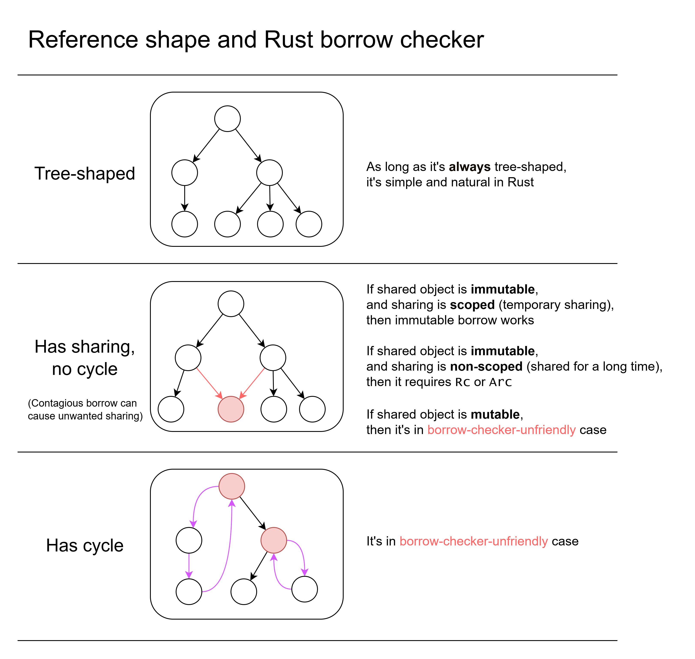

# How to Avoid Fighting Rust Borrow Checker

<!-- truncate -->

It's unproductive to fight with Rust borrow checker, by changing some code, try to compile, then change other code, try to compile, and so on. Rust developers should clearly knowing what things are not allowed by borrow checker, or hard to do under borrow checker in advance.

The 3 important facts in Rust:

- **Tree-shaped ownership**. In Rust's ownership system, one object can own many children or no chlld, but must be owned by **exactly one parent**. Ownership relations form a tree. [^about_sharing]
- **Mutable borrow exclusiveness**. If there exists one mutable borrow for an object, then no other reference to that object can exist. Mutable borrow is exclusive.
- **Borrow is contagious**. If you borrow a child, you indirectly borrow the parent (and parent's parent, and so on) **if crossing function boundary**. Just borrowing one wheel of a car makes you borrow the whole car. Combined with previous point, it can cause troubles for mutable data, and can be solved using **split borrow** (that does not cross function boundary).

[^about_sharing]: Reference counting (`Rc`, `Arc`) allows sharing, but they are not "native" Rust ownership. The implementation of `Rc` and `Arc` uses `unsafe`. 

Rust applies **local** constraints. Here **local** means it doesn't analyze the whole application's code, and just analyze within individual scopes, using types to encode information. Outside of the current scope, all information that's not encoded into type are not considered.

Unfortunately the constraints limit expressiveness of referencing[^limit_expressiveness]. Safe Rust will reject some safe programs.

[^limit_expressiveness]: Safe Rust limits expressiveness related to referencing and memory layout. But safe Rust is still expressive enough to be Turing-complete.

## Considering reference shape

Firstly consider the reference [^about_reference] shape of your in-memory data.

[^about_reference]: Note that here "reference" here means reference in general OOP context (where there is no distinction between ownership and non-owning reference, think about reference in Java/C#/JS/Python). This is different to the Rust reference. I will use "borrow" for Rust reference in this article.



- If the reference is tree-shaped, then it's simple and natural in Rust. 
- If the reference shape has **sharing**, things become a little complicated.
    - Sharing means there are two or more references to the same object.
    - If shared object is immutable:
        - If the sharing is scoped (only temporarily shared), then you can use immutable borrow. You may need lifetime annotation.
        - If the sharing is not scoped (may share for a long time, not bounded within a scope), you need to use reference counting (`Rc` in singlethreaded case, `Arc` in possibly-multithreaded case)
    - If shared object is mutable, then it's in **borrow-check-unfriendly case**. Solutions elaborated below.
- If the reference shape has **cycle**, then it's also in **borrow-check-unfriendly case**. Solutions elaborated below.

The most fighting with borrow checker happens in the **borrow-check-unfriendly cases**.

## Summarize solutions

The solutions in borrow-checker-unfriendly cases (will elaborate below):

- Avoid contagious borrow.
- Try to refactor reference structure. Use data-oriented design instead of OOP design.
- Use ID/handle to replace reference.
- Avoid mutation (pure-functional-style).
- `Arc<QCell<T>>`
- `Arc<RwLock<T>>`
- Use unsafe and raw pointer.

## Contagious borrow issue

The previously mentioned two important facts:

- **Mutable borrow exclusiveness**. If you mutable borrow it, others cannot borrow it.
- **Borrow is contagious**. Just borrowing one wheel of a car makes you borrow the whole car, if the borrow crosses function boundary. (unless using split borrow that works within one scope)

A simple example: [^about_code_example]

```rust
pub struct Parent {  
    total_score: u32,  
    children: Vec<Child>  
}
pub struct Child {  
    score: u32  
}

impl Parent {  
    fn get_children(&self) -> &Vec<Child> {  
        &self.children  
    }  
  
    fn add_score(&mut self, score: u32) {  
        self.total_score += score;  
    }  
}

fn main() {  
    let mut parent = Parent{total_score: 0, children: vec![]};  
  
    for child in parent.get_children() {  
        parent.add_score(child.score);  
    }
}
```

[^about_code_example]: This simplified code example is just for illustrating contagious borrow issue. Ignore issues like children vec is empty, total score doesn't need to be a field, etc.

Compile error:

```
25 |     for child in parent.get_children() {
   |                  ---------------------
   |                  |
   |                  immutable borrow occurs here
   |                  immutable borrow later used here
26 |         parent.add_score(child.score);
   |         ^^^^^^^^^^^^^^^^^^^^^^^^^^^^^ mutable borrow occurs here
```

This code is totally memory-safe: the `.add_score()` only touch the `total_score` field, and `.get_children()` only touch the `children` field. They work on separate data, they still clashes, because of **contagious borrow**:

- In `fn get_children(&self) -> &Vec<Child> { &self.children }`, although the method body just borrows `children` field, the returned reference indirectly borrows the whole `self`.
- `parent.get_children()` immutably borrows `parent`. It borrows the whole `parent`, not just a field in `parent`. The borrow checker works **locally** (just checked function signature) and doesn't check the body of `get_children`.
- The for loop indirectly borrows the result of `parent.get_children()` which indirectly borrows `parent`.
- In `fn add_score(&mut self, score: u32) { self.total_score += score; }`, the function body only mutably borrowed `total_score` field, but the argument `&mut self` borrows the whole `Parent`, not just one field.

The core problem is that you just want to borrow one field, but forced to borrow the whole object. And due to mutable borrow exclusiveness, this doesn't compile. (It often works fine in immutable case, because immutable borrows can co-exist for same object.)

What if I just inline `get_children` and `add_score`? Then it compiles fine:

```rust
pub struct Parent {  
    total_score: u32,  
    children: Vec<Child>  
}
pub struct Child {  
    score: u32  
}
fn main() {  
    let mut parent = Parent{total_score: 0, children: vec![]};  
  
    for child in &parent.children {  
        let score = child.score;  
        parent.total_score += score;  
    }  
}
```

Why that compiles? Because it does a **split borrow**: the compiler sees borrowing of individual fields in `main()` function, and don't do contagious borrow.

The deeper cause is that:

- **Borrow checker works locally**: when seeing a function call, it **only checks function signature**, instead of checking code inside the function. (Its benefit is to make borrow checking faster and simpler. Doing whole-program analysis is hard and slow, and doesn't work with things like dynamic linking.)
- **Information is lost in function signature**: the borrowing information becomes coarse-grained and is simplified in function signature. The type system does not allow expressing borrowing only one field, and can only express borrowing the whole object. [There are propsed solutions](https://smallcultfollowing.com/babysteps/blog/2025/02/25/view-types-redux/).

The solutions:

- **Avoid OOP-style getter and setter** (just make fields public), unless really necessary.
  - For getter, if the getter returns reference which cause contagious borrow. The getter that returns cloned/copied value is fine. For immutable data, getter returning reference is also usually fine.
  - For setter, it must pass `&mut self` which cause contagious borrow.
  - **Data-oriented** design (DOD).
- Use ID/handle to replace reference. (Entity component system (ECS) is one solution.)
- Other workarounds like `Arc<QCell<>>` `Arc<RwLock<>>`, etc.
- **Avoid mutation** or **defer mutation**:

## Avoid mutation or defer mutation

The previous problem occurs partially due to mutable borrow exclusiveness. If all borrows are immutable, then contagious borrow is usually not a problem.

The common way of avoiding mutation is **mutate-by-recreate**: All data is immutable. When you want to mutate something, you create a new version of it. Just like in pure functional language (e.g. Haskell).

Unfortunately, **mutate-by-recreate is also contagious**: if you recreated a new version of a child, you need to also recreate a new version of parent that holds the new child, and parent's parent, and so on. In functional languages there are abstractions like [lens](https://hackage.haskell.org/package/lens) to make this kind of cascade-recreate simpler.

Mutate-by-recreate can be useful for cases like:

- Safely sharing data in multithreading (related: Read-copy-update(RCU), copy-on-write (COW))
- Take snapshot and rollback efficiently

Mutate-by-recreate can be optimized by sharing unchanged sub-structures. See also: [Persistent data structure](https://en.wikipedia.org/wiki/Persistent_data_structure), [Rope](https://en.wikipedia.org/wiki/Rope_(data_structure)).

Another solution is to **treat mutation as data**. When you want to mutate something, you **append a mutation command into command queue** (the command can also be called "event" or "log"). Then execute the mutation commands at once. (Note that command should not indirectly reference base data.)

- In the process of creating new commands, it only do immutable borrow to base data, and only one mutable borrow to the command queue. 
- When executing the commands, it only do one mutable borrow to base data at a time.

What if I want to read the latest state before execute the commands in queue? Then you need to inspect both the command queue and base data to get latest state ([LSM tree](https://en.wikipedia.org/wiki/Log-structured_merge-tree) does similar things).

Treating mutation as data also has other benefits:

- The mutation can be serialized, and sent via network or saved to disk.
- The mutation can be inspected for debugging and logging.
- You can post-process the command list, such as sorting, filtering. If the data is sharded, the mutation command can dispatch to specific shard.
- In distributed system, there is a log (command list) that's synchronized between nodes using a consensus protocol (like Raft). And the log is source-of-truth: the mutable state is completely derived from the log (and previous state checkpoints).
- The idea of turning operations into data is also adopted by [io_uring](https://en.wikipedia.org/wiki/Io_uring) and modern graphics APIs (Vulkan, Metal, WebGPU).

The previous code rewritten using deferred mutation:

```rust
pub struct Parent {  
    total_score: u32,  
    children: Vec<Child>  
}  
pub struct Child {  
    score: u32  
}  
pub enum Command {  
    AddTotalScore(u32),  
    // can add more kinds of commands  
}  
  
impl Parent {  
    fn get_children(&self) -> &Vec<Child> {  
        &self.children  
    }  
  
    fn add_score(&mut self, score: u32) {  
        self.total_score += score;  
    }  
}  
  
fn main() {  
    let mut parent = Parent{total_score: 0, children: vec![]};  
    let mut commands: Vec<Command> = Vec::new();  
  
    for child in parent.get_children() {  
        commands.push(Command::AddTotalScore(child.score));  
    }  
  
    for command in commands {  
        match command {  
            Command::AddTotalScore(num) => {  
                parent.add_score(num);  
            }  
        };  
    }  
}
```

## About circular reference

### Circular reference in mathematics

Some may argue that "Circular reference is a bad thing. Look how much trouble do circular references create in mathematics":

- [Circular proof](https://en.wikipedia.org/wiki/Circular_reasoning): if A then B, if B then A. Circular proof is wrong. It can prove neither A nor B.
- The set that indirectly includes itself cause [Russel's paradox](https://en.wikipedia.org/wiki/Russell%27s_paradox): Let R be the set of all sets that are not members of themselves. R contains R deduces R should not contain R, and vice versa. Set theory carefully avoids cirular reference.
- [Halting problem](https://en.wikipedia.org/wiki/Halting_problem) is proved impossible to solve, by using circular reference:
  
  Assume there exists a function `halts(program, input)`, which takes in a `program` and `input` data, and outputs a boolean telling whether `program(input)` will eventually halt.
  
  Then construct a paradox program `paradox`: 

```pseudocode
fn paradox(program: Program) {
    if halts(program, program) {
        while true {} // dead loop
    } else {
        return; // halts
    }
}
```

  Then `halts(paradox, paradox)` will cause a paradox. If it returns true, then `paradox(paradox)` halts, but in `paradox`'s definition it should deadloop.
  
  [Rice's theorem](https://en.wikipedia.org/wiki/Rice%27s_theorem) is an extension to Halting problem: All non-trivial semantic properties of programs are undecidable (includes whether it eventually halts).

- [Gödel's incomplete theorem](https://en.wikipedia.org/wiki/G%C3%B6del%27s_incompleteness_theorems). 
  - Firstly encode symbols, statements and proofs into data [^godel_integer]. The statements that contain free variables (e.g. x is a free variable in "x is an even number") can also be encoded (it can represent "functions" and even "higher-order functions").
  - There is a function `is_proof(theory, proof)` that determines whether a proof successfully proves a theory. 
  - Then `provable(theory)` is defined as whether there exists a `proof` that satisfies `is_proof(theory, proof)`.
  - Negating its result tests whether a theory is unprovable: `unprovable(theory) = ¬provable(theory)`
  - Let `H(x) = unprovable(x(x))` [^godel_substitution]. `H` itself is also encoded as data, so we can construct `G = H(H) = unprovable(H(H)) = unprovable(G)`, which creates a self-referencial statement: `G`  means `G` is not provable. If `G` is true, then `G` is not provable. If `G` is false, then `G` is provable, which is a paradox.

[^godel_integer]: Specifically, Gödel encodes symbols, statements and proofs into integer, called Gödel number. There exists many ways of encoding symbols/statements/proofs as data, and which exact way is not important. For simplicity, I will treat them all as data, and ignore the conversion between data and symbol/statements/proofs.

[^godel_substitution]: Here `x(x)` is symbol substitution. `substitute(formula, variable, replacement)` finds all `variable` in `formula` and replace them as `replacement`. `x(x)` is `substitute(x, 'x', x)`. The validity of `x(x)` involves existence of fixed point. The original theorem is very complex and this article just describes a simplified version.

There is something in common between Halting problem, Russel's paradox and Gödel's incomplete theorem: they all self-reference and "negate" itself, causing paradox.

### Circular reference in programming

Circular reference being bad in mathematics does NOT mean they are also bad in programming. The circular reference in math theories are different to circular reference in data. There are many valid cases of circular references in programming (e.g. there are doublely-linked list running in Linux kernel and still works fine).

But circular reference do add risks to memory management:

- In C/C++, circular reference need to be carefully handled to avoid use-after-free.
- In GC languages, circular reference has memory leak risk. If a child references parent, and parent references child, then referencing any child will keep the whole structure alive.

Here are some common use cases of circular reference:

- Case 1: The parent references a child. The child references its parent, just for convenience. (Referencing to parent is not necessary, parent can be passed by argument)
- Case 2: The parent registers a callback to child. When something happened on child, the callback is called, and parent do something. It that case, parent references child, child references callback, callback references parent (e.g. lambda capture).
- Case 3: In a tree structure, the child references parent allows getting the path from one node to root node. Without it, you cannot get the path from just one node reference, and need to store variable-length path information.
- Case 4: The data is inherently a graph structure that can contain cycles.

### Avoid "just-for-convenience" circular reference in Rust

In the case 1 above: The child references parent, just for convenience. In OOP code. If you just have a reference to a child object, and you want to use some data in parent, child referencing parent would be convenient. Without it, the parent also need to be passed as argument. 

That convenience in OOP languages will lead to troubles in Rust. It's recommended to pass extra arguments instead of having circular reference.

Note that due to previously mentioned contagious borrow issue, you cannot mutably borrow child and parent at the same time (except using interior mutability). The workaround is to 1. do a split borrow on parent and pass the individual components of parent (pass more arguments and be more verbose than in other languages) 2. use interior mutability (e.g. `RefCell`, `Mutex`, `QCell`).

### The callback circular reference

**Observer pattern** is commonly used in GUI and other dynamic reactive systems. When a parent owns a child, but parent want to be notified when some event happens on child, the parent register callback to child, and child calls callback when event happens.

However, as the callback need to tell parent, the callback function object have to reference the parent. Then it creates circular reference: **parent references child, child references callback, callback references parent**, as mentioned previously in case 2.

Solutions:

- Use reference counting and interior mutability. The classical ones: `Rc<RefCell<T>>` (singlethreaded), `Arc<RwLock<T>>` (multithreaded). I also recommend using [`QCell`](https://docs.rs/qcell/latest/qcell/) (elaborated below): `Rc<QCell<T>>`, `Arc<QCell<T>>`.
  
  The back-reference (callback to parent, child to parent) should use `Weak` to avoid memory leak.
- Use event bus to replace callbacks. Similar to the previous deferred mutation, we turn event into data. Each component listen to specific "event channel" or "event topic". When something happens, put the event into event bus, then event bus notifies components.
- Use ID/handle to replace reference (elaborated later).

### The circular reference that's inherent in data structure

In the previously mentioned case 3 and case 4, circular reference is needed in data structure.

Solutions:

- Use reference counting and interior mutability (previously mentioned). This is **recommended when there are many different types of components and you want to add new types easily** (like in GUI).
- Use ID/handle to replace reference (elaborated later). This is **recommended when you want more compact memory layout, and you rarely need to add new types into data** (suitable for data-intensive cases, can obtain better performance due to cache-friendliness).

## Use handle/ID to replace reference

Data-oriented design:

- Try to pack data into contagious array, (instead of objects laid out sparsely managed by allocator).
- Use handle (e.g. array index) or ID to replace reference.
- The different fields of the same object doesn't necessarily need to be together in memory. The one field of many objects can be put together (parallel array).
- Manage memory based on **arenas**.

One kind of arena is [slotmap](https://docs.rs/slotmap/latest/slotmap/):

- Slotmap is basically an array of elements, but each element has a version integer. 
- Each handle (key) has an index and a version. 
- When accessing the slotmap, it firstly does a bound check, then checks version. 
- After removing element, the version increments. The previous handle cannot get the new element at the same index, because of version mismatch.
- The handle (key) are just `Copy`-able data that's not restricted by borrow checker.
- Although memory safe, it still has the equivalent of "use-after-free": using a handle of an already-removed object cannot get element from the slotmap [^slotmap_uniqueness]. Each get element operation may fail.

[^slotmap_uniqueness]: Each slotmap ensures key uniqueness, but if you mix keys of different slotmaps, the different keys of different slotmap may duplicate in value. Using the wrong key may successfully get an element but logically wrong.

Other map structure, like `HashMap` or `TreeMap` can also be arenas. If no element can be removed from arena, then a `Vec` can also be an areana.

One important fact: when we use ID/handle to replace reference, the borrow checker no longer ensure that the ID/handle will point to a living object.

### Generalized reference and two reference semantics

The concept of **generalized reference**:

- The reference in GC languages is generalized reference.
- Pointer is generalized reference.
- Borrowing in Rust is generalized reference.
- Ownership in Rust is also considered as generalized reference.
- Smart pointer (`Rc`, `Arc`, `Weak`, `Box` in Rust, `shared_ptr`, `weak_ptr`, `unique_ptr` in C++, etc.) are generalized reference.
- **ID**s are generalized reference. (It includes all kinds of IDs, including **handles**, UUID, string id (URL, file path, username, etc.), integer id, primary key, and all kinds of identification information).

The generalized reference is separated into two kinds: strong and weak:

- Strong generalized reference: The system **ensures it always points to a living object**. 
  
  It contains: normal references in GC languages (when not null), Rust borrow and ownership, strong reference counting (`Rc`, `Arc`, `shared_ptr` when not null), and **ID in database with foreign key constraint**.
- Weak generalized reference: The system **does NOT ensure it points to a living object**.
  
  It contains: ID (no foreign key constraint), handles, weak reference in GC languages, weak reference counting (`Weak`, `weak_ptr`).

The major differences:

- For weak generalized references, **every data access may fail, and requires error handling**.
- For strong generalized reference, the **lifetime of referenced object is tightly coupled with the existence of reference**:
  - In Rust, the coupling comes from borrow checker. The borrow is limited by lifetime and other constraints.
  - In GC langauges, the coupling comes from GC. The existence of a strong reference keeps the object alive. Note that in GC languages there are **live-but-unusable objects** (like a `File` already closed in Java).
  - In reference counting, the coupling of course comes from runtime reference counting.
- For weak generalized reference, the **lifetime of object is decoupled from referces to it**.


## Mutable borrow exclusiveness

As previously mentioned, Rust has **mutable borrow exclusiveness**:

- A mutable borrow to one object cannot co-exist with any other borrow to the same object. Two mutable borrows cannot co-exist. One mutable and one immutable also cannot co-exist.
- Multiple immutable borrows for one object can co-exist.

That is also called "mutation xor sharing", as mutation and sharing cannot co-exist.

In multi-threading case, this is natural: multiple threads read the same immutable data is fine. As long as one thread mutates the data, other thread cannot safely read or write it without other synchronization (atomics, locks, etc.).

But in single-threaded case, this restriction is not natural at all. No mainstream language (other than Rust) has this restriction.

> _Mutation xor sharing_ is, in some sense, neither necessary nor sufficient. It’s not _necessary_ because there are many programs (like every program written in Java) that share data like crazy and yet still work fine. It’s also not _sufficient_ in that there are many problems that demand some amount of sharing – which is why Rust has “backdoors” like `Arc<Mutex<T>>`, `AtomicU32`, and—the ultimate backdoor of them all—`unsafe`.
> 
> https://smallcultfollowing.com/babysteps/blog/2024/06/02/the-borrow-checker-within/

In Rust, mutable borrow exclusiveness is still useful in single-threaded case, for safety of **interior pointer**.

### Interior pointer

Interior pointer are the pointers that point into data inside another object. 

For example, you can take pointer of an element in `Vec`. If the `Vec` grows, it may allocate new memory and copy existing data to new memory, thus the interior pointer to it can become invalid. Mutable borrow exclusiveness can prevent this issue from happening:

```rust
fn main() {  
    let mut vec: Vec<u32> = vec!(1, 2, 3);  
    let interior_pointer: &u32 = &vec[0];  
    vec.push(4);  
    print!("{}", *interior_pointer);  
}
```

Compile error:

```
3 |     let interior_pointer: &u32 = &vec[0];
  |                                   --- immutable borrow occurs here
4 |     vec.push(4);
  |     ^^^^^^^^^^^ mutable borrow occurs here
5 |     print!("{}", *interior_pointer);
  |                  ----------------- immutable borrow later used here
```

Another example is about `enum`: interior pointer pointing inside `enum` can also be invalidated, because different enum variants has different memory layout:

```rust
enum DifferentMemoryLayout {  
    A(u64, u64),  
    B(String)  
}  
  
fn main() {  
    let mut v: DifferentMemoryLayout = DifferentMemoryLayout::A(1, 2);  
    let interior_pointer: &u64 = match v {  
        DifferentMemoryLayout::A(ref a, ref b) => {a}  
        DifferentMemoryLayout::B(_) => { panic!() }  
    };  
    v = DifferentMemoryLayout::B("hello".to_string());  
    println!("{}", *interior_pointer);  
}
```

Compile error:

```
9  |         DifferentMemoryLayout::A(ref a, ref b) => {a}
   |                                  ----- `v` is borrowed here
...
12 |     v = DifferentMemoryLayout::B("hello".to_string());
   |     ^ `v` is assigned to here but it was already borrowed
13 |     println!("{}", *interior_pointer);
   |                    ----------------- borrow later used here
```

Because that a mutation can invalidate the memory layout that interior pointer depends on, mutable borrow exclusiveness is still important for memory safety in single-threaded case.

### Interior pointer in other languages

Note that Golang also supports interior pointer, but doesn't have such restriction. For example, interior pointer into slice:

```go
package main

import "fmt"

func main() {
	slice := []int{1, 2, 3}
	interiorPointer := &slice[0]
	slice = append(slice, 4)
	fmt.Printf("%v\n", *interiorPointer)
	fmt.Printf("old interior pointer: %p  new interior pointer: %p\n", interiorPointer, &slice[0])
}
```

Output

```
1
old interior pointer: 0xc0000ac000  new interior pointer: 0xc0000ae000
```

Because after re-allocating the slice, the old slice still exists in memory. If there is an interior pointer into the old slice, the old slice won't be freed by GC.

Golang also doesn't have sum type, so there is no equivalent to enum memory layout change in the previous example.

Also, Golang's doesn't allow taking interior pointer to map element value, but Rust allows.

In Java, there is no interior pointer. But there is one thing logically similar to interior pointer: `Iterator`. Mutating a container can cause iterator invalidation:

```java
public class Main {  
    public static void main(String[] args) {  
        List<Integer> list = new ArrayList<>();  
        list.add(1);  
  
        Iterator<Integer> iterator = list.iterator();  
        while (iterator.hasNext()) {  
            Integer value = iterator.next();  
            if (value < 3) {  
                list.remove(0);  
            }  
        }  
    }  
}
```

That will get `java.util.ConcurrentModificationException`. Java's `ArrayList` has an internal version counter that's incremented every time it changes. The iterator code checks concurrent modification using version counter. (Even without the version check, it will still be memory-safe because array access is range-checked.)

### Interior mutability

As previously mentioned, mutable borrow exclusiveness is still important in single-threaded case, because of interior pointer.

**But if we don't use any interior pointer, and code is single-threaded, then mutable borrow exclusiveness is simply not needed at all**.

That's why mainstream languages has no mutable borrow exclusiveness, and still works fine in single-threaded case. Java, JS and Python has no interior pointer. Golang and C# have interior pointer, they have GC and restrict interior pointer, so memory safe is still kept without mutable borrow exclusiveness.

The benefit of interior pointer is to allow tight memory layout, without having to do extra heap allocation just to get a reference some inner data.

Because that mutable borrow exclusiveness is overly restrictive, there is **interior mutability** that allows getting rid of that constraint.

Interior mutability allows you to mutate something from an immutable reference to it. (Because of that, immutable reference doesn't necessarily mean the referenced data is actually immutable. This can cause some confusion.)

Ways of interior mutability:

- `Cell<T>`, for simple copy-able types like integer.
- `RefCell<T>`, for single-threaded case.
  
  It has internal counters tracking how many immutable borrow and mutable borrow currently exist. If it detects violation of mutable borrow exclusiveness, `.borrow()` or `.borrow_mut()` will panic.
  
  It can cause crash if there is nested borrow that involves mutation. [See also](https://loglog.games/blog/leaving-rust-gamedev/#dynamic-borrow-checking-causes-unexpected-crashes-after-refactorings)
- `Mutex<T>` `RwLock<T>`, for locking in multi-threaded case. Note that unnecessary locking can cost performance, and has risk of deadlock. It's not recommended to overuse `Arc<Mutex<T>>` just because it can satisfy the borrow checker.
- [`QCell<T>`](https://docs.rs/qcell/latest/qcell/). This is special. `QCell` has an internal ID. `QCellOwner` is also an ID. You can only use `QCell` via `QCellOwner`. The borrowing to `QCellOwner` ensures mutable borrow exclusiveness. Using it require passing reference of `QCellOwner` in argument everywhere.
  
   [GPUI](https://zed.dev/blog/gpui-ownership)'s `Model<T>` is similar to `Rc<QCell<T>>`, where GPUI's `AppContext` correspond to `QCellOwner`.
   
   QCell will fail to borrow if the owner ID doesn't mismatch. Different to `RefCell`, if owner ID matches, it won't panic just because nested borrow.
   
   It can also work in multithreading, by having `RwLock<QCellOwner>`. This can allow one lock to protect many pieces of data in different places [^lock_granularity].
   
   [Ghost cell](https://docs.rs/ghost-cell/latest/ghost_cell/) is similar to QCell, but zero-cost, and more restrictive (use closure lifetime as owner id).

[^lock_granularity]: Sometimes, having fine-grained lock is slower because of more lock/unlock operations. But sometimes having fine-grained lock is faster because it allows higher parallelism. Sometimes fine-grained lock can cause deadlock but coarse-grained lock won't deadlock. It depends on exact case.

They are usually used inside reference counting (`Arc<...>`, `Rc<...>`).

## Rust lock is non-reentrant

`MutexGuard` drops at the end of scope, not drop on the last use. NLL doesn't apply.


## Just clone the data

For example, if borrow checker has trouble with a string borrowing, you can just clone the string. It's usually fine as long as it's not performance bottleneck.

## Summarize the contagious things

- Borrowing that cross function boundary is contagious. Just borrowing a wheel of car can indirectly borrow the whole car.
- Mutate-by-recreate is contagious. Recreating child require also recreating parent that holds the new child, and parent's parent, and so on.
- Lifetime annotation is contagious. If some type has a lifetime parameter `'a`, then every type that holds it and every function that processes it must also have the lifetime parameter `'a`. Refactoring that adds/remove lifetime parameter may be a huge work.
- In current borrow checker, one branch's borrowing is contagious to the whole branching scope.


## Using unsafe

By using unsafe you can freely manipulate pointers and are not restricted by borrow checker. But writing unsafe Rust is harder than just writing C, because you need to carefully avoid breaking the constraints that safe Rust code relies on. A bug in unsafe code can cause issue in safe code. Also be wary about undefined behaviors that may cause wrong optimization. Writing unsafe Rust correctly is a hard topic.


## Entity component system


## Self-reference

Using self reference usually require `Pin` and `unsafe`.

workaround: store id/index instead of interior pointer.

## Contagious borrowing between branches

Current borrow checker does coarse-grained analysis on branch. One branch's borrowing is **contagious** to another branch. This will be fixed by Polonius.

According to [Polonius update](https://blog.rust-lang.org/inside-rust/2023/10/06/polonius-update/):

This won't compile:

```rust
fn get_default<'r, K: Hash + Eq + Copy, V: Default>(
    map: &'r mut HashMap<K, V>,
    key: K,
) -> &'r mut V {
    match map.get_mut(&key) { // -------------+ 'r
        Some(value) => value,              // |
        None => {                          // |
            map.insert(key, V::default()); // |
            //  ^~~~~~ ERROR               // |
            map.get_mut(&key).unwrap()     // |
        }                                  // |
    }                                      // |
}   
```

Becaue the first branch `Some(value) => ...`'s output value indirectly mutably borrows `map`, the second branch has to also indirectly mutably borrow `map`, which conflicts with another mutable borrow in scope.

## Tokio require future to be `Send + Sync + 'static`

The lifetime `'static`'s name is unintuitive. In C, `static` can create global-variable-within-function. In OOP languages like C/C++, Java, C#, `static` means global variable.

In Rust, `'static` inlcudes reference to global variable. But `'static` also includes the non-reference types that itself has ownership.

## Extracting variable and inlining variable has side effect

Reborrow [haibane_tenshi's blog - Obscure Rust: reborrowing is a half-baked feature](https://haibane-tenshi.github.io/rust-reborrowing/) extracting variable makes reborrow not working

Take reference into temporary value. inlining make it not compile (temporary value drop right after use, local variables drop at the end of scope, except NLL)

