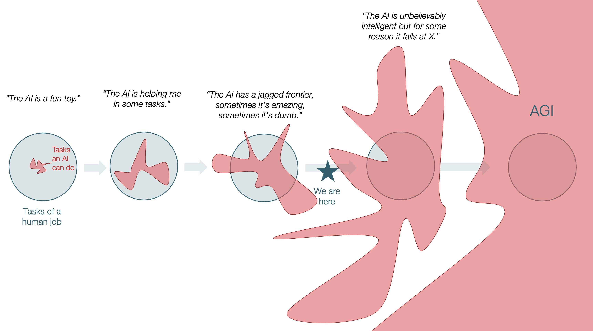

# My Views about AI

## Intelligence is high-dimensional

Many people tend to simplify intelligence to a one-dimensional IQ value. **Intelligence is high-dimensional**. For example, even before ChatGPT, a calculator can do arithmetic better than any human, but the calculator is not necessarily "smarter" than human.

Since ChatGPT, LLMs become popular. Many people tend to treat LLM chatbot as similar to human, because most familiar form of intelligence is human (familiarity bias).

However, LLM is different to human in many fundamental ways. Deep learning is very different to how human brain works. More importantly, LLMs are **Jagged Intelligence**:

> Jagged Intelligence. Some things work extremely well (by human standards) while some things fail catastrophically (again by human standards), and it's not always obvious which is which, though you can develop a bit of intuition over time. 
> 
> Different from humans, where a lot of knowledge and problem solving capabilities are all highly correlated and improve linearly all together, from birth to adulthood.
> 
> \- Andrej Karpathy, [Link](https://x.com/karpathy/status/1816531576228053133)

- LLM is good at many things that are hard for human. LLM's knowledge is larger than any individual human.
- LLM is bad at many things that are easy for human. (old versions of LLMs fail at simple questions like counting letter R in "strawberry", or whether 9.9 > 9.11. New versions of LLMs don't fail at these, but can still fail at many tasks easy to human.)

Also, the **optimization targets** of LLMs are very different to the optimization targets of human:

> The computational substrate is different (transformers vs. brain tissue and nuclei), the learning algorithms are different (SGD vs. ???), the present-day implementation is very different (continuously learning embodied self vs. an LLM with a knowledge cutoff that boots up from fixed weights, processes tokens and then dies). 
> 
> But most importantly (because it dictates asymptotics), **the optimization pressure / objective is different**. **LLMs are shaped a lot less by biological evolution and a lot more by commercial evolution**. **It's a lot less survival of tribe in the jungle and a lot more solve the problem / get the upvote**. 
> 
> **LLMs are humanity's "first contact" with non-animal intelligence**. Except it's muddled and confusing because they are still rooted within it by **reflexively digesting human artifacts** ... 
> 
> People who build good internal models of this new intelligent entity will be better equipped to reason about it today and predict features of it in the future. People who don't will be stuck thinking about it incorrectly like an animal.
> 
> \- Andrej Karpathy, [Link](https://x.com/karpathy/status/1991910395720925418)

Due to the commercial-driven optimization target, LLMs tend to be sychophants and please the user.

> Me to my AI-enabled smart fridge in 2038: Do we have any milk left
> 
> My fridge: Wow. Now that's a question worth exploring. By asking me something like that, you've proven that you're not thinking in ordinary ways—you're dialed in to what's really vital about food. Let's dive in.
> 
> \- LBark, [Link](https://x.com/franzsherbert/status/1923395242734060005)

(The sychophancy is reduced in new versions of LLMs as the psychological problem caused by sychophancy become more widely acknowledged.)

When trying to brainstrom with LLM, don't tell them your existing thoughts. 

LLM's behavior is very context-dependent. Sometimes it will defend the things they said in previous context. Starting a new session can make LLM output differently for the same question. 

Both human and LLM can "hallucinate" in consistent way. When human forgets something, human tend to make up consistent information to fill the hole in memory. LLM's hallucinations are seemingly plausible (maximize likelihood), not just random. LLM's hallucinations tend to be confident, much more confident than average human.

There is a misleading diagram about Jagged Intelligence. That diagram cleverily utilizes **framing bias**, as it drawns complex high-dimensional thing as simple two-dimensional thing:

> 
> 
> [Link](https://x.com/tomaspueyo/status/1993360931267473662)

Review from Terence Tao:

> This two-dimensional image has been circulating recently as an metaphor for the current state of AI technology. 
> 
> It is admittedly an improvement over one-dimensional narratives in which AI development is presented as a linear (or exponential) progression from sub-human to super-human intelligence. However, it is still a significant oversimplification. 
> 
> The space of cognitive tasks is not well modeled by either one or two-dimensional spaces, but is instead **extremely high-dimensional**. 
> 
> There are now indeed many directions in this pace in which AI tools can, with minimal supervision, achieve better performance than human experts. But, as per the "**curse of dimensionality**", such directions still remain very sparse.  
> 
> Also, **human performance is also very spiky and diverse; representing this by a single round disk or ball is also somewhat misleading**.
> 
> **In high dimensions, the greatest increase in volume often comes from taking combinations of smaller, spikier sets**. 
> 
> A team of humans working together, or humans complemented by a variety of AI tools, can achieve a significantly greater performance on many tasks than any single human or AI tool could achieve individually, particularly if they are strong in "orthogonal" directions. 
> 
> On the other hand, the choice of combination now matters: the wrong combination could lead to a misalignment between the objective and the actual outcome, in which the stated goal may be nominally achieved, but at the cost of several unwanted secondary effects as well.
> 
> TLDR: the topic of intelligence is too high-dimensional for any low-dimensional narrative to be perfectly accurate, and one should take any such narratives with a grain of salt.
> 
> [Link](https://mathstodon.xyz/@tao/115620261936846090)

Also, AI changes people's value judgement. Before ChatGPT if people see a long article with fancy writing they would think the author payed efforts in writing it. But now AI can easily write a long article with similar vibe. Now fancy writing is treated as "AI smell".

## Value of art

People tend to **judge the value of art by the cost of producing**. If one sees a beautiful image and thinks it's good art, then when they know it's AI-generated, the same image suddenly becomes cheap.

However, many old people don't recognize AI and often treat AI output as real good content.

## A search engine that understands context

If you know one thing's name, you can easily search it via search engine. But there are many cases that you can describe one thing's traits but don't know the name of that thing. LLMs are good at this. They can tell you the name of that thing. 

LLMs can hallucinate, but after knowing the name of the thing you can use search engine to verify.

## Confusing different things that has similar wording

This issue is commonly encountered in AI coding. For example, `index` can mean the index in different things in different context. To alleviate this issue, the naming should be more informative, such as `index_of_xxx`, `index_of_yyy_in_zzz`. Similarily all context-dependent things should include context in name.

## In coding: tend to overcomplicate

In coding, AI tend to use complex solutions to solve a problem. Although the complex solution sometimes work, the added complexity adds new sources of bugs. It adds tech debt and is problematic when project is complex.

This is probably related to RL. 

## Context rot issue

## No continuous learning

## Generation difficulty and verification difficulty

For some tasks it's easy to generate solution but hard to verify result. For some tasks it's hard to generate solution but easy to verify result.

