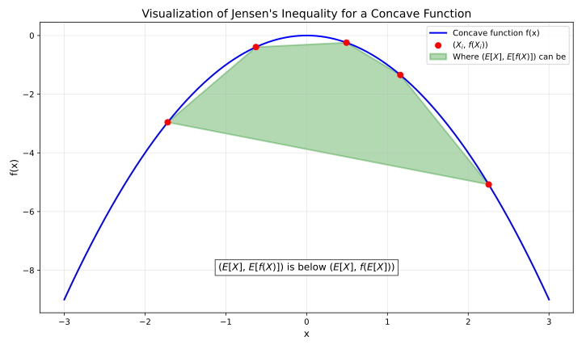
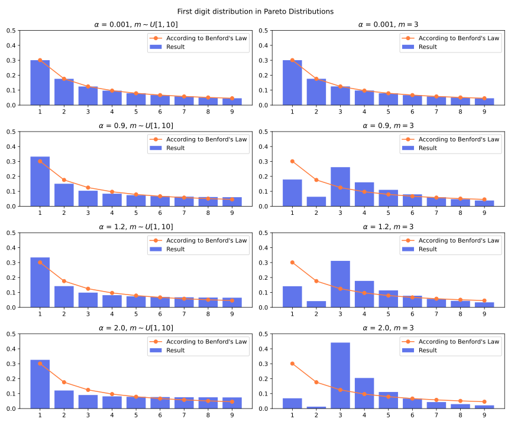

# Some Statistics Knowledge

<!-- truncate -->


## Basic concepts

What's the essence of probability? There are two views:

- Frequentist: Probability is an objective thing. We can know probability from the result of repeating a random event many times in the same condition.
- Bayesian: Probability is a subjective thing. Probability means how you think it's likely to happen based on your initial assumptions and the evidences you see. **Probability is relative to the information you have.**

Probability is related to sampling assumptions. Example: [Bertrand Paradox](https://en.wikipedia.org/wiki/Bertrand_paradox_(probability)): there are many ways to randoly select a chord on a circle, with different proability densities of chord.

A distribution tells how likely a random variable will be what value:

- A discrete distribution can be a table, telling the probability of each possible outcome.
- A discrete distribuiton can be a function, where the input is a possible outcome and the output is probability.
- A discrete distribution can be a vector (an array), where i-th number is the probability of i-th outcome.
- A discrete distribution can be a histogram, where each pillar is a possible outcome, and the height of pillar is probability.
- A continuous distribution can be described by a **probability density function (PDF)** $f$. A continuous distribution has infinitely many outcomes, and the probability of each specific outcome is zero (usually). We care about the probability of a range: $P(a<X<b)=\int_a^b f(x)dx$. The integral of the whole range should be 1: $\int_{-\infty}^{\infty}f(x)dx=1$. The value of PDF can be larger than 1.
- A distribution can be described by cumulative distribution function. $F(x) = P(X \leq x)$. It can be integration of PDF: $F(x) = \int_{-\infty}^x f(x)dx$. It start from 0 and monotonically increase then reach 1.
- Quantile function $Q$ is the inverse of cumulative distribution function. $Q(p) = x$ means $F(x)=p$ and $P(X \leq x) = p$. The top 25% value is $Q(0.75)$. The bottom 25% value is $Q(0.25)$. 

Independent means that two random variables don't affect each other. Knowing one doesn't affect the distribution of other. But there are dependent random variables that, when you know one, the distribution of another changes.

$P(X=x)$ means the probability of random variable $X$ take value $x$. It can also be written as $P_X(x)$ or $P(X)$. Sometimes the probability density function $f$ is used to represent a distribution.

A joint distribution tells how likely a combination of multiple variables will be what value. For a joint distribution of X and Y, each outcome is a pair of X and Y, denoted $(X, Y)$. If X and Y are independent, then $P(X=x,Y=y)=P((X,Y)=(x,y))=P(X=x) \cdot P(Y=y)$.

For a joint distribution of $(X, Y)$, if we only care about X, then the distribution of X is called **marginal** distribution.

You can only add probability when two events are mutually exclusive.

You can only multiply probability when two events are independent, or multiplying a conditional probability with the condition's probability.

## Conditional probability

$P(E \vert C)$ means the probability of $E$ happening **if** $C$ happens.

$$
P(E|C) = \frac{P(\overbrace{E \cap C}^{\mathclap{\text{E and C both happen}}})}{P(C)} \quad\quad\quad\quad\quad P(E\cap C) = P(E|C) \cdot P(C)
$$


If E and C are independent, then $P(E \cap C) = P(E)P(C)$, then $P(E \vert C)=P(E)$.

For example, there is a medical testing method of a disease. The test result can be positive (indicate having diesase) or negative. But that test is not always accurate.

There are two random variables: whether test result is positive, whther the person actually has disease. This is a joint distribution. The 4 cases:

|                               | Test is positive                      | Test is negative                       |
| ----------------------------- | ------------------------------------- | -------------------------------------- |
| Actually has disease          | True positive $a$                     | **False negative (Type II Error)** $b$ |
| Actually doesn't have disease | **False positive (Type I Error)** $c$ | True negative $d$                      |

$a, b, c, d$ are four possibilities. $a + b + c + d = 1$.

For that distribution, there are two marginal distributions. If we only care about whether the person actually has disease and ignore the test result, then the marginal distribution is:

|                               | Probability                           |
| ----------------------------- | ------------------------------------- |
| Actually has disease          | $a+b$ (the infect rate of population) |
| Actually doesn't have disease | $c+d$                                 |

Similarily there is also a marginal distribution of whether the test result is positive.

False negative rate is $P(\text{Test is negative } \vert \text{ Actually has disease})$, it means the rate of negative test when actually having disease. And false positive rate is $P(\text{Test is positive } \vert \text{ Actually doesn't have disease})$.

$$
\text{False negative rate} = P(\text{Test is negative} | \text{Actually has disease}) = \frac{b}{a + b}
$$

$$
\text{False positive rate} = P(\text{Test is positive} | \text{Actually doesn't have disease}) = \frac{c}{c + d}
$$

Some people may intuitively think false negative rate means $P(\text{Test result is false } \vert \text{ Test is negative})$, which equals $P(\text{Actually has disease } \vert \text{ Test is negative})$, which equals $\frac{b}{b+d}$. But that's not the official definition of false negative.

Bayes theorem allow "reversing" $P(A \vert B)$ as $P(B \vert A)$:

$$
P(A|B) = \frac{P(A \cap B)}{P(B)} = \frac{P(B|A)\cdot P(A)}{P(B)}
$$

- **Prior** means what I assume the distribution is before knowing some new information.
- If I see some new information and improved my understanding of the distribution, then the new distribution that I assume is **posterior**.

## Mean

The theoretical mean is the "weighted average" of all possible cases using theoretical probabilities.

$E[X]$ denotes the theoretical mean of random variable $X$, also called the expected value of $X$. It's also often denoted as $\mu$.

For discrete case, $E[X]$ is calculated by summing all theoretically possible values multiply by their  theoretical probability.

The mean for discrete case:

$$
\mu = E[X] = \sum_{\underbrace{x} _ {\mathclap{\text{consider all cases of x}}}} x \cdot \overbrace{P(X=x)} ^ {\mathclap{\text{probability of that case}}}
$$

The mean for continuous case:

$$
\mu = E[X] = \int_{-\infty}^{\infty} x \cdot p(x) dx
$$

Some rules related to mean:

- The mean of two random variables can add up
$$E[X + Y] = E[X] + E[Y]\quad \quad \quad E[\sum_iX_i] = \sum_iE[X_i]$$
- Multiplying a random variable by a constant $k$ multiplies its mean
$$E[kX] = k \cdot E[X]$$
- A constant's mean is that constant
$$E[k] = k$$

(The constant $k$ doesn't necessarily need to be globally constant. It just need to be a certain value that's not affected by the random outcome. It just need to be "constant in context".)

Another important rule is that, if $X$ and $Y$ are independent, then

$$
E[X \cdot Y] = E[X] \cdot E[Y]
$$

Because when $X$ and $Y$ are independent, $P(X=x_i, Y=y_j) = P(X=x_i) \cdot P(Y=y_j)$, then:

$$
E[X \cdot Y] = \sum_{i,j}{x_i \cdot y_j \cdot P(X=x_i, Y=y_j)} = \sum_{i,j}{x_i \cdot y_j \cdot P(X=x_i) \cdot P(Y=y_j)}
$$

Note that $E[X+Y]=E[X]+E[Y]$ always work regardless of independence, but $E[XY]=E[X]E[Y]$ requires independence.

For a sum, the common factor that's not related to sum index can be extraced out. So:

$$
\sum_{i,j}f(i)g(j)
= \sum_{i} \left( \sum _ {j} (\underbrace{f(i)} _ \text{irrelevant to j} \cdot g(j)) \right)  
=\sum _ {i} \left(  f(i)  \underbrace{\sum _ {j} g(j)} _ \text{irrelevant to i} \right)
=\left(\sum _ {i} f(i)\right) \left(\sum  _ {j} g(j)\right) 
$$

Then:

$$
\sum_{i,j}{x_i \cdot y_j \cdot P(X=x_i) \cdot P(Y=y_j)} = \left(\sum_ix_iP(X=x_i)\right) \cdot \left(\sum_jy_jP(Y=y_j)\right) = E[X] \cdot E[Y]
$$

(That's for the discrete case. Continuous case is similar.)

If we have $n$ samples of $X$, denoted $X_1, X_2, ... X_n$, each sample is a random variable, and **each sample is independent to each other**, and **each sample are taken from the same distribution** (independently and identically distributed, **i.i.d**), then we can estimate the theoretical mean by calculating the average. The estimated mean is denoted as $\hat{\mu}$ (Mu hat):

$$
\hat{E}_i[X] = \hat{\mu} = \frac{1}{n} \sum_i{X_i}
$$

Hat  $\hat{}$  means it's an **empirical** value calculated from samples, not the theoretical value. 

Some important clarifications:

- The theoretical mean is weighted average using theoretical probabilities
- The estimated mean (empirical mean, sample mean) is non-weighted average over samples
- The theoretical mean is an accurate value, determined by the theoretical distribution
- The estimated mean is an inaccurate random variable, because it's calculated from random samples

The mean of estimated mean equals the theoretical mean. 

$$
E[\hat{\mu}] = E[\frac{1}{n}\sum_iX_i] = \frac{1}{n} \sum_i E[X_i] = \frac{1}{n} \sum_i E[X] = \frac{1}{n} n \cdot E[X] = \mu
$$

Note that if the samples are not independent to each other, or they are taken from different distributions, then the estimation will be possibly biased.

## Variance

The theoretical variance, $\text{Var}[X]$, also denoted as $\sigma ^2$, measures how "spread out" the samples are.

$$
\sigma ^2 = \text{Var}[X] = E[(X - \mu)^2]
$$

If $k$ is a constant:

$$
\text{Var}[kX] = k^2 \text{Var}[X]
$$

$$
\text{Var}[X + k] = \text{Var}[X]
$$

$$
\text{Var}[X] = E[X^2] - E[X]^2
$$

Standard deviation (**stdev**) $\sigma$ is the square root of variance. Multiplying a random variable by a constant also multiplies the standard deviation.

The covariance $\text{Cov}[X, Y]$ measures the "joint variability" of two random variables $X$ and $Y$.

$$
\text{Cov}[X, Y] = E[(X-E[X])(Y-E[Y])]
\quad\quad\quad
\text{Var}[X]=\text{Cov}[X,X]
$$

Some rules related to variance:

$$
\text{Var}[X + Y]=
E[((X-E[X])+(Y-E[Y]))^2] 
$$

$$
= E[(X-E[X])^2 + (Y-E[Y])^2 + 2(X-E[X])(Y-E[Y])] 
= \text{Var}[X] + \text{Var}[Y] + 2 \cdot \text{Cov}[X, Y]
$$

If $X$ and $Y$ are indepdenent, as previouly mentioned $E[XY]=E[X]\cdot E[Y]$, then

$$
\text{Cov}[X, Y] = E[(X-E[X])(Y-E[Y])] = E[X-E[X]] \cdot E[Y-E[Y]] = 0 \cdot 0 = 0
$$


so $\text{Var}[X + Y]= \text{Var}[X] + \text{Var}[Y]$

The mean is sometimes also called location. The variance is sometimes called dispersion.

If we have some i.i.d samples but don't know the theoretical variance, how to estimate the variance? If we know the theoretical mean, then it's simple:

$$
\hat{\sigma}^2 = \frac{1}{n} \sum_{i}((X_i - \mu)^2)
$$

$$
E[\hat{\sigma}^2] = \sigma^2
$$

However, the theoretical mean is different to the estimated mean. If we don't know the theoretical mean and use the estimated mean, it will be biased, and we need to divide $n-1$ instead of $n$ to avoid bias:

$$
\hat{\sigma}^2 = \frac{1}{n-1} \sum_{i}((X_i - \hat{\mu})^2)
$$

This is called Bessel's correction. note that the more i.i.d samples you have, the smaller the bias, so if you have many i.i.d samples, then the bias doesn't matter in practice.

Originally, n samples have n degrees of freedom. If we keep the estimated mean fixed, then it will only have n-1 degrees of freedom. That's an intuitive explanation of the correction. The exact dedution of that correction is tricky:

### Deduction of Bessel's correction

Firstly, the estimated mean itself also has variance

$$
\text{Var}[\hat{\mu}] = \text{Var}\left[\frac{1}{n}\sum_iX_i\right] = \frac{1}{n^2} \text{Var}\left[\sum_iX_i\right]
$$

As each sample is independent to other samples. As previously mentioned, if $X$ and $Y$ are independent, adding the variable also adds the variance: $\text{Var}[X + Y]= \text{Var}[X] + \text{Var}[Y]$. So:

$$
\text{Var}\left[\sum_i{X_i}\right] = \sum_i{\text{Var}[X_i]} = n\sigma^2
$$

$$
\text{Var}[\hat{\mu}] = \frac{1}{n^2} \text{Var}\left[\sum_iX_i\right] = \frac{1}{n^2} \cdot n\sigma^2 = \frac{\sigma^2}{n}
$$

As previously mentioned $E[\hat{\mu}] = \mu$, then $\text{Var}[\hat{\mu}] = E[(\hat{\mu} - E[\hat{\mu}])^2] = E[(\hat{\mu} - \mu)^2] = \frac{\sigma^2}{n}$. This will be used later.

A trick is to rewrite $X_i - \hat{\mu}$ to $(X_i - \mu) - (\hat{\mu} - \mu)$ and then expand:

$$
\sum_{i}((X_i - \hat{\mu})^2) = \sum _ {i}\left(((X_i - \mu) - (\hat{\mu} - \mu))^2\right)
= \sum _ i{\left(
(X_i - \mu)^2-2(X_i - \mu)(\hat{\mu} - \mu)+(\hat{\mu} - \mu)^2\right)
}
$$

$$
= \sum_i{(X_i - \mu)^2}
-2 (\hat{\mu} - \mu) \sum_i{(X_i - \mu)}
+n(\hat{\mu} - \mu)^2
\quad
$$

Then take mean of two sides:

$$
E\left[ \sum _ {i}((X_i - \hat{\mu})^2) \right]=
E\left[\sum _ i{(X_i - \mu)^2}
 -2 (\hat{\mu} - \mu) \sum _ i{(X_i - \mu)}
 +n(\hat{\mu} - \mu)^2\right]
$$

$$
=E\left[\sum_i{(X_i - \mu)^2}\right] 
-2 E\left[(\hat{\mu} - \mu) \sum_i{(X_i - \mu)}\right]
+n E[ (\hat{\mu} - \mu)^2 ]
$$

There are now three terms. The first one equals $n\sigma^2$:

$$
E\left[\sum_i{(X_i - \mu)^2}\right] = n\sigma^2
$$

note that

$$
\sum_i{(X_i-\mu)} = (\sum_iX_i) - n\mu = n\hat{\mu} - n\mu = n(\hat{\mu}-\mu)
$$

So the second one becomes

$$
-2 E\left[(\hat{\mu} - \mu) \sum_i{(X_i - \mu)}\right] =
-2E[(\hat{\mu}-\mu)n(\hat{\mu}-\mu)] = -2nE[(\hat{\mu}-\mu)^2]
$$

Now the above three things become

$$
E\left[ \sum_{i}((X_i - \hat{\mu})^2) \right]=n\sigma^2 -nE[(\hat{\mu}-\mu)^2]
$$

$E[(\hat{\mu}-\mu)^2]$ is also $\text{Var}[\hat{\mu}]$. As previously mentioned, it equals $\frac{\sigma^2}{n}$, so

$$
E\left[ \sum_{i}((X_i - \hat{\mu})^2) \right]=
n\sigma^2 -n \frac{\sigma^2}{n} = (n-1)\sigma^2
$$

So

$$
E\left[ \frac{\sum _ {i}((X_i - \hat{\mu})^2)}{n-1} \right] = \sigma^2
$$

### Other measures of "spreadness"

Mean absolute deviation:

$$
\text{MeanAbsoluteDeviation}[X] = E[ \left| X - E[X] \right| ]
$$

Sometimes the $E[X]$ is replaced by median value.

## Z-score

For a random variable $X$, if we know its mean $\mu$ and standard deviation $\sigma$ then we can "standardize" it so that its mean become 0 and standard deviation become 1:

$$
Z = \frac{X-\mu}{\sigma}
$$

That's called Z-score or standard score.

Often the theoretical mean and theoretical standard deviation is unknown, so z score is computed using sample mean and sample stdev:

$$
Z = \frac{X-\hat\mu}{\hat\sigma}
$$

In deep learning, **normalization** uses Z score:

- **Layer normalization**: it works on a vector. It treats each element in a vector as different samples from the same distribution, and then replace each element with their Z-score (using sample mean and sample stdev).
- **Batch normalization**: it works on a batch of vectors. It treats the elements in the same index in different vectors in batch as different samples from the same distribtion, and then compute Z-score (using sample mean and sample stdev).

Note that in layer normalization and batch normalization, the variance usually divides by $n$ instead of $n-1$.

Computing Z-score for a vector can also be seen as a projection:

- The input $\boldsymbol{x} = (x_1,x_2,...,x_n)$
- The vector of ones: $\boldsymbol{1} = (1, 1, ..., 1)$
- Computing sample mean can be seen as scaling $\frac 1 n$ then dot product with the vector of ones:  ${\hat \mu}= \frac 1 n \boldsymbol{x} \cdot \boldsymbol{1}$
- Subtracting the sample mean can be seen as subtracting $\hat {\mu} \cdot \boldsymbol{1}$, let's call it $\boldsymbol y$: $\boldsymbol y = \boldsymbol x - {\hat \mu} \cdot \boldsymbol{1} = \boldsymbol x- \frac 1 n (\boldsymbol{x} \cdot \boldsymbol{1}) \cdot \boldsymbol{1}$
- Recall projection: projecting vector $\boldsymbol a$ onto $\boldsymbol b$ is $(\frac{\boldsymbol a \cdot \boldsymbol b}{\boldsymbol b \cdot \boldsymbol b}) \cdot \boldsymbol b$.
- $(\boldsymbol 1)^2 = n$. So $\frac 1 n (\boldsymbol{x} \cdot \boldsymbol{1}) \cdot \boldsymbol{1}$ is the projection of $\boldsymbol x$ onto $\boldsymbol 1$. 
- Subtracting it means removing the component in the direction of $\boldsymbol 1$ from $\boldsymbol x$. So $\boldsymbol y$ is orthogonal to $\boldsymbol 1$. $\boldsymbol y$ is in a hyper-plane orthogonal to $\boldsymbol 1$.
- Standard deviation can be seen as the length of $\boldsymbol y$ divide by $\sqrt{n}$ (or $\sqrt{n-1}$): $\boldsymbol\sigma^2 = \frac 1 n (\boldsymbol y)^2$, $\boldsymbol\sigma = \frac 1 {\sqrt{n}} \vert \boldsymbol y \vert$.
- Dividing by standard deviation can be seen as projecting it onto unit sphere then multiply by $\sqrt n$ (or $\sqrt{n-1}$).
- So computing Z-score can be seen as firstly projecting onto a hyper-plane that's orthogonal to $\boldsymbol 1$ and then projecting onto unit sphere then multiply by $\sqrt n$ (or $\sqrt{n-1}$).

## Skewness

Skewness measures which side has more extreme values. 

$$
\text{Skew}[X] = E\left[\frac{(X - \mu)^3}{\sigma ^3}\right]
$$

A large positive skew means there is a fat tail on positive side (may have positive extreme values). A large negative skew means fat tail on negative side (may have negative extreme values). 

If two sides are symmetric, its skew is 0, regardless of how fat the tails are. Gaussian distributions are symmetric so they has zero skew. note that an asymmetric distribution can also has 0 skewness.

There is a concept called **moments** that unify mean, variance, skewness and kurtosis:

- The n-th moment: $E[X^n]$. Mean is the first moment.
- The n-th central moment: $E[(X-\mu)^n]$. Variance is the second central moment.
- The n-th central standardized moment: $E[(\frac{X-\mu}{\sigma})^n]$. Skewness is the third central standardized moment. Kurtosis is the fourth central standardized moment.

There is an unbiased way to estimate the thrid central moment $\mu_3$.

$$
\mu_3[X] = E[(X-\mu)^3]
\quad\quad\quad\quad
\hat{\mu_3} = \frac{n}{(n-1)(n-2)} \sum_i (X_i - \hat{\mu})^3
$$

The deduction of unbiased third central moment estimator is similar to Bessel's correction, but more tricky.

A common way of estimating skewness from i.i.d samples, is to use the unbiased third central moment estimator, to divide by cubic of unbiased estimator of standard deviation:

$$
G_1 = \frac{\hat{\mu_3}}{\hat{\sigma}^3}
= \frac{n}{(n-1)(n-2)}\sum_i{\frac{(X_i - \hat{\mu})^3}{\hat{\sigma}^3}}
$$

But it's still biased, as $E[\frac{X}{Y}]$ doesn't necessarily equal $\frac{E[X]}{E[Y]}$. Unfortunately, there is no completely unbiased way to estimate skewness from i.i.d samples (unless you have other assumptions about the underlying distribution). The bias gets smaller with more i.i.d samples.

## Kurtosis

Larger kurtosis means it has a fatter tail. The more extreme values it has, the higher its kurtosis.

$$
\text{Kurt}[X] = E\left[\frac{(X - \mu)^4}{\sigma ^4}\right] = \frac{E[(X-\mu)^4]}{\sigma^4}
$$

Gaussian distributions have kurtosis of 3. Excess kurtosis is the kurtosis minus 3.

A common way of estimating excess kurtosis from i.i.d samples, is to use the unbiased estimator of fourth cumulant ($E[(X-E[X])^4]-3Var[X]^2$), to divide the square of unbiased estimator of variance:

$$
G_2 = \frac{(n+1)n}{(n-1)(n-2)(n-3)} \cdot \frac{\sum_i((X_i-\hat{\mu})^4)}{\hat{\sigma}^4}
-3\frac{(n-1)^2}{(n-2)(n-3)}
$$

It's still biased.


## Control variate

If we have some independent samples of $X$, can estimate mean $E[X]$ by calculating average $\hat{E}[X]=\frac{1}{n}\sum_i X_i$. The variance of calculated average is $\frac{1}{n} \text{Var}[X]$, which will reduce by having more samples. 

However, if the variance of $X$ is large and the amount of samples is few, the average will have a large variance, the estimated mean will be inaccurate. We can make the estimation more accurate by using control variate.

If:

- we have a random variable Y that's correlated with X
- we know the true mean of Y: $E[Y]$,

Then we can estimate $E[X]$ using $\hat{E}[X+\lambda(Y-E[Y])]$, where $\lambda$ is a constant. By choosing the right $\lambda$, the estimator can have lower variance than just calculating average of X. The Y here is called a control variate.

Some previous knowledge: $E[\hat{E}[A]] = E[A]$,  $\text{Var}[\hat{E}[A]]=\frac{1}{n}\text{Var}[A]$.

The mean of that estimator is $E[X]$, meaning that the estimator is unbiased:

$$
E[\hat{E}[X+\lambda(Y-E[Y])]] = E[X+\lambda(Y-E[Y])] 
= E[X] + \lambda(\underbrace{E[Y-E[Y]]}_{=0})=E[X]
$$

Then calculate the variance of the estimator:

$$
\text{Var}[\hat{E}[X+\lambda(Y-E[Y])]]=\frac{1}{n}\text{Var}[X+\lambda(Y-E[Y])]
=\frac{1}{n}\text{Var}[X+\lambda Y\underbrace{-\lambda E[Y]}_\text{constant}]
$$

$$
=\frac{1}{n}\text{Var}[X+\lambda Y] = \frac{1}{n}(\text{Var}[X]+\text{Var}[\lambda Y] +2\text{cov}[X,\lambda Y])
= \frac{1}{n}(\text{Var}[X]+\lambda^2 \text{Var}[Y]+2\lambda \text{cov}[X,Y])
$$

We want to minimize the variance of estimator by choosing a $\lambda$. We want to find a $\lambda$ that minimizes $\text{Var}[Y] \lambda^2 + 2\text{cov}[X,Y] \lambda$. Quadratic funciton knowledge tells $ax^2+bx+c \ \ (a>0)$ minimizes when $x=\frac{-b}{2a}$, then the optimal lambda is:

$$
\lambda = - \frac{\text{cov}[X,Y]}{\text{Var}[Y]}
$$

And by using that optimal $\lambda$, the variance of estimator is:

$$
\text{Var}[\hat{E}[X+\lambda(Y-E[Y])]]=\frac{1}{n} \left( \text{Var}[X] -\frac{\text{cov}[X,Y]^2}{\text{Var}[Y]} \right)
$$

If X and Y are correlated, then $\frac{\text{cov}[X,Y]^2}{\text{Var}[Y]} > 0$, then the new estimator has smaller variance and is more accurate than the simple one. The larger the correlation, the better it can be.

## Information entropy

Information entropy measures:

- How **uncertain** a distribution is.
- **How much information** a sample in that distribution carries.

If we want to measure the amount of information of a specific event, an event $E$ 's amount of information as $I(E)$, there are 3 axioms:

- If that event always happens, then it carries zero information. $I(E) = 0$ if $P(E) = 1$.
- The more rare an event is, the larger information (more surprise) it carries. $I(E)$ increases as $P(E)$ decreases.
- The information of two independent events happen together is the sum of the information of each event. Here I use $(X, Y)$ to denote the combination of $X$ and $Y$. That means $I((X, Y)) = I(X) + I(Y)$ if $P((X, Y)) = P(X) \cdot P(Y)$. This implies the usage of logarithm.

Then according to the three axioms, the definition of $I$ (self information) is:

$$
I(E) = \log_b \frac{1}{P(E)} = - \log_b P(E)
$$

The base $b$ is relative to the unit. We often use the amount of bits as the unit of amount of information. An event with 50% probability has 1 bit of information, then the base will be 2:

$$
I(E) = \log_2 \frac{1}{P(E)} \quad \text{(in bits)}
$$

Then, for a distribution, the expected value of information of one sample is the expected value of $I(E)$. That defines information entropy $H$:

$$
H(X) = E[I(X)] = E\left[\log_2\frac{1}{P(X)}\right]
$$

In discrete case:

$$
H(X) = \sum_x \left(P(x) \cdot \log_2\left(\frac{1}{P(x)}\right) \right)
$$

If there exists $x$ where $P(x) = 0$, then it can be ignored in entropy calculation, as $\lim_{x \to 0} x \log x = 0$.

Information entropy in discrete case is always positive.

In continuous case, where $f$ is the probability density function, this is called differential entropy:

$$
H(X) = \int_{\mathbb{X}} {f(x) \cdot \log \frac{1}{f(x)}} dx
$$

($\mathbb{X}$ means the set of $x$ where $f(x) \neq 0$, also called support of $f$.)

In continuous case the base is often $e$ rather than 2. Here $\log$ by default means $\log_e$.

In discrete case, $0 \leq P(x) \leq 1$, $\log \frac{1}{P(x)} > 0$, so entropy can never be negative. But in continuous case, probability density function can take value larger than 1, so entropy may be negative.

- A fair coin toss with two cases has 1 bit of information entropy: $0.5 \cdot \log_2(\frac{1}{0.5}) + 0.5 \cdot \log_2(\frac{1}{0.5}) = 1$ bit.
- If the coin is biased, for example the head has 90% probability and tail 10%, then its entropy is: $0.9 \cdot \log_2(\frac{1}{0.9}) + 0.1 \cdot \log_2(\frac{1}{0.1}) \approx 0.47$ bits.
- If it's even more biased, having 99.99% probability of head and 0.01% probability of tail, then its entropy is: $0.9999 \cdot \log_2(\frac{1}{0.9999}) + 0.0001 \cdot \log_2(\frac{1}{0.0001}) \approx 0.0015$ bits.
- If a coin toss is fair but has 0.01% percent of standing up on the table, having 3 cases each with probability 0.0001, 0.49995, 0.49995, then its entropy is $0.0001 \cdot \log_2(\frac{1}{0.0001}) + 0.49995 \cdot \log_2(\frac{1}{0.49995}) + 0.49995 \cdot \log_2(\frac{1}{0.49995}) \approx 1.0014$ bits. (The standing up event itself has about 13.3 bits of information, but its probability is low so it contributed small in information entropy)

If X and Y are independent, then $H((X,Y))=E[I((X,Y))]=E[I(X)+I(Y)]=E[I(X)]+E[I(Y)]=H(X)+H(Y)$. If one fair coin toss has 1 bit entropy, then n independent tosses has n bit entropy.

If I split one case into two cases, entropy increases. If I merge two cases into one case, entropy reduces. Because $p_1\log \frac{1}{p_1} + p_2\log \frac{1}{p_2} > (p_1+p_2) \log \frac{1}{p_1+p_2}$ (if $p_1 \neq 0, p_2 \neq 0$), which is because that $f(x)=\log \frac{1}{x}$ is convex, so $\frac{p_1}{p_1+p_2}\log\frac{1}{p_1}+\frac{p_2}{p_1+p_2}\log\frac{1}{p_2}>\log\frac{1}{p_1+p_2}$ , then multiply two sides by $p_1+p_2$ gets the above result.

The information entropy is the theorecical minimum of information required to encode a sample. For example, to encode the result of a fair coin toss, we use 1 bit, 0 for head and 1 for tail (reversing is also fine). If the coin is biased to head, to compress the information, we can use 0 for two consecutive heads, 10 for one head, 11 for one tail, which require fewer bits on average for each sample. That may not be optimal, but the most optimal loseless compresion cannot be better than information entropy.

In continuous case, if $k$ is a positive constant, $H(kX) = H(X) + \log k$:

$$
Y=kX \quad (k>0) \quad \quad
f_Y(y) = \frac{1}{k}f_X(\frac{y}{k})
$$
$$
H(Y) = \int_\mathbb{Y} {f_Y(y) \cdot \log\frac{1}{f_Y(y)}} dy=\int_\mathbb{Y}{\frac{1}{k}f_X(x)\log\frac{1}{\frac{1}{k}f_X(x)}} d(kx)
=\int_\mathbb{X} f_X(x) \left(\log\frac{1}{f_X(x)} + \log k \right) dx
$$
$$
=\int_\mathbb{X} f_X(x) \log \frac{1}{f_X(x)}dx + (\log k) \int_\mathbb{X} f_X(x) dx = H(X) + \log k
$$

Entropy is invariant to offset of random variable. $H(X+k)=H(X)$

## Joint information entropy

A joint distribution of X and Y is a distribution where each outcome is a pair of X and Y. Its entropy is called joint information entropy. Here I will use $H((X,Y))$ to denote joint entropy (to avoid confusing with cross entropy).

$$
H((X,Y)) = E_{(X,Y)}\left[\log\frac{1}{P((X,Y))}\right] = \sum_{x,y}P((X,Y)=(x,y)) \log \frac{1}{P((X,Y)=(x,y))}
$$

If I fix the value of Y as $y$, then see the distribution of X:

$$
H(X|Y=y) = E_X\left[\log \frac{1}{P(X|Y=y)} \right]=\sum_xP(X=x|Y=y) \log\frac{1}{P(X=x|Y=y)}
$$

Take that mean over different Y, we get conditional entropy:

$$
H(X|Y) =  E_y[H(X|Y=y)] = \sum_{x,y} P(Y=y) P(X=x|Y=y) \log\frac{1}{P(X=x|Y=y)}
$$

Applying conditional probability rule: $P((X,Y)) = P(X \vert Y) P(Y)$

$$
= \sum_{x,y} P((X,Y)) \log \frac{1}{P(X=x|Y=y)}
$$

So the conditional entropy is defined like this:

$$
H(X|Y) = E_{X,Y}\left[\log\frac{1}{P(X|Y)}\right] = \sum_{x,y} P((X,Y)=(x,y)) \log \frac{1}{P(X=x|Y=y)}
$$

$P((X, Y)) = P(X \vert Y) P(Y)$. Similarily, $H((X,Y))=H(X \vert Y)+H(Y)$. The exact deduction is as follows:

$$
H(X|Y) + H(Y) = E_{X,Y}\left[ \log\frac{1}{P(X|Y)} \right] +E_Y\left[\log\frac{1}{P(Y)}\right]=E_{X,Y}\left[ \log\frac{1}{P(X|Y)} \right] +E_{X,Y}\left[\log\frac{1}{P(Y)}\right]
$$

$$
=E_{X,Y}\left[ \log\frac{1}{P(X|Y)}+\log\frac{1}{P(Y)} \right]=E_{X,Y}\left[ \log\frac{1}{P(X|Y)P(Y)}\right]=E_{X,Y}\left[ \log \frac{1}{P((X,Y))} \right] = H((X,Y))
$$

If $X$ and $Y$ are not independent, then the joint entropy is smaller than if they are independent: $H((X, Y)) < H(X) + H(Y)$. If X and Y are not independent then knowing X will also give some information about Y. This can be deduced by mutual information which will be explained below.

## KL divergence

Here $I_A(x)$ denotes the amount of information of value (event) $x$ in distribution $A$. The difference of information of the same value in two distributions $A$ and $B$:

$$
I_B(x) - I_A(x) = \log \frac{1}{P_B(x)} - \log \frac{1}{P_A(x)} = \log \frac{P_A(x)}{P_B(x)}
$$

The KL divergence from $A$ to $B$ is the expected value of that regarding the probabilities of $A$. Here $E_A$ means the expected value calculated using $A$'s probabilities:

$$
D_{KL}(A \parallel B) = E_A[I_B(x) - I_A(x)] = \sum_x P_A(x) \log \frac{P_A(x)}{P_B(x)}
$$

You can think KL divergence as:

- The "distance" between two distributions.
- If I "expect" the distribution is B, but the distribution is actually A, how much "surprise" do I get on average.
- If I design a loseless compression algorithm optimized for B, but use it to compress data from A, then the compression will be not optimal and contain redundant information. KL divergence measures how much redundant information it has on average.

KL divergence is also called relative entropy.

KL divergence is asymmetric, $D_{KL}(A\parallel B)$ is different to $D_{KL}(B\parallel A)$. It's often that the first distribution is the real underlying distribution, and the second distribution is an approximation or the model output.

If A and B are the same, the KL divergence betweem them are zero. Otherwise, KL divergence is positive. KL divergence can never be negative, will explain later.

$P_B(x)$ appears on denominator. If there exists $x$ that $P_B(x) = 0$ and $P_A(x) \neq 0$, then it can be seen that KL divergence is infinite. It can be seen as "The model expect something to never happen but it actually can happen". If there is no such case, we say that A absolutely continuous with respect to B, written as $A \ll B$. This requires all outcomes from B to include all outcomes from A.

Another concept is **cross entropy**. The cross entropy from A to B, denoted $H(A, B)$, is the entropy of A plus KL divergence from A to B:

$$
H(A, B) = H(A) + D_{KL}(A \parallel B) = E_A[I_B(x)]
$$
$$
H(A, B) = \sum_x P_A(x) \cdot \log \frac{1}{P_B(x)}
$$

Information entropy $H(X)$ can also be expressed as cross entropy of itself $H(X, X)$, similar to the relation between variance and covariance.

(In some places $H(A,B)$ denotes joint entropy. I use $H((A,B))$ for joint entropy to avoid ambiguity.)

Cross entropy is also asymmetric.

In deep learning cross entropy is often used as loss function. If each piece of training data's distribution's entropy $H(A)$ is fixed, minimizing cross entropy is the same as minimizing KL divergence.

### Jensen's inequality

Jensen's inequality states that for a concave function $f$:

$$
E[f(X)] \leq f(E[X])
$$

The reverse applies for convex.

Here is a visual example showing Jensen's inequality. For example I have a discrete distribution with 5 cases $X_1,X_2,X_3,X_4,X_5$ (these are possible outcomes of distribution, not samples), corresponding to X coordinates of the red dots. The probabilities of the 5 cases are $p_1, p_2, p_3, p_4, p_5$ that sum to 1.

$E[X] = p_1 X_1 + p_2 X_2 + p_3 X_3 + p_4 X_4 + p_5 X_5$.

$E[f(x)] = p_1 f(X_1) + p_2 f(X_2) + p_3 f(X_3) + p_4 f(X_4) + p_5 f(X_5)$.

Then $(E[X], E[f(x)])$ can be seen as an **interpolation** between five points $(X_1, f(X_1)), (X_2, f(X_2)), (X_3, f(X_3)), (X_4, f(X_4)), (X_5, f(X_5))$, using weights $p_1, p_2, p_3, p_4, p_5$. The possible area of the interpolated point correspond to the green convex polygon:




```python
import numpy as np
import matplotlib.pyplot as plt
from matplotlib.patches import Polygon

np.random.seed(42)

def concave_function(x):
    return -x**2

x_range = np.linspace(-3, 3, 1000)
y_range = concave_function(x_range)

x_points = np.random.uniform(-2.5, 2.5, 5)
x_points = np.sort(x_points)
y_points = concave_function(x_points)

average_x = np.mean(x_points)
f_of_average_x = concave_function(average_x)

average_of_f = np.mean(y_points)

plt.figure(figsize=(10, 6))

plt.plot(x_range, y_range, 'b-', linewidth=2, label='Concave function f(x)')

plt.scatter(x_points, y_points, color='red', s=50, zorder=3, label='($X_i$, $f(X_i)$)')

polygon_vertices = list(zip(x_points, y_points))
polygon = Polygon(polygon_vertices, closed=True, alpha=0.3, facecolor='green', edgecolor='green', 
                 linewidth=2, label='Where ($E[X]$, $E[f(X)]$) can be')
plt.gca().add_patch(polygon)

inequality_text = "($E[X]$, $E[f(X)]$) is below ($E[X]$, $f(E[X])$)"
plt.text(0, min(y_range) + 1, inequality_text, 
         horizontalalignment='center', fontsize=12, bbox=dict(facecolor='white', alpha=0.7))

plt.grid(True, alpha=0.3)
plt.legend(loc='upper right')
plt.title("Visualization of Jensen's Inequality for a Concave Function", fontsize=14)
plt.xlabel('x', fontsize=12)
plt.ylabel('f(x)', fontsize=12)

plt.tight_layout()
#plt.show()

plt.savefig("jensen_inequality.svg")

```

For each point in green polygon $(E[X], E[f(X)])$, the point on function curve with the same X coordinate $(E[X], f(E[X]))$ is above it. So $E[f(X)] \leq f(E[X])$.

The same applies when you add more cases to the discrete distribution, the convex polygon will have more points but still below the function curve. The same applies to continuous distribution when there are infinitely many cases.

Jensen's inequality tells that KL divergence is non-negative:

There is a trick that extracting -1 makes $P_A$ be in denominator that will be cancelled later.

$$
D_{KL}(A\parallel B) = E_A\left[\log \frac{P_A(x)}{P_B(x)}\right] = - E_A\left[\log \frac{P_B(x)}{P_A(x)}\right]
$$

The logarithm function is concave. Jensen's inequality gives:

$$
E_A\left[\log \frac{P_B(x)}{P_A(x)}\right] \leq \log \left( E_A \left[\frac{P_B(x)}{P_A(x)}\right] \right)
$$

Multiplying -1 and flip:

$$
D_{KL}(A \parallel B) = - E_A\left[\log \frac{P_B(x)}{P_A(x)}\right] \geq  
-\log \left( E_A \left[\frac{P_B(x)}{P_A(x)}\right] \right)
$$

The right side equals 0 because:

$$
E_A \left[\frac{P_B(x)}{P_A(x)}\right] = \sum_x P_A(x) \cdot \frac{P_B(x)}{P_A(x)} = \sum_x P_B(x) = 1
\quad\quad\quad
-\log \left( E_A\left[\frac{P_B(x)}{P_A(x)}\right] \right) = -\log 1 = 0
$$

### Estimate KL divergence

If:

- We have two distributions: $A$ is the target distribution, $B$ is the output of our model
- We have $n$ samples from $A$: $x_1, x_2, ... x_n$
- We know the probablity of each sample in each distribution. We know $P_A(x_i)$ and $P_B(x_i)$

Then how to estimate the KL divergence $D_{KL}(A, B)$?

Reference: [Approximating KL Divergence](http://joschu.net/blog/kl-approx.html)

As KL divergence is $E_A\left[\log \frac{P_A(x)}{P_B(x)}\right]$, the simply way is to calculate the average of $\log \frac{P_A(x)}{P_B(x)}$:

$$
\hat{D}_{KL}(A \parallel B) = \hat E_{x \sim A}\left[\log\frac{P_A(x)}{P_B(x)}\right]=\frac{1}{n}\sum_{x \sim A} \log \frac{P_A(x)}{P_B(x)}
$$

However it may to be negative in some cases. The true KL divergence can never be negative. This may cause issues.

A better way to estimate KL divergence is:

$$
\hat{D}_{KL}(A \parallel B) = \hat E_{x \sim A} \left[\log \frac{P_A(x)}{P_B(x)} + \frac{P_B(x)}{P_A(x)} - 1\right]
$$

($P_A(x) = 0$ is impossible because it's sampled from A)

It's always positive and has no bias. The $\frac{P_B(x)}{P_A(x)}-1$ is a **control variate** and is negatively correlated with $\log \frac{P_A(x)}{P_B(x)}$.

Recall control variate: if we want to estimate $E[X]$ from samples more accurately, we can find another variable $Y$ that's correlated with $X$, and we must know its theoretical mean $E[Y]$, then we use $\hat E[X+\lambda Y] - \lambda E[Y]$ to estimate $E[X]$. The parameter $\lambda$ is choosed by minimizing variance.

The mean of that control variate is zero, because $E_{x \sim A}\left[\frac{P_B(x)}{P_A(x)}-1\right]=\sum_x P_A(x) (\frac{P_B(x)}{P_A(x)}-1)=\sum_x (P_B(x) - P_A(x)) =\sum_x P_B(x) - \sum_x P_A(x)=0$

The $\lambda=1$ is not chosen by mimimizing variance, but chosen by making the estimator non-negative. If I define $k=\frac{P_B(x)}{P_A(x)}$, then $\log \frac{P_A(x)}{P_B(x)} + \lambda(\frac{P_B(x)}{P_A(x)} - 1) = -\log k + \lambda(k-1)$. We want it to be non-negative: $-\log k + \lambda(k-1) \geq 0$ for all $k>0$, it can be seen that a line $y=\lambda (k-1)$ must be above $y=\log k$, the only solution is $\lambda=1$, where the line is a tangent line on $\log k$.

## Mutual information

If X and Y are independent, then $H((X,Y))=H(X)+H(Y)$. But if X and Y are not independent, knowing X reduces uncertainty of Y, then $H((X,Y))<H(X)+H(Y)$. 

Mutual information $I(X;Y)$ measures how "related" X and Y are:

$$
I(X;Y) = H(X) + H(Y) - H((X, Y)) 
$$

For a joint distribution, if we only care about X, then the distribution of X is a marginal distribution, same as Y. 

If we treat X and Y as independent, consider a "fake" joint distribution as if X and Y are independent. Denote that "fake" joint distribution as $Z$, then $P(Z=(x,y))=P(X=x)P(Y=y)$. It's called "outer product of marginal distribution", because its probability matrix is the outer product of two marginal distributions, so it's denoted $X \otimes Y$.

Then mutual information can be expressed as KL divergence between joint distribution $(X, Y)$ and that "fake" joint distribution $X \otimes Y$:

$$
I(X;Y)=H(X)+H(Y)-H((X,Y))=E_X[I(X)]+E_Y[I(Y)]-E_{X,Y}[I((X,Y))]
$$

$$
=E_{X,Y}[I(X)+I(Y)-I((X,Y))] = E_{X,Y}\left[\log\frac{1}{P(X)} + \log \frac{1}{P(Y)} - \log \frac{1}{P((X,Y))} \right]
$$

$$
=E_{X,Y}\left[\log\frac{P((X,Y))}{P(X)P(Y)} \right]
= D_{KL}((X,Y) \parallel (X \otimes Y))
$$

KL divergence is zero when two distributions are the same, and KL divergence is positive when two distributions are not the same. So:

- Mutual information $I(X;Y)$ is zero if the joint distribution $(X,Y)$ is the same as $X\otimes Y$, which means X and Y are independent. 
- Mutual information $I(X;Y)$ is positive if X and Y are not independent.
- Mutual information is never negative, because KL divergence is never negative. 

$H((X,Y))=H(X)+H(Y)-I(X;Y)$, so if X and Y are not independent then $H((X,Y))<H(X)+H(Y)$.

Mutual information is symmetric, $I(X;Y)=I(Y;X)$.

As $H((X,Y)) = H(X \vert Y) + H(Y)$, so $I(X;Y) = H(X) + H(Y) - H((X,Y)) = H(X) - H(X \vert Y)$.

If knowing Y completely determines X, knowing Y make the distribution of X collapse to one case with 100% probability, then $H(X \vert Y) = 0$, then $I(X;Y)=H(X)$.

Some places use correlation factor $\frac{\text{Cov}[X,Y]}{\sqrt{\text{Var}[X]\text{Var}[Y]}}$ to measure the correlation between two variables. But correlation factor is not accurate in non-linear cases. Mutual information is more accurate in measuring correlation.

### Information Bottleneck theory in deep learning

Information Bottleneck theory tells that the training of neural network will learn an intermediary representation that:

- Minimize $I(\text{Input} \ ; \ \text{IntermediaryRepresentation})$. Try to compress the intermediary representation and reduce unnecessary information related to input.
- Maximize $I(\text{IntermediaryRepresentation} \ ; \ \text{Output})$. Try to keep the information in intermediary representation that's releveant to the output as much as possible.

## Convolution

If we have two **independent** random variablex X and Y, and consider the distribution of the sum $Z=X+Y$, then

$$
P(Z=z)=\sum_{x,y, \ \text{if} \  z=x+y} P(X=x)P(Y=y)
$$

For each z, it sums over different x and y within the constraint $z=x+y$.

The constraint $z=x+y$ allows determining $y$ from $x$ and $z$: $y=z-x$, so it can be rewritten as:

$$
P(Z=z)=\sum_{x}P(X=x) P(Y=z-x)
$$

In continuous case

$$
f_Z(z) = \int_{-\infty}^{\infty} f_X(x) f_Y(z-x) dx
$$

The probability density function of the sum $f_Z$ is denoted as convolution of $f_X$ and $f_Y$:

$$
f_Z = f_X * f_Y \quad\quad\quad P_Z=P_X * P_Y
$$

The convolution operator $*$ can:

- In continuous case, convolution takes two probability density functions, and give a new probability density function.
- In discrete case, convolution can take two functions and give a new function. Each function inputs an outcome and outputs the probability of that outcome.
- In discrete case, convolution can take two vectors and give a new vector. Each vector's i-th element correspond to the probability of i-th outcome.

Convolution can also work in 2D or more dimensions. If $X=(x_1,x_2)$ and $Y=(y_1,y_2)$ are 2D random variables (two joint distributions), $Z=X+Y=(z_1,z_2)$ is convolution of X and Y:

$$
f_z(z_1,z_2) = \int_{-\infty}^\infty \int_{-\infty}^\infty f_X(x_1,x_2) \cdot f_Y(z_1-x_1,z_2-x_2) dx_1dx_2
$$

Convolution can also work on cases where the values are not probabilities. Convolutional neural network uses discrete version of convolution on matrices.

## Likelihood

Normally when talking about probability we mean the probability of an outcome under a modelled distribution: $P(\text{outcome} \ \vert \ \text{modelled distribution})$. But sometimes we have some concrete samples from a distribution but want to know which model suits the best, so we talk about the probability that a model is true given some samples: $P(\text{modelled distribution} \ \vert \ \text{outcome})$. 

If I have some samples, then some parameters make the samples more **likely** to come from the modelled distribution, and some parameters make the samples less likely to come from the modelled distribution. 

For example, if I model a coin flip using a parameter $\theta$, that  and I observe 10 coin flips have 9 heads and 1 tail, then $\theta=0.9$ is more likely than $\theta=0.5$. That's straightforward for a simple model. But for more complex models, we need to measure likelihood.

Likelihood $L(\theta \vert x_1,x_2,...,x_n)$ measures:

- How likely that we get samples $x_1, x_2, ... , x_n$ from the modelled distribution using parameter $\theta$.
- how likely a parameter $\theta$ is the real underlying parameter, given some independent samples $x_1,x_2,...,x_n$.

$$
L(\theta | x_1,x_2,...x_n) = f(x_1|\theta) \cdot f(x_2|\theta) \cdot ... \cdot f(x_n|\theta) = \prod_i f(x_i|\theta)
$$

For example, if I model a coin flip distribution using a parameter $\theta$, the probability of head is $\theta$ and tail is $1-\theta$. If I observe 10 coin flip has 9 heads and 1 tail, then the likelihood of $\theta$:

$$
L(\theta | \text{ 9 heads and 1 tail }) = \theta^9 \cdot (1-\theta)
$$

- If I assume that the coin flip is fair, $\theta=0.5$, then likelihood is about 0.000977. 
- If I assume $\theta=0.9$, then likelihood is about 0.387, which is larger. 
- If I assume $\theta=0.999$ then likelihood is about 0.00099, which is smaller than when assuming $\theta=0.9$.

The more likely a parameter is, the higher its likelihood. If $\theta$ equals the true underlying parameter then likelihood takes maximum.

By taking logarithm, multiply becomes addition, making it easier to analyze. The log-likelihood function:

$$
\log L(\theta | x_1,x_2,...x_n) = \sum_i \log f(x_i|\theta)
$$

### Score and Fisher information

The **score function** is the derivative of log-likelihood with respect to parameter, for one sample:

$$
s(\theta;x) = \frac{\partial \log L(\theta | x)}{\partial \theta}
= \frac{\partial\log f(x | \theta)}{\partial \theta} = \frac{1}{f(x|\theta)} \cdot  \frac{\partial f(x|\theta)}{\partial \theta}
$$

If $\theta$ equals true underlying parameter, then mean of likelihood $E_x[L(\theta \vert x)]$ takes maximum, mean of log-likelihood $E_x[\log L(\theta \vert x)]$ also takes maximum.

A continuous function's maximum point has zero derivative, so when $\theta$ is true, then the mean of score function $E_x[s(\theta;x)]= \frac{\partial E_x[f(x \vert \theta)]}{\partial \theta}$ is zero.

The **Fisher information** $\mathcal{I}(\theta)$ is the mean of the square of score:

$$
\mathcal{I}(\theta) = E_x[s(\theta;x)^2]
$$

(The mean is calculated over different outcomes, not different parameters.)

We can also think that Fisher information is always computed under the assumption that $\theta$ is the true underlying parameter, then $E_x[s(\theta;x)]=0$, then Fisher information is the variance of score $\mathcal{I}(\theta)=\text{Var}_x[s(\theta;x)]$.

Fisher informaiton $\mathcal{I}(\theta)$ also measures the curvature of score function, in parameter space, around $\theta$.

Fisher information measures how much information a sample can tell us about the underlying parameter.

### Linear score

When the parameter is an offset and the offset is infinitely small, then the score function is called linear score. If the infinitely small offset is $\theta$. The offseted probability density is $f_2(x \vert \theta) = f(x+\theta)$, then 

$$
s_\text{linear}(x)=s(\theta;x) = \frac{\partial f_2(x|\theta)}{\partial \theta} = \frac{\partial \log f(x+\overbrace{\theta}^{\to 0})}{\partial \theta} = \frac{d\log f(x)}{dx}
$$

In the places that use score function (and Fisher information) but doesn not specify which parameter, they usually refer to the linear score function.

## Max-entropy distributions

Recall that if we make probability distribution more "spread out" the entropy will increase. If there is no constraint, maximizing entropy of real-number distribution will be "infinitely spread out over all real numbers" (which is not well-defined). But if there are constraints, maximizing entropy will give some common and important distributions:

| Constraint                          | Max-entropy distribution     |
| ----------------------------------- | ---------------------------- |
| $a \leq X \leq b$                   | Uniform distribution         |
| $E[X]=\mu,\ \text{Var}[X]=\sigma^2$ | Normal distribution          |
| $X \geq 0, \ E[X]=\mu$              | Exponential distribution     |
| $X \geq m > 0, \ E[\log X] = g$     | Pareto (Type I) distribution |

There are other max-entropy distributions. See [Wikipedia](https://en.wikipedia.org/wiki/Maximum_entropy_probability_distribution).

We can rediscover these max-entropy distributions, by using Largrange multiplier and functional derivative.

### Largrange multiplier

To find the distribution with maximum entropy under variance constraint, we can use Largrange multiplier. If we want to find maximum or minimum of $f(x)$ under the constraint that $g(x)=0$, we can define Largragian function $\mathcal{L}$:

$$
\mathcal{L}(x,\lambda) = f(x) + \lambda \cdot g(x)
$$

Its two partial derivatives have special properties:

$$
\frac{\partial \mathcal{L}(x,\lambda)}{\partial x} = \frac{\partial f(x)}{\partial x} + \lambda \frac{\partial g(x)}{\partial x}
\quad\quad\quad
\frac{\partial \mathcal{L}(x,\lambda)}{\partial \lambda} = g(x)
$$

Then solving equation $\frac{\partial \mathcal{L}(x,\lambda)}{\partial x}=0$ and $\frac{\partial \mathcal{L}(x,\lambda)}{\partial \lambda}=0$ will find the maximum or minimum under constraint. Similarily, if there are many constraints, there are multiple $\lambda$s. Similar things also apply to functions with multiple arguments. The argument $x$ can be a number or even a function, which involves functional derivative:

### Functional derivative

A functional is a function that inputs a function and outputs a value. (One of) its input is a function rather than a value (it's a higher-order function). Functional derivative (also called variational derivative) means the derivative of a functional respect to its argument function.

To compute functional derivative, we add a small "perturbation" to the function. $f(x)$ becomes $f(x)+ \epsilon \cdot \eta(x)$, where epsilon $\epsilon$ is an infinitely small value that approaches zero, and eta $\eta(x)$ is a test function. The test function can be any function that satisfy some properties.

The definition of functional derivative:

$$
\frac{\partial G(f+\epsilon \eta)}{\partial \epsilon} = \int \boxed{\frac{\partial G}{\partial f}} \cdot \eta(x) dx
$$

Note that it's inside integration.

For example, this is a functional: $G(f) = \int x f(x) dx$. To compute functional derivative $\frac{\partial G(f)}{\partial f}$, we firstly compute $\frac{\partial G(f+\epsilon \eta)}{\partial \epsilon}$ then try to make it into the form of $\int \boxed{\frac{\partial G}{\partial f}} \cdot \eta(x) dx$

$$
\frac{\partial G(f+\epsilon \eta)}{\partial \epsilon}=
\frac{\partial \int x (f(x)+\epsilon \eta(x))dx }{\partial \epsilon}=
\int x \cdot \eta(x) dx
$$

Then by pattern matching with the definition, we get $\frac{\partial G}{\partial f}=x$.

Calculate functional derivative for $G(f)=\int x^2f(x)dx$:

$$
\frac{G(f+\epsilon\eta)-G(f)}{\partial \epsilon}=
\frac{\partial\int x^2(f(x)+\epsilon\eta(x))- x^2f(x)dx}{\partial \epsilon}
= \int x^2 \eta(x) dx
$$

Then $\frac{\partial G}{\partial f}=x^2$.

Calculate functional derivative for $G(f) = \int (-f(x) \log f(x)) dx$:

$$
\frac{\partial G(f+\epsilon \eta)}{\partial \epsilon} = \frac{\partial \int (-1) (f(x)+\epsilon \eta(x)) \log(f(x)+\epsilon\eta(x)) dx}{\partial \epsilon}
$$

$$
= \int (-1) \left( \eta(x) \log (f(x)+\epsilon \eta(x)) + \frac{\eta(x)}{f(x)+\epsilon \eta(x)} (f(x)+\epsilon \eta(x)) \right) dx
$$

$$
= \int \left( -\log(f(x)+\epsilon \eta(x)) - 1 \right) \eta(x) dx
$$

As $\log$ is continuous, and $\epsilon \eta(x)$ is infinitely small, so $\log(f(x)+\epsilon \eta(x))=\log (f(x))$:

$$
\frac{\partial G(f+\epsilon \eta)}{\partial \epsilon} = \int (-\log f(x) - 1) \eta(x) dx
\quad\quad\quad
\frac{\partial G}{\partial f} = -\log f(x) - 1
$$

### Get uniform distribution by maximizing entropy

If we constraint the variance range,  $a \leq X \leq b$, then maximize its entropy using fuctional derivative

We have constraint $\int_a^b f(x)dx=1$, which is $\int_a^b f(x)dx-1=0$.

$$
\mathcal{L}(f) = \int_a^b f(x) \log \frac 1 {f(x)} dx + \lambda_1 \left(\int_a^b f(x)dx-1  \right)
$$

$$
= \int_a^b (-f(x) \log f(x) + \lambda_1 f(x)) dx - \lambda_1
$$

Compute derivatives

$$
\frac{\partial \mathcal{L}}{\partial f} = -\log f(x) -1 + \lambda_1
\quad\quad\quad
\frac{\partial \mathcal{L}}{\partial \lambda_1} = \int_a^b f(x)dx-1
$$

Solve $\frac{\partial \mathcal{L}}{\partial f}=0$:

$$
-\log f(x) -1 + \lambda_1=0
\quad\quad\quad
\log f(x) = \lambda_1 - 1
\quad\quad\quad
f(x) = e^{\lambda_1-1}
$$

Solve $\frac{\partial \mathcal{L}}{\partial \lambda_1}=0$:

$$
\int_a^b f(x)dx=1
\quad\quad\quad
\int_a^b e^{\lambda_1-1} dx = 1
\quad\quad\quad
(b-a) e^{\lambda_1-1} = 1
\quad\quad\quad
e^{\lambda_1-1}=\frac 1 {b-a}
$$

The result is $f(x) = \frac 1 {b-a} \ \ \ (a \leq x \leq b)$. 


## Normal distribution

The normal distribution, also called Gaussian distribution, is important in statistics. It's the distribution with maximum entropy if we constraint its variance $\sigma^2$ to be a finite value.

It has two parameters: the mean $\mu$ and the standard deviation $\sigma$. $N(\mu, \sigma^2)$ denotes a normal distribution. Changing $\mu$ moves the PDF alone X axis. Changing $\sigma$ scales PDF along X axis.

We can rediscover normal distribution by maximizing entropy under variance constraint.

### Rediscover normal distribution by maximizing entropy with variance constraint

For a distribution's probability density function $f$, we want to maximize its entropy $H(f)=\int f(x) \log\frac{1}{f(x)}dx$ under the constraint:

- It's a valid probability density function: $\int_{-\infty}^{\infty} f(x)dx=1$, and $f(x) \geq 0$
- The mean: $\int_{-\infty}^{\infty} x f(x) dx = \mu$
- The variance constraint: $\int_{-\infty}^{\infty} f(x) (x-\mu)^2 dx = \sigma^2$

We can simplify to make deduction easier:

- Moving the probability density function along X axis doesn't change entropy, so we can fix the mean as 0 (we can replace $x$ as $x-\mu$ after finishing deduction). 
- $\log\frac{1}{f(x)}$ already implicitly tells $f(x)>0$
- It turns out that the mean constraint $\int_{-\infty}^{\infty} x f(x) dx = 0$ is not necessary to deduce the result, so we can not include it in Largrange multipliers. (Including it is also fine but will make it more complex.)

The Largragian function:

$$
\mathcal{L}(f,\lambda_1,\lambda_2,\lambda_3)=
\begin{cases}
\int_{-\infty}^{\infty} f(x) \log\frac{1}{f(x)}dx \\ + \lambda_1 \left(\int_{-\infty}^{\infty} f(x)dx-1\right) \\ + \lambda_2 \left(\int_{-\infty}^{\infty} f(x)x^2dx -\sigma^2\right)
\end{cases}
$$

$$
=\int_{-\infty}^{\infty} (-f(x)\log f(x) + \lambda_1 f(x) + 
\lambda_2 x^2 f(x) ) dx - \lambda_1 - \lambda_2\sigma^2
$$

Then compute the functional derivative $\frac{\partial \mathcal{L}}{\partial f}$

$$
\frac{\partial \mathcal{L}}{\partial f}
= -\log f(x) - 1 + \lambda_1 + \lambda_2 x^2
$$

Then solve $\frac{\partial \mathcal{L}}{\partial f}=0$:

$$
\frac{\partial \mathcal{L}}{\partial f}=0
\quad\quad\quad
\log f(x) = -1+\lambda_1+\lambda_2 x^2
\quad\quad\quad
f(x) = e^{(-1+\lambda_1+\lambda_2 x^2)}
$$

We get the rough form of normal distribution's probabilify density function.

Then solve $\frac{\partial \mathcal{L}}{\partial \lambda_1}=0$:

$$
\frac{\partial \mathcal{L}}{\partial \lambda_1}=0 \quad\quad\quad
\int_{-\infty}^{\infty} f(x)dx=1 \quad\quad\quad
\int_{-\infty}^{\infty} e^{(-1+\lambda_1+\lambda_2 x^2)} dx = 1
$$

That integration must converge, so $\lambda_2<0$.

A subproblem: solve $\int_{-\infty}^{\infty} e^{-k x^2}dx$ ($k>0$). The trick is to firstly compute its square $(\int_{-\infty}^{\infty} e^{-k x^2}dx)^2$, turning the integration into two-dimensional, and then substitude polar coordinates $x=r \cos \theta, \ y = r \sin \theta, \ x^2+y^2=r^2, \ dx\ dy = r \ dr \ d\theta$ :

$$
\left( \int_{-\infty}^{\infty} e^{-kx^2}dx\right)^2
=\int_{-\infty}^{\infty}\int_{-\infty}^{\infty} e^{-k(x^2+y^2)}dx\ dy
= \int_{\theta=0}^{\theta=2\pi}\int_{r=0}^{r=\infty} r e^{-kr^2}dr\ d\theta
= 2\pi \int_{0}^{\infty} r e^{-kr^2}dr
$$

Then substitude $u=-kr^2, \ du = -2kr\ dr, \ dr = -\frac{1}{2kr}du$:

$$
= 2\pi \int_{0}^{-\infty} (-\frac{1}{2k}) e^udu=\frac{\pi}{k}\int_{-\infty}^0e^udu=\frac{\pi}{k}
$$

So $\int_{-\infty}^{\infty} e^{-kx^2}dx=\sqrt{\frac{\pi}{k}}$. 

Put $-\lambda_2=k$

$$
\int_{-\infty}^{\infty} e^{(-1+\lambda_1+\lambda_2 x^2)} dx 
= e^{-1+\lambda_1} \int_{-\infty}^{\infty} e^{\lambda_2 x^2}
= e^{-1+\lambda_1} \sqrt{\frac{\pi}{-\lambda_2}} = 1
$$

$$
e^{-1+\lambda_1} = \sqrt{\frac{-\lambda_2}{\pi}}
$$

Then solve $\frac{\partial \mathcal{L}}{\partial \lambda_2}=0$:

$$
\frac{\partial \mathcal{L}}{\partial \lambda_2}=0 \quad\quad\quad
\int_{-\infty}^{\infty} x^2f(x)dx=\sigma^2 \quad\quad\quad
\int_{-\infty}^{\infty} x^2e^{(-1+\lambda_1+\lambda_2 x^2)} dx = \sigma^2
$$

It requires another trick. For the previous result $\int_{-\infty}^{\infty} e^{-kx^2}dx=\sqrt{\frac{\pi}{k}}$, take derivative to $k$ on two sides:

$$
\int_{-\infty}^{\infty} e^{(-x^2)k}dx=\sqrt{\pi} k^{-\frac{1}{2}}
\xrightarrow{\text{take derivative to }k}
\int_{-\infty}^{\infty} (-x^2)e^{(-x^2)k}dx = -\frac{1}{2}\sqrt{\pi} k^{-\frac{3}{2}}
$$

So $\int_{-\infty}^{\infty} x^2e^{-kx^2}dx = \frac{1}{2}\sqrt{\frac{\pi}{k^3}}$

$$
\int_{-\infty}^{\infty} x^2e^{(-1+\lambda_1+\lambda_2 x^2)} dx
=e^{-1+\lambda_1} \int_{-\infty}^{\infty} e^{\lambda_2x^2}dx
=e^{-1+\lambda_1} \cdot \frac{1}{2} \sqrt{\frac{\pi}{-\lambda_2^3}}=\sigma^2
$$

By using $e^{-1+\lambda_1} = \sqrt{\frac{-\lambda_2}{\pi}}$, we get:

$$
\sqrt{\frac{-\lambda_2}{\pi}} \cdot \frac{1}{2} \sqrt{\frac{\pi}{-\lambda_2^3}}=\sigma^2
\quad\quad\quad
\sqrt{\frac{1}{\lambda_2^2}}=2\sigma^2
$$

Previously we know that $\lambda_2<0$, then $\lambda_2=-\frac{1}{2\sigma^2}$. Then $e^{-1+\lambda_1}=\sqrt{\frac{1}{2\pi\sigma^2}}$

Then we finally deduced the normal distribution's probability density function (when mean is 0):

$$
f(x) = e^{(-1+\lambda_1+\lambda_2 x^2)} = \sqrt{\frac{1}{2\pi\sigma^2}} e^{-\frac{1}{2\sigma^2}x^2}
$$

When mean is not 0, substitute $x$ as $x-\mu$, we get the general normal distribution:

$$
f(x)=\sqrt{\frac{1}{2\pi\sigma^2}} e^{-\frac{1}{2\sigma^2}(x-\mu)^2}
= \frac{1}{\sqrt{2\pi}\sigma} e^{-\frac{1}{2}\left( \frac{x-\mu}{\sigma} \right)^2}
$$

### Entropy of normal distribution

We can then calculate the entropy of normal distribution:

$$
H(X) = \int f(x)\log\frac{1}{f(x)}dx=\int f(x) \log( \sqrt{2\pi\sigma^2}e^{\frac{(x-\mu)^2}{2\sigma^2}})dx
$$

$$
=\int f(x) \left(\frac{1}{2}\log(2\pi\sigma^2)+\frac{(x-\mu)^2}{2\sigma^2}\right)dx=\frac{1}{2}\log(2\pi\sigma^2)\underbrace{\int f(x)dx} _ {=1}+
\frac{1}{2\sigma^2}\underbrace{\int f(x)(x-\mu)^2} _ {=\sigma^2}dx
$$


$$
=\frac{1}{2}\log(2\pi\sigma^2)+\frac{1}{2}=\frac{1}{2}\log(2\pi e \sigma^2)
$$

If X follows normal distribution and Y's distribution that have the same mean and variance, the cross entropy $H(Y,X)$ have the same value: $\frac{1}{2}\log(2\pi e \sigma^2)$, regardless of the exact probability density function of Y. The deduction is similar to the above:

$$
H(Y,X)=\int f_Y(x) \log \frac 1 {f_X(x)} dx = \int f_Y(x) \log( \sqrt{2\pi\sigma^2}e^{\frac{(x-\mu)^2}{2\sigma^2}})dx
$$

$$
=\int f_Y(x) \left(\frac{1}{2}\log(2\pi\sigma^2)+\frac{(x-\mu)^2}{2\sigma^2}\right)dx=\frac{1}{2}\log(2\pi\sigma^2)\underbrace{\int f_Y(x)dx} _ {=1}+
\frac{1}{2\sigma^2}\underbrace{\int f_Y(x)(x-\mu)^2} _ {=\sigma^2}dx
$$

$$
=\frac{1}{2}\log(2\pi\sigma^2)+\frac{1}{2}=\frac{1}{2}\log(2\pi e \sigma^2)
$$

### Central limit theorem

We have a random variable $X$, which has meam 0 and (finite) variance $\sigma^2$. 

If we add up $n$ independent samples of $X$: $X_1+X_2+...+X_n$, the variance of sum is $n\sigma^2$. 

To make its variance constant, we can divide it by $\sqrt n$, then we get $S_n = \frac{X_1+X_2+...+X_n}{\sqrt n}$. Here $S_n$ is called the **standardized sum**, because it makes variance not change by sample count.

Central limit theorem says that the standardized sum apporaches **normal distribution** as $n$ increase. No matter what the original distribution of $X$ is (as long as its variance is finite), the standardized sum will approach normal distribution. 

The information of distribution of $X$ will be "washed out" during the process. This "washing out information" is also **increasing of entropy**. As $n$ increase, the entopy of standardized sum always increase (except when X follows normal distribution the entropy stays at maximum). $H(S_{n+1}) > H(S_n)$ if $X$ is not normally distributed.

Normal distribution has the maximum entropy under variance constraint. As the entropy of standardized sum increase, its entropy will approach maximum and it will approach normal distribution. This is similar to second law of theomodynamics.

This is called Entropic Central Limit Theorem. Proving that is hard and requires a lot of prerequisite knowledges. See also: [Solution of Shannon's problem on the monotonicity of entropy](https://www.ams.org/journals/jams/2004-17-04/S0894-0347-04-00459-X/S0894-0347-04-00459-X.pdf), [Generalized Entropy Power Inequalities and Monotonicity Properties of Information](https://www.researchgate.net/publication/3086399_Generalized_Entropy_Power_Inequalities_and_Monotonicity_Properties_of_Information)

In the real world, many things follow normal distribution, like height of people, weight of people, error in manufacturing, error in measurement, etc. 

The height of people is affect by many complex factors (nurtrition, health, genetic factors, exercise, environmental factors, etc.). The combination of these complex factors definitely cannot be similified to a standardized sum of i.i.d zero-mean samples $\frac{X_1+X_2+...+X_n}{\sqrt n}$. Some factors have large effect and some factors have small effect. The factors are not necessarily independent. But the height of people still roughly follows normal distribution. This can be semi-explained by second law of theomodynamics. The complex interactions of many factors increase entropy of the height. At the same time there are also many factors that constraint the variance of height. Why is there a variance constraint? In some cases variance correspond to instability. A human that is 100 meters tall is impossible as it's physically unstable. Similarily a human that's 1 cm tall is impossible in maintaining normal biological function. The unstable things tend to collapse and vanish (survivorship bias), and the stable things remain. That's how the variance constraint occurs in nature. In some places, variance correspond to energy, and the variance is constrainted by conservation of energy.

Although normal distribution is common, not all distributions are normal. There are also many things that follow fat-tail distributions.

Also note that Central Limit Theorem works when $n$ approaches infinity. Even if a distribution's standardized sum approach normal distribution, the **speed of converging** is important: some distribution converge to normal quickly, and some slowly. Some fat-tail distribution has finite variance but their standardized sum converge to normal distribution very slowly.

### Multivariate normal distribution

In below, bold letter (like $\boldsymbol x$) means column vector:

$$
\boldsymbol x = \begin{bmatrix} x_1 \\ x_2 \\ ... \\ x_n \end{bmatrix}
$$

Linear transform: for a (column) vector $\boldsymbol{x}$, muliply a matrix $A$ on it: $A\boldsymbol x$ is linear transformation. Linear transformation can contain rotation, scaling and shearing. For row vector it's $\boldsymbol xA$. Two linear transformations can be combined one, corresponding to matrix multiplication.

Affine transform: for a  (column) vector $\boldsymbol x$, multiply a matrix on it and then add some offset $A\boldsymbol x + \boldsymbol b$. It can move based on the result of linear transform. Two affine transformations can be combined into one. If $\boldsymbol y=A\boldsymbol x+\boldsymbol b, \boldsymbol z=C\boldsymbol y+\boldsymbol d$, then $\boldsymbol z=(CA)\boldsymbol x +(C\boldsymbol b + \boldsymbol d)$

(in some places affine transformation is called "linear transformation".)

Normal distribution has linear properties:

- if you multiply a constant, the result still follow normal distribution. $X \sim N \rightarrow \ kX \sim N$
- if you add a constant, the result still follow normal distribution. $X \sim N \rightarrow (X+k) \sim N$
- If you add up two independent normal random variables, the result still follows normal distribution. $X \sim N, Y \sim N \rightarrow (X+Y) \sim N$
- A linear combination of many independent normal distributions also follow normal distribution. $X_1 \sim N, X_2 \sim N, ... X_n \sim N \rightarrow (k_1X_1 + k_2X_2 + ... + k_nX_n) \sim N$

If:

- We have a (row) vector $\boldsymbol x$ of independent random variables $\boldsymbol x=(x_1, x_2, ... x_n)$, each element in vector follows a normal distribution (not necessarily the same normal distribution),
- then, if we apply an affine transformation on that vector, which means multipling a matrix $A$ and then adding an offset $\boldsymbol b$,  $\boldsymbol y=A\boldsymbol x+\boldsymbol b$, 
- then each element of $\boldsymbol y$ is a linear combination of normal distributions, $y_i=x_1 A_{i,1} + x_2 A_{i, 2} + ... x_n A_{i,n} + b_i$, 
- so each element in $\boldsymbol y$ also follow normal distribution. Now $\boldsymbol y$ follows multivariate normal distribution.

Note that the elements of $\boldsymbol y$ are no longer necessarily independent. 

What if I apply two or many affine transformations? Two affine transformations can be combined into one. So the result is still multivariate normal distribution.

To describe a multivariate normal distribution, an important concept is **covariance matrix**. 

Recall covariance: $\text{Cov}[X,Y]=E[(X-E[X])(Y-E[Y])]$. Some rules about covariance:

- It's symmetric: $\text{Cov}[X,Y] = \text{Cov}[Y,X]$
- If X and Y are independent, $\text{Cov}[X,Y]=0$
- Adding constant $\text{Cov}[X+k,Y] = \text{Cov}[X,Y]$. Variance is invariant to translation.
- Multiplying constant $\text{Cov}[k\cdot X,Y] = k \cdot \text{Cov}[X,Y]$
- Addition $\text{Cov}[X+Y,Z] = \text{Cov}[X,Z]+\text{Cov}[Y,Z]$

Covariance matrix:

$$
\text{Cov}(\boldsymbol x,\boldsymbol y) = E[(\boldsymbol x - E[\boldsymbol x])(\boldsymbol y-E[\boldsymbol y])^T]
$$

Here $E[\boldsymbol x]$ taking mean of each element in $\boldsymbol x$ and output a vector. It's element-wise. $E[\boldsymbol x]_i = E[\boldsymbol x_i]$. Similar for matrix.

The covariance matrix written out:

$$
\text{Cov}( x, y)=\begin{bmatrix} 
\text{Cov}[ x_1, y_1] &\ \text{Cov}[ x_1, y_2] &\ ... &\ \text{Cov}[ x_1, y_n] \\
\text{Cov}[ x_2, y_1] &\ \text{Cov}[ x_2, y_2] &\ ... &\ \text{Cov}[ x_2, y_n] \\
\vdots &\ \vdots &\ \ddots &\ \vdots \\
\text{Cov}[ x_n, y_1] &\ \text{Cov}[ x_n, y_2] &\ ... &\ \text{Cov}[ x_n, y_n]
\end{bmatrix}
$$

Recall that multiplying constant and addition can be "moved out of $E[]$": $E[kX] = k E[X], \ E[X+Y]=E[X]+E[Y]$. If $A$ is a matrix that contains random variable and $B$ is a matrix that's not random, then $E[A\cdot B] = E[A]\cdot B, \ E[B\cdot A] = B\cdot E[A]$, because multiplying a matrix come down to multiplying constant and adding up, which all can "move out of $E[]$". Vector can be seen as a special kind of matrix.

So applying it to covariance matrix:

$$
\text{Cov}(A \cdot \boldsymbol x,\boldsymbol y) = E[(A\cdot \boldsymbol x - E[A\cdot \boldsymbol x])(\boldsymbol y-E[\boldsymbol y])^T] = E[(A\cdot \boldsymbol x - A \cdot E[\boldsymbol x])(\boldsymbol y-E[\boldsymbol y])^T]
$$
$$
=A\cdot E[(\boldsymbol x - E[\boldsymbol x])(\boldsymbol y-E[\boldsymbol y])^T] = A \cdot \text{Cov}(\boldsymbol x, \boldsymbol y)
$$

Similarily, $\text{Cov}(\boldsymbol x, B \cdot \boldsymbol y) = \text{Cov}(\boldsymbol x, \boldsymbol y)  \cdot B^T$.

If $\boldsymbol x$ follows multivariate normal distribution, it can be described by mean vector $\boldsymbol \mu$ (the mean of each element of $\boldsymbol x$) and covariance matrix $\text{Cov}(\boldsymbol x,\boldsymbol x)$.

Initially, if I have some independent normal variables $x_1, x_2, ... x_n$ with mean values $\mu_1, ..., \mu_n$ and variances $\sigma_1^2, ..., \sigma_n^2$. If we treat them as a multivariate normal distribution, the mean vector $\boldsymbol \mu_x = (\mu_1, ..., \mu_n)$. The covariance matrix will be diagonal as they are independent:

$$
\text{Cov}(\boldsymbol x,\boldsymbol x) = 
\begin{bmatrix} 
\sigma_1^2 &\ 0 &\ ... &\ 0 \\
0  &\ \sigma_2^2 &\ ... &\ 0 \\
\vdots &\ \vdots &\ \ddots &\ \vdots \\
0 &\ 0 &\ ... &\ \sigma_n^2
\end{bmatrix}
$$

Then if we apply an affine transformation $\boldsymbol y = A \boldsymbol x + \boldsymbol b$, then $\boldsymbol \mu_y = A \mu_x + \boldsymbol b$. $\text{Cov}(\boldsymbol y,\boldsymbol y) = \text{Cov}(A \boldsymbol x + \boldsymbol b,A \boldsymbol x + \boldsymbol b) = \text{Cov}(A \boldsymbol x, A \boldsymbol x) = A \text{Cov}(\boldsymbol x,\boldsymbol x) A^T$.

### Gaussian splatting

The industry standard of 3D modelling is to model the 3D object as many triangles, called mesh. It only models the visible surface object. It use many triangles to approximate curved surface.

Gaussian splatting provides an alternative method of 3D modelling. The 3D scene is modelled by a lot of mutlivariate (3D) gaussian distributions, called gaussian. When rendering, that 3D gaussian distribution is projected onto a plane (screen) and approximately become a 2D gaussian distribution, now probability density correspond to color opacity.

Note that the projection is perspective projection (near things big and far things small). Perspective projection is not linear. After perspective projection, the 3D Gaussian distribution is no longer strictly a 2D Gaussian distribution, can be approximated by a 2D Gaussian distribution.

Triangle mesh is often modelled by people. But gaussian splatting scene is often trained from photos of different perspectives of a scene.

A gaussian's color can be fixed or can change based on different view directions.

Gaussian splatting also works in 4D by adding a time dimension.

### Score-based diffusion model

In diffusion model, we add gaussian noise to image (or other things). Then the diffusion model takes noisy input and we train it to output the noise added to it. There will be many steps of adding noise and the model should output the noise added in each step.

Tweedie's formula shows that estimating the noise added is the same as computing the likelihood of image distribution.

To simplify, here we only consider one dimension and one noise step (the same also applies to many dimensions and many noise steps). 

If the original value is $x_0$, we add a noise $\epsilon \sim N(0, \sigma^2)$, the noise-added value is $x_1 = x_0 + \epsilon$, $x_1 \sim N(x_0, \sigma^2)$.

The diffusion model only know $x_1$ and don't know $x_0$. The diffusion model need to estimate $\epsilon$ from $x_1$.

Here:

- $p_0(x_0)$ is the probability density of original clean value (for image generation, it correspond to the probability distribution of images that we want to generate)
- $p_1(x_1)$ is the probability density of noise-added value
- $p_{1 \vert 0}(x_1 \vert x_0)$ is the probability density of noise-added value, given clean training data $x_0$. It's a normal distribution given $x_0$. It can also be seen as a function that take two arguments $x_0, x_1$.
- $p_{0 \vert 1}(x_0 \vert x_1)$ is the probability density of the original clean value given noise-added value. It can also be seen as a function that take two arguments $x_0, x_1$.

(I use $p_{1 \vert 0}(x_1 \vert x_0)$ instead of shorter $p(x_1 \vert x_0)$ is to reduce confusion between different distributions.)

$p_{1 \vert 0}(x_1 \vert x_0)$ is a normal distribution:

$$
p_{1 \vert 0}(x_1 \vert x_0) = \frac{1}{\sqrt{2\pi}\sigma} e^{-\frac{1}{2}\left( \frac{x1-x_0}{\sigma} \right)^2}
$$

Take log:

$$
\log p_{1 \vert 0}(x_1 \vert x_0) = -\frac 1 2 \left( \frac{x_1-x_0}{\sigma} \right)^2 + \log \frac 1 {\sqrt{2\pi}\sigma}
$$

The linear score function under condition:

$$
\frac{\partial \log p_{1 \vert 0}(x_1 \vert x_0)}{\partial x_1} = -\left(\frac{x_1-x_0}{\sigma} \right) \cdot \frac {1} {\sigma} = -\frac{x_1-x_0}{\sigma^2}
$$


Bayes rule:

$$
p_{0 \vert 1}(x_0 \vert x_1) = \frac{p_{1 \vert 0}(x_1 \vert x_0) p_0(x_0)}{p_1(x_1)}
$$

Take log

$$
\log p_{0 \vert 1}(x_0 \vert x_1) = \log p_{1 \vert 0}(x_1 \vert x_0) + \log p_0(x_0) - \log p_1(x_1)
$$

Take partial derivative to $x_1$:

$$
\frac{\partial\log p_{0 \vert 1}(x_0 \vert x_1)}{\partial x_1} = \frac{\partial \log p_{1 \vert 0}(x_1 \vert x_0)}{\partial x_1} + \underbrace{\frac{\partial \log p_0(x_0)}{\partial x_1}}_{=0} - \frac{\partial \log p_1(x_1)}{\partial x_1}
$$

Using previous result $\frac{\partial \log p_{1 \vert 0}(x_1 \vert x_0)}{\partial x_1} = - \frac{x_1-x_0}{\sigma^2}$

$$
\frac{\partial\log p_{0 \vert 1}(x_0 \vert x_1)}{\partial x_1}  = - \frac{x_1-x_0}{\sigma^2} - \frac{\partial \log p_1(x_1)}{\partial x_1}
$$

Rearrange:

$$
\sigma^2 \frac{\partial\log p_{0 \vert 1}(x_0 \vert x_1)}{\partial x_1}  = - x_1+x_0 - \sigma^2\frac{\partial \log p_1(x_1)}{\partial x_1}
$$

$$
x_0=\sigma^2 \frac{\partial\log p_{0 \vert 1}(x_0 \vert x_1)}{\partial x_1}+x_1+\sigma^2\frac{\partial \log p_1(x_1)}{\partial x_1}
$$

Now if we already know the noise-added value $x_1$, but we don't know $x_0$ so $x_0$ is uncertain. We want to compute the expectation of $x_0$ under that condition that $x_1$ is known.

$$
E[x_0 \vert x_1] = E_{x_0}\left[ \sigma^2 \frac{\partial\log p_{0 \vert 1}(x_0 \vert x_1)}{\partial x_1}+x_1+\sigma^2\frac{\partial \log p_1(x_1)}{\partial x_1}  \biggr\vert x_1 \right]
$$

$$
= x_1 + E_{x_0}\left[\sigma^2 \frac{\partial\log p_{0 \vert 1}(x_0 \vert x_1)}{\partial x_1}\biggr\vert x_1\right] + E_{x_0}\left[ \sigma^2\frac{\partial \log p_1(x_1)}{\partial x_1} \biggr\vert x_1\right]
$$

Within it, $E_{x_0}\left[ \frac{\partial\log p_{0 \vert 1}(x_0 \vert x_1)}{\partial x_1} \biggr\vert x_1 \right]=0$, because

$$
E_{x_0}\left[ \frac{\partial\log p_{0 \vert 1}(x_0 \vert x_1)}{\partial x_1} \biggr\vert x_1 \right]=
\int p_{0 \vert 1}(x_0 \vert x_1) \cdot \frac{\partial \log p_{0 \vert 1}(x_0 \vert x_1)}{\partial x_1} dx_0 
$$

$$
= \int p_{0 \vert 1}(x_0) \cdot \frac 1 {p_{0 \vert 1}(x_0 \vert x_1)} \cdot \frac{\partial p_{0 \vert 1}(x_0 \vert x_1)}{\partial x_1} dx_0 = \int \frac{\partial p_{0 \vert 1}(x_0 \vert x_1)}{\partial x_1} dx_0 = \frac{\partial \int p_{0 \vert 1}(x_0 \vert x_1) dx_0}{\partial x_1} = \frac{\partial 1}{\partial x_1}=0
$$

And $E_{x_0}\left[ \sigma^2\frac{\partial \log p_1(x_1)}{\partial x_1} \biggr\vert x_1\right] = \sigma^2\frac{\partial \log p_1(x_1)}{\partial x_1}$ because it's unrelated to random $x_0$.

So 

$$
E[x_0 \vert x_1] = x_1 + \underbrace{\sigma^2\frac{\partial \log p_1(x_1)}{\partial x_1}}_{\mathclap{\text{Train diffusion model to output this}}}
$$

That's Tweedie's formula (for 1D case). It can be generalized to many dimensions, where the $x_0, x_1$ are vectors, the distributions $p_0, p_1, p_{0 \vert 1}, p_{1 \vert 0}$ are joint distributions where different dimensions are not necessarily independent. The gaussian noise added to different dimensions are still independent.

The diffusion model is trained to estimate the added noise, which is the same as estimating the linear score.


## Exponential distribution

If we have constraint $X \geq 0$ and fix the mean $E[X]$ to a specific value $\mu$, then maximizing entropy gives exponential distribution. It can also be rediscovered from Lagrange multiplier:

$$
\mathcal{L}(f,\lambda_1,\lambda_2,\lambda_3)=
\begin{cases}
\int_{0}^{\infty} f(x) \log\frac{1}{f(x)}dx \\ + \lambda_1 \left(\int_{0}^{\infty} f(x)dx-1\right) \\ + \lambda_2 \left(\int_{0}^{\infty} f(x)xdx -\mu\right)
\end{cases}
$$
$$
=\int_{0}^{\infty} (-f(x)\log f(x) + \lambda_1 f(x) + 
\lambda_2 x f(x) ) dx - \lambda_1 - \lambda_2\mu
$$

$$
\frac{\partial \mathcal{L}}{\partial f}
= -\log f(x) - 1 + \lambda_1 + \lambda_2 x
\quad\quad\quad
\frac{\partial \mathcal{L}}{\partial \lambda_1}=\int_0^{\infty}f(x)dx-1
\quad\quad\quad
\frac{\partial \mathcal{L}}{\partial \lambda_2}=\int_0^{\infty} xf(x)dx-\mu
$$

Then solve $\frac{\partial \mathcal{L}}{\partial f}=0$:

$$
\frac{\partial \mathcal{L}}{\partial f}=0
\quad\quad\quad
\log f(x) = -1+\lambda_1+\lambda_2 x
\quad\quad\quad
f(x) = e^{(-1+\lambda_1+\lambda_2 x)} = e^{(-1+\lambda_1)} \cdot e^{\lambda_2 x}
$$

Then solve $\frac{\partial \mathcal{L}}{\partial \lambda_1}=0$:

$$
\frac{\partial \mathcal{L}}{\partial \lambda_1}=0
\quad\quad\quad
\int_0^{\infty} e^{(-1+\lambda_1)} \cdot e^{\lambda_2 x} dx = 1
\quad\quad\quad
\int_0^{\infty} e^{\lambda_2 x} dx = e^{1-\lambda_1}
$$

To make that integration finite, $\lambda_2 < 0$.

Let $u = \lambda_2 x, \ du = \lambda_2 dx, dx=\frac 1 {\lambda_2} du$, 

$$
\int_0^{\infty} e^{\lambda_2 x} dx = \frac 1 {\lambda_2} \int_0^{-\infty} e^udu = -\frac 1 {\lambda_2} = e^{1-\lambda_1}
$$

Then solve $\frac{\partial \mathcal{L}}{\partial \lambda_2}=0$:

$$
\frac{\partial \mathcal{L}}{\partial \lambda_2}=0
\quad\quad\quad
\int_0^{\infty} x e^{(-1+\lambda_1+\lambda_2 x)} dx = \mu
\quad\quad\quad
\int_0^{\infty} x e^{\lambda_2 x} dx = \mu e^{1-\lambda_1}
$$

$$
\int_0^{\infty} x e^{\lambda_2 x} dx = (\frac 1 {\lambda_2} x e^{\lambda_2 x} - \frac 1 {\lambda_2^2} e^{\lambda_2x}) _0^{\infty} = \frac 1 {\lambda_2^2}
$$

Now we have

$$
f(x) = e^{(-1+\lambda_1)} \cdot e^{\lambda_2 x}
\quad\quad\quad
-\frac 1 {\lambda_2} = e^{1-\lambda_1}
\quad\quad\quad
\frac 1 {\lambda_2^2}=\mu e^{1-\lambda_1}
$$

Solving it gives $\lambda_2 = - \frac 1 {\mu}, \ e^{1-\lambda_1} = \mu$. Then

$$
f(x) = \frac 1 \mu e^{-\frac 1 \mu x} \quad\quad (x \geq 0)
$$

In the common definition of exponential distribution, $\lambda = \frac 1 \mu$, $f(x) = \lambda e^{-\lambda x}$.

Its tail function:

$$
\text{TailFunction}(x) = P(X>x) = \int_x^{\infty} \lambda e^{-\lambda y}dy= \left(-e^{-\lambda y}\right) \biggr\vert_{y=x}^{y=\infty} = e^{-\lambda x}
$$

If some event is happening in fixed rate ($\lambda$), exponential distribution measures **how long do we need to wait for the next event**, **if how long we will need to wait is irrelevant how long we have aleady waited (memorylessness)**.

Exponential distribution can measure:

- The lifetime of machine components.
- The time until a radioactive atom decays.
- The time length of phone calls.
- The time interval between two packets for a router.
- ...

How to understand memorlessness? For example, a kind of radioactive atom decays once per 5 minutes on average. If the time unit is minute, then $\lambda = \frac 1 5$. For a specific atom, if we wait for it to decay, the time we need to wait is on average 5 minutes. However, if we have already waited for 3 minutes and it still hasn't decay, the expected time that we need to wait is still 5 minutes. If we have waited for 100 minutes and it still hasn't decay, the expected time that we need to wait is still 5 minutes. Because the atom doesn't **"remember"** how long we have waited.

Memorylessness means the probability that we still need to wait $\text{needToWait}$ amount of time is irrelevant to how long we have already waited:

$$
P(t \geq (\text{alreadyWaited} + \text{needToWait}) \ \vert \ t \geq \text{alreadyWaited}) = P(t \geq \text{needToWait})
$$

(We can also rediscover exponential distrbution from just memorylessness.)

Memorylessness is related with its maximum entropy property. Maximizing entropy under constraints means maximizing uncertainty and minizing information other than the constraints. The only two constraints are $X\geq 0$, the wait time is positive, and $E[X]=\frac 1 \lambda$, the average rate of the event. Other than the two constraints, there is no extra information. No information tells waiting reduces time need to wait, no information tells waiting increases time need to wait. So it's the most unbiased: waiting has no effect on the time need to wait. If the radioactive atom has some "internal memory" that changes over time and controls how likely it will decay, then the waiting time distribution encodes extra information other than the two constraints, which makes it no longer max-entropy.

## Pareto distribution


### Rediscover Pareto distribution from 80/20 rule

**80/20** rule: for example 80% of weallth are in the richest 20% (the real number may be different). 

It has **fractal property**: even within the richest 20%, 80% of wealth are in the richest 20% within. Based on this fractal-like property, we can naturally get **Pareto distribution**.

If the total people count is $N$, the total wealth amount is $W$. Then $0.2N$ people have $0.8W$ wealth. Applying the same within the $0.2N$ people: $0.2 \cdot 0.2 N$ people have $0.8 \cdot 0.8W$ wealth. Applying again, $0.2 \cdot 0.2 \cdot 0.2 N$ people have $0.8 \cdot 0.8 \cdot 0.8 W$ welath. 

Generalize it, $0.2^k N$ people have $0.8^k W$ wealth ($k$ can be generalized to continuous real number).

If the wealth variable is $X$ (assume $X > 0$), its probability density function is $f(x)$, and porportion of people correspond to probability, the richest $0.2^k$ porportion of people group have $0.8^kW$ wealth, $t$ is the wealth threshold (minimum wealth) of that group:

$$
P(X \geq t) = \int_t^{\infty} f(x)dx = 0.2^k
$$

Note that $f(x)$ represents probability density function (PDF), which correspond to density of proportion of people. $N\cdot f(x)$ is people amount density over wealth. Multiplying it with wealth $x$ and integrate gets total wealth in range:

$$
\int_t^{\infty} x (N \cdot f(x)) dx = 0.8^k W
\quad\quad\quad
\int_t^{\infty} x f(x) dx = 0.8^k \frac W N
$$

We can rediscover Pareto distribution from these. The first thing to do is extract and eliminate $k$:

$$
\int_t^{\infty} f(x)dx = 0.2^k = e^{(\log 0.2)k} \quad\quad\quad (\log 0.2) k=\log\int_t^{\infty} f(x)dx
$$

$$
\int_t^{\infty} x f(x) dx = \frac W N 0.8^k = \frac W N e^{(\log 0.8)k} \quad\quad\quad
(\log 0.8)k = \log \frac{N\int_t^{\infty} x f(x) dx}{W}
$$

$$
k=\frac{\log\int_t^{\infty} f(x)dx}{\log 0.2}=\frac{\log \frac{N\int_t^{\infty} x f(x) dx}{W}}{\log 0.8}
\quad\quad\quad
\frac{\log 0.8}{\log 0.2} \log\int_t^{\infty} f(x)dx = \log \frac{N\int_t^{\infty} x f(x) dx}{W}
$$

$$
\log\left(\left(\int_t^{\infty} f(x)dx\right) ^{\frac{\log 0.8}{\log 0.2}} \right) = \log \frac{N\int_t^{\infty} x f(x) dx}{W}
$$

$$
\left(\int_t^{\infty} f(x)dx\right) ^{\frac{\log 0.8}{\log 0.2}}  = \frac N W \int_t^{\infty} x f(x) dx
$$

Then we can take derivative to $t$ on two sides:

$$
\frac{\log 0.8}{\log 0.2} \left( \int_t^{\infty} f(x)dx \right)^{\frac{\log 0.8}{\log 0.2}-1} (- f(t)) = \frac N W (-t f(t))
$$

$f(t) \neq 0$. Divide two sides by $-f(t)$:

$$
\frac{\log 0.8}{\log 0.2} \left( \int_t^{\infty} f(x)dx \right)^{\frac{\log 0.8}{\log 0.2}-1} = \frac N W t
$$

$$
\left( \left( \int_t^{\infty} f(x)dx \right)^{\frac{\log 0.8}{\log 0.2}-1} \right)^{\frac 1 {\frac{\log 0.8}{\log 0.2}-1}} = \left(\frac {N\log 0.2} {W\log 0.8} t\right)^{\frac 1 {\frac{\log 0.8}{\log 0.2}-1}}
$$

$$
\int_t^{\infty} f(x)dx = \left( \frac{N\log 0.2}{W\log 0.8} t \right)^{\frac 1 {\frac{\log 0.8}{\log 0.2}-1}}
= \left( \frac{N\log 0.2}{W\log 0.8} t \right)^{\frac {\log 0.2} {\log 0.8-\log 0.2}}
$$

Take derivative to $t$ on two sides again:

$$
-f(t) = \frac {\log 0.2} {\log 0.8-\log 0.2} \left( \frac{N\log 0.2}{W\log 0.8} t \right)^{\frac {\log 0.2} {\log 0.8-\log 0.2} - 1} \cdot \frac{N\log 0.2}{W\log 0.8}
$$

Now $t$ is an argument and can be renamed to $x$. And do some adjustments:

$$
f(x) = -\frac {\log 0.2} {\log 0.8-\log 0.2} \left(\frac{N\log 0.2}{W\log 0.8}\right)^{\frac {\log 0.2} {\log 0.8-\log 0.2} } \cdot x ^{\frac {\log 0.2} {\log 0.8-\log 0.2} - 1}
$$

Now we get the PDF. We still need to make the total probability area to be 1 to make it a valid distribution. But there is no extra unknown parameter in PDF to change. The solution is to crop the range of $X$. If we set the minimum wealth in distribution to be $m$ (but doesn't constraint the maximum wealth), creating constraint $X \geq m$, then using the previous result

$$
\int_m^{\infty} f(x)dx = 1 \quad\quad\quad
\left( \frac{N\log 0.2}{W\log 0.8} m \right)^{\frac {\log 0.2} {\log 0.8-\log 0.2}} = 1
\quad\quad\quad
m = \frac{W \log 0.8}{N \log 0.2} \approx 0.1386 \frac W N
$$

Now we rediscovered (a special case of) Pareto distribution from just fractal 80/20 rule. We can generalize it further for other cases like 90/10 rule, 80/10 rule, etc. and get Pareto (Type I) distribution. It has two parameters, shape parameter $\alpha$ (correspond to $-\frac {\log 0.2} {\log 0.8-\log 0.2} = \frac{\log 5}{\log 4} \approx 1.161$) and minimum value $m$:

$$
f(x) = \begin{cases}
\alpha m^\alpha x^{-\alpha-1} &\ x \geq m,  \\
0 &\ x < m
\end{cases}
$$

Note that in real world the wealth of one can be negative (has debts more than assets). The Pareto distribution is just an approximation. $m$ means the threshold where Pareto distribution starts to be good approximation.

If $\alpha \leq 1$ then its theoretical mean is infinite. Of course if we have finite samples then the sample mean will be finite, but if the theoretical mean is infinite, the more sample we have, the larger the sample mean tend to be, and the trend won't stop.

If $\alpha \leq 2$ then its theoretical variance is infinite. Recall that centrol limit theorem require finite variance. The standarized sum of values taken from Pareto distribution whose $\alpha \leq 2$ does not follow central limit theorem because it has infinite variance.

Pareto distribution is often described using tail function (rather than probability density function):

$$
\text{TailFunction}(x) = P(X>x) = \begin{cases}
m^\alpha x^{-\alpha} &\ \text{if } x \geq m, \\
1 &\ \text{if } x < m
\end{cases}
$$

### Rediscover Pareto distribution by maximizing entropy under geometric mean constraint

There are additive values, like length, mass, money. For additive values, we often compute arithmetic average $\frac 1 n (x_1 + x_2 + .. + x_n)$.

There are also multiplicative values, like asset return rate, growth ratio. For multiplicative values, we often compute geometric average $(x_1 \cdot x_2 \cdot ... \cdot x_n)^{\frac 1 n}$. For example, if an asset grows by 20% in first year, drops 10% in second year and grows 1% in third year, then the average growth ratio per year is $(1.2 \cdot 0.9 \cdot 1.01)^{\frac 1 3}$.

Logarithm allows turning multiplication into addition, and turning power into multiplication. If $y = \log x$, then log of geometric average of $x$ is arithmetic average of $y$:

$$
\log \left((x_1 \cdot x_2 \cdot ... \cdot x_n)^{\frac 1 n}\right) = \frac 1 n (\log x_1 + \log x_2 + ... + \log x_n)=\frac 1 n (y_1 + y_2 + ... + y_n)
$$

Pareto distribution maximizes entropy under geometric mean constraint $E[\log X]$. 

If we have constraints $X \geq m > 0$, $E[\log X] = g$, using largrange multiplier to maximize entropy:

$$
\mathcal{L}(f, \lambda_1, \lambda_2)= \begin{cases}\int_m^{\infty} f(x) \log \frac 1 {f(x)} dx \\\\ + \lambda_1 (\int_m^{\infty} f(x)dx-1) \\\\ + \lambda_2 (\int_m^{\infty} f(x)\log x dx - g) \end{cases}
$$


$$
\mathcal{L}(f, \lambda_1, \lambda_2) = \int_m^{\infty} (\ -f(x)\log f(x) + \lambda_1 f(x) + \lambda_2 f(x) \log x \ ) dx -\lambda_1 - g \lambda_2
$$


$$
\frac{\partial \mathcal{L}}{\partial f} = -\log f(x) - 1 + \lambda_1 + \lambda_2 \log x
$$


$$
\frac{\partial \mathcal{L}}{\partial \lambda_1} = \int_m^{\infty} f(x) dx -1
$$


$$
\frac{\partial \mathcal{L}}{\partial \lambda_2} = \int_m^{\infty} f(x) \log x \ dx-g
$$

Solve $\frac{\partial \mathcal{L}}{\partial f}=0$:

$$
- \log f(x) - 1 + \lambda_1 + \lambda_2 \log x=0
$$

$$
\log f(x) = -1+\lambda_1 + \lambda_2 \log x
$$

$$
f(x) = e^{-1+\lambda_1+\lambda_2 \log x}
$$


$$
f(x) = e^{-1+\lambda_1} \cdot (e^{\log x})^{\lambda_2} = e^{-1+\lambda_1} \cdot x^{\lambda_2}
$$


Solve $\frac{\partial \mathcal{L}}{\partial \lambda_1}=0$:

$$
e^{-1+\lambda_1}\int_m^{\infty} x^{\lambda_2}dx = 1\quad\quad\quad \int_m^{\infty} x^{\lambda_2}dx = e^{1-\lambda_1}
$$

To make $\int_m^{\infty} x^{\lambda_2}dx$ be finite, $\lambda_2 < -1$. 

$$
\int_m^{\infty} x^{\lambda_2}dx= \left( \frac{1}{\lambda_2+1}x^{\lambda_2+1} \right) \biggr\vert^{x=\infty}_{x=m}  =- \frac 1 {\lambda_2+1} m^{\lambda_2 + 1} = e^{1-\lambda_1}
$$

$$
\frac{m^{\lambda_2+1}}{\lambda_2+1} = -e^{1-\lambda_1} \tag{1}\quad\quad\quad e^{-1+\lambda_1}=-\frac{\lambda_2+1}{m^{\lambda_2+1}}
$$

Solve $\frac{\partial \mathcal{L}}{\partial \lambda_2}=0$:

$$
\int_m^{\infty} f(x) \log x \ dx=g
$$

$$
\int_m^{\infty} e^{-1+\lambda_1} \cdot x^{\lambda_2} \log x \ dx=g
$$

If we temporarily ignore $e^{-1+\lambda_1}$ and compute $\int_m^{\infty} x^{\lambda_2} \log x \ dx$. Let $u=\log x$, $x=e^u$, $dx = e^udu$:

$$
\int_m^{\infty} x^{\lambda_2} \log x \ dx=\int_{\log m}^{\infty} e^{\lambda_2 u} u \ du = \left( \frac 1 {\lambda_2+1} u e^{(\lambda_2+1)u} - \frac 1 {(\lambda_2+1)^2} e^{(\lambda_2+1)u}\right) \biggr\vert_{u=\log m}^{u=\infty}
$$

Then

$$
\int_m^{\infty} x^{\lambda_2} \log x \ dx=- \frac 1 {\lambda_2+1} (\log m) e^{(\lambda_2+1)\log m} + \frac 1 {(\lambda_2+1)^2} e^{(\lambda_2+1)\log m}
$$

$$
=- \frac 1 {\lambda_2+1} (\log m)  m^{(\lambda_2+1)} + \frac 1 {(\lambda_2+1)^2} m^{(\lambda_2+1)}
$$

So

$$
\int_m^{\infty} e^{-1+\lambda_1} \cdot x^{\lambda_2} \log x \ dx
= e^{-1+\lambda_1} \left(- \frac 1 {\lambda_2+1} (\log m)  m^{(\lambda_2+1)} + \frac 1 {(\lambda_2+1)^2} m^{(\lambda_2+1)} \right)
$$

By using (1) $e^{-1+\lambda_1}=-\frac{\lambda_2+1}{m^{\lambda_2+1}}$:

$$
=- (-\log m + \frac 1 {\lambda_2+1})=\log m - \frac 1 {\lambda_2+1} = g
$$

$$
\frac 1 {\lambda_2+1} = \log m - g\quad\quad\quad\lambda_2+1 = \frac 1 {\log m - g}
$$

$$
e^{-1+\lambda_1}=-\frac{\lambda_2+1}{m^{\lambda_2+1}} = - \frac{\frac 1 {\log m - g}}{m^{\frac 1 {\log m - g}}}
$$

$$
f(x)= e^{-1+\lambda_1} \cdot x^{\lambda_2} = - \frac{\frac 1 {\log m - g}}{m^{\frac 1 {\log m - g}}} x^{(\frac 1 {\log m - g}-1)}
$$

Let $\alpha = -\frac 1 {\log m - g}$, it become:

$$
f(x) = \alpha m^{\alpha} x^{-\alpha-1} \quad\quad(x>m)
$$

Now we rediscovered Pareto (Type I) distribution by maximizing entropy.

In the process we have $\lambda_2 \lt -1$. From $\lambda_2+1 = \frac 1 {\log m - g}$ we know $\log m - g <0$, which is $m < e^g$.

### Share of top $p$ porportion

For example, if wealth follows Pareto distribution, how to compute the wealth share of the top 1%? Generally how to compute the share of the top $p$ porpotion?

We firstly need to compute the threshold value $t$ of the top $n$:

$$
P(X>t) = n \quad\quad\quad m^\alpha t^{-\alpha}=p
\quad\quad\quad
t= (p m^{-\alpha})^{- \frac{1}{\alpha}} = m p^{- \frac{1}{\alpha}}
$$

Then compute the share

$$
\text{Share} = \frac{\int_t^{\infty} x N f(x)dx}{\int_m^{\infty} x N f(x)dx}=\frac{\int_t^{\infty} x f(x)dx}{\int_m^{\infty} x f(x)dx}
$$

$$
\int_b^{\infty} x f(x)dx = \int_b^{\infty} \alpha m^{-\alpha} x^{-\alpha}dx = \alpha m^{-\alpha} \cdot \left( \frac 1 {-\alpha+1} x^{-\alpha+1} \right) \biggr\vert_{x=b}^{x=\infty} = \left(- \alpha m^{-\alpha} \frac 1 {-\alpha+1}\right) b^{-\alpha+1}
$$

To make that integration finite, we need $-\alpha+1< 0$, $\alpha > 1$.

$$
\text{Share}=\frac{\int_t^{\infty} x f(x)dx}{\int_m^{\infty} x f(x)dx}= \frac{\left(- \alpha m^{-\alpha} \frac 1 {-\alpha+1}\right) t^{-\alpha+1}}{\left(- \alpha m^{-\alpha} \frac 1 {-\alpha+1}\right) m^{-\alpha+1}}= \frac{t^{-\alpha+1}}{m^{-\alpha+1}} = \frac{m^{-\alpha+1} p^{ - \frac{1}{\alpha} (-\alpha+1)}}{m^{-\alpha+1}}=p^{1- \frac{1}{\alpha}}
$$

The share porpotion is irrelevant to $m$.

Some concrete numbers:

| $\alpha$ | Share of top 20% | Share of top 1% |
| -------- | ---------------- | --------------- |
| 1.001    | 99.84%           | 99.54%          |
| 1.1      | 86.39%           | 65.79%          |
| 1.160964 | 80.00%           | 52.81%          |
| 1.2      | 76.47%           | 46.42%          |
| 1.3      | 68.98%           | 34.55%          |
| 1.5      | 58.48%           | 21.54%          |
| 2        | 44.72%           | 10.00%          |
| 2.5      | 38.07%           | 6.31%           |
| 3        | 34.20%           | 4.64%           |


```python
print("| $\\alpha$ | Share of top 20% | Share of top 1% |\n| - | - | - |\n"+ "\n".join([
    "|"+ "|".join([f"{a}"] + [
        f"{pow(p,1-(1/a)):.2%}" for p in [0.2,0.01]
    ]) + "|" for a in [1.001,1.1,1.160964,1.2,1.3,1.5,2,2.5,3]
]))
```


### Power law distributions

A distribution is power law distribution if its tail function $P(X>x)$ is roughly porpotional to $x^{-\alpha}$, where $\alpha$ is called exponent.

$$
P(X>x) \propto x^{-\alpha} \quad\quad \text{(roughly)}
$$


The "roughly" here means that it can have small deviations that is infinitely small when $x$ is large enough. Rigorously speaking it's $P(X>x) \propto L(x) x^{-\alpha}$ where $L$ is a slow varying function that requires $\lim_{x \to \infty} \frac{L(rx)}{L(x)}=1$ for positive $r$.

Note that in some places the power law is written as $P(X>x) \propto L(x) x^{-(\alpha-1)}$. In these places the $\alpha$ is 1 larger than the $\alpha$ in Pareto distribution. The same $\alpha$ can have different meaning in different places. Here I will use the $\alpha$ that's consistent with the $\alpha$ in Pareto distribution.

The lower the exponent $\alpha$, the more right-skewed it is, and the more extreme values it have.

The power law parameter estimation according to [Power laws, Pareto distributions and Zipf’s law](https://arxiv.org/pdf/cond-mat/0412004):

| Distribution                   | Estimated min value that power law starts to hold | Estimated exponent $\alpha$ |
| ------------------------------ | ------------------------------------------------- | --------------------------- |
| Frequency of use of words      | 1                                                 | 1.20                        |
| Number of citations of papers  | 100                                               | 2.04                        |
| Number of hits on web sites    | 1                                                 | 1.40                        |
| Copies of books sold in the US | 2 millions                                        | 2.51                        |
| Telephone calls received       | 10                                                | 1.22                        |
| Magnitude of earthquakes       | 3.8                                               | 2.04                        |
| Diameter of moon craters       | 0.01                                              | 2.14                        |
| Intensity of solar flares      | 200                                               | **0.83**                    |
| Intensity of wars              | 3                                                 | **0.80**                    |
| Net worth of Americans         | \$600 millions                                    | 1.09                        |
| Frequency of family names      | 10000                                             | **0.94**                    |
| Population of US cities        | 40000                                             | 1.30                        |

Book _The Black Swan_ also provides some estimation of power law parameter in real world:

| Distribution                      | Estimated exponent $\alpha$            |
| --------------------------------- | -------------------------------------- |
| Number of books sold in the U.S.  | 1.5                                    |
| Magnitude of earthquakes          | 2.8                                    |
| Market moves                      | 3 (or lower)                           |
| Company size                      | 1.5                                    |
| People killed in terroist attacks | 2 (but possibly a much lower exponent) |

Note that the estimation **is not accurate** because they are sensitive to rare extreme samples.

Note that there are things whose estimated $\alpha < 1$: intensity of solar flares, intensity of wars, frequency of family names. Recall that in Pareto (Type I) distribuion if $\alpha \leq 1$ then the theoretical mean is infinite. The sample mean tend to be higher and higher when we collect samples and the trend won't stop. If the intensity of war do follow power law and the real $\alpha < 1$, then much larger wars exists in the future.

Note that most of these things has estimated $\alpha < 2$. In Pareto (Type I) distribution if $\alpha \leq 2$ then its theoretical variance is infinite. Not having a finite variance makes them not follow central limit theorem and should not be modelled using gaussian distribution.

There are other distributions that can have extreme values:

- **Log-normal distribution**: If $\log X$ is normally distributed, then $X$ follows log-normal distribution. Put in another way, if $Y$ is normally distributed, then $e^Y$ follows log-normal distribution.
- **Stretched exponential distribution**: $P(X>x)$ is roughly porpotional to $e^{-kx^\beta}$ ($\beta < 1$)
- **Power law with exponential cutoff**: $P(X>x)$ is roughly porpotional to $x^{-\alpha} e^{-\lambda x}$

They all have less extreme values than power law distributions, but more extreme values than normal distribution and exponential distribution.

### Relation with exponential distribution

If $T$ follows exponential distribution, then $a^T$ follows Pareto (Type I) distribution if $a>1$.

If $T$ follows exponential distribution, its probability density $f_T(t) = \lambda e^{-\lambda t}$ ($T\geq 0$), its cumulative distribution function $F_T(t) = P(T<t) = 1-e^{-\lambda t}$

If $Y=a^T$, $a>1$, then

$$
P(Y<y) = P(a^T < y) = P\left(T < \frac{\log y}{\log a}\right) = 1- e^{-\lambda \frac{\log y}{\log a}}=1- (e^{\log y})^{-\frac{\lambda}{\log a}}=1-y^{-\frac{\lambda}{\log a}}
$$

$$
\text{TailFunction}(y)=P(Y>y) = 1-P(Y<y) = y^{-\frac{\lambda}{\log a}}
$$

Because $T\geq 0$, $Y \geq a^0=1$. Now $Y$'s tail function is in the same form as Pareto (Type I) distribution, where $\alpha=\frac{\lambda}{\log a}, \ m =1$.

### Lindy effect

If the lifetime of something follows power law distribution, then it has Lindy effect: the longer that it has existed, the longer that it will likely to continue existing.

If the lifetime $T$ follows Pareto distribution, if something keeps living at time $t$, then compute the expected lifetime under that condition.

(The mean is weighted average. The conditional mean is also weighted average but under condition. But as the total integrated weight is not 1, it need to divide the total integrated weight.)

$$
E[T | T > t] = \frac{\int_t^{\infty} xf(x)dx}{\int_t^{\infty} f(x)dx} =
\frac{\int_t^{\infty} x \alpha m^{-\alpha} x^{-\alpha-1} dx }{\int_t^{\infty} \alpha m^{-\alpha} x^{-\alpha-1} dx}
$$

$$
= \frac{\int_t^{\infty}  x^{-\alpha} dx }{\int_t^{\infty} x^{-\alpha-1} dx} = \frac{ \frac 1 {-\alpha+1} x^{-\alpha+1} |_{x=t}^{x=\infty}}{\frac 1 {-\alpha} x^{-\alpha}|_{x=t}^{x=\infty}} = \frac{-\frac 1 {-\alpha+1} t^{-\alpha+1}}{-\frac 1 {-\alpha} t^{-\alpha}} = \frac{\alpha}{\alpha-1} t
$$

(For that integration to be finite, $-\alpha+1<0$, $\alpha>1$)

The expected lifetime is $\frac{\alpha}{\alpha-1} t$ under the condition that it has already lived to time $t$. The expected remaining lifetime is $\frac{\alpha}{\alpha-1} t-t= \frac{1}{\alpha-1}t$. It increases by $t$.

Lindy effect often doesn't apply to physical things. Lindy effect often applies to information, like technology, culture, art, social norm, etc.

| Distribution of lifetime | Expected remaining lifetime of living ones      |
| ------------------------ | ----------------------------------------------- |
| Normal distribution      | Get shorter as time passes                      |
| Exponential distribution | Does not change as time passes (memorylessness) |
| Pareto distribution      | Get longer as time passes (Lindy effect)        |

### Benford's law

If some numbers spans multiple orders of magnitudes, Benford's law says that about 30% of numbers have leading digit 1, about 18% of numbers have leading digit of 2, ... The digit $d$'s porportion is $\log_{10} \left(1 + \frac 1 d \right)$.

Pareto distribution is a distribution that spans many orders of magnitudes. Let's compute the distribution of first digit if the number follows Pareto distribution.

If $x$ starts with digit $d$ then $d 10^k \leq x < (d+1) 10^k$, $k=0, 1, 2, ...$ Pareto distribution has a lower bound $m$. If we make $m$ randomly distributed then analytically computing the probability of each starting digit become hard due to edge cases. 

In this case, doing a Monte Carlo simulation is easier.

How to randomly sample numbers from a Pareto distribution? Firstly we know the cumulative distribution function $F(x) = P(X<x) = 1-P(X>x) = 1- m^\alpha x^{-\alpha}$. We can then get quantile function, which is the inverse of $F$: $F(x)=p, \ \ Q(p) = x$

$$
p=1-m^\alpha x^{-\alpha} \quad\quad\quad m^\alpha x^{-\alpha}=1-p \quad\quad\quad x^{-\alpha} = (1-p) m^{-\alpha}
$$

$$
(x^{-\alpha})^{- \frac{1}{\alpha}} = \left((1-p) m^{-\alpha}\right)^{- \frac{1}{\alpha}}
\quad\quad\quad x = m (1-p)^{- \frac{1}{\alpha}}
\quad\quad\quad Q(p) = m (1-p)^{- \frac{1}{\alpha}}
$$

Now we can randomly sample $p$ between 0 and 1 then $Q(p)$ will follow Pareto distribution.

Given $x$ how to calculate its first digit? If $10\leq x<100$ ($1 \leq \log_{10} x < 2$) then first digit is $\lfloor {\frac x {10}} \rfloor$. If $100 \leq x < 1000$ ($2 \leq \log_{10}x < 3$) then the first digit is $\lfloor {\frac x {100}} \rfloor$. Generalize it, the first digit $d$ is:

$$
d = \left\lfloor \frac {x} {10^{\lfloor \log_{10} x \rfloor}} \right\rfloor
$$

Because Pareto distribution has a lot of extreme values, directly calculating the sample will likely to exceed floating-point range and give some `inf`. So we need to use log scale. Only calculate using $\log x$ and avoid using $x$ directly.

Sampling in log scale:

$$
\log x = \log \left(m (1-p)^{- \frac{1}{\alpha}}\right) = \log m - \frac{1}{\alpha} \log (1-p)
$$

Calculating first digit in log scale:

$$
\log_{10}x = \frac{\log_e x}{\log_e 10}
$$

$$
\log \frac {x} {10^{\lfloor \log_{10} x \rfloor}} = \log x - \lfloor \log_{10} x \rfloor  \log 10 = \log x - \left\lfloor \frac{\log x}{\log 10} \right\rfloor \log 10
$$

$$
d = \left\lfloor e^{\log x - \left\lfloor \frac{\log x}{\log 10} \right\rfloor \log 10} \right\rfloor
$$

When $\alpha$ approaches $0$ it accurately follows Benford's law. The larger $\alpha$ the larger deviation with Benford's law.

If we fix the min value $m$ as a specific number, like $3$, when $\alpha$ is not very close to $0$ it significantly deviates with Benford's law. However if we make $m$ a random value between 1 and 10 then it will be close to Benford's law.




```python
import numpy as np
import matplotlib.pyplot as plt

def first_digit_of_log_x(log_x):
    log_10_x = log_x / np.log(10)
    exponent = log_x - np.floor(log_10_x) * np.log(10)
    return np.floor(np.exp(exponent)).astype(int)

benford_probs = [np.log10(1 + 1/d) for d in range(1, 10)]

n_samples = 1000000
alphas = [0.001, 0.9, 1.2, 2.0]

fig, axs = plt.subplots(4, 2, figsize=(12, 10))
fig.suptitle("First digit distribution in Pareto Distributions")

def sub_plot(row, col, alpha, m, m_str):
    p = np.random.uniform(0, 1, n_samples)
    log_xs = np.log(m) - (np.log(1 - p)) / alpha
    digits = first_digit_of_log_x(log_xs)
    digit_counts = np.bincount(digits, minlength=10)[1:10]
    observed_probs = digit_counts / digit_counts.sum()
    
    axs[row, col].bar(range(1, 10), observed_probs, label='Result', color='#6075eb')
    axs[row, col].plot(range(1, 10), benford_probs, 'o-', label='According to Benford\'s Law', color='#ff7c3b')
    axs[row, col].set_title(f"$\\alpha$ = {alpha}, {m_str}")
    axs[row, col].legend()
    axs[row, col].set_xticks(range(1, 10))
    axs[row, col].set_ylim(0, 0.5)

sub_plot(0,0,0.001,np.random.uniform(1, 10, n_samples),'$m \\sim U[1,10]$')
sub_plot(1,0,0.9,np.random.uniform(1, 10, n_samples),'$m \\sim U[1,10]$')
sub_plot(2,0,1.2,np.random.uniform(1, 10, n_samples),'$m \\sim U[1,10]$')
sub_plot(3,0,2.0,np.random.uniform(1, 10, n_samples),'$m \\sim U[1,10]$')

sub_plot(0,1,0.001,3.0,'$m = 3$')
sub_plot(1,1,0.9,3.0,'$m = 3$')
sub_plot(2,1,1.2,3.0,'$m = 3$')
sub_plot(3,1,2.0,3.0,'$m = 3$')

plt.tight_layout()
plt.savefig("pareto_benfords_law.svg")
```


## Hypothesis testing

We have a null hypothesis $H_0$, like "the coin is fair", and an alternative hypothesis $H_1$, like "the coin is unfair". We now need to test how likely $H_1$ is true using data. 

If you have some data and it's extreme if we assume null hypothesis $H_0$, then **P-value** is the probability of getting the result that's as extreme or more extreme than the data if we assume null hypothesis $H_0$ is true. If p-value is small then the alternative hypothesis is likely true.

If I do ten coin flips then get 9 heads and 1 tail, the probability that the coin flip is fair but still get 9 heads and 1 tail. P-value is the probability that we get as extreme or more extreme as the result, and the "extreme" is two sided, so p-value is $P(\text{9 heads 1 tail}) + P(\text{10 heads 0 tail}) + P(\text{1 heads 9 tail}) + P(\text{0 heads 10 tail})$ assume coin flip is fair.

Can we swap the null hypothesis and alternative hypothesis? For two conflicting hypothesis, which one should be the null hypothesis? The key is **burden of proof**. The null hypothesis is the default that most people tend to agree and does not need proving. The alternative hypothesis is special and require you to prove using the data.

The lower the p value, the higher your confidence that alternative hypothesis is true. But due to randomness you cannot be 100% sure.

### Caveat: Collect data until significance

If you are doing an AB test, you keep collecting data, and when there is statistical significance (like p-value lower than 0.05) you make a conclusion, this is not statistically sound. A random fluctation in the process could lead to false positive results.

A more rigorous approach is to determine required sample size before AB test. And the fewer data you have the stricter hypothesis test should be (lower p-value threshold). According to O'Brien-Fleming Boundary, the p-value threshold should be 0.001 when you have 25% data, 0.005 when you have 50% data, 0.015 when you have 75% data and 0.045 when you have 100% data.


## Bootstrap

If I have some samples and I calculate values like mean, variance, median, etc. The calculated value is called statistic. The statistics themselves are also random. If you are sure "In 95% probability the real median is between 8.1 and 8.2" then $[8.1,8.2]$ is a confidence interval with 95% confidence level. Confidence interval can measure how uncertain a statistics is.

One way of computing confidence interval is called **bootstrap**. It doesn't require you to assume that the statistic is normally distributed. But it do require the samples to be i.i.d.

It works by resample from the data and create many replacements of the data, then calculate the statistics of the replacement data, then get the confidence interval.

For example if the original samples are $[1.0, 2.0, 3.0, 4.0, 5.0]$, resample means randomly select one from original data and repeat 5 times, giving things like $[4.0, 2.0, 4.0, 5.0, 2.0]$ or $[3.0, 2.0, 4.0, 4.0, 5.0]$ (they are likely to contain duplicates).

Then compute the statistics for each resample. If the confidence level is 95%, then the confidence interval's lower bound is the 2.5% percentile number in these statistics, and the upper bound is the 97.5% percentile number in these statistics.

## Overfitting

When we train a model (including deep learning and linear regression) we want it to also work on new data that's not in training set. But the training itself is to change the model parameter to fit training data. 

Overfitting means the training make the model "memorize" the training data and does not discover the underlying rule in real world that generates training data.

Reducing overfitting is a hard topic. The ways to reduce overfitting:

- Regularization. Force the model to be "simpler". Force the model to compress data. Weight sharing is also regularization (CNN is weight sharing comparing to MLP). Add inductive bias to limit the possibility of model. 
  
  (The old way of regularization is to simply reduce parameter count, but in deep learning, there is [deep double descent](https://openai.com/index/deep-double-descent/) effect where more parameter is better.)

- Make the model more expressive. If the model is not exprssive enough to capture real underlying rule in real world that generates training data, it's simply unable to generalize. An example is that RNN is less expressive than Transformer due to fixed-size state.
- Make the training data more comprehensive. Reinforcement learning, if done properly, can provide more comprehensive training data than supervised learning, because of the randomness in interacting with environment.

How to test how overfit a model is?

- Separate the data into training set and test set. Only train using training set and check model performance on test set.
- Test sensitivity to random fluctation. We can add randomness to parameter, input, hyperparameter, etc., then see model performance. An overfit model is more prone to random perturbation because memorization is more "fragile" than real underlying rule.

## Issues in real-world statistics

- Survivorship bias and selection bias.
- Simpson's paradox and base rate fallacy.
- Confusing correlation with causalty.
- Try too many different hypothesis. [Spurious correlations](https://tylervigen.com/spurious-correlations)
- Collect data until significance.
- Wrongly remove outliers.
- ...

