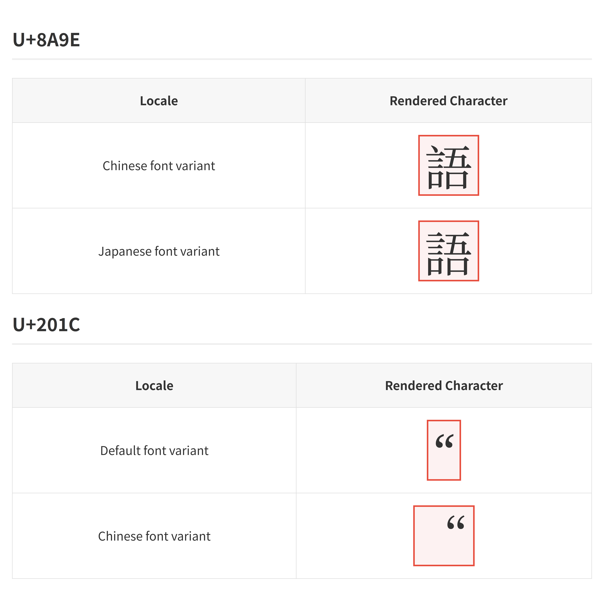

# Traps to Developers

<!-- truncate -->

A summarization of some traps to developers. There traps are unintuitive things that are easily misunderstood and cause bugs.

This article is mainly summarization. The main purpose is "know this trap exists". This article focuses on technical traps.

## Summarization of traps

### HTML and CSS

- `min-width` is `auto` by default. Inside flexbox or grid, `min-width: auto` often makes min width determined by content. It overrides effects of `flex-shrink`, `width: 0` and `max-width: 100%`, etc. It's recommended to set `min-width: 0`. Same for `min-height`. [See also](https://developer.mozilla.org/en-US/docs/Web/CSS/min-width)
- Horizontal and vertical are different in CSS:
  - Normally `width: auto` tries fill available space in parent. But `height: auto` normally tries to just expand to fit content.
  - For inline elements, inline-block elements and float elements, `width: auto` does not try to expand.
  - `margin: 0 auto` centers horizontally. But `margin: auto 0` normally become `margin: 0 0` which does not center vertically. But in a flexbox with `flex-direction: column`, `margin: auto 0` can center vertically. [^css_expand]
  - Percentage `margin-top` `margin-bottom` `padding-top` `padding-bottom` use parent width as base value, not height.
  - Margin collapse happens vertically but not horizontally.
  - Some of the above behave differently when layout axis flips (e.g. `writing-mode: vertical-rl`). [See also](https://drafts.csswg.org/css-writing-modes-4/#abstract-box)
- Margin collapse.
  - Two vertically touching siblings can overlap vertial margin. Child vertical margin can "leak" outside of parent.
  - Margin collapse doesn't happen when `border` or `padding` spcified. Don't try to debug margin collapse by coloring border. Debug it using browser's devtools.
  - Margin collapse can be fixed by block formatting context (BFC). `display: flow-root` creates a BFC. (There are other ways to create BFC, like `overflow: hidden`, `overflow: auto`, `overflow: scroll`, `display:table`, but with side effects)
- If a parent only contains floating children, the parent's height will collapse to 0, and the floating children will leak. Can be fixed by BFC.
- If the parent's `display` is `flex` or `grid`, then the child's `float` has no effect
- [Stacking context](https://developer.mozilla.org/en-US/docs/Web/CSS/CSS_positioned_layout/Stacking_context):
  
  In these cases, it will start a new stacking context:
  
  - The attributes that give special rendering effects (`transform`, `filter`, `perspective`, `mask`, `opacity` etc.), and `will-change` of them
  - `position: fixed` or `position: sticky`
  - Specifies `z-index` and `position` is `absolute` or `relative`
  - Specifies `z-index` and the element is inside flexbox or grid
  - `isolation: isolate`
  - ...
  
   Stacking context can cause these behaviors: [^stacking_context_impl]
  
  - `z-index` doesn't work across stacking contexts. It only works within a stacking context.
  - Stacking context can affect the coordinate of `position: absolute` or `fixed`. (The underlying logic is complex, [see also](https://developer.mozilla.org/en-US/docs/Web/CSS/position))
  - `position: sticky` doesn't work across stacking contexts.
  - `overflow: visible` will still be clipped by stacking context.
  - `background-attachment: fixed` will position based on stacking context.
  - `opacity` is "relative" to parent. Child `opacity:1` in transparent parent won't make it more opaque than parent.

- On mobile browsers, the top address bar and bottom navigation bar can go out of screen when scrolling down. `100vh` correspond to the height when the two bars gets out of screen, which is larger than the height when the two bars are on screen. The modern solution is `100dvh`.
- About scrollbar:
  - In Windows, scrollbar takes space. But in macOS it doesn't take space by default.
  - The space occupied by vertical scrollbar is included in width. Scrollbar "steals" space from inner contents. [^css_box_model_scrollbar]
  - A top-level element with `width: 100vw` overflows horizontally if viewport has scrollbar that takes space. `width: 100%` can workaround that issue.
  - About scrollbar styling: the [standard scroll bar styling](https://developer.mozilla.org/en-US/docs/Web/CSS/Guides/Scrollbars_styling) supports color and width but doesn't support many other features (e.g. round corner scrollbar). The [`-webkit-scrollbar`](https://developer.mozilla.org/en-US/docs/Web/CSS/Reference/Selectors/::-webkit-scrollbar) non-standard pseudo-elements supports these features but FireFox doesn't support them. In modern browser, if standard scrollbar styling is used, then the  `-webkit-scrollbar` has no effect.
- `position: absolute` is not based on its parent. It's based on its nearest positioned ancestor (the nearest ancestor that has `position` be `relative`, `absolute` or creates stacking context).
- [`backdrop-filter: blur` does not consider ambient things](https://www.joshwcomeau.com/css/backdrop-filter/#the-issue).
- If the parent's width/height is not pre-determined, then percent width/height (e.g. `width: 50%`, `height: 100%`) doesn't work. [^percent_width_height]
- CSS transition doesn't work between `height: 0` and `height: auto`. Solutions:
  - Use JS to set CSS height to `scrollHeight`. 
  - Put it in grid and transition from `grid-template-rows: 0fr` to `1fr`. 
  - Use `calc-size()`, [see also](https://developer.chrome.com/docs/css-ui/animate-to-height-auto) [^calc_size]. [^animate_height_auto]
- In JS, reading size-related value (e.g. `offsetHeight`) cause browser to re-compute layout which may hurt performance. It can also affect transition animation [^reflow_animation].
- `display: inline` ignores `width` `height` and `margin-top` `margin-bottom`
- Whitespace collapse. [See also](https://blog.dwac.dev/posts/html-whitespace/)
  - By default, newlines in html are treated as spaces. Multiple spaces together collapse into one. 
  - `<pre>` doesn't collapse whitespace. But HTML parser removes a line break in the beginning and end of `<pre>` content.
  - Often the spaces in the beginning and end of content are ignored, but this doesn't happen in `<a>`.
  - Any space or line break between two `display: inline-block` elements will be rendered as spacing. This doesn't happen in flexbox or grid.
- `text-align` aligns text and inline things, but doesn't align block elements (e.g. normal divs).
- `text-align: center` will not center when content is too wide. It will align left in that case. [See also](https://stackoverflow.com/questions/6618648/can-overflow-text-be-centered)
- By default `width` and `height` doesn't include padding and border. `width: 100%` with `padding: 10px` can still overflow the parent. `box-sizing: border-box` make the width/height include border and padding. Note that `width` includes scrollbar regardless of `box-sizing`.
- About override:
  - CSS import order matters. The latter-imported ones can override the earlier ones.
  - JS-set CSS can override attributes in `.css` files (when both are not `!important`). `!important` attribute in `.css` files can override non `!important` JS-set CSS.
  - Browser puts some user agent styles to `<input>` and `<button>` (e.g. `color`, `font-family`). So `<input>` and `<button>` will not inherit some styles from parent.
  - See [CSS cascade](https://developer.mozilla.org/en-US/docs/Web/CSS/CSS_cascade/Cascade) for complete details.
- About hiding:
  - Parent `visibility: hidden` doesn't enforce all childs to be hidden. If child has `visibility: visible` it will still be shown. This don't apply to `opacity: 0` or `display: none`.
  - An element with `opacity: 0` can still be interacted (e.g. click button). This doesn't apply to `display: none` or `visibility: hidden`.
  - `display: none` removes element from layout. This doesn't apply to `visibility: hidden` or `opacity: 0`.
- [Cumulative Layout Shift](https://web.dev/articles/cls). 
  - It's recommended to specify `width` and `height` attribute in `` to avoid layout shift due to image loading delay.
- File download request is not shown in Chrome dev tool, because it only shows networking in current tab, but file download is treated as in another tab. To inspect file download request, use `chrome://net-export/`.
- JS-in-HTML may interfere with HTML parsing. For example `')</script>` makes browser treat the first `</script>` as ending tag. [See also](https://sirre.al/2025/08/06/safe-json-in-script-tags-how-not-to-break-a-site/)
- Virtual scrolling breaks Ctrl-F (Cmd-F) search.

[^css_box_model_scrollbar]: The CSS box model includes content box, padding, border and margin, but doesn't mention scrollbar. Scrollbar is visually between border and padding, but scrollbar occupies space from content box ("steal" space across padding). In Chrome devtools, the padding highlight area includes scrollbar, but scrollbar is not in padding. One may ask "if width includes scrollbar, then why `width: 100vw` cause horizontal overflow"? Because `width: 100vw` applies to an element inside viewport, not viewport itself. Viewport width includes viewport's scrollbar.

[^css_expand]: CSS only try to expand if the available space is finite. In may cases it has infinite vertical space by default.

[^stacking_context_impl]: Browser will draw the stacking context into a seprate "image", then draw the image to web page (or parent stacking context). The weirdness of stacking context are caused by this separate drawing mechanism.

[^percent_width_height]: It avoids circular dependency where parent height is determined by content height, but content height is determined by parent height.

[^calc_size]: In Nov 2025 `calc-size` is not yet supported by FireFox and Safari. 

[^animate_height_auto]: Also, there is another solution for transition `height: auto`: transitioning `max-height` from 0 to a large value, but I don't recommend it as it will mess up animation timing.

[^reflow_animation]: When adding a new element, initial transition animation won't work by default. But if you read its layout-related value (e.g. `offsetHeight`) between changing animated attribute, it will trigger a reflow and make initial transition work.

### Unicode and text

- Two concepts: code point, grapheme cluster:
  - Grapheme cluster is the "unit of character" in GUI. An emoji is a grapheme cluster, but it may consist of many code points.
  - In UTF-8, a code point can be 1, 2, 3 or 4 bytes. The byte number does not necessarily represent code point number.
  - In UTF-16, each UTF-16 code unit is 2 bytes. A code point can be 1 code unit (2 bytes) or 2 code units (4 bytes, surrogate pair [^scalar_value]).
  - JSON string `\u` escape uses surrogate pair. `"\uD83D\uDE00"` in JSON has only one code point.
- Strings in different languages:
  - Rust use UTF-8 for in-memory string. `s.len()` gives byte count. Rust does not allow directly indexing on a `str` (but allows subslicing). `s.chars().count()` gives code point count. Rust is strict in UTF-8 code point validity.
  - Java, C# and JS's string encoding is similar to UTF-16 [^string_encoding]. String length is code unit count. Indexing works on code units. Each code unit is 2 bytes. One code point can be 1 code unit or 2 code units.
  - In Python, `len(s)` gives code point count. Indexing gives a string that contains one code point.
  - C++ `std::string` and Golang string have no constraint of encoding and is similar to byte array.
  - No language mentioned above do string length and indexing based on grapheme cluster.
  - In SQL, `varchar(100)` limits 100 code points (not bytes).
- When reading text data in chunk, don't convert individual chunks to string then concat, as it may cut inside a UTF-8 code point.
- Some Windows text files have byte order mark (BOM) at the beginning. It's U+FEFF zero-width no-break space (it's normally invisible). FE FF means file is in big-endian UTF-16. EF BB BF means UTF-8. Some non-Windows software doesn't handle BOM.
- When converting binary data to string, often the invalid places are replaced by � (U+FFFD).
  - Directly putting binary data to string loses information, except in C++ and Golang. Even in C++ and Golang it will still lose information after serializing to JSON (use Base64 for binary data in JSON).
- [Confusable characters](https://github.com/unicode-org/icu/blob/main/icu4c/source/data/unidata/confusables.txt). Some common examples:
  - `"` and `“` `”`. Microsoft Word and Google Doc auto-replace former to latter.
  - – (en dash) and - (minus-hyphen). Google Doc auto-replace -- to en dash.
  - ......
- Normalization. For example é can be U+00E9 (one code point) or U+0065 U+0301 (two code points). String comparision works on binary data and don't consider normalization.
- [Zero-width characters](https://ptiglobal.com/the-beauty-of-unicode-zero-width-characters/), [Invisible characters](https://invisible-characters.com/)
  - For example, there are many spaces: Normal space U+0020, no-break space U+00A0, em space U+2003, ......
- Line break. Windows often use CRLF `\r\n` for line break. Linux and macOS often use LF `\n` for line break.
- Locale ([elaborated below](#locale)).

[^scalar_value]: The U+XXXX notation (XXXX is a hex value) represents a code point. There is some ambiguity of "code point" in UTF-16. In UTF-16, for a code point formed by two code units (4 bytes), its two individual code units are also code points, but these two are surrogate code points. It can be seen as both one code point and two code points, which is confusing. The code points from U+D800 to U+DFFF are called surrogate code points. The code points that are not surrogate are called scalar values. For that code point formed by two code units (4 bytes), it's one scalar value, it's also two surrogate code points. From string semantic value, it should be seen as one code point (scalar value). This ambiguity doesn't exist in UTF-8. In this article, code point refers to scalar value.

[^string_encoding]: Strictly speaking, they use [WTF-16](https://simonsapin.github.io/wtf-8/#ill-formed-utf-16) encoding, which is similar to UTF-16 but allows invalid surrogate pairs. That encoding is for API and is not necessarily the actual in-memory representation. For example, Java has an optimization that use Latin-1 encoding (1 byte per code point) for in-memory string if possible.

### Floating point

- NaN. Floating point NaN is not equal to any number including itself. NaN == NaN is always false (even if the bits are same). NaN != NaN is always true. Computing on NaN usually gives NaN (it can "contaminate" computation). NaN corresponds to many different binary values.
- There are +Inf and -Inf. They are not NaN.
- There is a negative zero -0.0 which is different to normal zero. The negative zero equals zero when using floating point comparision. Normal zero is treated as "positive zero". The two zeros behave differently in some computations (e.g. `1.0 / 0.0 == Inf`, `1.0 / -0.0 == -Inf`, `log(0.0) == -Inf`, `log(-0.0)` is NaN)
- JSON standard doesn't allow NaN or Inf:
  - JS `JSON.stringify` turns NaN and Inf to null.
  - Python `json.dumps(...)` will directly write `NaN`, `Infinity` into result, which is not compliant to JSON standard. `json.dumps(..., allow_nan=False)` will raise `ValueError` if has NaN or Inf.
  - Golang `json.Marshal` will give error if has NaN or Inf.
- Directly compare equality for floating point may fail due to precision loss. Compare equality by things like `abs(a - b) < 0.00001`
- JS use floating point for all numbers. The max "safe" integer is $2^{53}-1$. Outside of the "safe" range, most integers cannot be accurately represented. For large integer it's recommended to use `BigInt`.
  
  If a JSON contains an integer larger than that, and JS deserializes it using `JSON.parse`, the number in result will be likely inaccurate. The workaround is to use other ways of deserializing JSON or use string for large integer. [^safe_int_timestamp]
  
- Floating-point is 2-based. It cannot accurately represent most decimals. 0.1+0.2 gets 0.30000000000000004 . [^excel_money].
- Associativity law and distribution law doesn't strictly hold because of precision loss. See also: [Defeating Nondeterminism in LLM Inference](https://thinkingmachines.ai/blog/defeating-nondeterminism-in-llm-inference/), [Taming Floating-Point Sums](https://orlp.net/blog/taming-float-sums/)
- Division is much slower than multiplication (unless using approximation). Dividing many numbers with one number can be optimized by firstly computing reciprocal then multiply by reciprocal.
- These things can make different hardware have different floating point computation results:
  - Hardware FMA (fused multiply-add) support. `fma(a, b, c) = a * b + c` (in some places `a + b * c`). Most modern hardware make intermediary result in FMA have higher precision. Some old hardware or embedded processors don't do that and treat it as normal multiply and add.
  - Floating point has a [Subnormal range](https://en.wikipedia.org/wiki/Subnormal_number) to make very-close-to-zero numbers more accurate. Most mondern hardware can handle them, but some old hardware and embedded processors treat subnormals as zero.
  - Rounding mode. The standard allows different rounding modes like round-to-nearest-ties-to-even (RNTE) or round-toward-zero (RTZ). 
    - In X86 and ARM, rounding mode is thread-local mutable state can be set by special instructions. It's not recommended to touch the rounding mode as it can affect other code.
    - In GPU, there is no mutable state for rounding mode. Rasterization often use RNTE rounding mode. In CUDA different rounding modes are associated by different instructions.
  - Math functions (e.g. sin, log) may be less accurate in some embedded hardware or old hardware.
  - X86 has legacy FPU which has 80-bit floating point registers and per-core rounding mode state. It's recommended to not use them.
  - ......
- Floating point precision is low for values with very large absolute value or values very close to zero. It's recommended to avoid temporary result to have very large absolute value or be very close-to-zero.
- Iteration can cause error accumulation. For example, if something need to rotate 1 degree every frame, don't cache the matrix and multiply 1-degree rotation matrix every frame. Compute angle based on time then re-calculate rotation matrix from angle.

[^safe_int_timestamp]: Putting millisecond timestamp integer in JSON fine, as millisecond timestamp exceeds limit in year 287396. But nanosecond timestamp suffers from that issue.

[^excel_money]: It's recommended to NOT use floating point to store money value. Note that Microsoft Excel uses floating point to represent number, and many financial data are processed in Excel. Excel has rounding so that 0.30000000000000004 is displayed as 0.3 . Only use Excel for finance if you don't require high precision. Doing rough financial analyzing in Excel is fine.

### Time

- [Leap second](https://en.wikipedia.org/wiki/Leap_second). Unix timestamp is "transparent" to leap second. Converting between Unix timestamp and UTC time assumes leap second doesn't exist. It's used with leap smear: make the time "stretch" or "squeeze" near a leap second to "hide" existence of leap second.
- Time zone. UTC and Unix timestamp is globally uniform. But human-readable time is time-zone-dependent. It's recommended to store timestamp in database and convert to human-readable time in UI, instead of storing human-readable time in database.
- Daylight Saving Time (DST): In some regions people adjust clock forward by one hour in warm seasons. When DST ends, 1:00 AM to 2:00 AM [^dst_end] will run twice, so converting human-readable time in this range to timestamp is ambiguous. [Python has `fold` to address this ambiguity](https://peps.python.org/pep-0495/).
- NTP sync may cause time to "jump backward" or "jump forward".
- It's recommended to configure the server's time zone as UTC. Different nodes having different time zones will cause trouble in distributed system. After changing system time zone, the database may need to be reconfigured or restarted.
- There are two clocks: hardware clock and system clock. The hardware clock itself doesn't care about time zone. Linux treats it as UTC by default. Windows treats it as local time by default.
- Verification of certificate uses time. If time is inaccurate, SSL/TLS may not work.
- The "timestamp" may be in seconds, milliseconds or nanoseconds.
- About `M` and `m` in date format: in Java `SimpleDateFormat`, `M` is month, `m` is minute. But in Python `datetime`, `m` is month, `M` is minute. 

[^dst_end]: In some regions it's 2:00 AM to 3:00 AM.

### Java

- `==` compares object reference. Should use `.equals` to compare object content. 
- Forget to override `equals` and `hashcode`. It will use object identity equality by default in map key and set.
- Mutate the content of map key object (or set element object) makes the container malfunciton (unless the mutation doesn't affect `equals` and `hashcode`).
- A method that returns `List<T>` may sometimes return mutable `ArrayList`, but sometimes return `Collections.emptyList()` which cannot be mutated.
- A method that returns `Optional<T>` may return `null`.
- Null is ambiguous. If `get()` on a map returns null, it may be either value is missing or value exists but it's null (can distinguish by `containsKey`). Null field and missing field in JSON are all mapped to null in Java object. [See also](https://committing-crimes.com/articles/2025-09-16-null-and-absence/). Similarily, privimtive value 0 can also be ambiguous.
- Implicitly converting `Integer` to `int` can cause `NullPointerException`, same for `Float`, `Long`, etc.
- Return in `finally` block swallows any exception thrown in the `try` or `catch` block. The method will return the value from `finally`.
- Interrupt. Some libraries ignore interrupt. If a thread is interrupted and then load a class, and class initialization has IO, then class may fail to load.
- Thread pool does not log exception of tasks sent by `.submit()` by default. You can only get exception from the future returned by `.submit()`. Don't discard the future. And `scheduleAtFixedRate` task silently stop if exception is thrown.
- Literal number starting with 0 will be treated as octal number. (`0123` is 83)
- When debugging, debugger will call `.toString()` to local variables. Some class' `.toString()` has side effect, which cause the code to run differently under debugger. This can be disabled in IDE.
- Before [Java24](https://openjdk.org/jeps/491) virtual thread can be "pinned" when blocking on `synchronized` lock, which may cause deadlock. It's recommended to upgrade to Java 24 if you use virtual thread.
- It's not recommended to override `finalize()`. `finalize()` running too slow blocks GC and cause memory leak. Exceptions out of `finalize()` are not logged. A dead object can resurrect itself in `finalize()`, and if a resurrected object become dead again, `finalize()` won't be called again. Use [`Cleaner`](https://docs.oracle.com/javase/9/docs/api/java/lang/ref/Cleaner.html) for GC-directed disposal.

### Golang

- `append()` reuses memory region if capacity allows. Appending to a subslice can overwrite parent if they share memory region.
- `defer` executes when the function returns, not when the lexical scope exits.
- `defer` capture mutable variable.
- About `nil`:
  - There are nil slice and empty slice (the two are different). But there is no nil string, only empty string. The nil map can be read like an empty map, but nil map cannot be modified.
  - Interface `nil` weird behavior. Interface pointer is a fat pointer containing type info and data pointer. If the data pointer is null but type info is not null, then it will not equal `nil`.
  - Receiving from or sending to `nil` channel blocks forever.
- Before Go 1.22, [loop variable capture issue](https://go.dev/blog/loopvar-preview).
- Different kinds of timeout. [The complete guide to Go net/http timeouts](https://blog.cloudflare.com/the-complete-guide-to-golang-net-http-timeouts/)
- Having interior pointer to an object keeps the whole object alive. This may cause memory leak.
- Forgetting to cancel context cause `<-ctx.Done()` to deadlock.
- For `WaitGroup`, `Add` must be called before `Wait`. Don't `Add` in a new goroutine (unless with proper synchronization).
- `sync.Mutex` should be passed by pointer not value. Same applies to `sync.WaitGroup` `sync.Cond` `net.Conn` etc. But slices, maps and channels can be passed by value.

### C/C++

- Don't use `=` to compare equality.
- Storing a pointer to an element in `std::vector` and then grow the vector, vector may re-allocate content, making element pointer invalid. Similar to other containers.
- `std::string` created from literal string may be temporary. Taking `c_str()` from a temporary string is wrong.
- [Iterator invalidation](https://learnmoderncpp.com/2024/09/04/understanding-iterator-invalidation/). Modifying a container when looping on it.
- `std::views::filter` malfunctions when element is mutated that predicate result changes in multi-pass iteration. [See also](https://github.com/CppCon/CppCon2024/blob/main/Presentations/Taming_the_Cpp_Filter_View.pdf). `std::views::as_rvalue` with `std::ranges::to` mutates the element which can trigger that issue. [See also](https://github.com/philsquared/cpponsea2025-slides/blob/main/Presentations/Faster_Safer_Better_Ranges.pdf)
- `std::remove` doesn't remove but just rearrange elements. `erase` actually removes.
- Literal number starting with 0 will be treated as octal number. (`0123` is 83)
- Destructing a deep tree structure can stack overflow. Solution is to replace recursion with loop in destructor.
- `std::shared_ptr` itself is not atomic (although its reference count is atomic). Mutating a `shared_ptr` itself is not thread-safe. `std::atomic<std::shared_ptr<...>>` is atomic.
- For `std::map` and `std::unordered_map`, `map[key]` alone will mutate the map if the corresponding entry doesn't exist. [See also](https://en.cppreference.com/w/cpp/container/map/operator_at.html)
- Undefined behaviors. The compiler optimization aim to keep defined behavior the same, but can freely change undefined behavior. Relying on undefined behavior can make program break under optimization. [See also](https://russellw.github.io/undefined-behavior)
  - Accessing uninitialized memory is undefined behavior. Converting a `char*` to struct pointer can be seen as accessing uninitialized memory, because the object lifetime hasn't started. It's recommended to put the struct elsewhere and use `memcpy` to initialize it.
  - Accessing invalid memory (e.g. null pointer) is undefined behavior.
  - Integer overflow/underflow is undefined behavior. Note that unsigned integer can underflow below 0.
  - Aliasing.
    - Aliasing means multiple pointers point to the same place in memory.
    - Strict aliasing rule: If there are two pointers with type `A*` and `B*`, then compiler assumes two pointer can never equal. If they equal, using it to access memory undefined behavior. Except in two cases: 1. `A` and `B` has subtyping relation 2. converting pointer to byte pointer (`char*`, `unsigned char*` or `std::byte*`) (the reverse does not apply). [^pointer_type_hold_integer]
    - Pointer provenance. Two pointers from two different provenances are treated as never alias. If their address equals, it's undefined behavior. [See also](https://www.ralfj.de/blog/2020/12/14/provenance.html)
  - In C++ `const` can mean both read-only and immutable. Converting `const T*` to `T*` only works if that `const` means read-only. If pointed object is immutable (declared as `const T`) then mutating it by pointer cast is undefined behavior.
  - If `bool`'s binary value is neither 0 or 1, using it is undefined behavior. Similarily if an enum's binary value is not valid, using it is undefined behavior.
- Alignment.
  - For example, 64-bit integer's address need to be disivible by 8. In ARM, accessing memory in unaligned way can cause crash.
  - Unaligned memory access is undefined behavior.
  - Directly treating a part of byte buffer as a struct is undefined behavior. Not only due to alignment, but also due to object lifetime not yet started [^start_object_lifetime].
  - Alignment can cause padding in struct that waste space.
  - Some SIMD instructions only work with aligned data. For example, AVX instructions usually require 32-byte alignment.
- Global variable initialization runs before `main`. [Static Initialization Order Fiasco](https://en.cppreference.com/w/cpp/language/siof.html).
- Start from C++ 11, destructors have `noexcept` by default. If exception is thrown out of a `noexcept` function, whole process will crash.
- In signal handler, don't do any IO or locking, don't `printf` or `malloc`

[^start_object_lifetime]: Directly treating existing binary data as struct is undefined behavior, because the object lifetime hasn't started, so it's treated as using uninitialized memory, even when it's aligned. One solution is to put the struct on stack then use `memcpy` to initialize it.

[^pointer_type_hold_integer]: Using pointer type to hold integer is fine as long as you don't use it to access memory. But it's not recommended to do that.

### Python

- Default argument is a stored value that will not be re-created on every call.
- Be careful about indentation when copying and pasting Python code.
- In conditons, these things are "falsy": 0, `None`, empty string, empty container. Be careful if 0 or empty container represents valid value. Also it can be controlled by implementing `__bool__` method.
- GIL (global interpreter lock) releases during IO operations (e.g. write file). Two concurrent threads reading and writing same file may cause data race in disk.

### SQL Databases

- Null is special:
  - `x = null` doesn't work. `x is null` works. Null does not equal itself, similar to NaN.
  - Unique index allows duplicating null (except in Microsoft SQL server). 
  - `select distinct` treat nulls as the same in some databases. 
  - `count(x)` and `count(distinct x)` ignore rows where `x` is null.
- Date implicit conversion can be timezone-dependent.
- Complex join with disctinct may be slower than nested query. [See also](https://www.red-gate.com/simple-talk/databases/sql-server/t-sql-programming-sql-server/dont-use-distinct-as-a-join-fixer/)
- In MySQL (InnoDB), if string field doesn't have `character set utf8mb4` then it will error if you try to insert a text containing 4-byte UTF-8 code point.
- MySQL (InnoDB) default to case-insensitive.
- MySQL (InnoDB) can do implicit conversion by default. `select '123abc' + 1;` gives 124.
- MySQL (InnoDB) gap lock may cause deadlock.
- In MySQL (InnoDB) you can select a field and group by another field. It gives nondeterministic result.
- Multi-column index `(x, y)` cannot be used when only filtering on `y`. (except when there are very few different `x` values, database can do a skip scan that uses the index.)
- In SQLite the field type doesn't matter unless the table is `strict`.
- SQLite by default does not do vacuum. The file size only increases and won't shrink. To make it shrink you need to either manually `vacuum;` or enable `auto_vacuum`.
- Foreign key may cause implicit locking, which may cause deadlock.
- Foreign key may interfere when loading database backup.
- Locking may break repeatable read isolation (it's database-specific).
- Distributed SQL database may doesn't support locking or have weird locking behaviors. It's database-specific.
- If the backend has N+1 query issue, the slowness may won't be shown in slow query log, because the backend does many small queries serially and each individual query is fast.
- Long-running transaction can cause problems (e.g. locking). It's recommended to make all transactions finish quickly.
- If a string column is used in index or primary key, it will have length limit. MySQL applies the limitation when changing table schema. PostgreSQL applies the limitation by erroring when inserting or updating data.
- PostgreSQL `notify` involves global locking if used within transaction, [see also](https://www.recall.ai/blog/postgres-listen-notify-does-not-scale). Also, `listen` malfunctions when used with connection pooling. It also has message size limit.
- In PostgreSQL, incrementally updating a large `jsonb` is slow, as it internally recreates whole `jsonb` data. It's recommended to separate it if you do incremental update.
- Storing UUID as string in database wasts performance. It's recommended to use database's built-in UUID type.
  - Also, in some places UUID text doesn't have hyphen (e.g. `6cdd4753e57047259dd7024cb27b4c4f` instead of `6cdd4753-e570-4725-9dd7-024cb27b4c4f`). Need to consider it when parsing and comparing UUID.
- Whole-table locks that can make the service temporarily unusable:
  - In MySQL (InnoDB) 8.0+, adding unique index or foreign key is mostly concurrent (only briefly lock) and won't block operations. But in older versions it may do whole-table lock.
  - `mysqldump` used without `--single-transaction` cause whole-table read lock.
  - In PostgreSQL, `create unique index` or `alter table ... add foreign key` cause whole-table read-lock. To avoid that, use `create unique index concurrently` to add unique index. For foreign key, use `alter table ... add foreign key ... not valid;` then `alter table ... validate constraint ...`.
  - In MySQL (InnoDB) an `update` or `delete` that cannot use index may lock the whole table, not just targeted rows.
- Querying which range a point is in by `select ... from ranges where p >= start and p <= end` is inefficient, even when having composite index of `(start, end)`. [^about_ranges]

[^about_ranges]: It's recommended to use spatial index in MySQL and GiST in PostgreSQL for ranges. For non-overlappable ranges, it's possible to efficiently query using just B-tree index: `select * from (select ... from ranges where start <= p order by start desc limit 1) where end >= p` (only require index of `start` column). 

### Concurrency and Parallelism

- `volatile`:
  - `volatile` itself cannot replace locks. `volatile` itself doesn't provide atomicity.
  - You don't need `volatile` for data protected by lock. Locking can already establish memory order and prevent some wrong optimizations.
  - `volatile` can avoid wrong optimization related to reordering and merging memory reads/writes.
  - In C/C++, `volatile` doesn't establish memory order. But in Java and C# `volatile` establishes memory order. [^volatile_memory_order]
- Time-of-check to time-of-use ([TOCTOU](https://en.wikipedia.org/wiki/Time-of-check_to_time-of-use)).
- Data race (it's a large topic, not elaborate here).
- [Deadlock and lock-free deadlock](./About%20circular%20reference).
- [MySQL (InnoDB) gap lock may deadlock](./About%20circular%20reference#mysql-gap-lock-deadlock).
- PostgreSQL write skew. In repeatable read level, `select ... where ... for update` cannot prevent another transaction from inserting new rows that satisfy the query condition. It cannot enforce uniqueness. [^pg_write_skew]
- Atomic reference counting (`Arc`, `shared_ptr`) can be slow when many threads frequently change the same counter. [See also](https://pkolaczk.github.io/server-slower-than-a-laptop/)
- About read-write lock: trying to write lock when holding read lock will deadlock. The correct way is to firstly release the read lock, then acquire write lock, and the conditions that were checked in read lock need to be re-checked.
  - SQL allows a transaction that hold read lock to upgrade to write lock. This mechanism is prone to deadlock.
- Reentrant lock:
  - Reentrant means one thread can lock twice (and unlock twice) without deadlocking. Java `synchronized` and C# `lock` are reentrant.
  - Non-reentrant means if one thread lock twice, it will deadlock. Rust `Mutex` and Golang `sync.Mutex` are not reentrant.
- [False sharing](https://en.wikipedia.org/wiki/False_sharing) of the same cache line costs performance.
- Try to cancel some async operation, but the callback still runs.

[^pg_write_skew]: It can be solved in serializable level. Without serializable level, it can also be solved by special constraints. For conditional uniqueness constraint, use partial unique index. For range uniqueness constraint, use range type and exclude constraint. For uniqueness across two tables, insert redundant data into another table with unique constraint. (Related: in MySQL repeatable read level, `select ... for update` will do gap lock on index which can prevent write skew, but gap lock may cause deadlock.)

[^volatile_memory_order]: In Java, `volatile` accesses have sequentially-consistent ordering (JVM will use memory barrier instruction if needed). In C#, writes to `volatile` have release ordering, reads to `volatile` have acquire ordering (CLR will use memory barrier instruction if needed). Note that "release" and "acquire" in memory order is different to locking (but related to locking).

### Common in many languages

- Forget to check for null/None/nil.
- When for looping on a container, inserting to or removing from it (iterator invalidation).
- Unintended sharing of mutable data. For example in Python `[[0] * 10] * 10` does not create a proper 2D array.
- For non-negative integer `(low + high) / 2` may overflow. A safer way is `low + (high - low) / 2`.
- Short circuit. `a() || b()` will not run `b()` if `a()` returns true. `a() && b()` will not run `b()` when `a()` returns false.
- Operator precedence. `a || b && c` is `a || (b && c)`.
- Assertion should not be used for validating external data. Validating external data should use proper error handling. Assertion should check internal invariants.
- Confusing default value with missing value. For example, if the balence field is primitive integer, 0 can represent both "balance value not initialized" or "balance is really 0".
- When using profiler: the profiler may by default only include CPU time which excludes waiting time. If your app spends 90% time waiting (e.g. wait on database), the flamegraph may not include that 90% which is misleading.
- When getting files in a folder, the order is not deterministic (may depend on inode order). It may behave differently on different machines even with same files. It's recommended to sort by filename then process. 
  - Note that `ls` by default sorts results. Use `ls -f` to see raw file order.
- The order in hash map is also non-deterministic (unless using linked hash map).
- IO buffering. 
  - If you don't flush, it may delay actual write. 
    - A CLI program that don't flush stdout works fine when directly running in terminal, but it delays output when used with pipe `|`.
  - If program is force-killed (e.g. `kill -9`) some of its last log may not be written to log file because it's buffered.
  - In Linux, if `write()` and `close()` both don't return error code, the write may still fail, due to IO buffering. [See also](https://man7.org/linux/man-pages/man2/close.2.html)

### Transitive dependency conflict

Indirectly use different versions of the same package (diamond dependency issue).

- In Java, maven will only pick one version. If there is incompatibility, may result in errors like `NoSuchMethodError` at runtime.
  - Shading can make two versions of the same package co-exist by renaming.
- In JS, node.js allows two versions of same package to co-exist. Their `let`, `const` global variables and classes will separately co-exist. But other global variables are shared.
  - If two versions of React are used together, it may give "invalid hook call" error.
  - If two versions of a React component library use together, it may have context-related issues.
- Python doesn't allow two versions os same package to co-exist. (Sometimes this creates "dependency hell".)
- In C/C++ it may give "duplicate symbol" error during linking.
- Rust allows two different major versions of same crate to co-exist. It de-duplicates according to semantic versioning ([See also](https://doc.rust-lang.org/cargo/reference/semver.html), [See also](https://effective-rust.com/dep-graph.html)). Their global variables also separately co-exist. [Having two major versions of Tokio causes problem](https://rust-lang.github.io/wg-async/vision/submitted_stories/status_quo/alan_creates_a_hanging_alarm.html#addendum-multiple-tokio-major-versions).

### Linux and bash

- If the current directory is moved, `pwd` still shows the original path. `pwd -P` shows the real path.
- `cmd > file 2>&1` make both stdout and stderr go to file. But `cmd 2>&1 > file` only make stdout go to file but don't redirect stderr.
- There is a capability system for executables, apart from file permission sytem. Use `getcap` to see capability.
- Unset variables. If `DIR` is unset, `rm -rf "$DIR/"` becomes `rm -rf "/"`. Using `set -u` can make bash error when encountering unset variable. 
- Bash has caching between command name and file path of command. If you move one file in `$PATH` then using that command gives ENOENT. Refresh cache using `hash -r`
- Using a variable unquoted will make spaces separate it into different arguments. Also it will make its line breaks treated as space.
- `set -e` can make the script exit immediately when a sub-command fails, but it doesn't work inside function whose result is condition-checked (e.g. the left side of `||`, `&&`, condition of `if`). [See also](https://stratus3d.com/blog/2019/11/29/bash-errexit-inconsistency/)
- `fork()` creates a new process that has only one thread. If another thread holds lock during forking, that lock will never release. `fork()` also has potential of security issues.
- File name can contain `\n` `\r` `'` `"`. File name can be invalid UTF-8.
- In Linux file names are case-sensitive, different to Windows and macOS.
- glibc compatibility issue. A program that's build in a new Linux distribution dynamically links with a new version of glibc, then it may be incompatible with old versions of glibc in old systems. Can be fixed by static linking glibc or using containers.

### Backend-related

- K8s `livenessProbe` used with debugger. Breakpoint debugger usually block the whole application, making it unable to respond health check request, so it can be killed by K8s `livenessProbe`.
- Don't use `:latest` image. They can change at any time.
- In Redis, getting keys by a prefix `KEYS prefix-*` is a slow operation that will traverse all keys. Use Redis hash map for that use case.
- Kafka's message size limit is 1MB by default.
- In Kafka, across partitions, consume order may be different to produce order. If key is null then message's partition is not deterministic.
- In Kafka, if a consumer processes too slow (no acknowledge within `max.poll.interval.ms`, default 5 min), the consumer will be treated as failed, then a rebalance occurs. That timeout is per-batch. If a batch contains too many messages it may reach that timeout even if individual message processing is not slow. Can fix by reducing batch size `max.poll.records`.

### React

- React compares equality using reference equality, not content equality.
  - The objects and arrays that are newly created in component rendering [^react_rendering] are treated as always-new. Use `useMemo` to fix [^js_string_primitive].
  - The closure functions that are created in component rendering are also always-new. Use `useCallback` to fix.
  - If an always-new thing is put into `useEffect` dependency array, the effect will run on every component function call. See also [Cloudflare indicent 2025 Sept-12](https://blog.cloudflare.com/deep-dive-into-cloudflares-sept-12-dashboard-and-api-outage/). 
  - Don't forget to include dependencies in the dependency array. And the dependencies also need to be memoed.
- About state:
  - State objects themselves should be immutable. Don't directly set fields of state objects. Always recreate whole object.
  - Don't set state directly in component rendering. State can only be set in callbacks.
- `useEffect` without dependency array runs on every component render. But `useEffect` with empty dependency array `[]` runs only on component mounting.
- Forget clean up in `useEffect`.
- Closure trap. Closure can capture a state. If the state changes, the closure still captures the old state. Solutions:
  - Make closure not capture state and access state within `useReducer`. 
  - Put mutable thing in `useRef` (note that changing value in ref don't trigger component re-rendering, you need to change state or prop to trigger re-rendering)
  - Add state to effect dependency array. But if the effect manages `setInterval`, doing this will make timing inaccurate.
- `useEffect` firstly runs in next iteration of event loop, after browser renders the web page. Doing initialization in `useEffect` is not early enough and may cause visual flicker. Use `useLayoutEffect` for early initialization.

[^js_string_primitive]: In JS, `string` is primitive type, not object type. In JS you don't need to worry about two strings with same content but different reference like in Java. However the `String` in JS is object and use refernce equality.

[^react_rendering]: Word "render" has ambiguity. The React component rendering means calling the component function. It doesn't draw contents on web page. It's different to browser rendering, which draws contents on web page.

### Git

- Rebase and squashing rewrite history. If local already-pushed history is rewritten, normal push will give conflicts, need to use force push. If remote history is rewritten, normal pull will give conflicts, need to use `--rebase` pulling.
  - Force pushing with `--force-with-lease` can sometimes avoid overwriting other developers' commits. But if you fetch then don't pull, `--force-with-lease` cannot protect.
- After commiting files, adding these files into `.gitignore` won't automatically exclude them from git. To exclude them, delete them.
  - You can also use `git rm --cached` to exclude them without deleting locally. However, after excluding and pushing, when another coworker pulls, these files will be deleted (not just excluded).
- Reverting a merge doesn't fully cancel the side effect of the merge. If you merge B to A and then revert, merging B to A again has no effect. One solution is to revert the revert of merge. 
  - A cleaner way to cancel a merge, instead of reverting merge, is to 1. backup the branch, 2. hard reset to commit before merge, 3. cherry pick commits after merge, 4. force push.
- In GitHub, if you accidentally commited secret (e.g. API key) and pushed to public, even if you override it using force push, GitHub will still keep that secret public. [See also](https://trufflesecurity.com/blog/guest-post-how-i-scanned-all-of-github-s-oops-commits-for-leaked-secrets), [Example activity tab](https://github.com/SharonBrizinov/test-oops-commit/compare/e6533c7bd729957b2eb31e88065c5158d1317c5e...9eedfa00983b7269a75d76ec5e008565c2eff2ef)
- In GitHub, if there is a private repo A and you forked it as B (also private), then when A becomes public, the private repo B's content is also publicly accessible, even after deleting B. [See also](https://trufflesecurity.com/blog/anyone-can-access-deleted-and-private-repo-data-github).
- GitHub by default allows deleting a release tag, and adding a new tag with same name, pointing to another commit. It's not recommended to do that. It breaks build system caching. It can be disabled in rulesets configuration. For external dependencies, hardcoding release tag may be not enough to prevent supply chain risk.
- `git stash pop` does not drop the stash if there is a conflict.
- In Windows, Git often auto-convert cloned text files to be CRLF line ending. But in WSL many software (e.g. bash) doesn't work with files with CRLF. Using `git clone --config core.autocrlf=false -c core.eol=lf ...` can make git clone as LF.
- macOS auto adds `.DS_Store` files into every folder. It's recommended to add `**/.DS_Store` into `.gitignore`.
- In Windows and macOS, file name is case-insensitive. Renaming file that only change letter case won't be tracked by git (renaming using `git mv` works normally).

### Networking

- Some routers and firewall silently kill idle TCP connections without telling application. Some code (like HTTP client libraries, database clients) keep a pool of TCP connections for reuse, which can be silently invalidated (using these TCP connection will get RST). To solve it, configure system TCP keepalive. [See also](https://tldp.org/HOWTO/html_single/TCP-Keepalive-HOWTO/) [^keepalive]
- The result of `traceroute` is not reliable. [See also](https://gekk.info/articles/traceroute.htm). Sometimes [tcptraceroute](https://linux.die.net/man/1/tcptraceroute) is useful.
- TCP slow start can increase latency. Can be fixed by disabling `tcp_slow_start_after_idle`. [See also](https://ably.com/blog/optimizing-global-message-transit-latency-a-journey-through-tcp-configuration)
- TCP sticky packet. Nagle's algorithm delays packet sending. It will increase latency. Can be fixed by enabling `TCP_NODELAY`. [See also](https://brooker.co.za/blog/2024/05/09/nagle.html) 
- If you put your backend behind Nginx, you need to configure connection reuse, otherwise under high concurrency, connection between nginx and backend may fail, due to not having enough internal ports.
- Nginx `proxy_buffering` delays SSE.
- If the backend behind Nginx initiates closing the TCP connection, Nginx passive health check treat it as backend failure and temporarly stop reverse proxying. [See also](https://nginx.org/en/docs/http/ngx_http_upstream_module.html)
- The HTTP protocol does not explicitly forbit GET and DELETE requests to have body. Some places do use body in GET and DELETE requests. But many libraries and HTTP servers does not support them.
- One IP can host multiple websites, distinguished by domain name. The HTTP header `Host` and SNI in TLS handshake carries domain name, which are important. Some websites cannot be accessed via IP address.
- CORS (cross-origin resource sharing). For requests to another website (origin), the browser will prevent JS from getting response, unless the server's response contains header `Access-Control-Allow-Origin` and it matches client website. This requires configuring the backend. Passing cookie to another website involves more configuration. If your frontend and backend are in the same website then there is no CORS issue.
- [Reverse path filtering](https://en.wikipedia.org/wiki/Reverse-path_forwarding). When routing is asymmetric, packet from A to B use different interface than packets from B to A, then reverse path filtering rejects valid packets.
- In old versions of Linux, if `tcp_tw_recycle` is enabled, it aggressively recycles connection based on TCP timestamp. NAT and load balancer can make TCP timestamp not monotonic, so that feature can drop normal connections.
- When using SSL/TLS in private network unconnected to internet, the client may try to check certificate revocation status from internet, which will timeout.
- Certificate expire. Examples: [Starlink incident](https://www.appviewx.com/blogs/expired-certificate-causes-high-profile-service-outage-proving-certificate-automation-is-critical/), [LinkedIn incident](https://www.appviewx.com/blogs/linkedin-certificate-expiry-fiasco-third-times-a-charm/), [Microsoft Teams incident](https://www.exoprise.com/2020/02/04/teams-outage-expired-certificate/)

[^keepalive]: Note that [HTTP/1.0 Keep-Alive](https://developer.mozilla.org/en-US/docs/Web/HTTP/Reference/Headers/Keep-Alive) is different to TCP keepalive.

### Locale

- The upper case and lower case can be different in other natural languages. In Turkish (tr-TR) lowercase of `I` is `ı` and upper case of `i` is `İ`. The `\w` (word char) in regular expression can be locale-dependent.
- Letter ordering can be different in other natural languages. Regular expression `[a-z]` may malfunction in other locale. 
- PostgreSQL linguistic sorting (collation) depends on glibc by default. Upgrading glibc may cause index corruption due to changing of linguistic order. [See also](https://wiki.postgresql.org/wiki/Locale_data_changes). Related: [Docker Postgres Image issue](https://x.com/gwenshap/status/1990942970682749183)
- Text notation of floating-point number is locale-dependent. `1,234.56` in US correspond to `1.234,56` in Germany.
- CSV normally use `,` as spearator. But in Germany locale separator is `;`.
- [Han unification](https://en.wikipedia.org/wiki/Han_unification). Some characters in different language with slightly different appearance use the same code point. Usually a font will contain variants for different languages that render these characters differently. [HTML code](https://github.com/qouteall/qouteall-blog/blob/main/blog/2025/unicode-unification-example.html) 

### Regular expression

- Regular expression cannot parse the syntax that allows infinite nesting (because regular expression engine use finite state machine. Infinite nesting require infinite states to parse). HTML allows infinite nesting. But it's ok to use regex to parse HTML of a specific website.
- Regular expression behavior can be locale-dependent (depending on which regular expression engine).
- There are many different "dialects" of regular expression. Don't assume a regular expression that works in JS can work in Java.
- A separate regular expression validation can be out-of-sync with actual data format. [Crowdstrike incident](https://www.crowdstrike.com/wp-content/uploads/2024/08/Channel-File-291-Incident-Root-Cause-Analysis-08.06.2024.pdf) was caused by a wrong separate regular expression validation. It's recommended to **avoid separate regular expression validation. Reuse parsing code for validation**. See also: [Parse, don't validate](https://lexi-lambda.github.io/blog/2019/11/05/parse-don-t-validate/)
- Email validation is not easy. [See also](https://stackoverflow.com/questions/201323/how-can-i-validate-an-email-address-using-a-regular-expression)
- Backtracking performance issue. See also: [Cloudflare indicent 2019 July-2](https://blog.cloudflare.com/details-of-the-cloudflare-outage-on-july-2-2019/), [Stack Exchange incident 2016 July-20](https://stackstatus.tumblr.com/post/147710624694/outage-postmortem-july-20-2016)

### Other

- YAML:
  - YAML is space-sensitive, unlike JSON. `key:value` is wrong. `key: value` is correct.
  - YAML doesn't allow using tab for indentation.
  - [Norway country code `NO` become false if unquoted](https://www.bram.us/2022/01/11/yaml-the-norway-problem/).
  - [Git commit hash may become number if unquoted](https://tmendez.dev/posts/rng-git-hash-bug/).
  - Two different extensions of YAML file: `.yml` and `.yaml`. Some places only accept one of them.
  - See also: [The yaml document from hell](https://ruudvanasseldonk.com/2023/01/11/the-yaml-document-from-hell)
- When using Microsoft Excel to open a CSV file, Excel will do a lot of conversions, such as date conversion (e.g. turn `1/2` and `1-2` into `2-Jan`) and Excel won't show you the original string. [The gene SEPT1 was renamed due to this Excel issue](https://en.wikipedia.org/wiki/SEPTIN1). Excel will also make large numbers inaccurate (e.g. turn `12345678901234567890` into `12345678901234500000`) and won't show you the original accurate number, because Excel internally use floating point for number.
- It's recommended to configure billing limit when using cloud services, especially serverless. See also: [ServerlessHorrors](https://serverlesshorrors.com/)
- Big endian and little endian in binary file and net packet.
- Blurring in image may not be enough to remove text information. See [Depix](https://github.com/spipm/Depixelization_poc). Opaque covering can fully remove text information.
- The current working directory can be changed by system call (e.g. `chdir`).
- Windows limits command size to 32767 code units. [See also](https://learn.microsoft.com/en-us/windows/win32/api/processthreadsapi/nf-processthreadsapi-createprocessw)
- In Windows the default stack size of main thread is 1MB, but in Linux and macOS it's often 8MB. It's easier to stack overflow in Windows by default.
- In Windoes environment variable names are case-insensitive.
- Windows limits path length to be 260 code units by default.

