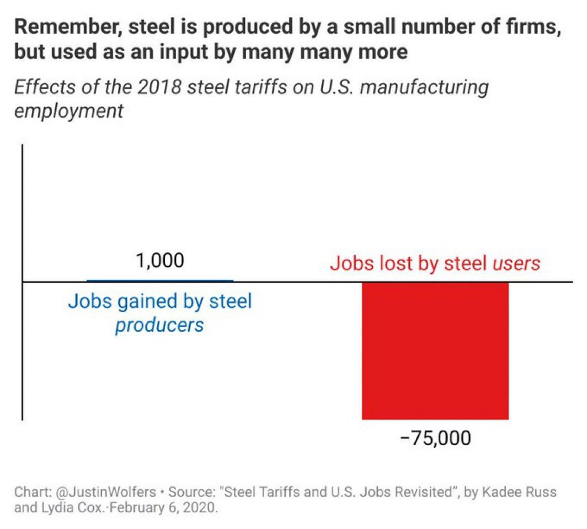

# The Nonlinear World

<!-- truncate -->

## Self-reinforcing feedback loops

Examples:

- Matthew effect. Having money helps earning money and vice versa.
- Network effect. The more people using a platform (like X(Twitter), Facebook) the more people will choose it. Same as flywheel effect.
- Economies of scale. Increase production can amortize research costs, marketing costs and other fixed costs. Financing is also easier on larger scale.
- Virus spread. The more it infects, the quicker it will spread.
- Self-fulfilling prophecy. Prasing can improve performance. Confidence helps collaboration. Distrust can make things worse (e.g. bank run).
- Motivation and result. Good result increases motivation and increase the likelyhood of getting good results, vice versa.
- Attitude can shape behavior. Behavior can shape attitude (One like to persuade self to justify decisions).
- Social interaction. One being angry to another may make two both more angry. Also applys to friendliness and trust/distrust.
- Herd mentality. Some people do something, more people follow.
- Financial market momentum.
- Debt can both accelerate growth and accelerate bankruptcy.
- Information spread (meme spread). The more popular a piece of information is, the more chance it spreads.
- Avalanche.
- Cascade failure in software systems.
- ...

## Concentration

Self-reinforcing feedback loops cause concentration and winner-take-all effect.

Examples of concentration and 80/20 rule (Pareto principle):

- For business:
  - Most profit often come from very few products.
  - For to-business products, most profit often come from few enterprise customers.
  - Most complains often come from very few users. 
  - Most meaningful work is often done by very few employees.
- On internet:
  - The most engagement come from very few posts.
  - The most voice on internet comes from a minority of users. The dominant narrative on internet may not represent most people's views.
- In software:
  - Most users use few common features. 
  - Most issues that user see are caused by few common bugs.
  - Most complexity (and bugs) come from very few features and requirements.
  - Most development efforts are for fixing edge cases. Few development efforts are spent on main case handling.
  - Most time is spent executing few hot code.
  - Most developers use few languages and frameworks.
- The most social connections are related to few core people.
- The most decisions are made by few important information.
- In financial market:
  - The most volatility concentrates on small time intervals.
  - The most profit (and loss) come from few important investments.
  - The most market value and trading volume concentrates on few assets.
- About risk:
  - Most car crashes are caused by few drivers.
  - The most negative impact come from very few severe incidents.
- If some work seems huge, if it follows 80/20, doing just 20% of it can get 80% of effects.
- ...

They exhibit **fat-tailed distributions** instead of normal distributions. 

For them, the mean and variance may be misleading. Median is more representative than mean. The sample variance is likely very underestimated.

## Self-balancing feedback loops and cycles

Examples:
- In nature: predator-prey relation, climate systems.
- In human body: temperature adjustment, blood glucose adjustment, etc.
- In machines: thermostat, etc.
- Planet movements: day-night alternation, seasons, the [Milankovitch cycle](https://en.wikipedia.org/wiki/Milankovitch_cycles).
- Demand-supply relation: high demand increase price. High price facilitates investments in supply (this can take time) and reduces demand (people search for alternatives), thus causing price drop.
- In financial market:
  - Price grow create potential for selling and vice versa. Market momentum cannot continue forever (although it may be much longer than expected).
  - Profit reduces as trading size grows when it drains up liquidity.
  - If one financial trading strategy is effective and many people use it, then that strategy will cease to be effective. If everyone believe that one strategy is ineffective, then it may be actually effective. Market is **anti-inductive**.
  - Low volatility induce higher leverage that potential increase volatility. High volatility provide potential profit for hedging that may lead to reduced volatility.
  - Two uncorrelated assets may be commonly diversified together that may potentially increase their correlation. 
- The debt cycle. Economy growth parallels debt growth. Higher debt impose higher risk and more interest cost. Then debt collapses and inefficient companies bankrupt. The economy becomes more frugal and more efficient. The debt level becomes low again.
- The cycle of money supply. The Federal Reserve keeps trying to balance between controlling inflation and providing enough money (to keep economy healthy).
- The Kondratiev cycle. New technology drives growth and investments. The application of new teconology matures and growth plateaus, creating excess investment, excess debts and inflation. Then recession comes. A new radical innovation drives a new cycle.
- The demographic cycle. Ancient China suffers from [Malthusian trap](https://en.wikipedia.org/wiki/Malthusianism): Population grows, farmland per capita reduces, food supply cannot catch up population. When it's close to threshold, a natural disaster can cause famine (and war), reducing populatoin.
- Economies of scale eventually faces diminishing marginal return. And larger scale makes management harder.
- Over-concentration of wealth and power reduces efficiency and stability of society. The inefficient and unstable societies tend to eventually either collapse or reform (or be colonized). Religions, culture and inter-society connection play a role in controlling inequality.
- Large companies are likely to be inefficient due to bureaucracy.
- The innovator's dillema. Large companies are bad at innovation.
- "Hard times create strong men. Strong men create good times. Good times create weak men. Weak men create hard times." ― G. Michael Hopf
- Boredom with memes. Talking too much about one thing on internet cause boredom, making people move attention. Attention span on internet is short.
- Elo-score-based matching in PvP games. If you lose, you will match with lower-skilled players and be more likely to win, and vice versa.
- Cry wolf syndrome. False warning make people less and less sensitive.

(Side note: The phrase "negative feedback loop" means self-balancing feedback loop, but sometimes is also (mis)used to describe "self-reinforcing feedback loop with negative effect" like financial crisis.)

The force behind a self-balancing feedback loop may drive self-reinforcing feedback loop in the next stage of cycle.

The **"competition"** between self-reinforcing feedback loops and self-balancing feedback loops:

|                             | Self-reinforcing                                                    | Self-balancing                                                                     |
| --------------------------- | ------------------------------------------------------------------- | ---------------------------------------------------------------------------------- |
| Population growth           | Exponential growth                                                  | Limited food supply, living resources and jobs; Higher competition                 |
| Asset price grow            | Confidence spread                                                   | Long force depletes; Short force accumulates                                       |
| Asset price drop            | Panic spread                                                        | Short force depletes; Long force accumulates                                       |
| Debt growth and inflation   | Economy growth; Facilitates investments and debt                    | Cost of excess invstment and debt; Monetary tightening for keeping currency credit |
| Debt collapse and deflation | Cadcade credit collapse during financial crisis; Lose of confidence | Countermeasures for crisis; Fiscal and monetary stimulus                           |
| Monopoly                    | Matthew effect; Economies of scale; Brand recognition               | Antitrust; Safety concerns; Innovator's dillema; Bureaucracy within large company  |
| Scaling of production       | Amortize cost                                                       | Harder to manage; Diminishing marginal return; Higher risk                         |
| Virus spread                | The more it infects, the quicker it spreads                         | Immunity; Societal countermeasures; Medication; Natural selection                  |
| Spread of information       | The more people know it, the quicker it spreads                     | Saturation of acceptors; Lose of interest                                          |
| Popularity of meme          | Fad following; Algorithimic recommendation                          | Boredom                                                                            |
| Scaling in AI               | Scaling gives better performance                                    | Higher cost in training and inference                                              |

Note that nonlinear systems are complex. They are more than just two kinds of feedback loops.

## More is different

In nonlinear systems, there are often the accumulation of potential and the sudden release of them:

- Accumulation: Development of a technology without widespread adoption.
  
  Release: Once a techonology is improved up to a threshold, it may suddenly become popular and get deployed widely.

- Accumulation: Overvaluation of assets.
  
  Release: A sudden bubble burst leads to market corrections.
  
  The reverse also applied. Undervalued asset price may one day suddenly grow.

- Accumulation: Geological plates shifting builds up stress along fault lines.
  
  Release: The stress is suddenly released in the form of an earthquake.

- Accumulation: Gradual accumulation of pollution without immediate consequences.
  
  Release: A large disaster, like [the Great Smog of London](https://en.wikipedia.org/wiki/Great_Smog_of_London), shows the accumulated environmental damage.
  
- Accumulation: Reduced safety investment for years without immediate consequences.

  Release: A large incident shows the consequence of reduced safety investment.

- Accumulation: Reality has silently shifted greatly.

  Release: A special event showing it. The knowledge suddenly becomes common knowledge. Stock price may move a lot quickly.

There are emergent properties that only emerge if scale becomes big enough:

- The market price comes from the decisions of many individuals (and quantitive trading programs).
- Scaling up (model size, data, etc.) in deep learning lead to new behavior (e.g. in-context learning, pass Turing test).
- Ant colony, bird flock behavior, etc.
- ...

## Fractal properties

The relation between cycle and trends is similar to fractal. There are trends in cycles. There are also cycles in trends. There are cycles in cycles.

Trend following investment and contrarian investment can work at same time at different scales, due to the fractal-like structure: large trends contain small cycles, large cycles contain small trends, large cycles contain small cycles.

Investing in index is long-term trend following, as the index selects the winning stocks. If the index has positon limitation for each individual stock, then it also incorporates contrarian investment.

Heinrich's law: for every accident that causes a major injury, there are 29 accidents that cause minor injuries and 300 accidents that cause no injuries.

## Nonlinear systems are hard to understand and predict

Nonlinear systems are chaotic. Predicting them accurately is practically impossible. You can only do some blurry inaccurate predictions. There are unknown unknowns and [Black Swan events](https://en.wikipedia.org/wiki/Black_swan_theory).

But people tend to think they understand and can predict, while they cannot (hindsight bias, confirmation bias, narrative fallacy, etc.).

In prediction: 

- Pursue simpler predictions instead of fragile complex accurate predictions. Many tightly-dependent predictions tend to fail together.
- Try to be less wrong, not perfectly correct. Just being less wrong than others can outcompete sometimes.
- Have plan-B instead of relying on prediction.
- The real difficulties will likely to be different to the difficulties you predicted.

Nonliear systems are hard to understand. If something appears irrational but existed for a long time, it's likely that you don't understand it. What everyone believes may one day turn out to be false.

There are great ideas that are hard to discover, but once discovered, become very obvious and very natural (also hindsight bias).

(Knowing these may reduce courage and reduce agency)

## Nonlinear systems have paradigm shifts

Paradigm shift could be caused by radical technological innovations (e.g. invention of Internet), natural disasters (e.g. Covid-19), or a release of accumulated potential.

For a long cycle that spans decades (e.g. macro debt cycle), entering the next stage of cycle is a paradigm shift.

> History and societies do not crawl. They make jumps.
> 
> ― _The Black Swan_

> There are decades where nothing happens; and there are weeks where decades happen.
> 
> ― Vladimir Ilyich Lenin

Experiences may be obsolete or even harmful after a paradigm shift. Ideas, methods, cultures and systems may only work in specific paradigms.

## Nonlinear systems have second-order effects and unity of opposites

**Goodhart's law**: When a measure becomes a target, it ceases to be a good measure.

- The actions we do may backfire. Safety measures and safety tools may backfire.
- Trying to eliminate risk and optimize out diversity can deprive positive black swans and antifragility.
- Most coorporations and governments have measures to punish mistakes. However, it's often that the more one do, the more mistake one makes. People in these environments tend to do things as few as possible.
- Abundance could lead to waste. Scarcity could lead to efficiency. 
- Laziness could lead to innovation. Diligence faces diminishing marginal return and involution.
- Danger could lead to deterrence and unity. Safety could lead to ignorance and fragility.
- Being advanced could lead to path dependence. Monopoly make competitors search for alternatives that may lead to disruptive innovation.
- The most severe risk could come from the thing you trust the most.
- Freedom can lead to imitation. Constraint can lead to innovation.
- The fundamental is the simplest (大道至简). The profound intelligence appears foolish (大智若愚). [The rise of worse is better](https://www.dreamsongs.com/RiseOfWorseIsBetter.html).
- Knowing more isn't necessarily better. Knowledge may make you stuck in confirmation bias and stay further from practice. Green lumber fallacy.

## About optimizations

- Almost all **optimizations are tradeoffs**. Some tradeoffs are hidden. Optimizations may make the system more fragile and unadaptive to paradigm shifts.

- Different cases suit different tradeoffs. No one-size-fits-all.

- Optimization may backfire (perverse incentive, iatrogenesis, etc.). Reduce naive interventionism.

- 80/20 rule. Optimize the important part first. Also note that not everything can be 80/20-ed.

- Optimization has diminishing marginal return. Overly optimize one aspect is usually a bad tradeoff. Pursuing perfection is often unrealistic.

- Yerkes–Dodson law: Medium motivation or stress works the best. Too much or too few motivation or stress don't work well.

- It's often that long-term benefit requires short-term cost. Getting out of a local minima often requires temporarily increasing loss. There will be temporary pain.

- Optimize for the root goal instead of sub-goals. A sub-goal may originally serve for the root goal but now conflict with the root goal. Be ware of **means-end inversion**.

  Question the constraints of the optimization. Some constraints are actually unnecessary for the root goal. There are also cases where a constraint leads to innovation.

- Right decision can fail and bad decision can succeed due to randomness. Results may be misleading

- [Theory of the second best](https://en.wikipedia.org/wiki/Theory_of_the_second_best). If something is imperfect, adding more imperfection may be better overall.

## 3 kinds of risks

- the risk we know and prepared, 
- the unknown unknown (Black Swan), 
- and the risk that we know but don't want to accept and act on (Grey Rhino, ostrich effect, elephant in the room).

## Redundancy

Redundancy tackles risk. Two kinds of redundancy:

- Resource redundancy. Example: save more cash, hoard emergency food.
- Functional redundancy. Example: be more versatile and can change profession, having a plan B when plan A fails.

Diversification is also a way to handle risks. Note that diversification only works when they are not correlated or only weakly correlated. But many financial assets are highly correlated under Black Swan event.

## Good side of incident

- it reveals problems and gives pressure to improve
- it makes people appreciate the good instead of taking things for granted
- ...

## On positive black swans

In theory, betting on positive black swan is good because it has large upsides and limited downsides. 

However, in real world, **positive Black Swan may come very late or never come**.

- Avoid fatal risk. Don't all-in. Stop-loss is important.
- Normal people don't suit winner-take-all profession (e.g. actor, social media influencer). Take a normal profession and do winner-take-all things in part time.
- Doing more things can improve exposure to positive black swan.
- Be patient and reduce expectation. 

Be flexible in correcting mistakes. Beware of sunk cost fallacy. Stop-loss is important. It's impossible to plan everything right in the beginning. Success usually requires a lot of trial and error. Be more forgiving to the many failures in the process of trial and error. (It's also hard to do.)

Embrace some randomness instead of paranoidly avoiding randomness.

Barbell strategy: 10-15% high-risk high-payoff diverse investments and 85-90% safe liquid investments. (Don't trust seemingly middle-risk investments.) Short but intense activitity can be better than continuous mild activitity.

## Contrarian strategy

- The seemingly good opportunities are often highly-competitive and not worth joining. Being the upstream or downstream of a highly-competitive field could be better ("Picks and Shovels" strategy).
- The seemingly bad opportunities are worth considering. These are not competitive. 

Many good ideas initially look bad:

> By 2005 or so, it will become clear that the Internet's impact on the economy has been no greater than the fax machine's.
> 
> \- Nobel Prize-winning economist, Paul Krugman, in 1998

Note that competitiveness is relative to the market size. A quickly-growing market is not competitive even if it seems so.

## The flip side of advanced technologies

Technology advancement usually involves **scaling**: 

- scaling size
- scaling energy
- scaling speed
- scaling precision
- scaling density
- scaling connection
- scaling computation
- ...

Scaling often involves higher fragility and higher cost (e.g. advanced chip manufacturing), and eventually facing diminishing marginal return. Scaling of connection also boost concentration and Matthew effect.

Advanced technology is often more fragile or has unobvious downsides. It often requires a balance between convenience of advanced technology and reliability of provimitive methods.

Advanced but expensive technology may defeat due to financial sustainability.

In capitalism, technologies are usually developed for profit, not for human well-being (e.g. processed food, algorithmic recommendation, AI training data collection).

Time is the ultimate test of new technologies.

## Automation side effects

When automation works, it's good. But automation may break. And when it breaks, no one has experience to fix it, because it rarely breaks.

## Second-order effects with inverse results

In nonlinear world, many things may "backfire".

Note: **"X may backfire" should not be simplified to "X is bad".**

### Technology-related

- First-order effect: Internet makes knowledge more accessible, making learning easier.
  
  Second-order effect: Misinformation and low-quality contents are also more accessible. Discerning true and useful information is the new problem. Addictive contents are also more accessible, distracting learning.

- First-order effect: Productivity software (like Word, Excel, PowerPoint, remote meeting tools) increase work efficiency.

  Second-order effect: The convenience also induce more unnecessary documents, spreadsheets, presentations, meetings, and communications, leading to productivity waste.

- First-order effect: Online shopping is often cheaper and more convenient, saving money.

  Second-order effect: The convenience of online shopping can lead to impulse purchases of unnecessary things, causing larger overall spending.

- First-order effect: Better hardware makes software run faster.

  Second-order effect: Better hardware performance make software developers focus less on optimization, resulting in slow software.

- First-order effect: Email spam filters can reduce disturbance.

  Second-order effect: A wrong filtering may make you miss an important email.

- First-order effect: Hiring a UI designer can improve the UI of the product.

  Second-order effect: The UI designer may redesign the UI to justify their value. The users that get used to old UI may be frustrated by the new unfamiliar UI. The new UI may sacrifice usability for aethetics.

### In Economy and Finance

- First-order effect: The British government in colonial India provided bonus for dead cobra. The bonus could incentivize cobra hunting.

  Second-order effect: Breeding cobra is easier than hunting wild cobra, so people started breeding it. When the policy is removed, the breeders released their cobra to the wild. This is called **cobra effect** and [perverse incentive](https://en.wikipedia.org/wiki/Perverse_incentive).

- First-order effect: After improving the steam engine, it requires less coal to do the same work, so the demand of coal will reduce.

  Second-order effect: The reduced cost of using steam engine greatly increased the usage of steam engine, so the demand of coal greaty increased. This is [Jevons paradox](https://en.wikipedia.org/wiki/Jevons_paradox). This also happened in IT industry: the increased hardware performance are absorbed by higher demands.

- First-order effect: Improving a product can enhance its reputation.

  Second-order effect: Improving a product may make it more popular and attract more customers that doesn't fit the product, which may hurt the reputation.

- First-order effect: Price controls reduce price.

  Second-order effect: Price control disincentivize production, causing reduced supply, making real price higher. Price control hinders transaction, but people's demand persists, so it leads to black markets, increasing transaction costs.

- First-order effect: Subsidizing buying house reduces housing cost.

  Second-order effect: Housing price increased because of increased purchase power. The surging housing price attracts more real estate investments, driving housing price up even more.
  
- First-order effect: The release of positive news about a stock causes its price to increase. 

  Second-order effect: If the market had already anticipated it, and it falls short of expectations, the stock price may actually decline.

- First-order effect: Price limit up in stock market restricts buying, which helps curb price increase.

  Second-order effect: Price limit up avoids market from reaching equilbrium, obsecuring price growing potential, making stock holders reluctant to sell, which may further boost price. Similarily, price limit-down can make potential buyers reluctant to buy, which may boost downward momentum.

- First-order effect: Antitrust is detrimental to monopoly companies.
  
  Second-order effect: Antitrust regulations may also increase compliance cost, making competing startups harder to grow, thus benefits monopoly companies. [Regulatory capture](https://en.wikipedia.org/wiki/Regulatory_capture).

- First-order effect: Tariffs protect domestic companies.
  
  Second-order effect: Tariff may reduce competition pressure, reducing domestic companies' drive to improve and eventually reducing their competitiveness. Domestic companies may rise price after tariff to increase profit.
  
  What's more, the job loss caused by increasing price may be higher than the job created by tariff:

- First-order effect: Advertisement make the product more popular.
  
  Second-order effect: Too much ads may annoy customers. A bad ad can hurt the brand. The ad that mentions competitor may actually help competitor.

- First-order effect: Restricting foreign exchange helps maintaining foreign currency reserves.

  Second-order effect: Restricting foreign exchange makes foreign investors panic, promoting capital outflows through unregulated ways.

- First-order effect: Ruthless competition (social Darwinism) will select out the best talents.

  Second-order effect: 
  
  - It may select out the people that are good at competition but bad at coorporating. 
  - The talents tend to seek safe environments instead of ruthless unsafe environment. Even the top talents cannot ensure they don't make any mistake and always win.
  - A lot of great talents require more resource investment to exhibit ability, but they may lose the ruthless competition because they initially don't win and can never obtain enough resource. [^qianlima]
  - Fitness is high-dimensional. High medical fee selects out healthy persons but filters out talents that occasionally get ill.

- First-order effect: Copyright law protects artists because it makes consumers pay artists.

  Second-order effect: The publishers and distribution channels form monopoly naturally. There is no "free market" for artists. Artists have to commission copyright to publishers and distributors. Artists only get a small share of profits. Also, the publisher can restrict usage of the artwork so that it's harder to get popular.

- First-order effect: Mineral resources make the country rich.

  Second-order effect: [Resource curse](https://en.wikipedia.org/wiki/Resource_curse). Profits in mineral export makes country's currency overvalued. Then importing becomes cheaper than country's own products. so the domestic argiculture and industries cannot develop. Having "easy money" also make people not work hard. When the international mineral price drops, economy collapses.

[^qianlima]: Related: [Qianlima](https://en.wikipedia.org/wiki/Qianlima) (千里马). The high-capacity horse require more food to show its capacity. But without showing its capacity it can never get enough food supply. 

### In Health and Biology

- First-order effect: Antibiotics cure bacterial infections.

  Second-order effect: Antibiotics drive natural selection, leading to the evolution of antibiotic-resistant bacteria, causing harder-to-cure infections.

- First-order effect: Just eating very few reduces caloric intake, helping weight loss.
  
  Second-order effect: A large calorie deficit may cause higher level of cortiso, inhibiting fat burning, facilitating muscle breakdown, slowing down metabolism, hindering weight loss efforts. Weight loss requires scientific diet.
  
- First-order effect: Medication cure diseases.

  Second-order effect: There are [iatrogenesis](https://en.wikipedia.org/wiki/Iatrogenesis), which means the harm caused by medical treatment. Iagrogenesis can be caused my many ways, such as:

  - Wrong diagnosis and wrong medication
  - Side effect of medication
  - Infect at the hospital
  - Antibiotics disrupt the gut biome, then interfere with immune system
  - (Also: Issues caused by financial hardship due to large medical bill.)
  - ...

### In Psychology

- First-order effect: Suppressing own emotion helps overcoming that emotion.
  
  Second-order effect: This may make the emotion stronger and may unleash one day.

- First-order effect: Defending an idea eagerly make people believe it more.
  
  Second-order effect: The eagerness in defending the idea may make people question the incentives.

- First-order effect: Praisng a product improve people's impression of a product.
  
  Second-order effect: Praisng a product raises people's expectation, which may lead to disappointment if the actual usage experience doesn't meet the high expectation.

- First-order effect: Having eagerness can help achieving some goal.
  
  Second-order effect: Being too eager may deplete patience when facing failures. Yerkes-Dodson law.

- First-order effect: Suppressing the publication of some information stops it being spread.

  Second-order effect: Trying to suppressing information may make people gain more interest in that information. [Streisand effect](https://en.wikipedia.org/wiki/Streisand_effect).

- First-order effect: Disallowing kid to play videogames will make them not do it.

  Second-order effect: [Reverse psychology](https://en.wikipedia.org/wiki/Reverse_psychology). The kid being not allowed to play videogames may become more eager to play them.

- First-order effect: Having choices is good as there is more freedom.

  Second-order effect: May waste more time considering which choice is better.

- First-order effect: Smart people's beliefs are more correct because they are smart.

  Second-order effect: Smart people are also more smart in making up reasons to justify their own belief (motivated reasoning and confirmation bias).

- First-order effect: Giving away free things can generate goodwill and appreciation.

  Second-order effect: Some recipients may take free things for granted, complain about not receiving more, or criticize the quality. The recipient also may feel having lower social status and may develop hatred.

### In Cybersecurity

- First-order effect: Forcing the user to login again every 5 minutes can improve security.

  Second-order effect: Users are frustrated by frequent logins and may try to make login as easy as possible, like using simple passwords or keeping passwords in clipboard. Also auto log-out may happen during critical work.

- First-order effect: Complex password requirement can improve security.
  
  Second-order effect: The user may forget the complex password, so the user may write down the password somewhere to avoid the trouble of reseting password every time.

- First-order effect: Enforcing password rolling can improve security.
  
  Second-order effect: The user may reduce the memory pressure by using regular passwords (like AAABBB111, CCCDDD222), to avoid the trouble of reseting password every time.

- First-order effect: Encryption and 2FA (two-factor authentication) helps security.
  
  Second-order effect: If you lose the key and didn't backup the key, you may be unable to access the encrypted file. 2FA makes it harder to access account if you lost your phone and didn't backup. 

- First-order effect: Antimalwares improve security.

  Second-order effect: Antimalwares may break the system. [CrowdStrike incident](https://en.wikipedia.org/wiki/2024_CrowdStrike-related_IT_outages) broke 8.5 million computers.

### In Software Development

- First-order effect: Adding developers to a software project can accelerate it.

  Second-order effect: It may increase communication cost and cause more chaos. Man-month myth.

- First-order effect: Abstraction helps understanding and maintaining code.

  Second-order effect: Abstraction also comes with constraints. If the new requirement doesn't follow the constraint of the abstraction, then the developer need to either add exception case handling throughout the abstraction, making code hard-to-maintain, or refactor the abstraction.

- First-order effect: Observability and telemetry systems help the reliability of the service.

  Second-order effect: Observability and telemetry may accidentally break the system.

> In short, the root cause was a new telemetry service configuration that unexpectedly generated massive Kubernetes API load across large clusters, overwhelming the control plane and breaking DNS-based service discovery.
> 
> — [Incident Report for OpenAI](https://status.openai.com/incidents/ctrsv3lwd797)

> Once a system reaches a certain level of reliability, most major incidents will involve:
> 
> - A manual intervention that was intended to mitigate a minor incident, _or_
> - Unexpected behavior of a subsystem _whose primary purpose was to improve reliability_
> 
> — [A conjecture on why reliable systems fail](https://surfingcomplexity.blog/2017/06/24/a-conjecture-on-why-reliable-systems-fail/)

- First-order effect: Static analysis tools are good for improving security.

  Second-order effect: The process of fixing an analyzer false-positive may introduce a new security bug:

> The bug is due to a heap-based buffer overflow weakness accidentally introduced in glibc 2.37 in August 2022 and later backported to glibc 2.36 when addressing a less severe vulnerability tracked as CVE-2022-39046.
> 
> — [New Linux glibc flaw lets attackers get root on major distros](https://www.bleepingcomputer.com/news/security/new-linux-glibc-flaw-lets-attackers-get-root-on-major-distros/)

# Related

Many ideas in this article are learned from N. N. Taleb's books: _The Black Swan_, _Antifragile_.

