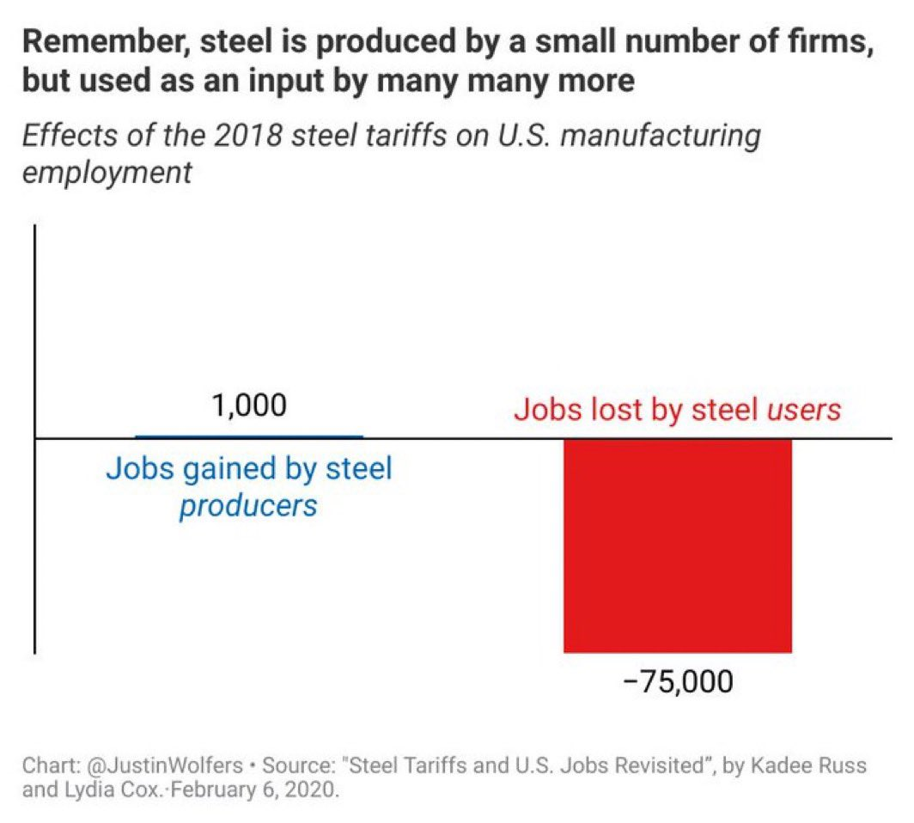

# The Nonlinear World

<!-- truncate -->

## Second-order effect

In this complex world, there are second-order effects. Many things may "backfire".

Note: **"X may backfire" should not be simplified to "X is bad".**

### Technology-related

- First-order effect: Internet makes knowledge more accessible, making learning easier.
  
  Second-order effect: Misinformation and low-quality contents are also more accessible. Discerning true and useful information is the new problem. Addictive contents are also more accessible, distracting learning.

- First-order effect: Productivity software (like Word, Excel, PowerPoint, remote meeting tools) increase work efficiency.

  Second-order effect: The convenience also induce more unnecessary documents, spreadsheets, presentations, meetings, and communications, leading to productivity waste.

- First-order effect: Online shopping is often cheaper and more convenient, saving money.

  Second-order effect: The convenience of online shopping can lead to impulse purchases of unnecessary things, causing larger overall spending.

- First-order effect: Email spam filters can reduce disturbance.

  Second-order effect: It may wrongly filter an important email. If the user always worries about wrong filtering and frequently view garbage email section then it doesn't reduce disturbance.

- First-order effect: Hiring a new UI designer can improve the UI of the product.

  Second-order effect: The new UI designer may redesign the UI to justify their value. The users that get used to old UI may be frustrated by the new unfamiliar UI. The new UI may sacrifice usability for aesthetics.

- First-order effect: Increasing the sensitivity of alarm improves security because it can catch more anomalies.

  Second-order effect: Increasing alarm sensitivity also increases false alarms. Cry wolf syndrome. People are tired of false alarms and care less about alarms.

- First-order effect: Constraints are bad. It increases cost and reduces possible solutions.

  Second-order effect: Constraint can breed creativity. Working in different constraints give different solutions. The variability of solutions can help getting out of local optima.

- First-order effect: Adding more roads makes traffic faster.

  Second-order effect: [Braess paradox](https://en.wikipedia.org/wiki/Braess%27s_paradox). Adding more roads can make overall traffic slower.

- First-order effect: Allowing human to intervene an automation system improves control in emergency.

  Second-order effect: When human's operation partially conflicts with automation system's operation, it faces new unpredictability. It's often less safe than pure human control or pure automation.

### In Economy

- First-order effect: The British government in colonial India provided bonus for dead cobra. The bonus could incentivize cobra hunting.

  Second-order effect: Breeding cobra is easier than hunting wild cobra, so people started breeding it. When the policy is removed, the breeders released their cobra to the wild. This is called cobra effect and [perverse incentive](https://en.wikipedia.org/wiki/Perverse_incentive).

- First-order effect: Using measured numbers is an objective way of judging performance.

  Second-order effect: **Goodhart's law**. When a measure becomes target, it ceases to be a good measure. Examples:

  - When doctors are judged by patient satisfaction survey, doctors tend to do treatments that improve short-term comfort but sacrifice long-term health.
  - When KPI judges success rate regardless of difficulty, then employee choose to do only easy tasks and avoid hard tasks. **The more non-trivial things one does, the more mistakes one will make**.
  - When salesmen are judged by sale amount, salesmen tend to lie to custumers and hurt company reputation.
  - Training AI model to increase user satisfaction score will make the AI sycophant.
  - When promotion is judged by task difficulty, then people do useless hard things instead of important but easy things.
  - AB test shows that adding annoying popups and manipulative texts increase conversion rate. However it drives away high-value customers.
  - When researchers are judged by paper reference count, there will be researcher groups referencing each other in group.
  - ...

- First-order effect: After the steam engine was improved, it required less coal to do the same work, so the demand of coal would reduce.

  Second-order effect: [Jevons paradox](https://en.wikipedia.org/wiki/Jevons_paradox).The reduced cost of using steam engine greatly increased the usage of steam engine, so the demand of coal greaty increased.

- First-order effect: Improving a product can enhance its reputation.

  Second-order effect: Improving a product may make it more popular and attract more customers that doesn't fit the product, which may hurt the reputation.

- First-order effect: Price control reduces price.

  Second-order effect: Price control disincentivize production, causing reduced supply, making real price higher. Price control hinders transaction, but people's demand persists, so it leads to black markets, increasing transaction costs.

- First-order effect: Subsidizing buying house reduces housing cost.

  Second-order effect: Housing price increased because of increased purchase power. The surging housing price attracts more real estate investments, driving housing price up even more.

- First-order effect: Antitrust is detrimental to monopoly companies.
  
  Second-order effect: Antitrust regulations may also increase compliance cost, making competing startups harder to grow, thus benefits monopoly companies. [Regulatory capture](https://en.wikipedia.org/wiki/Regulatory_capture).

- First-order effect: Tariffs protect domestic companies, because it makes foreign competitors' products more expensive.
  
  Second-order effect: Tariff may reduce competition pressure, reducing domestic companies' drive to improve and eventually reducing their competitiveness. Domestic companies may rise price after tariff to increase profit.
  
  Also, the job loss caused by increasing price may be higher than the jobs created by tariff:

- First-order effect: Advertizements make the product more popular.
  
  Second-order effect: Too much ads may annoy customers[^sleeper_effect]. A bad ad can hurt the brand. The ad that mentions competitor may actually help competitor.

- First-order effect: Ruthless competition (social Darwinism) will select the best talents.

  Second-order effect: 
  
  - It may select out the people that are good at competition but bad at coorporating. 
  - Even the top talents cannot ensure they don't make any mistake and always win. The talents tend to seek safer environments.
  - A lot of great talents require more resource investment to show ability, but they may lose the ruthless competition because they initially don't win and can never obtain enough resource. [^qianlima]
  - Talent is high-dimensional. It filters out the talents whose ability is out of testing range. The currently seemingly useless ability may be important in the future.

- First-order effect: Copyright law protects artists because it makes consumers pay artists.

  Second-order effect: The publishers and distribution channels form monopoly naturally. There is no "free market" for artists. Artists have to commission copyright to publishers and distributors. Artists only get a small share of profits, and lose freedom of usage of the artwork.

- First-order effect: Mineral resources make the country rich.

  Second-order effect: [Resource curse](https://en.wikipedia.org/wiki/Resource_curse). Profits in mineral export makes country's currency overvalued. Then importing becomes cheaper than country's own products. so the domestic argiculture and industries cannot develop. Having "easy money" also make people not work hard. When the international mineral price drops, economy collapses.

- First-order effect: When a department has budget surplus. It shows that the department is over-funded. So reducing its budget saves money for the organization.

  Second-order effect: Saving money is effectively punished by reducing budget. After learning this, the department will do excessive spending to avoid any surplus from reducing its budget. This greately increases money waste in the organization.

- First-order effect: Promoting employees that did great job incentivizes employee. It makes the company more efficient.

  Second-order effect: [Peter principle](https://en.wikipedia.org/wiki/Peter_principle). The promoted employee is not necessarily good in new job because the work changes. But the employee performing bad in raised position is rarely demoted. So "being good at work" is unstable state, but "being bad at work" is stable state. Eventually it likely reaches stable state: most employees do the work they are bad at.

- First-order effect: Manager sets very high goals to employees. This pushes employees to work hard.

  Second-order effect: If the manager sets high goals but don't have the ability to verify the result, it will be a disaster. Most employees cannot achieve the high goal. The honest employees gets low evaluation and tend to leave. The employees that fake results get rewarded and stay. 

- First-order effect: First-mover advantage. The company creating a new product category has advantage. It develops brand recognition and network effect early. 

  Second-order effect: Second-mover advantage. After the first-mover costly explores different techiques/strategies, the second-mover can directly learn. And the first-mover often cannot correct its mistake due to sunk cost. The second-mover can avoid first-mover's mistakes.

[^qianlima]: Related: [Qianlima](https://en.wikipedia.org/wiki/Qianlima) (千里马). The high-capacity horse require more food to show its capacity. But without showing its capacity it can never get enough food supply. 

[^sleeper_effect]: There is a third-order effect. If consumer hates the ad, seeing more ads hate more, but the ads still leave "footprint" in memory. Due to [sleeper effect](https://en.wikipedia.org/wiki/Sleeper_effect) the customer may start liking the product after some time.

### In Finance

- First-order effect: The release of positive news about a stock causes its price to increase. 

  Second-order effect: If the market had already anticipated it, and it falls short of high expectations, the price may decline.

- First-order effect: Price limit up in stock market restricts buying, which helps curb price increase.

  Second-order effect: Price limit up avoids market from reaching equilbrium, obsecuring price growing potential, making stock holders reluctant to sell, which may further boost price. Similarily, price limit-down can make potential buyers reluctant to buy, which may boost downward momentum.

- First-order effect: Restricting foreign exchange helps maintaining foreign currency reserves.

  Second-order effect: Restricting foreign exchange makes foreign investors panic, promoting capital outflows through unregulated ways.

- First-order effect: Quantitive easing reduces financial risk because it increases money supply.

  Second-order effect: It inflates asset bubbles and cause more potential risk in the future. It also causes moral hazard and encourages careless risk-takers.

- First-order effect: Increasing interest rate curbs inflation, because it reduces money supply.

  Second-order effect: Many inflations are caused by reduced supply of goods. Increasing interest rate reduces productivity investment, thus curbs supply increase, thus can boost inflation.

- First-order effect: When uncertainty increases, money moves from risky assets (e.g. stock) to gold, because gold is safer.

  Second-order effect: When actual large risk occurs, asset prices drop. Leverages face forced liquidation (margin call). High-liquidity assets, including gold, are often sold first to get cash to prevent other leverage assets from going zero. This second-order effect is often temporary.

- First-order effect: If a lot of money is shorting an asset, its price will drop.

  Second-order effect: If price grows to a threshold, short positions face forced liquidation, which creates big "buying pressure" and make price grow furthur. It's called short squeeze.

### In Health and Biology

- First-order effect: Antibiotics cure bacterial infections.

  Second-order effect: Antibiotics drive natural selection, leading to the evolution of antibiotic-resistant bacteria, causing harder-to-cure infections.

- First-order effect: Just eating very few reduces caloric intake, helping weight loss.
  
  Second-order effect: A large calorie deficit may cause higher level of cortiso, inhibiting fat burning, facilitating muscle breakdown, slowing down metabolism, hindering weight loss efforts.

- First-order effect: Raising children in clean environments make them healthy because they avoid most pathogen.

  Second-order effect: Lacking touch with pathogens in young age may cause immune system development issues, then may facilitate autoimmune disease.

- First-order effect: Advance of medical techonology improve population health and reduce healthcare cost.

  Second-order effect: 
  
  - Advance of medical techonology increases average age. As age increases, health problems are more likely to appear. The overall healthcare burden increases.
  - Some previously fatal disease is now not fatal, but the technology is still not advanced enough to fully cure it. The patient survived but faces low life quality and high healthcare cost.

- First-order effect: Medication cure diseases.

  Second-order effect: There are [iatrogenesis](https://en.wikipedia.org/wiki/Iatrogenesis), which means the harm caused by medical treatment. Iagrogenesis can be caused my many ways, such as:

  - Wrong diagnosis and wrong medication
  - Side effect of medication
  - Infect at the hospital
  - Antibiotics disrupt the gut biome, thus interfere with immune system
  - Expensive medication costs money
  - ...

### In Psychology

- First-order effect: Suppressing own emotion helps overcoming that emotion.
  
  Second-order effect: This may make the emotion stronger and may unleash one day.

- First-order effect: Praisng a product improve people's impression of a product.
  
  Second-order effect: Praisng a product raises people's expectation, which may lead to disappointment if the actual usage experience doesn't meet the high expectation.

- First-order effect: Having eagerness helps achieve the goal.
  
  Second-order effect: 

  - Being too eager may deplete patience when faced with failures. Yerkes-Dodson law. 
  - Desperate eagerness is a sign of low confidence. In dating, sales and interviewing, signs of low confidence reduce chance of success.

- First-order effect: Suppressing the publication of some information stops its spread.

  Second-order effect: Trying to suppressing information may make people gain more interest in that information. [Streisand effect](https://en.wikipedia.org/wiki/Streisand_effect).

- First-order effect: Disallowing kid to play videogames makes kid not play videogames.

  Second-order effect: [Reverse psychology](https://en.wikipedia.org/wiki/Reverse_psychology). The kid being not allowed to play videogames may become more eager to play them.

- First-order effect: Having choices is good as there is more freedom.

  Second-order effect: May waste more time considering which choice is better.

  Divination has real utility: it makes one quickly make decision, stopping wasting time considering which is better.

  In bargaining, the party that has no choice but fight has advantage over the party that has fallback choice.

- First-order effect: Smart people's beliefs are more correct because they are smart.

  Second-order effect: Smart people are also more smart in making up reasons to justify their own belief (motivated reasoning and confirmation bias).

- First-order effect: Giving away free things can generate goodwill and appreciation.

  Second-order effect: Some recipients may take free things for granted, complain about not receiving more, or criticize the quality. The recipient also may feel having lower social status and may develop hatred.

- First-order effect: Giving clear unambiguous feedback helps learning.

  Second-order effect: It makes student overly rely on external feedback. Then the student can hardly develop internal judgement, thus perform worse in real-world tasks that don't have clear feedback. [See also](http://www.macrocognition.com/documents/CTT%2012-29-08.pdf)

- First-order effect: Knowledge helps decision-making.

  Second-order effect: 
  
  - Believing too much on a piece of knowledge makes one stuck in **confirmation bias** and stay furthur from truth. 
  - Knowing more about possible risks make one hesitate in making decisions, reducing agency.
  
  Green lumber fallacy. Deep understanding is often not required for real-world success. The idiom "knowledge is power" is not always true. **The true knowledge includes when to not use knowledge**.

- First-order effect: Punishing mistakes will force people to make fewer mistakes.

  Second-order effect: 
  
  - For personal punishment: It cause one to be scared of practicing, thus gain less experience. Lacking of experience make them more likely to make mistakes.
  - For punishment to decision-makers in organizations: It's often not obvious whether the failure is caused by wrong decision or just insufficient investment. Then fear of punishing naturally leads continuing investment to wrong decision, falling into sunk cost trap.

- First-order effect: Only reporting successful results and not reporting failed attempts could improve others' impression on you.

  Second-order effect: If you haven't obtained successful results for some time, not reporting makes people question that you are not working.

- First-order effect: Making software react faster improves user exprience.

  Second-order effect: If the softwrare reacts too fast, the user may suspect that "it doesn't do real work". If it's an AI application, the user tend to think fast AI is dumber than slow AI.

### In Cybersecurity

- First-order effect: Forcing the user to login again after inactive for 2 minutes can improve security.

  Second-order effect: Users are frustrated by frequent logins and may try to make login as easy as possible, like using simple passwords or keeping passwords in clipboard. Also auto log-out may happen during critical work.

- First-order effect: Complex password requirement can improve security.
  
  Second-order effect: The user may forget the complex password, so the user may write down the password somewhere to avoid the trouble of reseting password every time.

- First-order effect: Enforcing password rolling can improve security.
  
  Second-order effect: The user may reduce the memory pressure by using regular passwords (like AAABBB111, CCCDDD222), to avoid the trouble of reseting password every time.

### In Software Development

- First-order effect: Better hardware makes software run faster.

  Second-order effect: Better hardware performance make software developers focus less on optimization, resulting in slow software.

- First-order effect: Adding developers to a software project can accelerate it.

  Second-order effect: It may increase communication cost and cause more chaos. Man-month myth.

- First-order effect: Abstraction helps understanding and maintaining code.

  Second-order effect: Abstraction also comes with constraints. If the new requirement doesn't follow the constraint of the abstraction, then the developer need to either add exception case handling throughout the abstraction, making code hard-to-maintain, or refactor the abstraction.

- First-order effect: Observability and telemetry systems help the reliability of the service.

  Second-order effect: Observability and telemetry may accidentally break the system.

> In short, the root cause was a new telemetry service configuration that unexpectedly generated massive Kubernetes API load across large clusters, overwhelming the control plane and breaking DNS-based service discovery.
> 
> \- [Incident Report for OpenAI](https://status.openai.com/incidents/ctrsv3lwd797)

> Once a system reaches a certain level of reliability, most major incidents will involve:
> 
> - A manual intervention that was intended to mitigate a minor incident, _or_
> - Unexpected behavior of a subsystem _whose primary purpose was to improve reliability_
> 
> \- [A conjecture on why reliable systems fail](https://surfingcomplexity.blog/2017/06/24/a-conjecture-on-why-reliable-systems-fail/)

- First-order effect: Static analysis tools are good for improving security.

  Second-order effect: The process of fixing an analyzer false-positive may introduce a new security bug:

> The bug is due to a heap-based buffer overflow weakness accidentally introduced in glibc 2.37 in August 2022 and later backported to glibc 2.36 when addressing a less severe vulnerability tracked as CVE-2022-39046.
> 
> \- [New Linux glibc flaw lets attackers get root on major distros](https://www.bleepingcomputer.com/news/security/new-linux-glibc-flaw-lets-attackers-get-root-on-major-distros/)

## Feedback loops

### Self-reinforcing feedback loops

Examples:

- Matthew effect. Having money helps earning money and vice versa.
- Network effect. The more people using a platform (like X(Twitter), Facebook, Uber) the more usable platform is, so more people use it.
- Flywheel effect. Some operations are initially costly and inefficient. But keep doing it makes it easier and easier.
- Economies of scale. Increase production can amortize research costs, marketing costs and other fixed costs. Financing is also easier on larger scale.
- Virus spread. The more it infects, the more sperading sources.
- Self-fulfilling prophecy. Some examples:
  - When people believe in a plan, people collaborate more and invest more, then it's more likely to succeed.
  - Bank run. Some people not trusting bank make bank's financial status worse and less trustworthy.
  - Teacher dislikes a student and give bad feedback, then student have less motivation to learn thus perform worse.
  - A commodity originally has supply-demand balance. When someone buys a lot of it, price increases, people think it has a shortage then buy more eagerly, then shortage becomes true and price furthur increases.
  - ...
- Attitude can shape behavior. Behavior can shape attitude. Persuade self to justify decisions.
- Social interaction. One being angry to another may make two both more angry. Also applys to friendliness and trust/distrust.
- Herd mentality. Some people do something, more people follow.
- Financial market momentum.
- Debt can both accelerate growth and accelerate bankruptcy.
- Spread of information and idea. The more popular a piece of information is, the more chance it spreads.
- Sunk cost. The more resources put in, the higher sunk cost is, the harder to stop loss.
  - This also applies to war. When both sides costed a lot in war, the war is hard to stop.
- Banks only loan to companies with good financial status.
- The worse health condition is, the more expensive health insurance is, the less likely one affords treatment.
- Ponzi scheme. When one falls into a Ponzi scheme, one tend to spread the scheme to reduce own loss.
- Recognition of power. When one uses power and succeeded, the observers confirm the power. When a rule is broken once and there is no consequence, then more and more people will break the rule. 
- Avalanche.
- Cascade failure.
- ...

### Concentration

Self-reinforcing feedback loops cause concentration and winner-take-all effect.

Examples of concentration and 80/20 rule (Pareto principle):

- For business:
  - Most profit often come from very few products.
  - For to-business products, most profit often come from few enterprise customers.
  - Most complains often come from very few users. 
  - Most meaningful knowledge work is done by few employees. (On the contrary, the contribution of physical work is more even.)
- On internet:
  - The most engagement come from very few posts.
  - The most voice on internet comes from a minority of users. The dominant narrative on internet may not represent most people's views.
- In software:
  - Most users use few common features. 
  - Most issues that user see are caused by few common bugs.
  - Most complexity (and bugs) come from very few features and requirements.
  - Most development efforts are for fixing edge cases. Few development efforts are spent on main case handling.
  - One bug applies to all instances of the software version.
- The most social connections are related to few core people.
- The most decisions are made based on few important information.
- In financial market:
  - The most volatility concentrates on small time intervals.
  - The most profit and loss come from few important investments.
  - The most market value and trading volume concentrates on few assets.
- About risk:
  - Most car crashes are caused by few drivers.
  - The most negative impact come from very few severe incidents.

They have **fat-tailed distributions** instead of normal distributions. 

For them, the mean and variance may be misleading. Median is more representative than mean. The sample variance is likely very underestimated.

If some work seems huge, if it follows 80/20, doing just 20% of it can get 80% of effects. However note that not all work can be 80-20-ed.

### Self-balancing feedback loops and cycles

Examples:

- In nature: predator-prey relation, climate systems.
- In human body: temperature adjustment, blood glucose adjustment, etc.
- In machines: thermostat, etc.
- Planet movements: day-night alternation, seasons, the [Milankovitch cycle](https://en.wikipedia.org/wiki/Milankovitch_cycles).
- Demand-supply relation: high demand increase price. High price facilitates investments in supply (this can take time) and reduces demand (people search for alternatives), thus causing price drop.
- In financial market:
  - Price grow create potential for selling and vice versa. Market momentum cannot continue forever (although it may be much longer than expected).
  - Profit reduces as trading size grows when it drains up liquidity.
  - If one financial trading strategy is effective and many people use it, then that strategy will cease to be effective. If everyone believe that one strategy is ineffective, then it may be actually effective. Market is [**anti-inductive**](https://www.lesswrong.com/posts/h24JGbmweNpWZfBkM/markets-are-anti-inductive).
  - Low volatility induce higher leverage that potentially increases volatility. High volatility provide potential profit for hedging that may lead to reduced volatility.
  - Two uncorrelated assets may be commonly diversified together that may potentially increase their correlation. 
- The debt cycle. Economy growth parallels debt growth. Higher debt impose higher risk and more interest cost. Then debt collapses and inefficient companies bankrupt. The economy becomes more frugal and more efficient. The debt level becomes low again.
- The Kondratiev cycle. New technology drives growth and investments. The application of new teconology matures and growth plateaus, creating excess investment, excess debts and inflation. Then recession comes. A new radical innovation drives a new cycle.
- The demographic cycle. Ancient China suffers from [Malthusian trap](https://en.wikipedia.org/wiki/Malthusianism): Population grows, farmland per capita reduces, food supply cannot catch up population. When it's close to threshold, a natural disaster can cause famine (and war), reducing population.
- Economies of scale eventually faces diminishing marginal return. And larger scale makes management harder.
- Over-concentration of wealth and power reduces efficiency and stability of society.
- Large companies are likely to be inefficient due to bureaucracy.
- The innovator's dillema. Large companies are bad at innovation.
- "Hard times create strong men. Strong men create good times. Good times create weak men. Weak men create hard times." ― G. Michael Hopf
- Boredom with memes. Attention span on internet is short. No meme can keep dominating.
- Elo-score-based matching in PvP games. If you lose, you will match with lower-skilled players and be more likely to win, and vice versa.
- Cry wolf syndrome. False warning make people less sensitive.
- Cooperating and cheating. When no one cooperates, the group that cooperates gain advantage. But when everyone cooperates, the ones cheating gain advantage.

Note that "negative feedback loop" means self-balancing feedback loop, but sometimes it is also (mis)used to describe "self-reinforcing feedback loop with negative effect" like financial crisis.

The force behind a self-balancing feedback loop may drive self-reinforcing feedback loop in the next stage of cycle.

The **"competition"** between self-reinforcing feedback loops and self-balancing feedback loops:

|                             | Self-reinforcing                                                                            | Self-balancing                                                                     |
| --------------------------- | ------------------------------------------------------------------------------------------- | ---------------------------------------------------------------------------------- |
| Population growth           | Exponential growth                                                                          | Limited food supply, living resources and jobs; Higher competition                 |
| Asset price grow            | Trend following investments; Fear of missing out; Overconfidence; Leverage                  | Long force depletes; Short potential accumulates                                   |
| Asset price drop            | Panic; Margin call                                                                          | Short force depletes; Long potential accumulates                                   |
| Debt growth and inflation   | Economy growth; Higher confidence                                                           | Cost of excess invstment and debt; Monetary tightening for keeping currency credit |
| Debt collapse and deflation | Cadcade credit collapse during financial crisis; Lose of confidence                         | Countermeasures for crisis; Fiscal and monetary stimulus                           |
| Monopoly                    | Matthew effect; Economies of scale; Brand recognition                                       | Antitrust; Safety concerns; Innovator's dillema; Bureaucracy within large company  |
| Scaling of production       | Amortize cost                                                                               | Harder to manage; Diminishing marginal return; Higher risk                         |
| Virus spread                | The more it infects, the quicker it spreads                                                 | Immunity; Societal countermeasures; Medication; Natural selection                  |
| Spread of information       | The more people know it, the quicker it spreads; Fad following; Algorithmic recommendataion | Saturation of acceptors; Lose of interest                                          |
| Scaling in AI               | Scaling gives better performance                                                            | Higher cost in training and inference; Dinimishing marginal utility                |

Note that nonlinear systems are complex. They are more than just two kinds of feedback loops.

## More is different

Sometimes, when one thing reaches a threshold, things become very different. Sometimes it accumulates potential and suddenly release the potential one day.

- A technology used to be bad but keeps improving. Once it improves above a threshold, it suddenly becomes economically valuable and get deployed widely.
- An undervalued asset's fundamental keeps improving. Once there is some public event showing it, its price may suddenly grow a lot. Vice versa for bubble assets.
- A system cuts cost by reducing safety investments. The existing safety investments gradually decay. When it decays to a point, a random event can trigger a large incident.
- ...

There are emergent properties that only emerge if scale becomes big enough:

- The market price comes from the decisions of many individuals (and quantitive trading programs).
- Scaling up (model size, data, etc.) in deep learning lead to new behavior (e.g. in-context learning, pass Turing test).
- Ant colony, bird flock behavior, etc.
- ...

Composition fallacy: composing things together may give surprising results. Two good things composed may be bad, and two bad things composed may be good.

The law of large number only works if the samples are independent.

## Fractal properties

The relation between cycle and trends is similar to fractal. There are small trends in cycles. There are also small cycles in trends. There are small cycles in cycles.

Investing in index is long-term trend following, as the index selects the winning stocks. If the index has positon limitation for each individual stock, then it also incorporates contrarian investment.

Heinrich's law: for every accident that causes a major injury, there are 29 accidents that cause minor injuries and 300 accidents that cause no injuries.

## Cannot predict accurately

Nonlinear systems are chaotic. Predicting them accurately is practically impossible.

There are many conflicting factors. For example, if inflation increases, first-order effect tells gold price will grow, and second-order effects tells that increased inflation cause Fed to tighten money so gold price will drop. Due to **hindsight bias** it's always easy to explain history. If gold price grows, explain that first-order effect is stronger. If gold price drops, explain that second-order effect is stronger. But being able to explain history doesn't mean being able to predict future.

Pursue simpler predictions instead of fragile complex specific predictions. Many tightly-dependent predictions tend to fail together.

Sometimes, just being less wrong than others can gain advantage.

If something appears irrational but existed for a long time, it's likely that you don't understand it.

What everyone believes may one day turn out to be false.

There are great ideas that are hard to discover, but once discovered, become very obvious and very natural (hindsight bias).

## Paradigm shifts

Paradigm shift could be caused by radical technological innovations (e.g. invention of Internet), natural disasters (e.g. Covid-19), or a release of accumulated potential.

For a long cycle that spans decades (e.g. macro debt cycle), entering the next stage of cycle is a paradigm shift.

> History and societies do not crawl. They make jumps.
> 
> \- _The Black Swan_

> There are decades where nothing happens; and there are weeks where decades happen.
> 
> \- Vladimir Ilyich Lenin

Experiences may be obsolete or even harmful after a paradigm shift. Ideas, methods, cultures and systems may only work in specific paradigms.

## Unity of opposites

- Abundance could lead to waste. Scarcity could lead to efficiency. 
- Laziness could lead to innovation. Diligence faces diminishing marginal return and involution. When the direction is wrong, dilligence compounds error.
- Danger could lead to deterrence and unity. Safety could lead to ignorance and fragility.
- Being advanced could lead to path dependence. Monopoly make competitors search for alternatives that may lead to disruptive innovation.
- The most severe risk could come from the thing you trust the most.
- Freedom can lead to imitation. Constraint can lead to innovation.
- The fundamental is the simplest (大道至简). The profound intelligence appears foolish (大智若愚). [The rise of worse is better](https://www.dreamsongs.com/RiseOfWorseIsBetter.html).

## About optimizations

- Almost all **optimizations are tradeoffs**. Some tradeoffs are hidden. Optimizations may make the system more fragile and unadaptive to paradigm shifts.

- Different cases suit different tradeoffs. No one-size-fits-all.

- Optimization may backfire (perverse incentive, iatrogenesis, etc.). Sometimes not optimizing is better.

- 80/20 rule. Optimize the important part first. Also note that not everything can be 80/20-ed.

- Optimization has diminishing marginal return. Overly optimize one aspect is usually a bad tradeoff. Pursuing perfection is often unrealistic.

- Yerkes-Dodson law: Medium motivation or stress works the best. Too much or too few motivation or stress don't work well.

- It's often that long-term benefit requires short-term cost. Getting out of a local minima often requires temporarily increasing loss.

- Optimize for the root goal instead of sub-goals. A sub-goal may originally serve for the root goal but now conflict with the root goal. Be ware of **means-end inversion**.

  Question the constraints of the optimization. Some constraints are actually unnecessary for the root goal. There are also cases where a constraint leads to innovation.

- Right decision can fail and bad decision can succeed due to randomness. Results may be misleading.

- [Theory of the second best](https://en.wikipedia.org/wiki/Theory_of_the_second_best). If something is imperfect, adding more imperfection may be better overall.

## High-dimensionality

About health: Some people treat health as a score. After eating unhealthy food or staying up late, the socre decreases. And the score can be earned back by taking supplements and exercising. This view is wrong. It simplifies high-dimensional health status into a one-dimensional score.

About AI: Current AI can solve PhD-level exam problems that 99.9% people cannot solve. But AI doesn't actually achieve PhD-level intelligence. Intelligence is high-dimensional. Solving exam problems is just one dimension.

## About risk

### 3 kinds of risks

- The risk we know and prepared for.
- The unknown unknown (Black Swan). 
- The risk that we know but don't want to accept and act on (Grey Rhino, ostrich effect, elephant in the room).

### Redundancy

Redundancy tackles risk. Two kinds of redundancy:

- Resource redundancy. Example: save more cash; hoard emergency food.
- Functional redundancy. Example: be more versatile and can change profession; have a plan B when plan A fails.

Diversification is also a way to handle risks. Note that diversification only works when correlation is low. Many assets seems low-correlation but has high correlation under Black Swan event. When two low-correlation assets are commonly diversified together, their correlation potentially increases.

### Optionality

Harvest optionality: being able to delay harvest when market price is low. For example, timberland can delay cutting tree when wood price is low, brewhouse can keep brewing when alcohol price is low.

Modern manufactoring is often very capital-intensive and fragile. Short-term over-production can be fatal. It can be overcomed by counter-cyclical subsidy but the subsidy can easily fall into sunk-cost trap. Unfortunately, the more advanced manufactoring is more capital-intensive and more fragile. However, even if the manufactoring company collapses, the technology and equipments still remain.

### Good side of incident

- It reveals problems and gives pressure to improve.
- It makes people appreciate the good instead of taking things for granted.
- It sometimes destroies inefficient things and leave room for more efficient things.
- ...

### In software: untested error handling likely won't work

Distributed system has **failover** functionality: when one node fails, another node takes the responsibility. However, if you haven't tested failover, it likely won't work as intended:

> Another impactful incident for Actions occurred on March 5. Automated failover has been progressively rolling out across our Redis infrastructure, and on this day, a failover occurred for a Redis cluster used by Actions job orchestration. The failover performed as expected, but a **latent configuration issue** meant the failover left the cluster in a state with no writable primary. With writes failing and failover not available as a mitigation, we had to correct the state manually to mitigate. This was not an aggressive rollout or missing resiliency mechanism, but rather latent configuration that was only exposed by an event in production infrastructure.
> 
> \- [Addressing GitHub’s recent availability issues](https://github.blog/news-insights/company-news/addressing-githubs-recent-availability-issues-2/)

It also applies to other kinds of error handling.

But testing error handling hard. There are many kinds of different error cases.

### Diversity and "blind sopts"

Everyone has some "blind sopts" in thinking. It may be path dependence: Someone tried X, succeeded, then think X is the final answer; tried Y, failed, then think Y will never work. Sometimes an idea requires doing a specific thing to inspire.

When there is diversity, different people can communicate different ideas and "fill" other peoples' "blind spots".

### Efficiency often requires centralization

Bitcoin can only process 3 to 7 on-chain transactions per second, and it takes about 5 minutes to get first confirmation for each transaction. But a centralized Bitcoin exchange center can process transactions much quicker.

There are faster decentralized cryptocurrency protocol designs. But doing big upgrade to Bitcoin protocol is nearly impossible because it requires consensus of major players ([block size war](https://vitalik.eth.limo/general/2024/05/31/blocksize.html)), and there are interest conflicts. But banks and exchange centers can upgrade its software without most customer's aggrement.

## On positive Black Swans

It seems betting on positive Black Swan is good because it has large upsides and limited downsides. However, in real world, **positive Black Swan may come very late or never come**. But the "limited downside" will likely keep applying for long time. 

It's actually very hard to do. It requires patience and reducing expectation. 

Normal people don't suit winner-take-all profession (e.g. actor, social media influencer, founding startup).

Keep staying in the game makes one exposed to positive Black Swan. Don't all-in. Stop-loss is important.

Doing more things and make more connections can improve exposure to positive Black Swan.

Embrace some randomness instead of paranoidly avoiding randomness.

Barbell strategy: 10-15% high-risk high-payoff diverse investments and 85-90% safe liquid investments. (Don't trust seemingly middle-risk investments.) Short but intense activitity can be better than continuous mild activitity.

## On planning

In many cases, the real-world feedback invalidates assumptions in the plan. Then it's important to correct the plan. Beware of sunk cost fallacy.

Success usually requires a lot of trial and error. Be more forgiving to the many failures in the process of trial and error. (It's also hard to do.)

> A complex system that works is invariably found to have evolved from a simple system that worked. A complex system designed from scratch never works and cannot be patched up to make it work. You have to start over with a working simple system.
> 
> \- Systemantics: How Systems Work and Especially How They Fail

Innovation cannot be planned. Having diversity of ideas and constraints could help innovation.

## Contrarian strategy

- The seemingly good opportunities are often highly-competitive and not worth joining. Being the upstream or downstream of a highly-competitive field could be better ("Picks and Shovels" strategy).
- The seemingly bad opportunities are worth considering. These are not competitive. 

Many good ideas initially look bad:

> By 2005 or so, it will become clear that the Internet's impact on the economy has been no greater than the fax machine's.
> 
> \- Nobel Prize-winning economist, Paul Krugman, in 1998

Note that competitiveness is relative to the market size. A quickly-growing market is not competitive even if it seems so.

## The flip side of advanced technologies

Technology advancement usually involves **scaling**: 

- scaling size
- scaling energy
- scaling speed
- scaling precision
- scaling density
- scaling connection
- scaling computation
- ...

Scaling often involves higher fragility and higher cost (e.g. advanced chip manufacturing), and eventually facing diminishing marginal return. Scaling of connection also boost concentration and Matthew effect.

Advanced technology is often more fragile or has unobvious downsides. It often requires a balance between convenience of advanced technology, and reliability of primitive methods.

Advanced but expensive technology may defeat due to financial sustainability.

In capitalism, technologies are usually developed for profit, not for human well-being (e.g. processed food, algorithmic recommendation, AI training data collection).

If a piece of software has a bug, then every copy of the same version of software has the same bug. This is a source of fragility. For example, if a self-driving algorithm has a bug, then many self-driving cars that deploy such algorithm has the same bug. If an AI model has a bias, then all usages to the same AI model suffers from the same bias.

### Fragility of automation

When automation works, it's good. But automation may break. And when it breaks, no one is familiar to it or has experience to fix it. The automation may be set up years ago and the person familiar with it may have left.

> it was an **auto-renewal being bricked** due to some new subdomain additions, and the renewal failures didn't send notifications for whatever reason. And then it took some Bazel team members **who were very unfamiliar with this** whole area to scramble to read documentation and secure permissions... and the SSL certs taking ages to propagate as usual.
> 
> \- [Link](https://github.com/bazelbuild/bazel/issues/28101#issuecomment-3693346788)

## Short-termism and long-termism

Long-termism can usually gain advantage. However long-termism is often fragile because it involves more investments. Investments can break. Long-termism only works in stable and safe environments.

Also, reducing fragility requires safety investments that require long-termism. The short-termism cutting safety investment increases fragility.

When the large environment is unstable and unsuitable for long-termism, it requires local small safe stable environments to make long-termism work.

It's often that the process of doing improvement has risks. But the improvement can avoid bigger risk in the future. Under short-termism, it can only stuck in local minimum, avoiding risky improvement.

## Related

Many ideas in this article are learnt from N. N. Taleb's books: _The Black Swan_, _Antifragile_.

