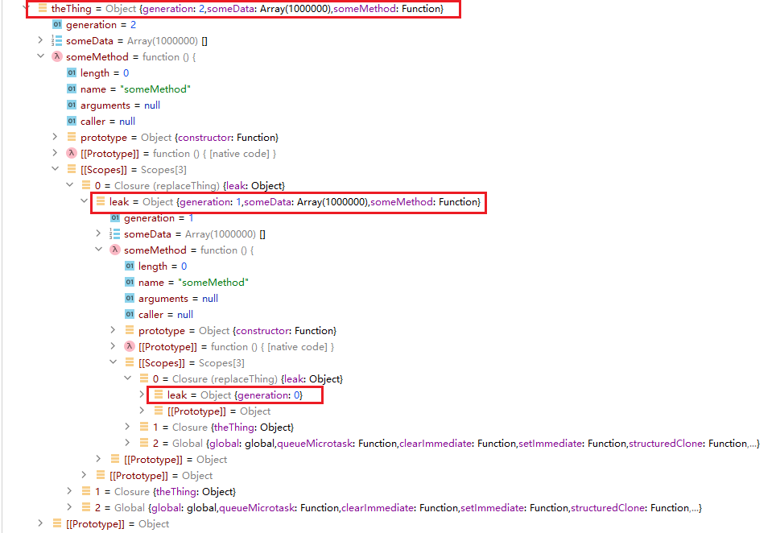
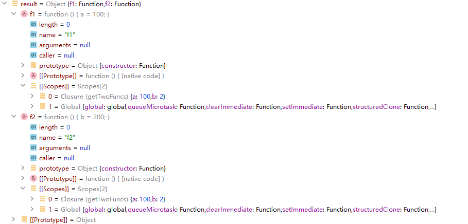

# JavaScript中一个内存泄漏情况，以及各语言闭包实现方式

JavaScript中存在一个巧妙的内存泄漏情况： [轻松排查线上Node内存泄漏问题 - CNode技术社区 (cnodejs.org)](https://cnodejs.org/topic/58eb5d378cda07442731569f) （从[这里](https://zhuanlan.zhihu.com/p/602808787)看到的）。这个内存泄漏的原理非常巧妙，牵扯到JavaScript中闭包的实现方式。

简化后的内存泄漏代码：

```javascript
let theThing = null;
let replaceThing = function () {
    let leak = theThing;
    let unused = function () {
        console.log(leak)
    };
    
    // 不断修改theThing的引用
    theThing = {
        someData: new Array(1000000),
        someMethod: function () {
            console.log('a');
        }
    };
};

// 重复执行，检查内存使用量是否上升
for (;;) {
  replaceThing()
}
```

在不断执行`replaceThing`的时候，内存使用量不断增长，出现内存泄露。

后文会将该内存泄漏的原理。在此之前，先看一下Python和Java中是否有相同的问题。

对应Python代码

```python
theThing = {}

def replaceThing():
    global theThing
    leak = theThing
    unused = lambda : print(leak)
    theThing = {
        'someData': [2333] * 1000000,
        'someMethod': lambda : print('a')
    }

while True:
    replaceThing()
```

没有内存泄露。

对应Java代码

```java
public class Main {
	public static record Thing(int[] someData, Runnable someMethod) {}
	
	public static Thing theThing = null;
	
	public static void replaceThing() {
		Thing leak = theThing;
		Runnable unused = () -> System.out.println(leak);
		theThing = new Thing(new int[1000000], () -> System.out.println("a"));
	}
	
	public static void main(String[] args) {
		for (; ; ) {
			replaceThing();
		}
	}
}
```

也没有内存泄露。可以看到这个问题牵扯到JavaScript的特殊性（也可能是V8的问题）。

### 内存泄漏的原理

首先，在对象上加入`generation`数，每个新对象`generation`加一，用于区分。然后执行`replaceThing`两次，用debug器查看内容：

```javascript
let theThing = {generation: 0};
let replaceThing = function () {
    let leak = theThing;
    let unused = function () {
        console.log(leak)
    };
    // 不断修改theThing的引用
    theThing = {
        generation: theThing.generation + 1,
        someData: new Array(1000000),
        someMethod: function () {
            console.log('a');
        }
    };
};
replaceThing();
replaceThing();
```

用debug器查看对象内容，结果很显然，新的`theThing`间接引用到了旧的`theThing`，形成一条链。不需要的对象仍然被引用，无法被GC，于是内存泄漏。



所以，问题的核心变成，为什么`theThing`里面的`someMethod`要间接引用`leak`呢？`someMethod`里面明明没用用到`leak`。在Java和Python中，闭包函数都没用引用没用到的`leak`，然而在JavaScript中，闭包函数不直接引用单个变量，而是去引用Environment Record。

Environment Record自身存储了函数中的相关局部变量，每个Environment Record都可以有一个上级parent Environment Record。**闭包函数“捕获”了外面的变量，实际上外面的变量存在Environment Record中。**

对于Environment Record，有这些特性：

* 只有可能被捕获的变量会放在Environment Record中。没有被捕获的变量不在Environment Record中。
* JavaScript允许修改捕获的变量，实际上修改的是Environment Record中的变量。
* 因为Environment Record可以被修改，不能复制Environment Record。

加入一个Environment Record中有两个变量`a`和`b`，然后有两个函数分别捕获`a`和`b`，两个函数实际上引用的是一个Environment Record：

```javascript
function getTwoFuncs() {
    let a = 1;
    let b = 2;
    return {
        f1: function () { a = 100; },
        f2: function () { b = 200; }
    }
}

let result = getTwoFuncs();
result.f1();
```

从debug器可以看到，两个函数都共享一个Environment Record，对`a`的修改能共享：



在这个情况下，第一个函数只需要`a`，却不得不间接引用`b`，带来内存泄漏可能性。对于本文的例子也是同理：

```javascript
function () {
    let leak = theThing;
    let unused = function () {
        console.log(leak)
    };
    theThing = {
        ...,
        someMethod: function () {
            console.log('a');
        }
    };
};
```

局部变量`leak`被`unused`函数捕获，因此不得不将`leak`放在Environment Record中，而`someMethod`的函数也在当前函数内，需要引用当前函数的Environment Record，于是不得不间接引用了`leak`，导致内存泄漏。

对于这种内存泄漏，要怎么解决？解决方案包括：去除不需要的`unused`，在更新`theThing`的时候避免使用旧值，某些值可以通过参数传递而不是通过闭包传递，等等。

实际上，如果将JavaScript中的闭包实现修改一下，就可以避免这个内存泄露，只需要将每个被捕获的变量都存到单独的一个cell（单元）对象里面，然后闭包引用它使用的cell即可，这样就不会出现引用到不需要的值的情况。不过现在的JavaScript运行时并没有这么去实现，可能原因是在捕获多个变量后有多个cell，对象数量变多会降低性能。也有可能是跟`var`变量的存储方式保持一致。

注：在写JavaScript的时候，尽量使用`let`和`const`，不要使用`var`，因为`var`变量不遵从函数内的作用域。


为什么Java和Python中没有这个问题？


Python中也有跟捕获相关的坑：被捕获变量可以在外面被修改

```python
def test():
    a = 1
    func = lambda: print(a)
    a = 2
    func() # 输出2

test()
```

这是因为Python中每个被捕获的变量都存在单独的cell中，闭包函数引用了cell，修改变量修改的是cell中的值。

在Java中，被捕获的变量直接存储在函数对象里，且不能赋值，避免了这种坑。

