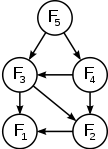

# 惰性求值的妙用

* 无限大数据结构
* 惰性求值快速排序
* 惰性求值搜索树
* 惰性求值矩阵乘法


惰性求值的核心，分为两部分

* 用不到的东西，暂时不求值
* 求值过的东西，缓存下来，重复求值的使用用


## 从惰性求值角度看动态规划

动态规划的核心是：

* 一个问题可以分解成子问题，子问题可以继续拆分子问题，可以用子问题结果可以较快算出原问题的结果
* 子问题“越分越小”，不会出现子问题分解后变回父问题的情况，分解到最后的最小问题可以快速获得结果
* 一个子问题的结果被多次用到，所以要缓存

其中前两个特性属于"最优子结构(optimal substructure)"的性质。

例如，该图表示斐波那契数列前五项计算的依赖关系，计算第5项依赖第3、4项，F1和F2被依赖两次。



在Java中写一个简单的、通用抽象的动态规划框架，使用一个HashMap作为缓存：

```java
@FunctionalInterface
public static interface SubProblemComputation<K, V> {
	V compute(K key, DynamicProgrammingSolver<K, V> cache);
}
public static class DynamicProgrammingSolver<K, V> {
	public final SubProblemComputation<K, V> func;
	private final Map<K, V> cacheMap = new HashMap<>();
	
	public DynamicProgrammingSolver(SubProblemComputation<K, V> func) {
		this.func = func;
	}
	
    // 先查缓存，缓存没有就运行求解函数
	public V compute(K key) {
		// 注意：不要使用computeIfAbsent，递归会导致ConcurrentModificationException
		if (cacheMap.containsKey(key)) {
			return cacheMap.get(key);
		}
		V computed = func.compute(key, this);
		cacheMap.put(key, computed);
		return computed;
	}
}
```

其中`SubProblemComputation`表示一个求解子问题结果的函数，`DynamicProgrammingSolver`传入一个这样的函数，K为子问题参数，V为子问题结果，结果存储在cacheMap中。

> 注：这个是为了通用、抽象而采用HashMap作为缓存，实际上用数组做缓存一般更快

先看一个较为普通的动态规划问题，计算一个有向无环图中，一个开始节点到一个目标节点的最短距离。这个情况下，可以**将子问题定义为：对节点n，求解n到目标节点的最短距离**。求解过程为，如果n为目标节点则返回0，若n不是目标节点，查看n发出的边，对每个边计算该边的距离加上这个边指向节点到目标节点的最短距离，这个时候用到了子问题的结果。由于图是无环的，不会陷入死递归。

```java
// 节点存边的列表
public static record Node(List<Edge> edgesComingOut) {}
// 边包含距离和指向的节点
public static record Edge(double distance, Node target) {}

public static double computeShortestDistance(Node start, Node end) {
	DynamicProgrammingSolver<Node, Double> solver1 = new DynamicProgrammingSolver<>(
		// 计算从node到end的最短距离
		(node, solver) -> {
			if (node == end) {
				return 0.0;
			}
			
			return node.edgesComingOut().stream()
				// 对每一条边，计算边的距离+指向节点到end的最短距离
				.mapToDouble(e -> e.distance() + solver.compute(e.target()))
				// 取最小值
				.min().orElse(Double.MAX_VALUE);
		}
	);
	
	return solver1.compute(start);
}
```

> 注：这个代码只计算最短路径长度，不返回最短路径，想要获取最短路径的话，子问题返回值中包含经过的是哪条边即可。

为什么这个算法没有搜索所有可能路径，但仍不会漏过最短路径？这是因为“最优子结构”。

Wikipedia上对“最优子结构”的定义可以解释为这样：

* 有一个“可能性”的集合，有一个全局损失函数，输入一个可能性输出一个损失值，问题是要找到损失函数最小的（若干个）可能性（最大化某个值相当于最小化其负值）
* 可能性集合可以分成若干个不相交的子集
* 每个子集有自己的“局部”损失函数（输入一个子集中的可能性，输出一个局部损失值），且这个局部损失函数的最小值的计算**不依赖**于子集之外的内容
* 通过每个子集的局部损失函数最小的（若干个）可能性，可以快速找到全局损失函数最小的（若干个）可能性
* 寻找局部损失函数最小值比寻找全局损失函数更简单
* 子集可以继续这样拆分，通过有限步拆分，最终问题能被拆分到平凡的小问题

对于求最短路径问题，一个可能性就是一条从起始到终点的路径，可能性集合就是所有这样的路径。我们从起始点出发，这个时候从这个起始点发出的所有路径，可以分成多个子集，起始点发出的每一条边对应一个子集，


另外一个动态规划的例子，对于一个数列，求解最长递增子数列。

将数列表示为数组`arr`，对于一个结尾为`arr[i]`的递增子序列，这个时候如果`arr[i]`后面有一个`arr[j]`，且`arr[j] > arr[i]`，那么可以把`arr[j]`加上获得另一个递增子序列，结尾为`arr[j]`。所有的递增子序列都可以这样从前到后构造出来，包括最长的递增子序列。

在用这个过程构造出一个最长递增子序列的过程中，他每一步是先基于某个元素`arr[i]`结尾的递增子序列，然后在后面找到`arr[j]`，且`arr[j] > arr[i]`，**这个过程是向右看的，因此`arr[i]`左边的元素不影响向右看的过程，**由于我们要找尽可能长的子序列，因此可以基于以`arr[i]`结尾的**最长**的递增子序列。

这就是“最优子结构”，**在搜索问题空间的时候，问题的某些地方（子结构）可以直接采用已经发现的最优结果，不用去对这些地方重复搜索**。在基于以`arr[i]`结尾的递增子数列构造更长递增子数列的过程中，所基于的以`arr[i]`结尾的递增子数列不用再去搜索，只要取以`arr[i]`结尾的最长递增子数列即可。

不过，在搜索结果的过程中，结果的最长递增子数列的结尾可能是任何元素，因此要查找以任何元素结尾的最长递增子数列。


